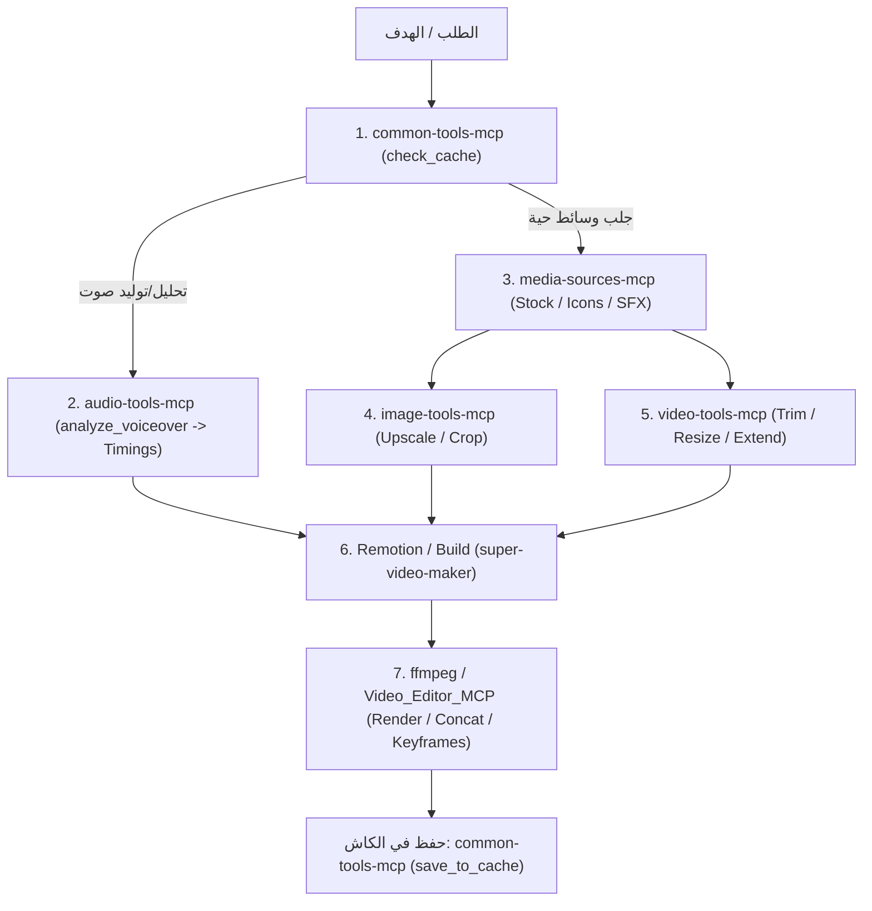

# MCP Toolbook — الدليل الشامل لخوادم وأدوات MCP السبعة

> هذا الدليل هو المرجع التشغيلي الرسمي لكافة خوادم وأدوات MCP السبعة في مساحة العمل `tools/mcp-servers/`.

---

## 🗺️ خريطة خوادم الـ MCP السبعة ومواقعها في سير العمل



---

## 1️⃣ `audio-tools-mcp` (محرك معالجة وهندسة الصوت والتوقيت)
> **المسار:** `tools/mcp-servers/audio-tools-mcp`  
> **الهدف الأساسي:** استخراج التوقيت الدقيق على مستوى الكلمة والجملة، ضبط معايير الجهارة العالمية (-16 LUFS)، قص الصمت، وضمان قفل الحركة على الصوت بنسبة 100%.

### 🛠️ الأدوات:

#### 1. `analyze_voiceover`
* **الوصف:** تفريغ وتحليل التعليق الصوتي (Voiceover) واستخراج الطوابع الزمنية الدقيقة (Timestamps) لكل كلمة وجملة. **هذه أول وأهم خطوة تقنية في إنتاج أي فيديو به صوت.**
* **المعاملات:**
  * `audio_path` *(str)*: مسار ملف الصوت.
  * `language` *(str, اختياري)*: لغة الصوت (مثل `"ar"` أو `"en"`).
  * `model_size` *(str, اختياري)*: حجم نموذج Whisper (افتراضي `"base"` أو `"medium"`).
* **مثال للاستخدام:**
```json
{
  "ServerName": "audio-tools-mcp",
  "ToolName": "analyze_voiceover",
  "Arguments": {
    "audio_path": "${PLUGIN_ROOT}/${PLUGIN_DATA}/assets/processing/voiceover.mp3",
    "language": "ar"
  }
}
```

---

#### 2. `split_voiceover_sentences`
* **الوصف:** تقسيم الملف الصوتي إلى ملفات صوتية منفصلة لكل جملة اعتماداً على تحليل `analyze_voiceover` وفترات الصمت، لربط كل مشهد بجملته.
* **المعاملات:**
  * `audio_path` *(str)*: مسار الصوت الكامل.
  * `analysis_path` *(str)*: مسار ملف نتيجة التحليل JSON.
  * `output_dir` *(str)*: مجلد حفظ الجمل المقطعة.
  * `min_sentence_duration` *(float, افتراضي 2.0)*: أقل مدة للجملة بالثواني.
  * `max_sentence_duration` *(float, افتراضي 10.0)*: أقصى مدة للجملة.
  * `silence_threshold` *(float, افتراضي 0.30)*: عتبة الصمت الفاصل بين الجمل.
* **مثال للاستخدام:**
```json
{
  "ServerName": "audio-tools-mcp",
  "ToolName": "split_voiceover_sentences",
  "Arguments": {
    "audio_path": "${PLUGIN_ROOT}/${PLUGIN_DATA}/assets/processing/voiceover.mp3",
    "analysis_path": "${PLUGIN_ROOT}/${PLUGIN_DATA}/processed/audio/analysis.json",
    "output_dir": "${PLUGIN_ROOT}/${PLUGIN_DATA}/processed/audio/sentences/"
  }
}
```

---

#### 3. `get_voiceover_manifest`
* **الوصف:** بناء بيان (Manifest) شامل يجمع مسارات الجمل المقطعة وتوقيتاتها ونصوصها في هيكل واحد جاهز للاستهلاك في Remotion.
* **المعاملات:**
  * `audio_path` *(str)*: مسار الصوت الأصلي.
  * `analysis` أو `analysis_path` *(اختياري)*: كائن أو مسار التحليل.
  * `split_result` أو `split_result_path` *(اختياري)*: نتيجة التقطيع.
  * `output_path` *(str, اختياري)*: مسار حفظ ملف الـ manifest.json.
* **مثال للاستخدام:**
```json
{
  "ServerName": "audio-tools-mcp",
  "ToolName": "get_voiceover_manifest",
  "Arguments": {
    "audio_path": "${PLUGIN_ROOT}/${PLUGIN_DATA}/assets/processing/voiceover.mp3",
    "analysis_path": "${PLUGIN_ROOT}/${PLUGIN_DATA}/processed/audio/analysis.json",
    "split_result_path": "${PLUGIN_ROOT}/${PLUGIN_DATA}/processed/audio/sentences/split_result.json",
    "output_path": "${PLUGIN_ROOT}/${PLUGIN_DATA}/processed/audio/manifest.json"
  }
}
```

---

#### 4. `build_voiceover_timeline`
* **الوصف:** تحويل الـ Manifest إلى جدول زمني متسلسل (Timeline) بالمشاهد والإطارات (Frames) عند معدل إطارات محدد (مثل 30fps أو 60fps).
* **المعاملات:**
  * `manifest` أو `manifest_path` *(str)*: مسار ملف المانفيست.
  * `output_path` *(str, اختياري)*: مسار حفظ الـ timeline.json.
* **مثال للاستخدام:**
```json
{
  "ServerName": "audio-tools-mcp",
  "ToolName": "build_voiceover_timeline",
  "Arguments": {
    "manifest_path": "${PLUGIN_ROOT}/${PLUGIN_DATA}/processed/audio/manifest.json",
    "output_path": "${PLUGIN_ROOT}/${PLUGIN_DATA}/processed/audio/timeline.json"
  }
}
```

---

#### 5. `normalize_loudness`
* **الوصف:** ضبط مستوى الصوت وفق المعايير العالمية للبث (EBU R128 / ITU BS.1770)، الافتراضي الموصى به للمنصات هو `-16 LUFS`.
* **المعاملات:**
  * `file_path` *(str)*: مسار ملف الصوت.
  * `target_lufs` *(float)*: القيمة المطلوبة (مثال: `-16.0` للـ Voiceover أو `-24.0` لموسيقى الخلفية).
  * `output_path` *(str, اختياري)*: مسار الملف الناتج.
* **مثال للاستخدام:**
```json
{
  "ServerName": "audio-tools-mcp",
  "ToolName": "normalize_loudness",
  "Arguments": {
    "file_path": "${PLUGIN_ROOT}/${PLUGIN_DATA}/assets/incoming/raw_voiceover.wav",
    "target_lufs": -16.0,
    "output_path": "${PLUGIN_ROOT}/${PLUGIN_DATA}/assets/processing/normalized_vo.mp3"
  }
}
```

---

#### 6. `detect_and_trim_silence`
* **الوصف:** اكتشاف الصمت وحذفه من بداية ونهاية الملف الصوتي لتجنب الفراغات الميتة في الفيديو.
* **المعاملات:**
  * `file_path` *(str)*: مسار الصوت.
  * `threshold_db` *(float, افتراضي -40.0)*: عتبة مستوى الديسيبل لاعتبار الصوت صمتاً.
  * `min_silence_duration` *(float, افتراضي 0.1)*: أقل مدة زمنية للصمت.
  * `trim_start` *(bool, افتراضي True)*: قص من البداية.
  * `trim_end` *(bool, افتراضي True)*: قص من النهاية.
* **مثال للاستخدام:**
```json
{
  "ServerName": "audio-tools-mcp",
  "ToolName": "detect_and_trim_silence",
  "Arguments": {
    "file_path": "${PLUGIN_ROOT}/${PLUGIN_DATA}/assets/incoming/recorded_speech.mp3",
    "threshold_db": -45.0,
    "output_path": "${PLUGIN_ROOT}/${PLUGIN_DATA}/assets/processing/trimmed_speech.mp3"
  }
}
```

---

#### 7. `trim_audio` & 8. `extend_audio`
* **`trim_audio`:** قص الصوت ليتطابق مع مدة محددة بدقة `target_duration`.
* **`extend_audio`:** تمديد الصوت القصير عبر التكرار السلس (Seamless Loop) أو التجميد ليصل إلى `target_duration`.
* **مثال للاستخدام:**
```json
{
  "ServerName": "audio-tools-mcp",
  "ToolName": "extend_audio",
  "Arguments": {
    "file_path": "${PLUGIN_ROOT}/${PLUGIN_DATA}/assets/ready/bg_music_short.mp3",
    "target_duration": 45.0,
    "method": "loop",
    "output_path": "${PLUGIN_ROOT}/${PLUGIN_DATA}/processed/audio/bg_music_extended.mp3"
  }
}
```

---

## 2️⃣ `media-sources-mcp` (جلب وبحث وإدارة الوسائط المفتوحة)
> **المسار:** `tools/mcp-servers/media-sources-mcp`  
> **الهدف الأساسي:** البحث في كبرى منصات الأصول المرئية والمسموعة (Pixabay, Pexels, Freesound, Iconify)، وتنزيلها مباشرة للمشروع، وإدارة دورة حياة الأصل.

### 🛠️ الأدوات:

| الأداة | الوصف | المعاملات الرئيسية |
|---|---|---|
| `pixabay_search_images` | البحث عن صور ورسوم توضيحية وفيكتور | `query`, `per_page`, `orientation` ("all", "horizontal", "vertical") |
| `pixabay_search_videos` | البحث عن مقاطع فيديو B-Roll بدقات مختلفة | `query`, `per_page` |
| `pixabay_search_audio` | البحث عن موسيقى تصويرية ومؤثرات | `query`, `max_results` |
| `pexels_search_images` | البحث عن صور واقعية عالية الدقة | `query`, `per_page`, `orientation` ("landscape", "portrait", "square") |
| `pexels_search_videos` | البحث عن فيديوهات Pexels سينمائية | `query`, `per_page`, `orientation` |
| `freesound_search` | البحث عن مؤثرات صوتية حقيقية (SFX) | `query`, `page`, `page_size` |
| `iconify_search` | البحث في أكثر من 150,000 أيقونة مفتوحة | `query`, `limit` |
| `download_iconify_icon` | تنزيل أيقونة بصيغة SVG مخصصة اللون والأبعاد | `prefix`, `name`, `color`, `width`, `height`, `output_path` |
| `download_direct_file` | تنزيل ملف من رابط مباشر وتصنيفه | `url`, `asset_type` ("video", "image", "audio"), `source`, `asset_id` |
| `download_media_page` | تنزيل صفحة وسائط ومعالجتها | `url`, `asset_type`, `source`, `asset_id` |
| `change_asset_status` | نقل الأصل في دورة الحياة (`incoming` → `processing` → `ready`) | `file_path`, `from_status`, `to_status`, `asset_type` |

#### أمثلة عملية:

* **البحث عن مقطع فيديو SaaS في Pexels:**
```json
{
  "ServerName": "media-sources-mcp",
  "ToolName": "pexels_search_videos",
  "Arguments": {
    "query": "developer coding modern office dark mode",
    "per_page": 5,
    "orientation": "landscape"
  }
}
```

* **تنزيل أيقونة متجهة ملونة للمشروع مباشرة:**
```json
{
  "ServerName": "media-sources-mcp",
  "ToolName": "download_iconify_icon",
  "Arguments": {
    "prefix": "lucide",
    "name": "rocket",
    "color": "#3B82F6",
    "width": 64,
    "height": 64,
    "output_path": "${PLUGIN_ROOT}/${PLUGIN_DATA}/assets/ready/rocket_icon.svg"
  }
}
```

---

## 3️⃣ `video-tools-mcp` (المعالجة الميكانيكية للفيديو)
> **المسار:** `tools/mcp-servers/video-tools-mcp`  
> **الهدف الأساسي:** تنفيذ المعالجات الحسابية السريعة للفيديو (قص، تمديد، تغيير أبعاد، قص الإطارات السوداء).

### 🛠️ الأدوات:

#### 1. `resize_video`
* **الوصف:** تغيير أبعاد الفيديو لدعم أبعاد المنصات (مثل 16:9 لليوتيوب `1920x1080`، أو 9:16 للريلز والتيك توك `1080x1920`) مع الحفاظ على نسبة العرض إلى الارتفاع عبر الـ Padding.
* **المعاملات:** `file_path`, `target_width`, `target_height`, `maintain_aspect_ratio`, `output_path`.
* **مثال:**
```json
{
  "ServerName": "video-tools-mcp",
  "ToolName": "resize_video",
  "Arguments": {
    "file_path": "${PLUGIN_ROOT}/${PLUGIN_DATA}/assets/incoming/landscape_broll.mp4",
    "target_width": 1080,
    "target_height": 1920,
    "maintain_aspect_ratio": true,
    "output_path": "${PLUGIN_ROOT}/${PLUGIN_DATA}/processed/video/reel_broll.mp4"
  }
}
```

#### 2. `detect_and_trim_black_frames`
* **الوصف:** فحص الفيديو واكتشاف أي إطارات سوداء أو فلاشات فارغة في بداية أو نهاية الفيديو وحذفها تلقائياً.
* **المعاملات:** `file_path`, `threshold` (عتبة السواد), `min_duration`, `trim_start`, `trim_end`, `output_path`.

#### 3. `trim_video` & 4. `extend_video`
* **`trim_video`:** قص مدة الفيديو بدقة متناهية بالثواني.
* **`extend_video`:** تمديد مقطع فيديو قصير (مثلاً خلفية 2 ثانية تمدد إلى 10 ثوانٍ عبر التكرار الذكي أو التجميد).

---

## 4️⃣ `image-tools-mcp` (محرك معالجة الصور الفورية)
> **المسار:** `tools/mcp-servers/image-tools-mcp`  
> **الهدف الأساسي:** ترقية جودة الصور، قص النسب بدون تشويه، واقتطاع الهوامش تلقائياً.

### 🛠️ الأدوات:

#### 1. `upscale_image`
* **الوصف:** رفع دقة الصور منخفضة الجودة لتصبح حادة وجاهزة للعرض في فيديوهات 4K أو 1080p.
* **المعاملات:** `file_path`, `target_width`, `target_height`, `output_path`.

#### 2. `crop_to_ratio`
* **الوصف:** قص الصورة لتطابق نسبة عرض محددة مع التركيز على المنتصف (`"16:9"`, `"9:16"`, `"1:1"`, `"4:5"`).
* **المعاملات:** `file_path`, `target_ratio`, `output_path`.
* **مثال:**
```json
{
  "ServerName": "image-tools-mcp",
  "ToolName": "crop_to_ratio",
  "Arguments": {
    "file_path": "${PLUGIN_ROOT}/${PLUGIN_DATA}/assets/incoming/product_photo.jpg",
    "target_ratio": "9:16",
    "output_path": "${PLUGIN_ROOT}/${PLUGIN_DATA}/assets/processing/product_story.jpg"
  }
}
```

#### 3. `auto_crop_content`
* **الوصف:** كشف الخلفيات الموحدة أو الشفافة واقتطاع المساحات الميتة حول العنصر الأساسي (Bounding Box).
* **المعاملات:** `file_path`, `background_color` ("auto" أو كود لون), `background_threshold`, `output_path`.

---

## 5️⃣ `common-tools-mcp` (نظام الكاش وتفادي المعالجة المكررة)
> **المسار:** `tools/mcp-servers/common-tools-mcp`  
> **الهدف الأساسي:** حفظ واكتشاف أي أصل تمت معالجته مسبقاً بنفس المواصفات لمنع استهلاك الوقت والـ CPU مرتين (Zero Redundancy).

### 🛠️ الأدوات:

#### 1. `check_cache`
* **الوصف:** الاستعلام عما إذا كان الأصل المطلوب معالجته موجوداً بالفعل في الكاش بالبصمة المطابقة.
* **المعاملات:** `asset_id`, `specs_hash` (تجزئة الإعدادات مثل الأبعاد والمدة), `cache_dir`.
* **مثال:**
```json
{
  "ServerName": "common-tools-mcp",
  "ToolName": "check_cache",
  "Arguments": {
    "asset_id": "broll_tech_01",
    "specs_hash": "w1080_h1920_dur5.0",
    "cache_dir": "${PLUGIN_ROOT}/${PLUGIN_DATA}/storage/cache"
  }
}
```

#### 2. `save_to_cache`
* **الوصف:** حفظ الملف المعالج داخل الكاش المنظم وربطه ببصمة مواصفاته لاستدعائه فورياً في المشاريع القادمة.
* **المعاملات:** `file_path`, `asset_id`, `specs_hash`, `cache_dir`.

---

## 6️⃣ `ffmpeg` / `ffmpeg-mcp-server` (إدارة مهام FFmpeg الثقيلة والخلفية)
> **المسار:** `tools/mcp-servers/ffmpeg-mcp-server`  
> **الهدف الأساسي:** تشغيل عمليات FFmpeg التي تتطلب وقتاً كمهام خلفية (Background Jobs) غير حاجزة للواجهة، مع إمكانية متابعة التقدم والإلغاء ودمج الفيديوهات.

### 🛠️ الأدوات:

#### 1. `get_files_info`
* **الوصف:** فحص مجلد أو ملفات واستخراج الميتاداتا الكاملة (الكوديك، معدل الإطارات FPS، الدقة، معدل البت Bitrate، قنوات الصوت).
* **المعاملات:** `directory` *(str)*.
* **مثال:**
```json
{
  "ServerName": "ffmpeg",
  "ToolName": "get_files_info",
  "Arguments": {
    "directory": "${PLUGIN_ROOT}/${PLUGIN_DATA}/assets/ready"
  }
}
```

#### 2. `increase_keyframes`
* **الوصف:** زيادة وتكثيف الإطارات المفتاحية (GOP / Keyframes) في الفيديو لتسهيل المونتاج الدقيق والانتقالات وتقليل الـ Seeking lag.
* **المعاملات:** `filename` *(str)*.

#### 3. `concatenate_videos`
* **الوصف:** دمج وتجميع مقاطع فيديو متعددة في فيديو نهائي واحد بسلاسة.
* **المعاملات:** `video_files` *(قائمة المسارات)*, `items` *(تفاصيل الترتيب)*.

#### 4. `check_processing_status` & 5. `cancel_video_processing`
* **`check_processing_status`:** الاستعلام عن نسبة إنجاز وظائف المعالجة الحالية (Progress %).
* **`cancel_video_processing`:** إيقاف وإلغاء أي مهمة رندر جارية بالـ `jobId`.

---

## 7️⃣ `video-editor` / `Video_Editor_MCP` (محرك التنفيذ المباشر والحر)
> **المسار:** `tools/mcp-servers/Video_Editor_MCP`  
> **الهدف الأساسي:** توفير بيئة تشغيل لأوامر FFmpeg المعقدة والمركبة (Complex Filtergraphs) عندما لا تغطي الأدوات القياسية الحالة المطلوبة.

### 🛠️ الأدوات:

#### 1. `export_path`
* **الوصف:** إرجاع المسار الافتراضي المعتمد لتصدير الفيديوهات النهائية في مساحة العمل.
* **المعاملات:** لا توجد معاملات.

#### 2. `execute_command`
* **الوصف:** تنفيذ أمر FFmpeg مباشر مع مراقبة الأخطاء ومتابعة الإنجاز الحية.
* **المعاملات:** `command` *(str - سلسلة أمر ffmpeg)*.
* **مثال:**
```json
{
  "ServerName": "video-editor",
  "ToolName": "execute_command",
  "Arguments": {
    "command": "ffmpeg -y -i input.mp4 -vf \"scale=1920:1080:force_original_aspect_ratio=decrease,pad=1920:1080:(ow-iw)/2:(oh-ih)/2:color=black\" -c:v libx264 -crf 18 -preset fast output.mp4"
  }
}
```

---

## 📋 مصفوفة توجيه القرارات السريعة (أي خادم أستخدم؟)

| المهمة المطلوبة | الخادم الإلزامي | الأداة الأولى |
|---|---|---|
| **تحليل تعليق صوتي واستخراج مواضع الكلمات** | `audio-tools-mcp` | `analyze_voiceover` |
| **تعديل جهارة الصوت وفق معايير المنصات (-16 LUFS)** | `audio-tools-mcp` | `normalize_loudness` |
| **البحث عن لقطة B-Roll أو صورة أو أيقونة** | `media-sources-mcp` | `pexels_search_videos` / `iconify_search` |
| **تنزيل أيقونة SVG للمشروع** | `media-sources-mcp` | `download_iconify_icon` |
| **قص هوامش صورة أو تغيير نسبتها لـ 9:16** | `image-tools-mcp` | `crop_to_ratio` / `auto_crop_content` |
| **تغيير أبعاد مقطع فيديو أو قص إطاراته السوداء** | `video-tools-mcp` | `resize_video` / `detect_and_trim_black_frames` |
| **فحص وجود أصل معالج مسبقاً قبل إعادة معالجته** | `common-tools-mcp` | `check_cache` |
| **معالجة رندر طويلة بالخلفية ودمج كليبات** | `ffmpeg` | `concatenate_videos` / `check_processing_status` |
| **أمر FFmpeg حر ومتقدم (Complex Filter)** | `video-editor` | `execute_command` |
