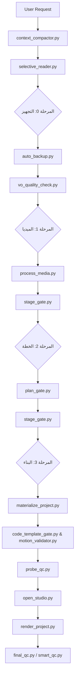

# Video Production Protocol — v4.0 (Agile Visual-First)

## 🗺️ مخطط التدفق الشامل للنظام (System Architecture)



## 📚 التوثيق المرجعي

- **إدارة السياق:** `.agents/plugins/super-video-maker-plugin/docs/CONTEXT_MANAGEMENT.md`
- **دليل القوالب:** `.agents/plugins/super-video-maker-plugin/docs/PROJECT_TEMPLATES_GUIDE.md`
- **Smart QC:** `.agents/plugins/super-video-maker-plugin/docs/SMART_QC_GUIDE.md`
- **إدارة الجلسات:** `.agents/plugins/super-video-maker-plugin/docs/SESSION_MANAGEMENT.md`
- **المواصفات التقنية:** `.agents/plugins/super-video-maker-plugin/docs/TECHNICAL_SPECIFICATIONS.md`
- **مصفوفة القراءة حسب المرحلة:** `.agents/plugins/super-video-maker-plugin/docs/PHASE_READING_MATRIX.md`

## 📚 بروتوكول القراءة الانتقائية (إلزامي)

### القاعدة الأساسية
اقرأ `.agents/plugins/super-video-maker-plugin/docs/PHASE_READING_MATRIX.md` في بداية كل خطوة لتحديد الملفات المطلوبة فقط.

### التنفيذ:
1. قبل أي خطوة، شغّل:
   ```bash
   python .agents/launcher.py selective_reader.py <phase>
   ```
   حيث `<phase>` هي المرحلة الحالية (analyze, plan, build_scene_N, audio, review, render)

2. اقرأ **فقط** الملفات التي يظهرها السكريبت
3. إذا احتجت ملفاً إضافياً، دوّن السبب في `.session_state.json` كتحذير

### المحظورات:
- ❌ قراءة `TEMPLATE_INDEX.md` في مرحلة `audio`
- ❌ قراءة كل مراجع Motion Taste في مرحلة `build_scene_N`
- ❌ قراءة ملفات مشاهد قديمة عند بناء مشهد جديد (إلا Scene{N-1}.tsx فقط للمرجع)

## 🔄 استئناف جلسة منتهية أو متوقفة

عند فتح محادثة جديدة لمشروع قائم، **ممنوع البدء من الصفر**. استخدم هذا الأمر:

```bash
python .agents/launcher.py session_manager.py resume <project_id>
```

ثم اقرأ ملف `resume_brief.md` المولّد والصق "البرومبت الجاهز" المذكور فيه في المحادثة الجديدة.
هذا يحفظ كل السياق والقرارات المتخذة والمراحل المنجزة، ويقوم تلقائياً بتنظيف `transcript.jsonl` للمحادثة الجديدة.

## 🧠 بروتوكول إدارة الذاكرة (إلزامي)

### عند بداية أي جلسة أو مرحلة جديدة:
1. تحقق من وجود `projects/<id>/session_digest.md`
2. إذا كان موجوداً: اقرأه أولاً قبل أي شيء آخر
3. إذا لم يكن موجوداً: شغّل `python .agents/launcher.py context_compactor.py compact <project_id>` (والذي يستدعي بدوره `transcript_cleaner.py` إذا لزم الأمر).

### عند اتخاذ أي قرار مهم:
سجّله فوراً:
```bash
python .agents/launcher.py context_compactor.py add-decision <project_id> "القرار" --status approved
```

### عند رفض المستخدم لاقتراح:
سجّله فوراً لمنع تكراره:
```bash
python .agents/launcher.py context_compactor.py add-decision <project_id> "الاقتراح المرفوض" --status rejected
```

### عند إكمال كل مرحلة:
حدّث المرحلة وتأكد من تخطي البوابة:
```bash
python .agents/launcher.py stage_gate.py <project_id> <المرحلة_الجديدة>
python .agents/launcher.py context_compactor.py set-phase <project_id> "<المرحلة_الجديدة>"
```

### عند حل مشكلة تقنية:
وثّقها:
```bash
python .agents/launcher.py context_compactor.py add-note <project_id> issue_resolved "<المشكلة>: <الحل>"
```

## 🎬 معاينة ستايل الحركة (إلزامية في كل مشروع جديد)

### القاعدة الأساسية:
**لا تفترض Energetic/Dynamic تلقائياً.** اسأل المستخدم أولاً.

### الخطوات:
1. عند بداية أي مشروع جديد، شغّل:
   ```bash
   python .agents/launcher.py motion_style_interviewer <project_id>
   ```

2. اعرض الأسئلة العشرة على المستخدم (كنص عادي، ليس JSON)

3. انتظر إجابات المستخدم (أرقام مفصولة بفاصلة)

4. السكريبت يولد `projects/<id>/motion_style_config.json` تلقائياً

5. اقرأ هذا الملف قبل بناء كل مشهد وطبّق القيم المحددة

### الاستثناءات:
- إذا قال المستخدم "افتراضي" → استخدم Energetic/Dynamic
- إذا قال المستخدم "نفس المشروع السابق" → انسخ الـ config من آخر مشروع
- إذا قال المستخدم "تجاوز المعاينة" → احفظ `{"style": "skipped"}` ووثّق السبب

### المحظورات:
- ❌ افتراض Energetic/Dynamic بدون سؤال المستخدم
- ❌ تجاهل ملف `motion_style_config.json` بعد إنشائه
- ❌ استخدام قيم مختلفة عن المحددة في الـ config

## 🔒 الأدوات الإلزامية (ممنوع تجاوزها)

### عند بداية كل مشروع:
1. ✅ `vo_quality_check.py` — فحص جودة الصوت
   - **التجاوز:** مسموح فقط للمشاريع التجريبية (`{"experimental": true}` في `.session_state.json`)
2. ✅ `auto_backup.py` — نسخة احتياطية أولية
   - **التجاوز:** مسموح فقط للاختبارات السريعة (`{"skip_backup": true}`)
3. ✅ `audio-tools-mcp:analyze_voiceover` — تحليل الصوت

### بعد الرندر:
1. ✅ `PRODUCTION_REPORT.md` — تقرير الإنتاج (يُنشأ تلقائياً بعد الرندر)

## المرحلة 0: التحضير والتحليل الأولي
**السكريبتات الإلزامية:**
- `auto_backup.py`: يُشغل فور بدء المشروع لأخذ نسخة احتياطية مبدئية.
- `vo_quality_check.py`: يُشغل بعد استلام الصوت لفحص جودته المبدئية.

---

## المرحلة 1: حزمة الميديا + المعاينة (🛑 توقف 1)

الخطوة 0 (قبل أي مرحلة): فحص التنبيهات الحية
- افحص وجود `projects/<id>/.agent_alerts.md`
- إذا كان موجوداً، اقرأ التنبيهات وتعامل معها قبل المتابعة
- إذا كان فارغاً أو غير موجود، انتقل للخطوة التالية

**السكريبتات الإلزامية:**
- `process_media.py`: لمعالجة الفيديو والصوت.

### الخطوة 1: تحليل صوتي إلزامي
بمجرد رفع المستخدم للـ VO (أو طلب توليده):
1. شغّل فوراً: `audio-tools-mcp:analyze_voiceover` على الملف.
2. انتظر نتائج التحليل (`04_timings.json`).

### الخطوة 2: جلب الميديا ومعالجتها
1. مرفوعات المستخدم أولاً → `assets/incoming/`
2. فحص الكاش: `common-tools-mcp:check_cache` (يُمنع الجلب من النت إذا وُجد أصل مطابق معالج).
3. جلب الناقص عبر `media-sources-mcp` مباشرة.
4. المعالجة (All-Intra للفيديو، -16 LUFS للـ VO، -24 LUFS للـ SFX) عبر `process_media.py`.
5. الحفظ في الكاش: `common-tools-mcp:save_to_cache`.

المخرج: حزمة الميديا الجاهزة
🛑 توقف 1: انتظر موافقة المستخدم على حزمة الميديا.

---

## المرحلة 2: الخطة التفصيلية + المعاينة (🛑 توقف 2)

الخطوة 0 (قبل أي مرحلة): فحص التنبيهات الحية
- افحص وجود `projects/<id>/.agent_alerts.md`
- اقرأ التنبيهات إن وجدت.

**السكريبتات الإلزامية:**
- `plan_gate.py`: للتحقق من صحة الخطة التفصيلية (Master Plan).
- `stage_gate.py`: للتحقق من إتمام المرحلة للانتقال للبناء.

#### ⚠️ قاعدة إلزامية غير قابلة للتفاوض:
**الخطة التفصيلية يجب أن يكتبها الوكيل بنفسه، وليس عبر سكريبت.** (تم حذف `generate_plan.py` تماماً).

الأسباب:
- السكريبتات لا تفهم السياق الإبداعي للمحتوى
- التوليد الإبداعي مهمة الوكيل، والفحص مهمة السكريبتات (`plan_gate.py`).

#### الخطوات الإلزامية:
1. اقرأ `references/PLAN_TEMPLATE.md` لفهم الهيكل والقواعد
2. اقرأ `04_timings.json` للتوقيتات الدقيقة لكل كلمة
3. اقرأ `TEMPLATE_INDEX.md` لاختيار القوالب المناسبة
4. اقرأ `SFX_BINDING_MATRIX.md` لاختيار المؤثرات المناسبة
5. اقرأ `motion-personality.md` و `user-signature-style.md` للاقتباسات
6. اكتب الخطة بنفسك، مشهداً بمشهد، لقطة بلقطة
7. احفظها في `projects/<project_id>/master_plan.md`
8. شغّل: `python .agents/launcher.py plan_gate.py <project_id>` للفحص
9. إذا فشل الفحص، أصلح الخطة وأعد المحاولة

#### معايير الخطة المقبولة:
- ✅ كل مشهد له جدول كلمات مع توقيتات دقيقة
- ✅ كل مشهد له ≥ 2 لقطات مفصلة
- ✅ كل لقطة لها: قالب + كاميرا + إيماءة + SFX + كلمة متزامنة
- ✅ لا حشو، لا تعليقات فارغة، لا عبارات عامة

#### ❌ محظورات مطلقة (المرحلة 2):
- لا تستخدم أي سكريبت لكتابة المحتوى الإبداعي (يُمنع استخدام generate_plan.py).
- لا تضف حشواً للوصول لعدد أسطر معين.
- التخطي للرندر أو البناء بدون تجاوز `plan_gate.py`.

المخرج: `master_plan.md` مكتوب بالكامل بواسطة الوكيل.
🛑 توقف 2: انتظر موافقة المستخدم الصريحة على الخطة التفصيلية.

---

## المرحلة 3: البناء + المعاينة + الرندر (🛑 توقف 3)

**السكريبتات الإلزامية:**
- `materialize_project.py`: لنسخ ميديا المشروع.
- `code_template_gate.py`: للتحقق من التزام الكود بالقوالب.
- `motion_validator.py`: للتحقق من أرقام الحركة (Spring/Interpolate).
- `probe_qc.py`: فحص الكود قبل الاستوديو.
- `open_studio.py`: لفتح بيئة المعاينة.
- `render_project.py`: للرندر النهائي.
- `final_qc.py` أو `smart_qc.py`: لفحص الفيديو المُصدَّر.

**السكريبتات الاختيارية (OPTIONAL_JUSTIFIED):**
- `batch_builder.py`: يُستخدم فقط للمشاريع الضخمة التي تحتوي على > 5 مشاهد لتسريع عملية توليد كود المشاهد بالتوازي (بناءً على خطة جاهزة وموافق عليها).

### الخطوة 1: بناء المشاهد (Code Generation)
- يُمنع بناء أي مشهد بدون وجود خطة المشهد المطابقة.
- يجب استخدام القوالب المعتمدة في `TEMPLATE_INDEX.md` (صفر ارتجال).
- يجب تطبيق شخصية الحركة من `motion-personality.md`.
- كل ميديا تدخل البناء عبر `materialize_project.py` فقط. ممنوع النسخ اليدوي.
- يُفحص كود المشهد آلياً عبر `code_template_gate.py` و `motion_validator.py` لضمان عدم وجود أكواد حركة غير قياسية.

### الخطوة 2: المعاينة والجودة (Probe-QC & Studio)
- لا فتح للاستوديو قبل نجاح فحص الجودة `probe_qc.py`.
- تشغيل الاستوديو للمعاينة: `python .agents/launcher.py open_studio.py <project_id>` (ممنوع استخدام npm/npx مباشرة).

### الخطوة 3: الرندر النهائي
- 🛑 ممنوع الرندر قبل المعاينة وموافقة المستخدم الصريحة.
- 🛑 يجب إنشاء ملف `.studio_approved` يدويًا من قبل المستخدم بعد المعاينة (ممنوع إنشاؤه برمجياً أو تلقائياً).
- الرندر يتم عبر الأمر: `python .agents/launcher.py render_project.py <project_id>`.
- بعد الرندر، يتم تشغيل `final_qc.py` (و `smart_qc.py` إذا توفر Tesseract) لضمان خلو الفيديو من الأخطاء النهائية.

المخرج: الفيديو النهائي المُصدّر.
🛑 توقف 3: توقف نهائي للتسليم.

## 🎬 المشاريع الخاصة

### المشاريع الصامتة (Audio-Free)
إذا كان المشروع لا يحتوي على تعليق صوتي:
1. أضف `{"audio_free": true}` إلى `.session_state.json`
2. سيتم تجاوز:
   - `require_vo_quality_check`
   - `require_stage_complete` (مرحلة audio_analysis)
   - `require_all_sentences_covered`

### المشاريع التجريبية
أضف `{"experimental": true}` لتجاوز فحوصات الجودة الصارمة.
