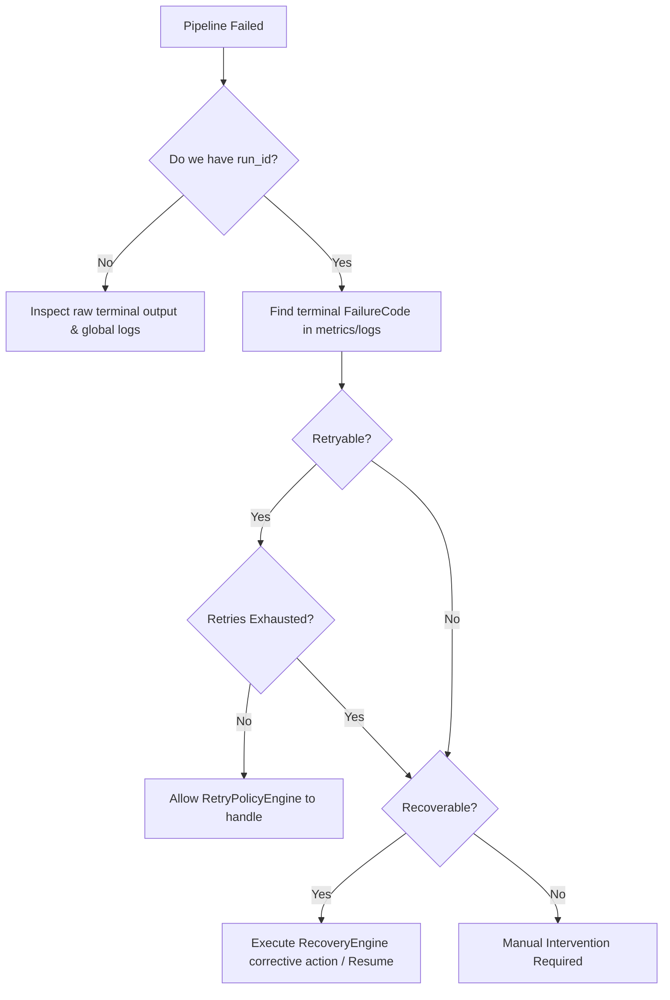

# Phase 7 Runtime Runbook

This document serves as the operational runbook for recovering from pipeline failures in Phase 7.

## Diagnostic Decision Tree

When the pipeline fails, follow this decision path to determine the correct action:



---

## 1. Gate Rejections (ASSET_GATE_REJECTED, PLAN_GATE_REJECTED, etc.)

**Symptom**: Pipeline stops early. `plan_gate.py` or `asset_gate.py` fails and refuses to advance.
**FailureCode**: `ASSET_GATE_REJECTED`, `PLAN_GATE_REJECTED`, `QC_GATE_FAILED`
**Severity**: WARNING / ERROR
**Likely Cause**: Missing files, failed validation rules, invalid blueprint.
**Automatic Behavior**: Pipeline halts. State remains at the previous successful checkpoint.
**How to Confirm**: Check the log output for the specific missing file or validation error message.
**Manual Recovery**: 
- Fix the underlying file or plan.
- Re-run the pipeline. `RecoveryEngine` will resume from the last valid checkpoint automatically.
**Do NOT Do**: Do not bypass the gate check. Do not manually update the checkpoint file.

---

## 2. Render Process & Output Failures

**Symptom**: `render_project.py` crashes, times out, or finishes but `out.mp4` is missing.
**FailureCode**: `RENDER_PROCESS_FAILED`, `RENDER_TIMEOUT`, `RENDER_OUTPUT_MISSING`
**Severity**: ERROR / WARNING
**Likely Cause**: Remotion/FFmpeg crash, memory limit exceeded, rendering took too long.
**Automatic Behavior**: RetryPolicyEngine will retry the render process up to 3 times automatically.
**How to Confirm**: Inspect the terminal output for `Max attempts exhausted`. Check `metrics_collector` for retry counts.
**Manual Recovery**: 
- If retries are exhausted, inspect the rendering logs to fix the root cause (e.g., lower resolution, fix code).
- Re-run the pipeline. It will resume from `BLUEPRINT_READY` and retry rendering.
**Do NOT Do**: Do not manually run `npx remotion`. Always use `pipeline.py`.

---

## 3. State & Checkpoint Failures

**Symptom**: Pipeline refuses to start or resume, citing missing artifacts or mismatched hashes.
**FailureCode**: `STATE_CORRUPTION`, `PROJECT_NOT_LOCKED`
**Severity**: CRITICAL / WARNING
**Likely Cause**: A critical file (`master_plan.md`, `05_blueprint.json`, `out.mp4`) was manually deleted or modified after a checkpoint was saved.
**Automatic Behavior**: Pipeline halts. `RecoveryEngine` will reject the checkpoint and suggest restarting from scratch or a previous safe state.
**How to Confirm**: `RecoveryEngine` log will state `Artifact missing` or `Artifact hash mismatch`.
**Manual Recovery**: 
- If a file was manually deleted, you must accept the pipeline's decision to restart from a previous safe stage (or delete `.pipeline_checkpoint.json` to start from scratch).
**Do NOT Do**: Do not try to hack `.pipeline_checkpoint.json` to bypass validation.

---

## 4. Internal & Security Failures

**Symptom**: Hard crashes, Python exceptions, blocked execution.
**FailureCode**: `SECURITY_POLICY_BLOCKED`, `UNEXPECTED_INTERNAL_ERROR`, `GATE_EXECUTION_FAILED`
**Severity**: CRITICAL / ERROR
**Likely Cause**: A developer tried to run failure injection in production, or a syntax error in the python scripts.
**Automatic Behavior**: Immediate crash. Security policies cannot be retried. `GATE_EXECUTION_FAILED` is retried 3 times before giving up.
**How to Confirm**: Check the exception traceback in the terminal or `runtime.jsonl`.
**Manual Recovery**: 
- Fix the python code bug. 
- Disable failure injection variables if in production.
**Do NOT Do**: Do not ignore stack traces. 

---

## Operational Commands

Use ONLY these canonical commands to interact with the pipeline in Phase 7:

**1. Run Pipeline (Normal Mode)**
```bash
python scripts/pipeline.py <project_id>
```

**2. Inspect Health & Metrics**
*(Will be available in Phase 7.6 collector / or manual inspection of runtime.jsonl)*
```bash
python scripts/metrics_collector.py <project_id>
```

**3. Run Phase 7 Assurance Tests**
```bash
python -m pytest scripts/tests/test_*.py -v
```
