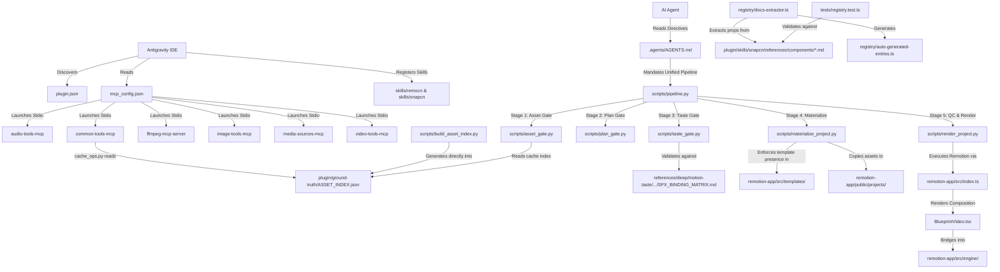

# Super Video Maker Plugin vs Root Architecture

## 1. System Context & Overview

This document defines the architectural relationship between the **Root Project Workspace** (`c:\video\clean-video-workspace\`) and the **Plugin Subsystem** (`.agents\plugins\super-video-maker-plugin\`).

Historically, in early development (prior to commit `9dcb888`), the entire video production codebase (including Remotion templates, engine code, execution scripts, and production recipes) resided inside the plugin directory. In commit `9dcb888` (*"refactor(core): decouple application logic from AI plugin"*), application core logic, the Remotion rendering engine, and the pipeline orchestrators were decoupled and promoted to the root repository level. Subsequently, in commit `7e94c15` (*"refactor(plugin): overhaul super-video-maker-plugin to strictly follow unified pipeline protocol"*), obsolete manual coding references and legacy tests were purged from the plugin to align with the unified pipeline.

---

## 2. High-Level Architectural Diagram

```text
                                  +---------------------------------------+
                                  |         Google Antigravity IDE        |
                                  |   (Agent Plugins & Customization)     |
                                  +-------------------+-------------------+
                                                      |
                                     Discovers via .agents/plugins/
                                                      |
                                                      v
                        +-----------------------------------------------------------+
                        |  .agents/plugins/super-video-maker-plugin/plugin.json     |
                        |  (Identity: super-video-maker v1.0.0, Commercial Director)|
                        +-----------------------------+-----------------------------+
                                                      |
                         +----------------------------+----------------------------+
                         |                                                         |
                         v                                                         v
      +-------------------------------------+                   +-------------------------------------+
      |         PLUGIN-LOCAL SUBSYSTEM      |                   |       ROOT WORKSPACE SUBSYSTEM      |
      | (.agents/plugins/.../tools, skills) |                   |  (scripts/, templates/, engine/)    |
      +-------------------------------------+                   +-------------------------------------+
      | 1. MCP Configuration                |                   | 1. Canonical Pipeline               |
      |    `mcp_config.json`                |                   |    `scripts/pipeline.py` (ACTIVE)   |
      |    -> 6 active stdio servers        |                   |    `.pipeline_state.json`           |
      |                                     |                   |                                     |
      | 2. Active Agent Skills              |                   | 2. Rendering Engine & Templates     |
      |    - `skills/remocn/` (12 files)    |                   |    `templates/` (109 components)    |
      |    - `skills/snapcn/` (43 files)    |                   |    `remotion-app/src/templates/`    |
      |                                     |                   |    `remotion-app/src/engine/`       |
      | 3. Tool Adapters & MCP Servers      |                   |                                     |
      |    - `tools/*.py` (13 scripts)      |                   | 3. Production Recipes               |
      |    - `tools/mcp-servers/` (6 srvs)  |                   |    `recipes/*.json` (17 recipes)    |
      |                                     |                   |                                     |
      | 4. Active Cache Index Target        |                   | 4. Authoritative Documentation      |
      |    `ground-truth/ASSET_INDEX.json`  |                   |    `ARCHITECTURE_TRUTH.md`          |
      |    (Generated by root script)       |                   |    `references/` (Level 5 + deep/)  |
      |                                     |                   |    `documentation/`                 |
      | 5. Standalone Packaging Artifacts   |                   |                                     |
      |    `package.json`, `.env`, etc.     |                   | 5. Security & Gate Enforcement      |
      +-------------------------------------+                   |    `scripts/security.py`            |
                                                                |    `.agents/guardian/` (Guardian)   |
                                                                |    `config/violations_config.json`  |
                                                                +-------------------------------------+
```

---

## 3. Detailed Component Loading Graph



---

## 4. Canonical Source-of-Truth Map

| Subsystem | Canonical Source | Status / Role | Rationale & Evidence |
|---|---|---|---|
| **Templates** | **ROOT** | `ROOT_IS_SOURCE_OF_TRUTH` | 109 templates reside in `templates/` and `remotion-app/src/templates/`. Plugin contains 0 templates (`.tsx` count = 0). Validated by `tests/template_runtime_resolution.test.ts` and `contracts.test.ts`. |
| **Scripts & Pipeline** | **ROOT** | `ROOT_IS_SOURCE_OF_TRUTH` | Canonical unified orchestrator is `scripts/pipeline.py`. State managed in `.pipeline_state.json`. Decoupled from plugin in commit `9dcb888`. Enforced by `ARCHITECTURE_TRUTH.md`. |
| **Recipes** | **ROOT** | `ROOT_IS_SOURCE_OF_TRUTH` | 17 production recipes in `recipes/*.json` validated by `recipes/schema.json` and indexed in `ground-truth/RECIPES_INDEX.md`. Plugin contains only 1 markdown wrapper command. |
| **References** | **ROOT** | `ROOT_IS_SOURCE_OF_TRUTH` | Root `references/` is constitutional Level 5 authority under `ARCHITECTURE_TRUTH.md`. All root files have authority banners and Zero-Build engine instructions. Root contains `references/deep/` (with `SFX_BINDING_MATRIX.md`). Plugin copies are diverged legacy versions. |
| **Configuration** | **ROOT** | `ROOT_IS_SOURCE_OF_TRUTH` | `.agents/guardian/utils.py` strictly loads `config/violations_config.json` from root. Plugin copy is an unmaintained, unreferenced remnant. |
| **Tools (Adapters)** | **PLUGIN** | `PLUGIN_IS_SOURCE_OF_TRUTH` | 13 Python scripts in `.agents/plugins/.../tools/` provide tool adapters (elevenlabs, heygen, browser recorder, fal, replicate). Scanned by `scripts/build_ground_truth.py` and called by `recipes/*.json`. |
| **MCP Servers** | **PLUGIN** | `PLUGIN_IS_SOURCE_OF_TRUTH` | Declared in `.agents/plugins/.../mcp_config.json` and implemented in `tools/mcp-servers/`. Executed via stdio by Antigravity runtime. Zero root counterparts exist. |
| **Skills (`remocn`/`snapcn`)**| **PLUGIN** | `PLUGIN_IS_SOURCE_OF_TRUTH` | Loaded by Antigravity IDE from plugin directory. Component documentation parsed by root `registry/docs-extractor.ts` and validated by `tests/registry.test.ts`. |
| **Ground Truth (General)** | **ROOT** | `ROOT_IS_SOURCE_OF_TRUTH` | `TEMPLATE_INDEX.md`, `TOOLS_INDEX.md`, `MCP_INDEX.md`, `RECIPES_INDEX.md`, `CINEMATIC_INDEX.md` reside exclusively in root `ground-truth/`. |
| **Asset Index (`ASSET_INDEX.json`)**| **PLUGIN** | `GENERATED_FROM_ROOT` *(Inverted)* | `scripts/build_asset_index.py` actively writes to `.agents/plugins/.../ground-truth/ASSET_INDEX.json`. Read by `common-tools-mcp` and `asset_gate.py`. Root copy is a stale snapshot from commit `9dcb888`. |

---

## 5. Plugin Portability & Boundary Analysis

```text
PLUGIN_PORTABILITY_MODEL = REPO_COUPLED
```

### Architectural coupling evidence:
1. **Workspace Traversal**: `plugin/verify.py` resolves `plugin_dir.parents[2]` and actively asserts the presence of `templates/`, `engine/`, `scripts/`, `assets/`, `projects/`, and `documentation/` in the workspace root.
2. **Absolute Path Hardcoding**: `plugin/mcp_config.json` hardcodes `C:/video/clean-video-workspace` in server execution arguments, working directories, and environment variables (`SVM_DATA_DIR`, `SVM_PLUGIN_ROOT`).
3. **Execution Delegation**: `plugin/commands/avatar-insta-reel.md` explicitly instructs the agent to run root commands (`python scripts/pipeline.py <project_id>`).
4. **Cross-Boundary Testing**: `tests/registry.test.ts` and `registry/docs-extractor.ts` require relative traversal into `.agents/plugins/super-video-maker-plugin/skills/` to function.

The plugin was originally designed as a prospective standalone repository package (`docs/guides/DISTRIBUTION_CHECKLIST.md`), but decoupling was left incomplete. The plugin currently operates as an internal workspace extension rather than an independent portable plugin.
