# تقرير التدقيق المعماري والتقني لبيئة Clean Video Workspace
## (Technical Audit & Architecture Specification — Protocol v4.0)

---

## 1. ملخص تنفيذي ونطاق التقييم (Executive Summary & Scope)

يقدم هذا التقرير تحليلاً تقنياً موضوعياً ومحايداً لمنظومة العمل المؤتمتة لإنتاج الفيديو برمجياً (**Video-as-Code**) في مشروع **Clean Video Workspace**. يستعرض التقرير الهيكلية الفيزيائية، بروتوكولات الإنتاج المعتمدة (**Protocol v4.0**)، آليات الحراسة الاستباقية، مكونات المحرك الإضافي المركزي (**`super-video-maker-plugin`**)، ونتائج معالجة الثغرات التقنية المرصودة في مراجعات الأمان السابقة (**V2 Fixes**).

### منهجية وحدود التدقيق:
1. **الفحص التشغيلي (Operational / Dynamic Testing):**
   - تم التحقق الفعلي من عمل حزمة اختبارات الانحدار في `tests/test_guardrails.py`.
   - تم اختبار صمود تعبيرات Regex أمام محاولات التهرب بالفواصل السطرية والمسافات الزائدة.
   - تم التحقق من آلية التحقق الرياضي للختم الرقمي المشفر (`.seal` مع Secret Salt).
2. **الفحص الساكن (Static Code Review):**
   - مراجعة محرك الخطافات `hooks.json` في Antigravity 2.0.
   - مراجعة قواعد الحظر المركزية في `config/violations_config.json`.
   - مراجعة توجيهات الوكيل الدستورية في `AGENTS.md` وبروتوكول الإنتاج `video-production-protocol.md`.
   - مراجعة مكونات وأدوات وخوادم `super-video-maker-plugin` في `.agents/plugins/`.
3. **حدود نطاق التدقيق (Audit Boundaries):**
   - **ما لم يتم اختباره حياً:** استهلاك التوكنز الفعلي ومعدل طلبات APIs الخارجية (Rate Limits) أثناء جلسات إنتاج مطولة تتجاوز بيئة المحاكاة المحلية.
   - **طبيعة النماذج اللغوية (LLM Non-determinism):** تقييم الحراسة يركز على الحواجز البرمجية الوسيطة (Intermediary Hooks & Gates). سلوك النماذج يظل احتماليًا، لذا صُممت الحواجز لتعتمد على الفحص القطعي (Deterministic Validation) في نظام التشغيل وليس على افتراض التزام النموذج ذاتياً.

---

## 2. الفلسفة المعمارية ونموذج العمل (Architectural Analysis)

يعتمد النظام على نموذج تحويل عناصر الفيديو (المشاهد، النصوص، الكاميرا، الصوت) إلى كود برمجي تنفيذي (React / Remotion) بدلاً من مشاريع المونتاج اليدوية:

### 2.1 المبادئ الأساسية:
- **التصميم الموجه بالبيانات (Data-Driven Composition):** يتم تعريف عناصر الفيديو عبر هياكل بيانات (Blueprint JSON) تُحقن داخل قوالب مسبقة الصنع.
- **حظر الارتجال البرمجي (Restricted Improvisation):** يُمنع الوكيل من صياغة تحريكات صلبة أو مكونات مجهولة المصدر، ويلزم بالاستدعاء من فهرس القوالب المعتمد `TEMPLATE_INDEX.md`.
- **فصل مناطق السيادة (Separation of Concerns):**
  1. **منطقة الموارد (Assets Zone):** إدارة مركزية للأصول في مسارات `assets/`، تخضع لمعالجة موحدة (All-Intra للفيديو، وتطبيع -16 LUFS للصوت، و-24 LUFS للمؤثرات).
  2. **منطقة الحقيقة المرجعية (Ground Truth Zone):** قواعد البيانات، القوالب المصنفة، ومصفوفات التزامن الصوتي والحركي.
  3. **منطقة البناء والتنفيذ (Build Zone):** بيئات عمل معزولة لكل مشروع داخل `projects/<project_id>/` معزولة تماماً عن الملفات المشتركة.
  4. **منطقة المحرك والإضافات (Plugin & Capabilities Zone):** المتمثلة في `super-video-maker-plugin` كحزمة متكاملة للأدوات ومهارات Remotion وخوادم الـ MCP.

### 2.2 المقايضات المعمارية (Architectural Trade-offs):
- **المزايا:** استقرار عالي في الرندر، ثبات الأنماط البصرية، منع انهيار الأكواد أثناء التصدير، وتوثيق دقيق لكل عنصر.
- **التحديات:** انخفاض المرونة الحركية الحرة (Creative Rigidity) مقارنة بالمونتاج اليدوي؛ حيث يقتصر التنوع على ما تدعمه مكتبة القوالب الحالية (170+ قالب) وقدرات البلوجن.

---

## 3. الهيكلية الفيزيائية لمساحة العمل (Physical Directory Structure)

تتوزع مكونات مساحة العمل على النحو التالي وفقاً للواقع الفعلي للمشروع:

```text
clean-video-workspace/
├── .agents/                               # أدوات الحراسة والتوجيه المخصصة للوكيل
│   ├── guardian/                          # حراس بيئة Antigravity (خطافات Pre/Post Tool)
│   │   ├── command_guard.py               # فحص واعتراض أوامر run_command
│   │   ├── write_guard.py                 # حماية الملفات الأمنية ومسارات النظام من التعديل
│   │   ├── behavior_guard.py              # فحص سياق ومخرجات الوكيل قبل استدعاء الأدوات
│   │   └── post_executor.py               # مراقبة نتائج تنفيذ الأوامر وتسجيل الحالة
│   ├── secrets/                           # مستودع البيانات التشفيرية الحساسة
│   │   └── .qc_salt                       # مفتاح تشفير عشوائي محلي (256-bit) لحماية الأختام
│   ├── logs/                              # سجلات المراقبة والتدقيق
│   │   └── guardrails.log                 # السجل المركزي لكافة قرارات السماح والحظر
│   ├── rules/                             # بروتوكولات العمل المنظمة
│   │   └── video-production-protocol.md   # وثيقة البروتوكول الرسمية (v4.0)
│   ├── plugins/super-video-maker-plugin/  # المحرك الإضافي المركزي للقدرات والأدوات
│   │   ├── plugin.json                    # وثيقة تعريف وهوية البلوجن (Version 1.0.0)
│   │   ├── mcp_config.json                # تكوين وتوجيه خوادم MCP السبعة
│   │   ├── verify.py                      # سكربت التحقق الذاتي من بيئة واعتماديات البلوجن
│   │   ├── commands/                      # سيناريوهات وأوامر الإنتاج الجاهزة (Instagram reels, reviews)
│   │   ├── workflows/                     # مسارات العمل المركبة (Avatars, Split screens, Explainers)
│   │   ├── tools/                         # 19 أداة بايثون متخصصة (HeyGen, ElevenLabs, Fal, UGC)
│   │   │   └── mcp-servers/               # مجلد الخوادم السبعة المعزولة عبر uv
│   │   └── skills/                        # المهارات البرمجية المدمجة (remocn, snapcn)
│   └── AGENTS.md                          # القواعد الحاكمة العامة وقواطع التيار
├── config/                                # ملفات التكوين الموحدة
│   └── violations_config.json             # المصدر المركزي الموحد لأنماط الانتهاكات المحظورة
├── hooks.json                             # تكوين ربط خطافات Antigravity مع ملفات الحراسة
├── assets/                                # دورة حياة الوسائط المركزية
│   ├── incoming/                          # مدخلات المستخدم والمواد الخام المرفوعة
│   ├── cache/                             # وسائط الـ MCP المحفوظة مؤقتاً لتجنب التكرار
│   ├── processing/                        # بيئة المعالجة والتحويل الهندسي
│   └── ready/                             # الأصول المعتمدة الجاهزة للاستخدام البرمجي
├── projects/                              # مجلدات المشاريع المعزولة
│   └── [project_id]/                      # مجلد المشروع المستقل
│       ├── master_plan.md                 # الخطة التفصيلية المكتوبة يدويًا
│       ├── 02_asset_manifest.json         # بيان الوسائط المعتمدة
│       ├── 04_timings.json                # مصفوفة التوقيتات المستخرجة للتعليق الصوتي
│       ├── 05_05_blueprint.json              # المخطط الهندسي للمشاهد
│       ├── 06_build/                      # بيئة Remotion / React الخاصة بالمشروع
│       │   ├── src/                       # أكواد المشاهد والمكونات
│       │   └── public/media/              # الأصول المنقولة حصراً عبر سكربت البناء
│       ├── 08_qc/                         # مجلد مخرجات الفحص وإطارات المعاينة
│       ├── probe_qc_report.json           # تقرير الفحص الفني المستخرج آلياً
│       ├── probe_qc_report.json.seal      # الختم الرقمي المشفر لتقرير الفحص
│       └── .studio_approved               # ملف الموافقة البشرية الموثق بالبصمة
├── scripts/                               # ترسانة الأدوات التشغيلية والبوابات (53 سكربت)
│   ├── core/                              # النواة المشتركة لخطوط الأنابيب والبوابات
│   ├── plan_gate.py                       # بوابة تقييم جودة وتنوع الخطة
│   ├── asset_gate.py                      # بوابة فحص الوسائط
│   ├── code_template_gate.py              # بوابة فحص شجرة الكود (AST) ومنع الحركات العشوائية
│   ├── motion_validator.py                # بوابة مطابقة التناغم الحركي
│   ├── probe_qc.py                        # أداة الفحص الخفي واستخراج الختم الرقمي
│   ├── materialize_project.py             # الناقل الحصري للأصول إلى مجلد البناء
│   ├── scene_compiler.py                  # مترجم المشاهد إلى كود React
│   ├── open_studio.py                     # المشغل الوسيط لبيئة الاستوديو
│   └── render_project.py                  # المشغل الوسيط للرندر النهائي
├── engine/                                # المحرك السينمائي (الكاميرا، الصوت، التخطيط، المؤشر)
├── templates/                             # مكتبة القوالب المعتمدة (170+ قالب)
├── ground-truth/                          # فهارس الحقيقة ومواصفات القوالب (TEMPLATE_INDEX.md)
├── references/                            # الأدلة المرجعية ومصفوفات التزامن الحركي والصوتي
└── tests/                                 # اختبارات التحقق من الحراسة (test_guardrails.py)
```

---

## 4. تدفق خط الإنتاج وفق بروتوكول الإصدار الرابع (Protocol v4.0 Pipeline)

ينقسم خط الإنتاج إلى **3 مراحل رئيسية** تحكمها **3 نقاط توقف إجبارية (🛑 Hard Stops)** لا يُسمح بتجاوزها إلا بقرار صريح من المستخدم:

```mermaid
flowchart TD
    subgraph PreFlight ["المرحلة 0: التحضير والاستيضاح (Pre-Flight)"]
        VO[رفع التعليق الصوتي] --> VO_Analyze[تحليل الصوت: analyze_voiceover]
        VO_Analyze --> AskQ[طرح 5 أسئلة استيضاح عبر ask_question]
        AskQ --> UserAnswers[استلام إجابات المستخدم]
    end

    subgraph Phase1 ["المرحلة 1: حزمة الوسائط (🛑 STOP 1)"]
        UserAnswers --> CacheCheck[فحص الكاش: check_cache]
        CacheCheck --> FetchMCP[جلب الأصول: media-sources-mcp]
        FetchMCP --> FFmpegProc[معالجة الوسائط: FFmpeg All-Intra & LUFS]
        FFmpegProc --> SaveCache[تحديث الكاش وبيان 02_asset_manifest]
        SaveCache --> Stop1[🛑 STOP 1: اعتماد حزمة الوسائط]
    end

    subgraph Phase2 ["المرحلة 2: الخطة التفصيلية (🛑 STOP 2)"]
        Stop1 --> HumanPlan[كتابة الخطة يدويًا: master_plan.md]
        HumanPlan --> PlanGate[فحص الخطة: python scripts/plan_gate.py]
        PlanGate --> Stop2[🛑 STOP 2: اعتماد الخطة التفصيلية]
    end

    subgraph Phase3 ["المرحلة 3: البناء، المعاينة، والرندر (🛑 STOP 3)"]
        Stop2 --> GenJSON[إعداد 05_05_blueprint.json والبيان]
        GenJSON --> Materialize[نقل الأصول: scripts/materialize_project.py]
        Materialize --> Compile[تجميع المشاهد: scene_compiler.py]
        Compile --> ASTGate[فحص الكود: code_template_gate.py]
        ASTGate --> ProbeQC[الفحص الخفي واستخراج الختم: probe_qc.py]
        ProbeQC --> OpenStudio[فتح الاستوديو: scripts/open_studio.py]
        OpenStudio --> UserApprove[المعاينة البشرية وإصدار .studio_approved]
        UserApprove --> Render[الرندر النهائي: scripts/render_project.py]
        Render --> Stop3[🛑 STOP 3: استلام الفيديو النهائي]
    end
```



### 4.1 تفصيل متطلبات المراحل:
1. **المرحلة 0 (Pre-Flight):**
   - استدعاء إلزامي لأداة `analyze_voiceover` لإنشاء `04_timings.json`.
   - استخدام إلزامي لأداة `ask_question` التفاعلية لطرح 5 أسئلة جوهرية حول الأبعاد (Aspect Ratio)، الاستعارات البصرية، الإيقاع، لوحة الألوان، ونمط النصوص.
2. **المرحلة 1 (Media Package — 🛑 STOP 1):**
   - التحقق من الكاش عبر `check_cache` لمنع التحميل المزدوج.
   - جلب المفقود حصراً عبر أدوات MCP. يُحظر استخدام `curl`, `wget`, `yt-dlp`.
   - المعالجة الهندسية عبر FFmpeg: تحويل الفيديو إلى `All-Intra` وتطبيع الصوت (-16 LUFS للتعليق و -24 LUFS للمؤثرات).
   - توقف إجباري للموافقة على الوسائط.
3. **المرحلة 2 (Detailed Plan — 🛑 STOP 2):**
   - صياغة خطة `master_plan.md` بواسطة الوكيل حصراً دون الاستعانة بسكربتات توليد آلي.
   - الالتزام بالمعايير: جدول زمني للكلمات، لقطتان على الأقل لكل مشهد، 3 قوالب مختلفة كحد أدنى، 3 مؤثرات صوتية مختلفة، وتوثيق الاستشهادات الحركية.
   - التحقق عبر `python scripts/plan_gate.py <project_id>`.
   - توقف إجباري للموافقة على الخطة.
4. **المرحلة 3 (Build, Preview & Render — 🛑 STOP 3):**
   - توليد `05_05_blueprint.json` و `02_asset_manifest.json`.
   - نقل الوسائط حصراً عبر `materialize_project.py`.
   - فحص شجرة الكود (AST) وتطبيق التناغم الحركي.
   - تنفيذ الفحص الخفي `probe_qc.py` والتحقق من سلامة اللقطات التجريبية.
   - فتح الاستوديو عبر `open_studio.py` (حظر تشغيل `npm run` أو `npx` مباشرة).
   - اشتراط ملف `.studio_approved` اليدوي من قبل المستخدم للتصريح بالرندر.
   - تشغيل الرندر النهائي عبر `render_project.py`.

---

## 5. تحليل المنظومة الرقابية والحراس (Guardians & Defensive Architecture)

تعتمد بيئة العمل نظام دفاع متعدد الطبقات (Defense in Depth) للحد من مخاطر التهرب أو التوليد غير المنضبط:

### 5.1 محرك الخطافات (Antigravity 2.0 Hooks):
يرتبط النظام بملف `hooks.json` في جذر المشروع لتقييد صلاحيات الأدوات:
- **`run_command` (PreToolUse):** مراقبة وتدقيق كافة أوامر سطر الأوامر عبر `command_guard.py`.
- **`write_to_file | replace_file_content | multi_replace_file_content` (PreToolUse):** حماية الملفات الحساسة عبر `write_guard.py`.
- **`*` (Wildcard PreToolUse):** فحص مدخلات وسياق الوكيل اللحظي عبر `behavior_guard.py`.
- **`run_command` (PostToolUse):** تدقيق ومتابعة المخرجات التشغيلية عبر `post_executor.py`.

### 5.2 مهام الحراس المتخصصين:
1. **`command_guard.py`:**
   - يمنع تشغيل أدوات Node/npm مباشرة (`npx remotion`, `npm run studio`).
   - يمنع أدوات التنزيل الخارجية غير المصرح بها (`curl`, `wget`, `yt-dlp`).
   - يمنع الرندر المباشر عبر FFmpeg دون المرور بمحرك Remotion.
   - يمنع حذف الملفات والمجلدات الحساسة (`.agents/`, `engine/`, `templates/`, `scripts/`).
   - يمنع استدعاء `materialize_project.py` قبل اكتمال الملفات التأسيسية (`master_plan.md`, `05_05_blueprint.json`, `02_asset_manifest.json`).
2. **`write_guard.py`:**
   - يمنع تعديل أو إنشاء ملفات الاعتماد الأمنية: `.studio_approved`, `.studio_unlocked`, `probe_qc_report.json`, `.seal`, `.qc_salt`, `04_timings.json`.
   - يمنع الكتابة في مسارات النواة المحمية ومسارات القوالب الأساسية.
3. **`behavior_guard.py`:**
   - يحلل نصوص الوكيل وسياقه الحالي وسجل المحادثات قبل تنفيذ الأدوات لرصد أي حشو مصطنع (`padding`) أو محاولات ادعاء موافقات غير صحيحة.
4. **`post_executor.py`:**
   - يراقب حالة خروج الأوامر (Exit Codes) ويسجل التنبيهات التشغيلية.

### 5.3 آلية الختم الميكانيكي والسر المشفر (Cryptographic Mechanical Lock):
- **المشكلة السابقة:** إمكانية حساب الوكيل للـ Hash وكتابة ملف `.seal` لتخطي بوابة الجودة.
- **الحل التقني المنفذ:**
  1. يقوم `probe_qc.py` بإنشاء مفتاح عشوائي مشفر محلياً (32-byte / 256-bit) في مسار محمي: `.agents/secrets/.qc_salt`.
  2. يُحسب الختم بدمج بايتات تقرير الفحص مع المفتاح السري:
     $$\text{Seal} = \text{SHA-256}(\text{ReportBytes} + \text{SecretSalt})$$
  3. يقوم `open_studio.py` و `render_project.py` بالتحقق من تطابق هذه البصمة قبل فك القفل.
  4. بما أن `write_guard.py` يحظر على الوكيل كتابة أو تعديل `.seal` أو `.qc_salt`، فإن تزوير الختم يصبح غير ممكن حسابياً وبرمجياً في هذه البيئة.

---

## 6. التحليل المعماري للمحرك الإضافي المركزي (`super-video-maker-plugin`)

يمثل المجلد `.agents/plugins/super-video-maker-plugin/` الذراع التنفيذية الأكبر لقدرات الوكيل الذكي؛ إذ تنص توجيهات `AGENTS.md` على أنه **"المصدر الحصري لقدرات الوكيل كـ Commercial Motion Director"**. يتكامل هذا البلوجن مع مساحة العمل عبر المكونات التالية:

```text
.agents/plugins/super-video-maker-plugin/
├── plugin.json                     # ميثاق الهوية، الإصدار (1.0.0)، والكلمات المفتاحية
├── mcp_config.json / mcp.json      # تكوينات الاتصال بخوادم MCP السبعة
├── verify.py                       # سكربت التحقق الآلي من سلامة مسارات واعتماديات البلوجن
├── commands/                       # قوالب توجيهية لأوامر الإنتاج السريعة
│   ├── avatar-insta-reel.md        # سيناريو إنتاج ريلز إنستغرام عبر الأفاتار
│   ├── avatar-vo-reel.md           # سيناريو إنتاج ريلز صوتي مدمج مع الأفاتار
│   └── review-video.md             # سيناريو المراجعة البصرية وضبط الجودة
├── workflows/                      # مسارات عمل مركبة ومجهزة لإنماط الفيديوهات الشائعة
│   ├── avatar-insta-split/         # مسار إنتاج الشاشة المنقسمة (أفاتار + شاشة عرض)
│   ├── avatar-vo-broll/            # مسار مواءمة ظهور الأفاتار مع لقطات الـ B-Roll
│   ├── living-canvas-explainer/    # مسار الفيديوهات الشارحة للبرمجيات التفاعلية
│   └── tabletop-levels-explainer/  # مسار الشروحات التعليمية متعددة الطبقات
├── tools/                          # ترسانة من 19 أداة برمجية مكتوبة ببايثون
│   ├── mcp-servers/                # بيئات خوادم MCP المعزولة محلياً عبر uv
│   │   ├── audio-tools-mcp/        # أدوات معالجة وهندسة الصوت
│   │   ├── media-sources-mcp/      # أدوات جلب الأصول والأيقونات من المنصات العالمية
│   │   ├── video-tools-mcp/        # أدوات القص والتعديل الفيديوية
│   │   ├── ffmpeg-mcp-server/      # خادم المعالجة الثقيلة عبر FFmpeg
│   │   ├── common-tools-mcp/       # إدارة الكاش المحلي للأصول
│   │   ├── image-tools-mcp/        # أدوات معالجة الصور والتكبير الفائق
│   │   └── Video_Editor_MCP/       # خادم التحكم المتقدم بمسارات التحرير
│   ├── elevenlabs_voice.py         # الاتصال بـ ElevenLabs لتوليد التعليق الصوتي والموسيقى
│   ├── heygen_client.py            # إدارة وإنشاء الأفاتار المتحدث عبر HeyGen
│   ├── fal_seedance_video.py       # توليد لقطات سينمائية B-Roll عبر Fal AI (Seedance)
│   ├── replicate_video.py          # واجهة احتياطية لتوليد الفيديو عبر Replicate
│   ├── ugc_ad_runner.py            # خط إنتاج إعلانات المحتوى المنشأ من المستخدم (UGC)
│   ├── demo_video_composer.py      # مؤلف عروض الفيديو التوضيحية للبرمجيات
│   ├── video_captioner.py          # أداة استخراج وحرق النصوص والكابشنز الحركية
│   ├── screen_recorder.py          # مسجل الشاشة الآلي لإنتاج لقطات توضيحية مباشرة
│   ├── agent_browser_recorder.py   # أداة تسجيل متصفح الويب للوكيل عبر Playwright
│   ├── ad_quality_gate.py          # بوابة فحص جودة الإعلانات التجارية
│   ├── broll_layout_qc.py          # مدقق التوزيع المكاني ومطابقة لقطات B-Roll
│   └── ffmpeg_qc.py                # مدقق جودة البث والترميز عبر FFmpeg
└── skills/                         # المهارات المتخصصة المتاحة للوكيل
    ├── remocn/                     # مكتبة مكونات وحركات Remotion المقتبسة من shadcn
    └── snapcn/                     # سجل مكونات الحركة، الإطارات الذكية، وبطاقات التواصل
```

### 6.1 تصنيف وظائف أدوات البلوجن (Tool Categories):
1. **أدوات توليد الذكاء الاصطناعي السحابي (Cloud GenAI Integrations):**
   - توفر الاتصال بمزودي الخدمات عبر واجهات APIs مهيأة في `.env` (مثل ElevenLabs للصوت، HeyGen للأفاتار، و Fal / Replicate لتوليد الفيديو التخيلي).
2. **أدوات الإنتاج والتأليف الآلي (Automated Video Assembly):**
   - مثل `demo_video_composer.py` و `ugc_ad_runner.py` و `video_orchestrator.py`، والتي تتيح تجميع الفيديوهات بنقرة واحدة عبر قوالب وسيناريوهات محددة مسبقاً.
3. **أدوات التحقق وضبط الجودة الإعلانية (Advertising QC Gates):**
   - مثل `ad_quality_gate.py` و `broll_layout_qc.py`، وهي بوابات فحص متخصصة تركز على ملاءمة إعلانات السوشيال ميديا وسلامة توزيع النصوص في مناطق الأمان (Safe Zones).
4. **مهارات الواجهات والحركة (`remocn` & `snapcn`):**
   - تمثل مكتبات أكواد جاهزة (Registry) يستدعي منها الوكيل عناصر تفاعلية متطورة مثل محاكيات الأجهزة (Device Frames)، أسطر الأوامر الوهمية (Terminal Simulators)، الكابشنز التفاعلية بنمط الكاريوكي (Karaoke Captions)، وحركات النصوص ثلاثية الأبعاد دون كتابتها من الصفر.

### 6.2 الحماية الدستورية للبلوجن (Access Laws):
- تحظر وثيقة `AGENTS.md` حظراً قاطعاً تعديل أي ملف داخل مسار البلوجن إلا بطلب ترقية صريح من المستخدم.
- يُحظر تخزين ملفات الوسائط المنتجة داخل البلوجن؛ حيث تقتصر مسارات التخزين على مجلد `assets/` ومجلدات المشاريع المعزولة `projects/`.

---

## 7. تكامل خوادم الـ MCP اللامركزية (Model Context Protocol Integration)

يعتمد النظام والبلوجن على بنية تحتية لامركزية لأدوات الذكاء الاصطناعي تعمل عبر بيئات معزولة (`uv run`):
1. **`audio-tools-mcp`:** فحص وتحليل التعليق الصوتي، وتوليد مصفوفة التوقيتات بالملي ثانية (`analyze_voiceover`, `split_voiceover_sentences`).
2. **`media-sources-mcp`:** جلب الأصول البصرية والأيقونات الحية بأسلوب دلالي (`pexels_search_videos`, `pixabay_search_images`, `iconify_search`).
3. **`common-tools-mcp`:** إدارة الكاش الذكي للأصول المكررة ومنع إعادة التحميل (`check_cache`, `save_to_cache`).
4. **`ffmpeg-mcp-server` & `video-tools-mcp`:** المعالجة الفيديوية والصوتية الثقيلة محلياً (تطبيع الصوت، التحويل إلى All-Intra، تغيير الأبعاد، واكتشاف الإطارات الفارغة).
5. **`image-tools-mcp`:** تكبير الصور فائقة الدقة والقص التلقائي للمحتوى (`upscale_image`, `auto_crop_content`).
6. **`Video_Editor_MCP`:** تصدير المسارات والتحكم المتقدم بأوامر التحرير.

---

## 8. مصفوفة المشاكل المرصودة وحالة المعالجة (V2 Audit & Remediation Matrix)

يوثق الجدول التالي المشاكل التي تم تحديدها خلال عملية التدقيق المستقلة وحالة معالجتها الهندسية:

| المعرف | المشكلة المرصودة | درجة الخطورة | المعالجة المنفذة | طريقة التحقق | التقييم الحالي والمخاطر المتبقية |
|---|---|---|---|---|---|
| **SEC-01** | هشاشة تعبيرات Regex وسهولة الالتفاف عليها بمسافة أو سطر جديد | **عالية (High)** | إعادة صياغة الأنماط باستخدام `\b` ومعالجة المسافات `\s+` في `violations_config.json` | تشغيلي (اختبارات `test_violations_config_regexes` نجحت) | **مُعالجة.** (الخطر المتبقي: تقنيات Obfuscation المتقدمة عبر نصوص Shell مشفرة إن لم تكن الصلاحيات مقيدة). |
| **SEC-02** | إمكانية تزوير الختم الرقمي `.seal` لتخطي فحص الجودة الميكانيكي | **حرجة (Critical)** | دمج المفتاح السري المشفر `.qc_salt` في الحساب، وحظر كتابة وتعديل ملفات الأختام في `write_guard.py` | تشغيلي (التحقق الرياضي واختبار اعتراض الكتابة) | **مُعالجة.** (الخطر المتبقي: وصول يدوي مباشر من خارج بيئة الوكيل لتعديل المفتاح السري). |
| **LOG-01** | ثغرة شرط تنوع القوالب في `plan_gate.py` عند المشاهد الأقل من 3 | **متوسطة (Medium)** | تعديل الشرط ليصبح ديناميكياً وفق `min(len(scenes), 3)` | تشغيلي (اختبار `test_plan_gate_templates` نجح لحالات 1 و 3 مشاهد) | **مُعالجة.** المنطق الآن يفرض التناسب بين عدد القوالب والمشاهد المتاحة. |
| **SRC-01** | تشتت مصادر التحقق من جودة الخطة وقواعد الحشو | **متوسطة (Medium)** | إلغاء القواعد المعزولة في `plan_gate.py` وربطه بقسم `plan_quality_violations` في التكوين الموحد | تشغيلي وفحص ساكن (استيراد مباشر من JSON) | **مُعالجة.** مصدر الحقيقة موحد حالياً لكافة أدوات الفحص. |
| **RES-01** | غياب قواطع التيار (Circuit Breakers) مما يسبب احتراق التوكنز عند فشل الأدوات | **عالية (High)** | تضمين قاعدة إلزامية (Max Retries = 3) وتوجيهات الإيقاف في `AGENTS.md` | فحص ساكن للتوجيهات | **مُعالجة جزئياً على مستوى التوجيه (Prompt Level).** (الخطر المتبقي: اعتماد القاطع على وعي النموذج مالم يُبْنَ عداد برمجي صلب داخل الحارس). |
| **OBS-01** | غياب الشفافية وسجل المراقبة المركزي لمحاولات الحظر | **منخفضة (Low)** | تزويد كافة الحراس بوحدة تسجيل موحدة تدون الأحداث في `.agents/logs/guardrails.log` | تشغيلي (فحص مخرجات السجل أثناء التجارب) | **مُعالجة.** السجل يوثق كافة القرارات التشغيلية بدقة. |
| **INT-01** | عدم توافق أسماء الأدوات في `hooks.json` مع Antigravity 2.0 | **عالية (High)** | تحديث مطابقات الخطافات لتستخدم `run_command` و `write_to_file` والـ Wildcard `*` | فحص ساكن ومطابقة مع بيئة العمل | **مُعالجة.** الخطافات متوافقة تشغيلياً مع المحرك الحالي. |

---

## 9. تقييم المخاطر المتبقية والتحديات التشغيلية (Residual Risks & Operational Caveats)

للحفاظ على الشفافية والموضوعية الهندسية، يجب توثيق القيود والمخاطر المتبقية في المعمارية الحالية:

1. **طبيعة قواطع التيار المعتمدة على البرومبت (Prompt-based Circuit Breakers):**
   - حصر المحاولات بثلاث مرات معتمد حالياً على التزام الوكيل بتوجيهات `AGENTS.md`. إذا هلوس النموذج وتجاهل التوجيه، قد يستمر في التكرار مالم يتم دعم ذلك بعداد محاولات برمجي صلب (Stateful Execution Counter) يُحفظ في الذاكرة المحلية للحراس.
2. **قيود التحقق بالنصوص الصريحة (Regex Limits):**
   - رغم متانة تعبيرات الـ Regex المحدثة، إلا أن سطر الأوامر بطبيعته في بيئات مثل PowerShell و Bash يدعم طرقاً لا حصر لها للالتفاف (مثل تشفير Base64، أو تقسيم النصوص عبر متغيرات البيئة). الحماية المتكاملة مستقبلاً تتطلب بيئة تشغيل معزولة بالكامل (Containerized Sandbox / Docker) تمنع تنفيذ أوامر غير معتمدة من جذورها.
3. **التلوث السياقي وفقدان الذاكرة (Context Window Dilution):**
   - في الجلسات الإنتاجية الطويلة، يؤدي تدفق المخرجات الكبيرة إلى استنزاف نافذة السياق، مما قد يدفع النموذج لتجاوز بعض التعليمات الفرعية. يعتمد النظام على نقاط التفتيش النصية (`04_timings.json`, `05_05_blueprint.json`) للحد من هذا الأثر.
4. **التوافق التشغيلي لمنصة Remotion و FFmpeg:**
   - تظل مسارات الملفات في نظام Windows والفروقات بين الخطوط والفواصل الزمنية مصدراً محتملاً للأخطاء الطفيفة أثناء الرندر، ويتم الاعتماد على `probe_qc.py` كصمام أمان لاكتشافها مبكراً قبل التسليم.

---

## 10. التوصيات الفنية للترقيات المستقبلية (Future Technical Recommendations)

بناءً على نتائج هذا التدقيق، يُوصى بالخطوات التالية في الإصدارات القادمة:
1. **أتمتة قواطع التيار برمجياً (Stateful Guardrail Counters):**
   - تطوير `command_guard.py` ليحتفظ بعداد محاولات لكل أداة فاشلة، وإرجاع خطأ صلب (System Error) يمنع الأداة تلقائياً عند تجاوز 3 محاولات دون الاعتماد على وعي النموذج.
2. **عزل بيئة التنفيذ (Containerization):**
   - حصر تنفيذ أوامر Remotion و FFmpeg داخل حاويات Docker معزولة تماماً لمنع أي وصول لنظام التشغيل الأساسي.
3. **تطبيق نموذج التحكيم الذكي (LLM-as-a-Judge):**
   - إضافة خطوة تقييم ذكية عبر نموذج مصغر لفحص جودة النصوص والخطط الإبداعية قبل تمريرها لبوابة `plan_gate.py` لتقليل الاعتماد على القواعد السطحية.

---

## 11. الخلاصة الفنية (Technical Conclusion)

يمثل نظام **Clean Video Workspace** في وضعه الحالي بعد تطبيق إصلاحات **V2** وتوثيق مكونات المحرك الإضافي **`super-video-maker-plugin`** معمارية دفاعية متماسكة ومتوافقة مع البروتوكول الرسمي المحدث **Protocol v4.0**. 

نجحت الإصلاحات المنفذة في إغلاق الثغرات المباشرة المرتبطة بتزوير التقارير والتلاعب بالأختام الرقمية وتجاوز بوابات الجودة بالمسافات الفارغة. تظل المنظومة خاضعة للحدود الطبيعية لتقنيات الذكاء الاصطناعي، وتوفر آليات التحقق والخطافات الحالية بيئة عمل متزنة وقابلة للتتبع والتدقيق بدقة هندسية عالية.
