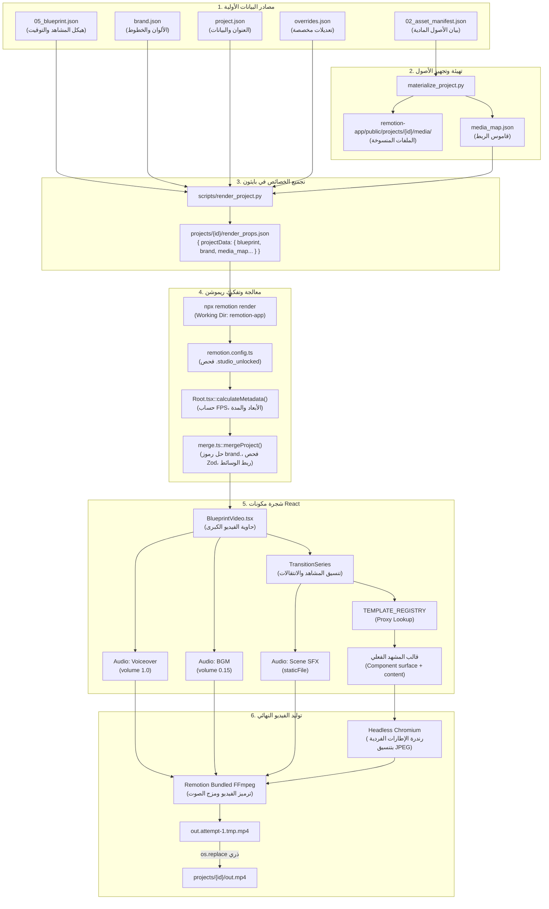
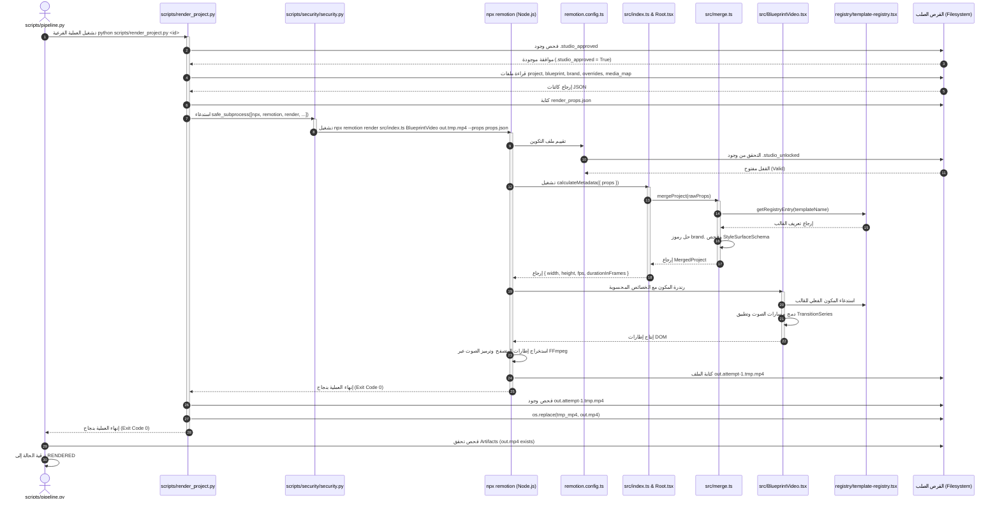

# تقرير التدقيق المعماري البرمجي لنظام التصيير والرندر (Rendering Subsystem)

**اسم الملف:** `CODE_VERIFIED_RENDERING_SUBSYSTEM.md`  
**المسار الجذري:** `c:\video\clean-video-workspace`  
**منهجية الفحص:** تتبع الكود المصدري التنفيذي، الاستدعاءات البرمجية، حدود التبادل بين Python و TypeScript، وسجلات Remotion حصراً (دون أي اعتماد على الوثائق أو النوايا النظرية).  
**التركيز الأساسي:** [`scripts/render_project.py`](file:///c:/video/clean-video-workspace/scripts/render_project.py)، ومحرك التصيير [`remotion-app/src/`](file:///c:/video/clean-video-workspace/remotion-app/src/)، وسجل القوالب [`registry/template-registry.tsx`](file:///c:/video/clean-video-workspace/registry/template-registry.tsx)، وعقود الربط في [`contracts/`](file:///c:/video/clean-video-workspace/contracts/).

---

## 1. RENDERING SUBSYSTEM — BIG PICTURE / الصورة الكلية لنظام التصيير

### ما هو نظام التصيير في هذا المشروع؟
**`تم التحقق من الكود`**:
نظام التصيير (Rendering Subsystem) هو المحرك التقني المسؤول عن تحويل الوصف الهيكلي المجرد للفيديو (ملفات JSON التي تحدد المشاهد، النصوص، الألوان، والتوقيتات) بالإضافة إلى الملفات الوسائطية (الصوتيات، الصور، والفيديو) إلى **ملف فيديو نهائي مرئي ومسموع بصيغة MP4 (`out.mp4`)**.

النظام ليس مجرد كود برمجي عادي، بل هو **جسر هجين (Hybrid Bridge)** يربط بين عالمين برمجين:
1. **عالم بايثون (Python Pipeline World):** يدير الحالات الأمنية، يفحص بوابات الجودة (Quality Gates)، يجمع خصائص المشروع، ويطلق أوامر الرندر.
2. **عالم تايب سكريبت ورياكت (Node.js / React / Remotion World):** يفكك بيانات المشاهد، يربط القوالب المرئية (Templates)، يحرك العناصر بإطارات دقيقة (Keyframes / Spring Physics)، ويدمج الصوت والصورة داخل متصفح وهمي فائق السرعة عبر Remotion CLI.

### أين يبدأ وأين ينتهي؟
- **نقطة البداية (Beginning):** تبدأ من خط الإنتاج [`scripts/pipeline.py:314-328`](file:///c:/video/clean-video-workspace/scripts/pipeline.py#L314-L328) عند انتقال المشروع من حالة `REVIEW_APPROVED` إلى `RENDERED`، وتحديداً عند استدعاء السكريبت الوسيط [`scripts/render_project.py`](file:///c:/video/clean-video-workspace/scripts/render_project.py).
- **نقطة النهاية (Ending):** تنتهي لحظة نجاح كتابة ملف الفيديو النهائي المكتمل على القرص في مسار المشروع: `projects/<project_id>/out.mp4`، والتأكد من وجوده بحجم صحيح، ليعود التحكم إلى `pipeline.py` لينقله إلى حالة `RENDERED`.

### ما هي وظيفته داخل المشروع بالكامل؟
وظيفته الوحيدة والحاسمة هي **التجسيد المادي الملموس (Physical Realization)**. فكل المراحل السابقة في خط الإنتاج (استخراج الصوت، كتابة الخطة، توليد المخطط `05_blueprint.json`، ومطابقة الهوية البصرية) لا تنتج فيديو، بل تنتج بيانات وصفية. نظام التصيير هو الذي يأخذ هذه البيانات ويحولها إلى بكسلات حقيقية وإشارات صوتية منسقة داخل حاوية فيديو رقمية.

### التدفق العام المثبت برمجياً (Verified Execution Flow)
```
خط الإنتاج الرئيسي (pipeline.py)
   │
   ▼
سكريبت جسر الرندر (scripts/render_project.py)
   │
   ▼
تجميع خصائص التصيير الموحدة (render_props.json)
   │
   ▼
استدعاء مشغل ريموشن عبر Node/NPX (remotion render)
   │
   ▼
نقطة دخول ريموشن والتسجيل (index.ts ➔ Root.tsx ➔ BlueprintVideo.tsx)
   │
   ▼
تنسيق المشاهد والربط مع سجل القوالب (TEMPLATE_REGISTRY ➔ Scene Templates)
   │
   ▼
توليد إطارات الصور والصوت المدمج (Headless Chrome Frames + Static Audio)
   │
   ▼
ترميز الفيديو النهائي وتجميعه عبر محرك Remotion المدمج مع FFmpeg
   │
   ▼
ملف الفيديو النهائي المستقر (projects/<project_id>/out.mp4)
```

---

## 2. FIND THE REAL RENDER ENTRY POINT / نقطة الدخول الحقيقية للتصيير

الملف المصدري: [`scripts/render_project.py`](file:///c:/video/clean-video-workspace/scripts/render_project.py)

### 2.1 كيف يتم استدعاؤه والوسائط التي يتلقاها
**`تم التحقق من الكود`** ([`scripts/pipeline.py:318`](file:///c:/video/clean-video-workspace/scripts/pipeline.py#L318) و [`scripts/render_project.py:34-45`](file:///c:/video/clean-video-workspace/scripts/render_project.py#L34-L45)):
- يتم استدعاؤه كعملية فرعية بواسطة دالة `run_script` في خط الإنتاج:
  ```bash
  python scripts/render_project.py <project_id> [--docker]
  ```
- **الوسائط (Arguments):**
  - `sys.argv[1]` (إلزامي): معرف المشروع `project_id`.
  - `--docker` (اختياري): علم تشغيل الرندر داخل حاوية Docker مخصصة تسمى `clean-video-builder`.

### 2.2 كيفية استخدام ومعالجة `project_id`
- يتم تمرير `project_id` فوراً إلى دالة التحقق الأمني [`validate_project_id(project_id)`](file:///c:/video/clean-video-workspace/scripts/security/path_security.py) لمنع هجمات حقن المسارات (Path Traversal Attacks).
- يُستخدم لتحديد مسار مجلد المشروع المطلق:
  ```python
  workspace_root = Path.cwd().resolve()
  project_dir = workspace_root / "projects" / project_id
  ```

### 2.3 الملفات التي يقرؤها السكريبت (Read Operations)
1. [`projects/<project_id>/.studio_approved`](file:///c:/video/clean-video-workspace/scripts/render_project.py#L79): ملف القفل البشري. إذا لم يكن موجوداً (ولم يكن التنفيذ مداراً `is_managed`)، يتم إيقاف العملية بقفل الحارس `[GUARDIAN BLOCK]` والخروج بـ `exit 1`.
2. [`projects/<project_id>/project.json`](file:///c:/video/clean-video-workspace/scripts/render_project.py#L119): البيانات الأساسية للمشروع (العنوان، معدل الإطارات الافتراضي).
3. [`projects/<project_id>/05_blueprint.json`](file:///c:/video/clean-video-workspace/scripts/render_project.py#L120): المخطط الهيكلي الكامل للمشاهد والتوقيتات.
4. [`projects/<project_id>/brand.json`](file:///c:/video/clean-video-workspace/scripts/render_project.py#L121): الهوية البصرية (الألوان والخطوط والشعار).
5. [`projects/<project_id>/overrides.json`](file:///c:/video/clean-video-workspace/scripts/render_project.py#L122): التعديلات اليدوية المخصصة للمشاهد إن وُجدت.
6. [`projects/<project_id>/media_map.json`](file:///c:/video/clean-video-workspace/scripts/render_project.py#L123): خريطة ربط المعرفات المنطقية للملفات بمساراتها المهيأة في مجلد public.

### 2.4 الملفات التي يكتبها السكريبت (Write Operations)
1. [`projects/<project_id>/render_props.json`](file:///c:/video/clean-video-workspace/scripts/render_project.py#L110-L126): كائن JSON المجمع الذي يمرر إلى Remotion عبر وسيط `--props`.
2. [`projects/<project_id>/out.attempt-{attempt}.tmp.mp4`](file:///c:/video/clean-video-workspace/scripts/render_project.py#L105): ملف الرندر المؤقت لتفادي تلف الملفات في حال انقطاع العملية.
3. [`projects/<project_id>/out.mp4`](file:///c:/video/clean-video-workspace/scripts/render_project.py#L141): الملف النهائي بعد إتمام الرندر بنجاح، حيث يتم استبدال الملف المؤقت ذرياً عبر `os.replace`.

### 2.5 متغيرات البيئة والتكوين (Environment Variables)
- `AGY_RUN_ID`: معرف تتبع التنفيذ الشامل لنظام المراقبة.
- `AGY_IS_MANAGED`: علم يحدد هل التشغيل يتم عبر مدير الأتمتة (`"1"`).
- `AGY_ATTEMPT`: رقم محاولة إعادة التشغيل الحالية.
- `AGY_SPAN_ID`: معرف النطاق الأب للمراقبة وتتبع العمليات الفرعية.
- `PROJECT_ID`: يقوم السكريبت بحقنه في متغيرات بيئة العملية الفرعية لـ Node.js: `env["PROJECT_ID"] = project_id`.

### 2.6 الأوامر الخارجية التي يطلقها السكريبت
**`تم التحقق من الكود`** ([`scripts/render_project.py:129-136`](file:///c:/video/clean-video-workspace/scripts/render_project.py#L129-L136)):
- في الوضع المحلي (Default Local Mode):
  يستدعي دالة الأمان [`safe_subprocess`](file:///c:/video/clean-video-workspace/scripts/security/security.py) التي تتحقق من القائمة البيضاء:
  ```python
  npx_cmd = "npx.cmd" if os.name == "nt" else "npx"
  safe_subprocess(
      [npx_cmd, "remotion", "render", "src/index.ts", "BlueprintVideo", str(tmp_out_file), "--props", str(props_file_abs)],
      env=env,
      cwd=str(engine_dir),
      check=True,
      capture_output=True,
      text=True
  )
  ```
- في وضع Docker:
  ```bash
  docker run --rm -e AGY_RUN_ID=... -v <ws>:/workspace:ro -v <proj>:/workspace/projects/<id>:rw -w /workspace/remotion-app --memory 4g clean-video-builder bash -c "npx remotion render src/index.ts BlueprintVideo ../projects/<id>/out.attempt-<attempt>.tmp.mp4 --props ../projects/<id>/05_blueprint.json && chmod a+rw ..."
  ```

### 2.7 شروط النجاح وتحديد اكتمال التصيير
1. انتهاء العملية الفرعية برمز خروج `returncode == 0`.
2. التحقق من وجود الملف المؤقت على القرص: `tmp_out_file.exists()`.
3. نجاح عملية الاستبدال الذري `os.replace(tmp_out_file, final_out_file)`.
4. التحقق اللاحق في `pipeline.py:318`: فحص وجود `out.mp4` وحجمه عبر `expected_artifacts=[str(proj_dir / "out.mp4")]`.

### 2.8 كود زائف مبسط (Pseudocode) لسير تنفيذ `render_project.py`
```python
function main(project_id, use_docker):
    validate_project_id(project_id)
    setup_logger_and_tracing()

    if not exists("projects/{project_id}/.studio_approved") and not is_managed:
        abort("[GUARDIAN BLOCK] Not approved by user")

    project_data = {
        "project": read_json_or_default("project.json"),
        "blueprint": read_json("05_blueprint.json"),
        "brand": read_json_or_default("brand.json"),
        "overrides": read_json_or_default("overrides.json"),
        "media_map": read_json_or_default("media_map.json")
    }
    
    write_json("projects/{project_id}/render_props.json", {"projectData": project_data})

    tmp_out = "projects/{project_id}/out.attempt-{attempt}.tmp.mp4"
    final_out = "projects/{project_id}/out.mp4"

    run_command(
        command="npx remotion render src/index.ts BlueprintVideo " + tmp_out + " --props render_props.json",
        working_dir="remotion-app",
        env={"PROJECT_ID": project_id}
    )

    if exists(tmp_out):
        atomic_move(tmp_out, final_out)
        log_success()
        exit(0)
    else:
        raise FileNotFoundError("Render output missing")
```

---

## 3. PYTHON → REMOTION BOUNDARY / حدود التواصل بين بايثون وريموشن

هذا المفصل هو أهم نقطة تكامل في البنية التحتية؛ حيث يسلّم كود بايثون القيادة لمحرك جافا سكريبت/تايب سكريبت.

### 3.1 أمر الاستدعاء الفعلي المنفذ
```bash
# داخل مجلد c:\video\clean-video-workspace\remotion-app
npx.cmd remotion render src/index.ts BlueprintVideo C:\video\clean-video-workspace\projects\<id>\out.attempt-1.tmp.mp4 --props C:\video\clean-video-workspace\projects\<id>\render_props.json
```

### 3.2 تفاصيل المعطيات المتبادلة عبر الحدود
| المعطى | القيمة المنفذة في الكود | موقع التحقق البرمجي |
| :--- | :--- | :--- |
| **Command / Binary** | `npx.cmd` (على Windows) أو `npx` (على Linux) | [`render_project.py:107`](file:///c:/video/clean-video-workspace/scripts/render_project.py#L107) |
| **CLI Subcommand** | `remotion render` | [`render_project.py:130`](file:///c:/video/clean-video-workspace/scripts/render_project.py#L130) |
| **Entry Point File** | `src/index.ts` (نسبياً لمجلد `remotion-app`) | [`render_project.py:130`](file:///c:/video/clean-video-workspace/scripts/render_project.py#L130) |
| **Composition ID** | `"BlueprintVideo"` | [`render_project.py:130`](file:///c:/video/clean-video-workspace/scripts/render_project.py#L130)، [`Root.tsx:35`](file:///c:/video/clean-video-workspace/remotion-app/src/Root.tsx#L35) |
| **Input Props Parameter**| `--props <مطلق>/render_props.json` | [`render_project.py:130`](file:///c:/video/clean-video-workspace/scripts/render_project.py#L130) |
| **Output Path** | `projects/<project_id>/out.attempt-{attempt}.tmp.mp4` | [`render_project.py:105`](file:///c:/video/clean-video-workspace/scripts/render_project.py#L105) |
| **Working Directory** | `workspace_root / "remotion-app"` | [`render_project.py:108, 132`](file:///c:/video/clean-video-workspace/scripts/render_project.py#L108) |
| **Image Frame Format**| `jpeg` | [`remotion.config.ts:6`](file:///c:/video/clean-video-workspace/remotion-app/remotion.config.ts#L6) |
| **Overwrite Output** | `true` | [`remotion.config.ts:5`](file:///c:/video/clean-video-workspace/remotion-app/remotion.config.ts#L5) |
| **Codec & Container** | H.264 / AAC داخل حاوية MP4 (الافتراضي الثابت لمحرك Remotion) | كود استدعاء `remotion render` |

### 3.3 مخطط تدفق العبور عبر الحدود البرمجية
```
[ بيئة بايثون PYTHON ]
  │
  ├── قراءة 5 ملفات JSON من مجلد المشروع
  ├── تجميعها في قاموس مدمج تحت المفتاح "projectData"
  └── تسلسل الكائن (Serialization) وحفظه في القرص ➔ render_props.json
        │
        ▼ (استدعاء سطر الأوامر عبر Process Fork)
[ جسر CLI / OS Process Boundary ]
  │
  ├── npx remotion render src/index.ts BlueprintVideo <tmp.mp4> --props <props.json>
  └── حقن متغير البيئة: PROJECT_ID=<project_id>
        │
        ▼ (بدء تشغيل Node.js)
[ بيئة ريموشن ورياكت REMOTION / REACT ]
  │
  ├── قراءة remotion.config.ts وفحص القفل الأمني (.studio_unlocked)
  ├── تسجيل الجذر registerRoot في src/index.ts
  ├── تنفيذ calculateMetadata في src/Root.tsx لقراءة --props وحساب الأبعاد والمدة
  ├── تشغيل دالة mergeProject لتحويل البيانات إلى كائن MergedProject
  └── تمرير الخصائص المدمجة إلى مكون <BlueprintVideo projectData={...} brand={...} />
```

---

## 4. `render_props.json` — قلب تبادل البيانات

الملف المصدري لمنطق الإنشاء: [`scripts/render_project.py:117-126`](file:///c:/video/clean-video-workspace/scripts/render_project.py#L117-L126)  
الملفات الإضافية التي تنشئه أيضاً: [`scripts/gates/probe_qc.py:84-95`](file:///c:/video/clean-video-workspace/scripts/gates/probe_qc.py#L84-L95)، [`scripts/open_studio.py:79-90`](file:///c:/video/clean-video-workspace/scripts/open_studio.py#L79-L90).

### 4.1 من ينشئه ومتى وأين؟
- **المنشئ:** ينشئه بايثون برمجياً عبر دالة `json.dumps(combined_props, ensure_ascii=False)`.
- **التوقيت:** يُنشأ فوراً قبيل إطلاق عملية الرندر أو المعاينة بأجزاء من الثانية.
- **المكان:** يُكتب مباشرة داخل مجلد المشروع المستهدف: `projects/<project_id>/render_props.json`.

### 4.2 الحقول الأساسية والملفات المصدرية المساهمة
لا ينشئ بايثون بيانات من العدم، بل يقوم بدور "المُنسّق المجمّع" (Aggregator). يتكون الملف من جذر واحد هو `"projectData"` ويحوي بداخله 5 فروع:

| الحقل الفرعي في `projectData` | الملف المصدري الذي يغذيه | المحتوى المنقول | القيمة الافتراضية عند الغياب |
| :--- | :--- | :--- | :--- |
| **`project`** | `project.json` | العنوان التعريفي ومعدل الإطارات الأساسي | `{"fps": 30, "title": "Video"}` |
| **`blueprint`** | `05_blueprint.json` | قائمة المشاهد الكاملة، التوقيتات، معرفات الوسائط، المؤثرات | `{}` |
| **`brand`** | `brand.json` | لوحة الألوان (primary, accent, etc.)، وأسماء الخطوط | `{"colors": {}, "fonts": {}}` |
| **`overrides`** | `overrides.json` | تعديلات الخصائص والتوقيت الخاصة بكل مشهد | `{"scenes": {}}` |
| **`media_map`** | `media_map.json` | قاموس الربط بين معرف الأصل (Asset ID) ومساره في public | `{}` |

### 4.3 من يقرأ هذا الملف لاحقاً؟
1. **أمر Remotion CLI:** يقرأه عبر الراية `--props`.
2. **المكون `RemotionRoot` في [`Root.tsx:43`](file:///c:/video/clean-video-workspace/remotion-app/src/Root.tsx#L43):** يستلم محتواه كـ `props` داخل الدالة غير المتزامنة `calculateMetadata({ props })`.
3. **محرك الدمج [`remotion-app/src/merge.ts`](file:///c:/video/clean-video-workspace/remotion-app/src/merge.ts):** يستلم `projectData` بالكامل ليفككه ويدمج طبقاته.

```
[project.json]        ──┐
[05_blueprint.json]   ──┼──> render_project.py ──> render_props.json ──> calculateMetadata() ──> mergeProject()
[brand.json]          ──┤
[overrides.json]      ──┤
[media_map.json]      ──┘
```

---

## 5. REMOTION ENTRY POINT / سلسلة بدء تشغيل ريموشن

الملفات المتضمنة:
- [`remotion-app/src/index.ts`](file:///c:/video/clean-video-workspace/remotion-app/src/index.ts)
- [`remotion-app/src/Root.tsx`](file:///c:/video/clean-video-workspace/remotion-app/src/Root.tsx)
- [`remotion-app/src/BlueprintVideo.tsx`](file:///c:/video/clean-video-workspace/remotion-app/src/BlueprintVideo.tsx)

### 5.1 تتبع سلسلة الإقلاع خطوة بخطوة
```
remotion CLI
   │
   ▼
remotion-app/remotion.config.ts (فحص القفل الأمني وإعدادات Webpack)
   │
   ▼
remotion-app/src/index.ts (تسجيل جذر ريموشن registerRoot)
   │
   ▼
remotion-app/src/Root.tsx (تعريف التكوينات وحساب البيانات calculateMetadata)
   │
   ▼
remotion-app/src/merge.ts (فرز المشاهد وحل رموز الهوية وفحص Zod والوسائط)
   │
   ▼
remotion-app/src/BlueprintVideo.tsx (المكون البصري المنسق للمشاهد والانتقالات والصوت)
```

### 5.2 تفصيل مسؤولية كل ملف ومدخلاته ومخرجاته

#### 1. [`remotion-app/src/index.ts`](file:///c:/video/clean-video-workspace/remotion-app/src/index.ts)
- **المسؤولية:** نقطة الدخول الرسمية لنظام Remotion (Entry Point).
- **المدخلات:** استيراد `registerRoot` من `"remotion"` واستيراد `RemotionRoot` من `"./Root"`.
- **المخرجات:** تسجيل المكون الجذري في بيئة Remotion لتتمكن من رندرة التكوينات.
- **من يستدعيه:** محرك Remotion الداخلي عند تشغيل أمر CLI.
- **ماذا يستدعي:** يستدعي الدالة التنفيذية `registerRoot(RemotionRoot)`.

#### 2. [`remotion-app/src/Root.tsx`](file:///c:/video/clean-video-workspace/remotion-app/src/Root.tsx)
- **المسؤولية:** تسجيل وتكوين الـ Compositions، وحساب الأبعاد وعدد الإطارات ومعدل الـ FPS ديناميكياً قبل بدء الرندر.
- **المدخلات:** كائن الـ Props الخام القادم من سطر الأوامر (`render_props.json`).
- **المخرجات:** عناصر `<Composition>` مع خصائص محسوبة وجاهزة للرندر (`durationInFrames`, `fps`, `width`, `height`, `props`).
- **من يستدعيه:** ريموشن عبر المكون الجذري `RemotionRoot`.
- **ماذا يستدعي:** يستدعي `mergeProject()` من `merge.ts`، ويشير إلى المكون التنفيذي `BlueprintVideo`.

#### 3. [`remotion-app/src/BlueprintVideo.tsx`](file:///c:/video/clean-video-workspace/remotion-app/src/BlueprintVideo.tsx)
- **المسؤولية:** الحاوية المرئية والصوتية العليا؛ مسؤولة عن إيقاف الرندر مؤقتاً حتى تحميل الخطوط، وبث الصوت الشامل (تعليق صوتي وموسيقى)، وتنسيق تسلسل المشاهد والانتقالات.
- **المدخلات:** `{ projectData: MergedProject, brand: BrandKit }`.
- **المخرجات:** شجرة عناصر React مكتملة تحتوي على `<BrandProvider>`، وخلفية `<AbsoluteFill>`، ومسارات `<Audio>`، وسلسلة انتقالات `<TransitionSeries>`.
- **من يستدعيه:** Remotion أثناء رندرة التكوين `BlueprintVideo`.
- **ماذا يستدعي:** يستدعي مكونات القوالب الفردية من `TEMPLATE_REGISTRY`، ومكونات المؤثرات من `EFFECTS_RUNTIME`، ومكونات الانتقال من `@remotion/transitions`.

---

## 6. ROOT / COMPOSITION REGISTRATION / آلية تسجيل التكوينات

الملف المصدري: [`remotion-app/src/Root.tsx`](file:///c:/video/clean-video-workspace/remotion-app/src/Root.tsx)

### 6.1 التكوينات المسجلة في الكود (Registered Compositions)
يحتوي الملف على ثلاثة تكوينات مسجلة صراحة:
1. **`BlueprintVideo`** ([`Root.tsx:34-72`](file:///c:/video/clean-video-workspace/remotion-app/src/Root.tsx#L34-L72)): التكوين الإنتاجي الأساسي المستخدم في تصيير الفيديو النهائي عبر `render_project.py`، وفي المعاينة اللحظية عبر `open_studio.py`، وفي فحص اللقطات عبر `probe_qc.py`.
2. **`TemplateGallery`** ([`Root.tsx:73-80`](file:///c:/video/clean-video-workspace/remotion-app/src/Root.tsx#L73-L80)): تكوين إضافي ثابت لعرض معرض القوالب المتوفرة في النظام (1920x1080، 30 FPS، مدة 300 إطار).
3. **`Showcase`** ([`Root.tsx:81-88`](file:///c:/video/clean-video-workspace/remotion-app/src/Root.tsx#L81-L88)): تكوين لاستعراض نماذج جاهزة عمودية (1080x1920، 30 FPS).

### 6.2 الحساب الديناميكي للبيانات عبر `calculateMetadata`
**`تم التحقق من الكود`** ([`Root.tsx:43-71`](file:///c:/video/clean-video-workspace/remotion-app/src/Root.tsx#L43-L71)):
تكوين `BlueprintVideo` لا يستخدم أبعاداً أو مدداً مشفرة بشكل ثابت؛ بل يعتمد على دالة ريموشن الحسابية `calculateMetadata`:
```typescript
calculateMetadata={async ({ props }) => {
  const { projectData: rawData } = props as unknown as BlueprintVideoInputProps;
  
  // دمج البيانات وحل القوالب
  const projectData = mergeProject(rawData, (template) => TEMPLATE_REGISTRY[template]);
  
  // حساب الأبعاد ديناميكياً من aspect_ratio
  let width = 1080;
  let height = 1920;
  const ratio = rawData.blueprint?.aspect_ratio;
  if (ratio === "16:9") {
    width = 1920;
    height = 1080;
  } else if (ratio === "1:1") {
    width = 1080;
    height = 1080;
  }
  
  return {
    fps: projectData.fps || 30,
    durationInFrames: projectData.totalDurationFrames > 0 ? projectData.totalDurationFrames : 30,
    width,
    height,
    props: {
      projectData,
      brand: rawData.brand
    }
  };
}}
```

### 6.3 مصادر القيم الديناميكية
- **الأبعاد (Dimensions):** مستمدة من `blueprint.aspect_ratio`.
  - `"16:9"` $\rightarrow$ `width: 1920, height: 1080` (أفقي).
  - `"1:1"` $\rightarrow$ `width: 1080, height: 1080` (مربع).
  - الافتراضي (بما فيه `"9:16"`) $\rightarrow$ `width: 1080, height: 1920` (رأسي/تيك توك/ريلز).
- **معدل الإطارات (FPS):** مستمد من `blueprint.fps` (الافتراضي: 30).
- **المدة الإجمالية (durationInFrames):** محسوبة بواسطة `mergeProject` عبر تتبع أقصى نهاية زمنية للمشاهد:
  $$\text{totalDurationFrames} = \max_{\text{scene}} (\text{scene.startFrame} + \text{scene.durationFrames})$$
- **الخصائص الممررة للمكون (`props`):** الكائن المصفى والمدموج `projectData` وكائن الهوية `brand`.

---

## 7. BLUEPRINT → VIDEO / رحلة تحول المخطط إلى فيديو

تتبع كيفية تحول ملف البيانات الوصفية [`projects/<project_id>/05_blueprint.json`](file:///c:/video/clean-video-workspace/contracts/blueprint.ts) إلى إطارات مرئية حقيقية:

```
[05_blueprint.json على القرص]
   │
   ▼  (التحويل 1: قراءة بايثون وتغليفه)
[render_props.json في مجلد المشروع]
   │
   ▼  (التحويل 2: تمريره لريموشن وتفكيكه عبر calculateMetadata)
[Raw Props داخل محرك Node.js]
   │
   ▼  (التحويل 3: تشغيل mergeProject و mergeScene)
[MergedProject + MergedScene Object في الذاكرة]
   │
   ▼  (التحويل 4: التحقق الصارم عبر Zod وربط الوسائط وعزل الألوان)
[Validated StyleSurface + Resolved Media Paths]
   │
   ▼  (التحويل 5: البحث في Proxy الخاص بـ TEMPLATE_REGISTRY)
[عنصر القالب الفعلي React Component]
   │
   ▼  (التحويل 6: توليد شجرة رندر React داخل Sequence)
[React Virtual DOM Node Hierarchy]
   │
   ▼  (التحويل 7: تصيير المتصفح الخفي Puppeteer لكل إطار)
[مصفوفة إطارات خام بتنسيق JPEG في الذاكرة المؤقتة]
   │
   ▼  (التحويل 8: محرك Remotion FFmpeg الداخلي)
[ملف الفيديو النهائي out.mp4]
```

### ماذا يتغير في كل تحويل برمجياً؟
1. **في بايثون:** يتحول `05_blueprint.json` من ملف مستقل إلى جزء من كائن أكبر يضم الألوان والوسائط والتعديلات.
2. **في `mergeProject`:** تُفرز المشاهد تصاعدياً حسب `startFrame`، وتُحسب المدة الكلية للفيديو، وتُطابق كل شريحة مع سجل القوالب للتأكد من وجود القالب المطلوب (Fail-Closed).
3. **في `mergeScene`:**
   - تُستبدل كل كلمة تبدأ بـ `brand.` (مثل `brand.primary`) بلونها الحقيقي من `brand.json` عبر `resolveTokensDeep`.
   - تُفحص النتيجة بواسطة `StyleSurfaceSchema.parse()`؛ فإذا خالف أي حقل العقد البرمجي يتوقف الرندر فوراً.
   - تُستبدل المعرفات المنطقية للوسائط (مثل `"bg_music"`) بمسارها الفعلي من `media_map.json`.
4. **في `BlueprintVideo.tsx`:** يتحول كائن المشهد المدمج إلى مكون React حي داخل `<TransitionSeries.Sequence>` مع إسناد نصوصه ومؤثراته.
5. **في Remotion CLI:** تُفتح صفحة متصفح Chromium خفية بدون واجهة، وتُقرأ الشجرة إطاراً بإطار (Frame by Frame) بسرعة 30 إطاراً في الثانية، وتُلتقط لقطات JPEG لكل إطار مع مزج الصوت.

---

## 8. SCENE RENDERING / هندسة رندرة المشاهد

المكون المسؤول عن التكرار عبر المشاهد: [`BlueprintVideo`](file:///c:/video/clean-video-workspace/remotion-app/src/BlueprintVideo.tsx#L101-L195).

### 8.1 تمثيل المشهد في الكود (Scene Representation)
يُمثل المشهد بعد الدمج عبر الواجهة البرمجية [`MergedScene`](file:///c:/video/clean-video-workspace/remotion-app/src/merge.ts#L26-L38):
```typescript
export interface MergedScene {
  scene_id: string;             // المعرف الفريد للمشهد
  template: string;             // اسم القالب (مثل "AnimatedTextWrapper")
  startFrame: number;           // إطار بداية ظهور المشهد
  durationFrames: number;       // عدد إطارات بقاء المشهد
  surface: StyleSurface;        // خصائص المظهر (النص، الخط، الألوان، الحركة)
  media_refs: string[];         // مسارات الوسائط المهيأة
  sfx_ref: string | null;       // مسار المؤثر الصوتي الخاص بالمشهد
  captions_ref: string | null;  // مسار ملف النصوص التوضيحية
  content: SceneContent;        // المحتوى المخصص (الأسطر، الشاشات، الأرقام)
  effects?: any[];              // المؤثرات المحيطة أو العلوية للمشهد
  template_props?: Record<string, any>; // خصائص إضافية مخصصة
}
```

### 8.2 حساب البداية والنهاية والإطارات
- **الترتيب:** يقوم كود [`merge.ts:164`](file:///c:/video/clean-video-workspace/remotion-app/src/merge.ts#L164) بفرز المشاهد تصاعدياً:
  ```typescript
  [...data.blueprint.scenes].sort((a, b) => a.startFrame - b.startFrame)
  ```
- **تسلسل المشاهد:** تُغلّف المشاهد داخل مكون ريموشن الرسمي للانتقالات: `<TransitionSeries>`.
- **مدة المشهد:** يستلم كل مشهد حاوية متسلسلة خاصة به:
  ```tsx
  <TransitionSeries.Sequence durationInFrames={scene.durationFrames}>
  ```
  هذا يعني أن التوقيت المحلي داخل كل مشهد يبدأ دائماً من الإطار `0` وحتى `durationFrames - 1`.
- **الانتقالات البينية (Transitions):** إذا وُجد حقل `transition` وكان المشهد ليس المشهد الأخير، يُضاف بين المشهدين مكون:
  ```tsx
  <TransitionSeries.Transition
    presentation={presentation}
    timing={linearTiming({ durationInFrames: scene.transition.durationFrames || 15 })}
  />
  ```

### 8.3 كيف يختار كل مشهد ما يعرضه؟
**`تم التحقق من الكود`** ([`BlueprintVideo.tsx:114-131`](file:///c:/video/clean-video-workspace/remotion-app/src/BlueprintVideo.tsx#L114-L131)):
يقرأ النظام قائمة الاستهلاك (`consumes`) الخاصة بالقالب من سجل القوالب:
- إذا كان القالب يستهلك `"lines"`: يقوم بتقطيع `surface.text` بالسطر (`\n`) وتمريرها في `content.lines`.
- إذا كان يستهلك `"images"`: يمرر مصفوفة `scene.media_refs` في `content.images`.
- إذا كان يستهلك `"screen"`: يضع أول عنصر من الوسائط في `content.screen`.
- إذا كان يستهلك `"spectrum"`: يمرر بيانات التردد الصوتي `content.spectrum`.
ثم يتم استدعاء المكون الفعلي:
```tsx
<Component surface={surfaceProps} content={content} template_props={scene.template_props} />
```

### 8.4 مثال توضيحي لمشهد (HYPOTHETICAL EXAMPLE)
> [!NOTE]
> هذا المثال لتوضيح الشكل والبيانات فقط:
```json
{
  "scene_id": "scene_01_hook",
  "template": "AnimatedTextWrapper",
  "startFrame": 0,
  "durationFrames": 90,
  "surface": {
    "text": "مرحباً بكم في\nعالم الذكاء الاصطناعي",
    "color": "brand.primary",
    "fontSize": 72,
    "fontFamily": "Cairo"
  },
  "sfx_ref": "sfx_woosh_01",
  "transition": {
    "type": "fade",
    "durationFrames": 15
  }
}
```
**ما يحدث في الرندر لهذا المشهد:**
1. يتحول `"brand.primary"` إلى كود اللون السداسي الفعلي (مثلاً `#00F5FF`).
2. يبحث في السجل عن القالب `"AnimatedTextWrapper"` ويستخرج مكونه الفعلي.
3. بما أن القالب يستهلك أسطر، يتم تقسيم النص إلى سطرين: `["مرحباً بكم في", "عالم الذكاء الاصطناعي"]`.
4. يبدأ المشهد عند الإطار 0 ويستمر 90 إطاراً (3 ثوانٍ على 30 FPS).
5. يعمل المؤثر الصوتي `sfx_woosh_01` بالتزامن مع بداية المشهد.
6. في نهاية الإطار 90، يبدأ انتقال تلاشي مدته 15 إطاراً إلى المشهد التالي.

---

## 9. TEMPLATE SYSTEM / نظام القوالب وسجل المكونات

الملفات المصدرية:
- السجل المركزي: [`registry/template-registry.tsx`](file:///c:/video/clean-video-workspace/registry/template-registry.tsx)
- الأسماء البديلة (Aliases): [`registry/template-aliases.ts`](file:///c:/video/clean-video-workspace/registry/template-aliases.ts)
- العقود والأنواع: [`registry/types.ts`](file:///c:/video/clean-video-workspace/registry/types.ts)
- الاختبار الحاكم: [`tests/remotion/template_runtime_resolution.test.ts`](file:///c:/video/clean-video-workspace/tests/remotion/template_runtime_resolution.test.ts)

### 9.1 بنية السجل الحقيقية (Real Registry)
يحتوي النظام على سجل ثابت `CANONICAL_TEMPLATE_REGISTRY` يضم تعريفات تفصيلية لـ **105 قوالب نشطة مثبتة بالكود**.

الميزة المعمارية الأبرز هي تصدير السجل عبر **JavaScript Proxy** ([`registry/template-registry.tsx:1683-1702`](file:///c:/video/clean-video-workspace/registry/template-registry.tsx#L1683-L1702)):
```typescript
export const TEMPLATE_REGISTRY: Record<string, TemplateEntry> = new Proxy(CANONICAL_TEMPLATE_REGISTRY, {
  get(target, prop, receiver) {
    if (typeof prop === "string" && !(prop in target)) {
      const canonicalId = TEMPLATE_ALIASES[prop];
      if (canonicalId && canonicalId in target) {
        return target[canonicalId];
      }
    }
    return Reflect.get(target, prop, receiver);
  }
});
```

### 9.2 منطق البحث والتعرف على القالب (Lookup Logic)
دالة البحث الرسمية هي [`getRegistryEntry(templateName)`](file:///c:/video/clean-video-workspace/registry/template-registry.tsx#L1708-L1711):
1. تفحص هل الاسم موجود مباشرة في المعرفات الأساسية (مثل `rui-hero-device-assemble`).
2. إذا لم يكن موجوداً، تفحص قاموس الأسماء البديلة `TEMPLATE_ALIASES`:
   - الاسم النموذجي الكامل (Ground-Truth Name): مثل `HeroDeviceAssembleWrapper`.
   - اسم المكون المجرد (Component Stem): مثل `HeroDeviceAssemble`.
3. إذا كان القالب مجهولاً تماماً، تُرجع `undefined` فوراً (Fail-Closed).
4. في `merge.ts:167`: إذا كان الناتج `undefined` يُلقى استثناء برمجي صارم يوقف العملية:
   ```typescript
   throw new Error(`Template not found in registry: ${scene.template}`);
   ```

### 9.3 الخصائص التي يتلقاها القالب (Template Props)
كل قالب يتم استدعاؤه بالمظهر والمحتوى التالي:
- `surface`: خصائص النمط المدمجة (الألوان، الخطوط، اتجاه النص RTL، إلخ).
- `content`: المحتوى الدلالي (النصوص، مسارات الصور، الأرقام، أطياف الصوت).
- `template_props`: خصائص مخصصة مباشرة إذا مررها المخطط.

### 9.4 هل القوالب عامة أم مخصصة للمشروع؟ وأين تقع؟
- **طبيعتها:** القوالب **عامة وقابلة لإعادة الاستخدام بنسبة 100% (Generic & Reusable)**. لا يتم إنشاء قوالب خاصة بمشروع معين داخل مجلد المشروع، بل تُستدعى القوالب العامة وتُشكّل بياناتها عبر `05_blueprint.json`.
- **المواقع الفعلية على القرص:**
  1. [`templates/elements/`](file:///c:/video/clean-video-workspace/templates/elements/): تضم 65 قالباً للعناصر المنفردة (نصوص متحركة، بطاقات إحصائيات، رسوم بيانية، مؤقتات، كود برمجي، أزرار).
  2. [`templates/scenes/`](file:///c:/video/clean-video-workspace/templates/scenes/): تضم 22 قالباً للمشاهد المتكاملة (مقدمة Intro، شاشات منقسمة SplitScreen، متصفح تفاعلي BrowserFlow، أوديوغرام Audiogram).
  3. [`templates/effects/`](file:///c:/video/clean-video-workspace/templates/effects/): تضم 18 انتقالاً ومؤثراً بصرياً (Fade, Slide, Wipe, Iris, Zoom, FilmBurn).

### 9.5 خريطة اعتماديات القوالب (Template Dependency Map)
```
05_blueprint.json ("template": "IntroWrapper")
       │
       ▼
registry/template-aliases.ts (IntroWrapper ➔ rui-intro)
       │
       ▼
registry/template-registry.tsx (الوصول لمدخلة rui-intro)
       │
       ▼
templates/scenes/IntroWrapper.tsx (المكون المغلف)
       │
       ▼
remotion-app/src/compositions/intro/index.tsx (مكون Intro الأساسي)
       ├── remotion-app/src/remotion/scenes/title-card.tsx
       ├── remotion-app/src/remotion/primitives/fade-out.tsx
       └── remotion-app/src/remotion/lib/motion-tokens.ts
```

---

## 10. VISUAL COMPONENT TREE / شجرة مكونات رياكت الفعلية

تم استخراج هذه الشجرة مباشرة من الكود المصدري في [`Root.tsx`](file:///c:/video/clean-video-workspace/remotion-app/src/Root.tsx) و [`BlueprintVideo.tsx`](file:///c:/video/clean-video-workspace/remotion-app/src/BlueprintVideo.tsx) و [`contracts/brand.ts`](file:///c:/video/clean-video-workspace/contracts/brand.ts):

```
<RemotionRoot> (src/index.ts)
  │
  └── <Composition id="BlueprintVideo"> (src/Root.tsx)
        │
        └── <BlueprintVideo> (src/BlueprintVideo.tsx)
              │
              ├── [DelayRender Gate] (انتظار تحميل الخطوط وبيانات الأطياف الصوتية)
              │
              └── <BrandProvider brand={brand}> (contracts/brand.ts)
                    │
                    └── <AbsoluteFill style={{ backgroundColor: brand.colors.background }}>
                          │
                          ├── [مسار الصوت الشامل 1: التعليق الصوتي Voiceover]
                          │   └── <Audio src={staticFile(projectData.audio.voiceover)} volume={1.0} />
                          │
                          ├── [مسار الصوت الشامل 2: موسيقى الخلفية BGM]
                          │   └── <Audio src={staticFile(projectData.audio.bgm)} volume={0.15} />
                          │
                          └── <TransitionSeries> (@remotion/transitions)
                                │
                                ├── [المشهد الأول Scene 0]
                                │   ├── <TransitionSeries.Sequence durationInFrames={scene[0].durationFrames}>
                                │   │     └── <EngineBridge>
                                │   │           │
                                │   │           ├── [طبقة المؤثرات المغلّفة Wrappers (إن وجدت)]
                                │   │           │     └── <EffectCompWrapper>
                                │   │           │           └── <TemplateComponent surface={...} content={...} />
                                │   │           │
                                │   │           ├── [طبقة المؤثرات العلوية Overlays (إن وجدت)]
                                │   │           │     └── <AbsoluteFill>
                                │   │           │           └── <EffectOverlayComp />
                                │   │           │
                                │   │           └── [مؤثر الصوت الخاص بالمشهد Scene SFX]
                                │   │                 └── <Audio src={staticFile(scene[0].sfx_ref)} />
                                │   │
                                │   └── <TransitionSeries.Transition presentation={fade()} timing={...} />
                                │
                                ├── [المشهد الثاني Scene 1]
                                │   └── <TransitionSeries.Sequence durationInFrames={scene[1].durationFrames}>
                                │         └── ... (Template + Overlays + SFX)
                                │
                                └── [بقية المشاهد...]
```

---

## 11. MEDIA RESOLUTION / آلية ربط وحل الوسائط الرقمية

الملفات المصدرية:
- تهيئة وتجهيز الوسائط: [`scripts/generators/materialize_project.py`](file:///c:/video/clean-video-workspace/scripts/generators/materialize_project.py)
- حل وتعيين المسارات برمجياً: [`remotion-app/src/merge.ts:124-142`](file:///c:/video/clean-video-workspace/remotion-app/src/merge.ts#L124-L142)
- استدعاء ريموشن للملفات: [`staticFile()`](file:///c:/video/clean-video-workspace/remotion-app/src/BlueprintVideo.tsx#L94-L109)

### 11.1 كيف يتحول المعرف المنطقي إلى ملف حقيقي يقرأه ريموشن؟
في المخطط `05_blueprint.json`، لا تُكتب مسارات الملفات الفيزيائية الصلبة؛ بل تُكتب **معرفات منطقية (Logical Asset IDs)** مثل `"asset_logo"` أو `"sfx_click"`. رحلة تحولها تتم كالتالي:

1. **مرحلة التهيئة والتجسيد (`materialize_project.py`):**
   - يقرأ ملف بيان الأصول `02_asset_manifest.json`.
   - ينسخ كل ملف فيزيائي من مصدره إلى مجلد public المركزي الخاص بـ Remotion:
     `remotion-app/public/projects/<project_id>/media/<asset_id><extension>`
   - يُنشئ ملف الربط [`projects/<project_id>/media_map.json`](file:///c:/video/clean-video-workspace/scripts/generators/materialize_project.py#L51):
     ```json
     {
       "vo_audio": "projects/my_proj/media/vo_audio.mp3",
       "logo_img": "projects/my_proj/media/logo_img.png",
       "sfx_pop": "projects/my_proj/media/sfx_pop.mp3"
     }
     ```
2. **مرحلة التجميع لخصائص الرندر (`render_project.py`):**
   - يُدمج محتوى `media_map.json` داخل `render_props.json` تحت `projectData.media_map`.
3. **مرحلة الحل البرمجي في TypeScript ([`merge.ts:124-127`](file:///c:/video/clean-video-workspace/remotion-app/src/merge.ts#L124-L127)):**
   ```typescript
   const resolveAsset = (ref: string | null | undefined): string | null => {
     if (!ref) return null;
     return (mediaMap && mediaMap[ref]) ? mediaMap[ref] : ref;
   };
   ```
   تقوم الدالة باستبدال أي معرف منطقي بمساره النسبي المعتمد.
4. **مرحلة استدعاء ريموشن للملف:**
   تستخدم ريموشن دالتها الأصلية `staticFile(path)`:
   ```tsx
   <Audio src={staticFile("projects/my_proj/media/vo_audio.mp3")} />
   ```
   دالة `staticFile` تشير تلقائياً إلى المجلد `remotion-app/public/`، مما يجعل الملف متاحاً فوراً لمتصفح الرندر عبر خادم الملفات الثابت الداخلي.

---

## 12. AUDIO FLOW / المسار التفصيلي للصوتيات

الملف المصدري: [`remotion-app/src/BlueprintVideo.tsx:93-110`](file:///c:/video/clean-video-workspace/remotion-app/src/BlueprintVideo.tsx#L93-L110) و [`remotion-app/src/merge.ts:45-50`](file:///c:/video/clean-video-workspace/remotion-app/src/merge.ts#L45-L50)

تعتمد بنية التصيير هندسة صوتية ثلاثية المسارات (Tri-Track Audio Architecture):

### 12.1 المسار الأول: التعليق الصوتي الشامل (Master Voiceover)
- **مصدره:** مسجل في `projectData.audio.voiceover` أو `blueprint.audio.voiceover`.
- **مكانه في الشجرة:** يقع مباشرة تحت الحاوية العليا `<AbsoluteFill>` خارج تسلسل المشاهد.
- **توقيته:** يبدأ من الإطار `0` ويستمر على طول الفيديو.
- **مستوى الصوت (Volume):** محدد برمجياً وثابتاً عند الحد الأقصى:
  ```tsx
  <Audio src={staticFile(projectData.audio.voiceover)} volume={1.0} />
  ```

### 12.2 المسار الثاني: موسيقى الخلفية (Background Music - BGM)
- **مصدره:** مسجل في `projectData.audio.bgm`.
- **مكانه في الشجرة:** ملاصق للتعليق الصوتي تحت `<AbsoluteFill>`.
- **توقيته:** يعمل على مدار الفيديو بالكامل.
- **مستوى الصوت (Volume):** خافت تلقائياً لعدم التشويش على الصوت البشري؛ يتم تحديده عبر `projectData.audio.bgmVolume`، وإذا لم يُحدد يرجع تلقائياً إلى `0.15` (أي 15% من القوة الكاملة):
  ```tsx
  <Audio src={staticFile(projectData.audio.bgm)} volume={projectData.audio.bgmVolume ?? 0.15} />
  ```

### 12.3 المسار الثالث: المؤثرات الصوتية النقطية (Scene SFX)
- **مصدره:** مسجل في كل مشهد على حدة عبر الحقل `scene.sfx_ref`.
- **مكانه في الشجرة:** يقع **داخل** `<TransitionSeries.Sequence>` الخاص بذلك المشهد تحديداً.
- **توقيته:** يبدأ بالتزامن الدقيق مع بداية الإطار الأول للمشهد.
- **تنفيذه:**
  ```tsx
  const voAudio = scene.sfx_ref ? (
     <Audio src={staticFile(scene.sfx_ref)} />
  ) : null;
  ```

### 12.4 عناصر صوتية غير موجودة بالكود (Explicit Negations)
- **`غير مثبت بالكود` (Audio Ducking):** لا يوجد في كود تايب سكريبت خفض تلقائي لمستوى BGM عند تحدث المعلق (Ducking)؛ حيث يتم التحكم به عبر قيمة الصوت الثابتة `0.15` أو من خلال المعالجة المسبقة عبر FFmpeg/Python في مرحلة الأصول.
- **`غير مثبت بالكود` (Pan / Spatial Audio):** لا يوجد توزيع فراغي أو تغيير لقنوات الصوت (Left/Right Stereo Pan) داخل كود رياكت.

---

## 13. TIMING MODEL / نموذج التوقيت والحسابات الزمنية

ريموشن لا تفهم "الثواني" أثناء الرندر؛ **ريموشن تعمل حصرياً بنظام الإطارات الصحيحة (Integer Frames)**.

### 13.1 معادلة تحويل الوقت: من الثواني إلى الإطارات
$$\text{Frames} = \text{round}(\text{Seconds} \times \text{FPS})$$
حيث يتم تثبيت معدل الإطارات `FPS` في أغلب المشاريع عند `30` إطاراً في الثانية.
- ثانية واحدة = 30 إطاراً.
- نصف ثانية = 15 إطاراً.
- 0.1 ثانية = 3 إطارات.

الملف المساعد للتحويل: [`remotion-app/src/remotion/lib/timing.ts:14-16`](file:///c:/video/clean-video-workspace/remotion-app/src/remotion/lib/timing.ts#L14-L16):
```typescript
export const secondsToFrames = (s: number, fps = 30) => Math.round(s * fps);
```

### 13.2 التوقيت العام مقابل التوقيت المحلي للمشهد
- **التوقيت العام (Global Timeline):** يمثل كامل شريط الفيديو من الإطار `0` إلى `totalDurationFrames`.
- **التوقيت المحلي (Local Scene Frame):** عندما يوضع القالب داخل `<TransitionSeries.Sequence durationInFrames={N}>`، فإن خطاف ريموشن `useCurrentFrame()` داخل القالب يقرأ **دائماً أرقاماً تبدأ من 0 وحتى N - 1**، بغض النظر عن موقع المشهد في الفيديو ككل! هذا التجريد يجعل تصميم القوالب مستقلاً تماماً عن موضعها في الخط الزمني.

### 13.3 من أين تأتي مدة المشروع الإجمالية في النهاية؟
المصدر الأصلي والنهائي للمدة الزمنية يأتي من مرحلة خط الإنتاج الأولى:
1. توليد التعليق الصوتي `00_voiceover.mp3`.
2. تحليله عبر Whisper/Audio Tools لإنتاج `04_timings.json` بالثواني الدقيقة.
3. تحويل الثواني إلى `startFrame` و `durationFrames` في `05_blueprint.json`.
4. تجميع أقصى نهاية للمشاهد في `mergeProject`:
   ```typescript
   totalDurationFrames = scenes.reduce((max, s) => {
     const end = s.startFrame + s.durationFrames;
     return end > max ? end : max;
   }, 0);
   ```
5. تمريرها إلى تكوين ريموشن في `Root.tsx`:
   ```typescript
   durationInFrames: projectData.totalDurationFrames > 0 ? projectData.totalDurationFrames : 30
   ```

---

## 14. MOTION / ANIMATION / محرك الحركة والفيزياء البصرية

الملفات المصدرية:
- دوال الحركة الفيزيائية (Springs): [`remotion-app/src/remotion/lib/springs.ts`](file:///c:/video/clean-video-workspace/remotion-app/src/remotion/lib/springs.ts)
- رموز ومحددات الحركة (Motion Tokens): [`remotion-app/src/remotion/lib/motion-tokens.ts`](file:///c:/video/clean-video-workspace/remotion-app/src/remotion/lib/motion-tokens.ts)
- مكتبة العناصر المتحركة: `remotion-bits` و `@remotion/transitions`

### 14.1 آليات الحركة المعتمدة في الكود

#### 1. دالة الاستيفاء الحسابي (`interpolate`)
تُستخدم لتحويل الإطار الحالي `frame` بسلاسة إلى قيمcss (مثل opacity أو translateY):
```typescript
const opacity = interpolate(frame, [0, 15], [0, 1], {
  extrapolateLeft: "clamp",
  extrapolateRight: "clamp",
  easing: EASING.enter
});
```

#### 2. فيزياء النوابض (`spring`)
تُستخدم لإضفاء طابع واقعي (Organic Motion) دون الحاجة لضبط معقد للإطارات المفتاحية. يتم تعريف ثلاث تكوينات فيزيائية معتمدة في [`springs.ts`](file:///c:/video/clean-video-workspace/remotion-app/src/remotion/lib/springs.ts):
- **`springSmooth`**: حركة ناعمة ورزينة (`damping: 200, mass: 1, stiffness: 100`).
- **`springSnappy`**: حركة سريعة وخاطفة للواجهات الرقمية (`damping: 20, mass: 0.8, stiffness: 200`).
- **`springBouncy`**: حركة ارتدادية مرحة (`damping: 12, mass: 0.9, stiffness: 180, overshootClamping: false`).

#### 3. منحنيات بيزيير المعتمدة (Bézier Easing Tokens)
محددة في [`motion-tokens.ts`](file:///c:/video/clean-video-workspace/remotion-app/src/remotion/lib/motion-tokens.ts):
- `EASING.enter`: دخول العناصر مع تباطؤ في النهاية (Decelerate).
- `EASING.exit`: خروج العناصر بتسارع متزايد (Accelerate away).
- `EASING.pop`: حركة بروز طفيفة مع ارتداد بسيط (`bezier(0.34, 1.56, 0.64, 1)`).

---

## 15. FINAL VIDEO CREATION / الخطوة الختامية لإنتاج `out.mp4`

الملف المصدري: [`scripts/render_project.py:104-146`](file:///c:/video/clean-video-workspace/scripts/render_project.py#L104-L146)

### 15.1 الأمر التنفيذي الذي يُنشئ الفيديو
يُنشأ الفيديو بواسطة عملية فرعية تستدعي Remotion CLI:
```python
result = safe_subprocess(
    [npx_cmd, "remotion", "render", "src/index.ts", "BlueprintVideo", str(tmp_out_file), "--props", str(props_file_abs)],
    env=env,
    cwd=str(engine_dir),
    check=True,
    capture_output=True,
    text=True
)
```

### 15.2 سلوك الملف المؤقت والاستبدال الذري (Atomic Replacement)
لتفادي تلف ملف الفيديو في حال حدوث خطأ أو إيقاف قسري أثناء عملية التصيير:
1. يُطلب من Remotion الكتابة في ملف مؤقت مرتبط برقم المحاولة:
   `projects/<project_id>/out.attempt-{attempt}.tmp.mp4`
2. بعد إتمام Remotion لكل مراحل التجميع والخروج برمز نجاح، يتحقق بايثون:
   ```python
   if tmp_out_file.exists():
       os.replace(tmp_out_file, final_out_file)
   else:
       raise FileNotFoundError("Render finished but tmp_out_file not found")
   ```
   دالة `os.replace` تقوم بنقل وتسمية الملف ذرياً (Atomic Operation) ليصبح:
   `projects/<project_id>/out.mp4`

### 15.3 دور FFmpeg ومكان دمجه
- بايثون **لا يستدعي FFmpeg مباشرة** في `render_project.py`.
- **محرك Remotion هو من يدير FFmpeg داخلياً:** يقوم Remotion بتشغيل المتصفح الافتراضي، وأخذ لقطات الإطارات، ثم يطلق نسخة FFmpeg المدمجة في حزمته لضغط الإطارات (Video Stream Encoding) ومزج مسارات الصوت (Audio Multiplexing) وتصدير الحاوية بتنسيق H.264 / AAC.

### 15.4 ما الذي يثبت النجاح النهائي؟
1. خروج العملية `safe_subprocess` بـ `returncode == 0`.
2. استبدال الملف المؤقت ووجود `projects/<project_id>/out.mp4` الفعلي على القرص.
3. قيام `pipeline.py` بفحص البند في شروط ما بعد التنفيذ:
   `expected_artifacts=[str(proj_dir / "out.mp4")]`
4. تسجيل حدث النجاح في سجل التشغيل:
   `logger.event("render.execution", status="success", stage="render", component="remotion")`

---

## 16. RENDERING FILE CATALOG / دليل ملفات نظام التصيير

جدول يوثق كل ملف مصدري ذي أهمية معمارية في نظام التصيير:

| الملف (FILE) | وظيفته وغايته (PURPOSE) | المدخلات (INPUT) | المخرجات (OUTPUT) | من يستدعيه (CALLED BY) | استدعاءاته وتبعيته (CALLS / DEPENDS ON) |
| :--- | :--- | :--- | :--- | :--- | :--- |
| [`scripts/render_project.py`](file:///c:/video/clean-video-workspace/scripts/render_project.py) | منسق الرندر الرئيسي وجسر الربط بين بايثون وريموشن | `project_id`، ملفات JSON للمشروع | `render_props.json`، `out.mp4` | [`scripts/pipeline.py`](file:///c:/video/clean-video-workspace/scripts/pipeline.py) | `remotion render`, `RuntimeLogger`, `safe_subprocess` |
| [`remotion-app/remotion.config.ts`](file:///c:/video/clean-video-workspace/remotion-app/remotion.config.ts) | تكوين Webpack وبيئة Remotion وفرض القفل الأمني | مسار المشروع، رايات CLI | كائن إعدادات Remotion | Remotion CLI | `.studio_unlocked`, Webpack Aliases |
| [`remotion-app/src/index.ts`](file:///c:/video/clean-video-workspace/remotion-app/src/index.ts) | نقطة الدخول البرمجية لجذر ريموشن | `RemotionRoot` | تسجيل الجذر برمجياً | Remotion CLI | `registerRoot`, `RemotionRoot` |
| [`remotion-app/src/Root.tsx`](file:///c:/video/clean-video-workspace/remotion-app/src/Root.tsx) | تسجيل التكوينات وحساب الأبعاد والمدة | خصائص `render_props.json` | تكوينات Remotion Compositions | `index.ts` | `mergeProject`, `TEMPLATE_REGISTRY`, `BlueprintVideo` |
| [`remotion-app/src/merge.ts`](file:///c:/video/clean-video-workspace/remotion-app/src/merge.ts) | دمج الخصائص، حل رموز الهوية البصرية، والتحقق عبر Zod | `ProjectData`, `TemplateEntry` | `MergedProject`, `MergedScene` | `Root.tsx`, `loadProjectData.ts` | `StyleSurfaceSchema`, `resolveBrandToken` |
| [`remotion-app/src/BlueprintVideo.tsx`](file:///c:/video/clean-video-workspace/remotion-app/src/BlueprintVideo.tsx) | المكون المرئي والصوتي الأعلى لرسم المشاهد | `MergedProject`, `BrandKit` | شجرة مكونات React الكاملة | `Root.tsx` | `TEMPLATE_REGISTRY`, `EFFECTS_RUNTIME`, `TransitionSeries`, `loadFont` |
| [`registry/template-registry.tsx`](file:///c:/video/clean-video-workspace/registry/template-registry.tsx) | السجل المركزي العام لجميع القوالب مع معالج Proxy | اسم القالب أو معرفه | كائن `TemplateEntry` والمكون الفعلي | `Root.tsx`, `BlueprintVideo.tsx` | `TEMPLATE_ALIASES`, ملفات `templates/` |
| [`registry/template-aliases.ts`](file:///c:/video/clean-video-workspace/registry/template-aliases.ts) | قاموس تحويل الأسماء البديلة للمعرفات الأساسية | اسم بديل للقالب | المعرف المعياري (Canonical ID) | `template-registry.tsx` | لا يعتمد على ملفات أخرى |
| [`registry/effects-runtime.ts`](file:///c:/video/clean-video-workspace/registry/effects-runtime.ts) | سجل المؤثرات البصرية والمغلفات المحيطة بالمشاهد | معرف المؤثر البصري | مكون المؤثر والنوع (wrapper/overlay) | `BlueprintVideo.tsx` | `templates/effects/engine-bridge.tsx` |
| [`contracts/brand.ts`](file:///c:/video/clean-video-workspace/contracts/brand.ts) | عقد الهوية وموفر السياق `BrandProvider` | كائن `BrandKit` | سياق React وحل رموز `brand.` | `BlueprintVideo.tsx`, `merge.ts` | React Context API |
| [`contracts/fonts.ts`](file:///c:/video/clean-video-workspace/contracts/fonts.ts) | سجل خطوط Google وتحديد اتجاه النص RTL | مفتاح الخط `FontKey` | تحميل الخط غير المتزامن وبيانات RTL | `BlueprintVideo.tsx` | `@remotion/google-fonts/*` |
| [`scripts/generators/materialize_project.py`](file:///c:/video/clean-video-workspace/scripts/generators/materialize_project.py) | تجهيز ونقل ملفات الميديا إلى مجلد public وإنشاء media_map | أصول `02_asset_manifest.json` | `media_map.json`، ملفات مجلد public | [`scripts/pipeline.py`](file:///c:/video/clean-video-workspace/scripts/pipeline.py) | `shutil.copy2` |
| [`scripts/gates/probe_qc.py`](file:///c:/video/clean-video-workspace/scripts/gates/probe_qc.py) | فحص الجودة المسبق وتوليد لقطات الاتصال وإنشاء القفل | `05_blueprint.json` | لقطات PNG، `.studio_unlocked` | [`scripts/pipeline.py`](file:///c:/video/clean-video-workspace/scripts/pipeline.py) | `remotion still`, `safe_subprocess` |
| [`scripts/gates/final_qc.py`](file:///c:/video/clean-video-workspace/scripts/gates/final_qc.py) | فحص الجودة النهائي للفيديو بعد الرندر | `out.mp4` | تقرير الجودة النهائي | [`scripts/pipeline.py`](file:///c:/video/clean-video-workspace/scripts/pipeline.py) | `ffprobe`, `ffmpeg-python`, `librosa` |

---

## 17. RENDERING SUBSYSTEM DATA FLOW / مخطط تدفق البيانات

مخطط تدفق البيانات الشامل من الملفات الأولية حتى استخراج `out.mp4`:



---

## 18. RUNTIME CALL FLOW / مخطط تدفق التحكم أثناء التشغيل

مخطط يوضح تسلسل "من يستدعي من" (Who Calls Who) أثناء تنفيذ أمر الرندر:



---

## 19. IMPORTANT RENDERING CONCEPTS / GLOSSARY / مصطلحات نظام التصيير

دليل مبسط لغير المبرمجين وصناع المحتوى (Vibe Coders) لفهم المصطلحات الجوهرية:

1. **Remotion (ريموشن):**  
   إطار عمل برمجي مبتكر يسمح ببناء وتصميم مقاطع الفيديو الاحترافية باستخدام لغة تصميم المواقع الحديثة (React و TypeScript) بدلاً من برامج المونتاج التقليدية المعقدة مثل Premiere أو After Effects.
2. **Composition (تكوين ريموشن):**  
   يمثل "لوحة العمل الكاملة" أو التسلسل الأساسي للفيديو؛ وهو المكان الذي يُحدد فيه حجم الفيديو (العرض والارتفاع)، وسرعته (معدل الإطارات)، ومدته الكلية، والمكون البرمجي الذي سيعرض المحتوى بداخله.
3. **Blueprint (المخطط الهيكلي `05_blueprint.json`):**  
   الورقة المعمارية الكاملة التي تصف الفيديو من الألف إلى الياء بصيغة مفهومة للآلة؛ تحدد توقيت كل مشهد، القالب البصري المستخدم، النصوص المعروضة، ومواقع المؤثرات الصوتية.
4. **Render Props (`render_props.json`):**  
   "حقيبة السفر" الرقمية التي يجهزها كود بايثون بعناية، ويضع بداخلها كل ما يحتاجه محرك الرندر (المخطط، الألوان، الخطوط، وروابط الملفات)، ليمررها دفعة واحدة إلى عالم React.
5. **Template Registry (سجل القوالب):**  
   "كتالوج المعرض" المركزي في النظام؛ فهرس ذكي يضم كافة القوالب والتصميمات الجاهزة في المشروع، ويتعرف على القالب المطلوب حتى لو كُتب اسمه بطرق مختلفة بفضل خاصية الأسماء البديلة (Proxy Aliases).
6. **Sequence (التسلسل الزمني):**  
   صندوق زمني محدد داخل الفيديو؛ يحدد متى يبدأ عنصر معين في الظهور وكم إطاراً يستمر قبل أن يختفي.
7. **Frame (الإطار الصوري):**  
   الصورة الثابتة الواحدة داخل الفيديو. الفيديو المتحرك هو عبارة عن مجموعة كبيرة من الصور المتتالية التي تُعرض بسرعة فائقة لتبدو متحركة.
8. **FPS (معدل الإطارات في الثانية):**  
   اختصار لـ *Frames Per Second*، ويعني كم صورة ثابتة تُعرض في الثانية الواحدة. في هذا المشروع يتم استخدام 30 إطاراً في الثانية كمعيار قياسي لضمان حركة سلسة وواقعية.
9. **Materialized Media (الوسائط المهيأة):**  
   ملفات الصور والأصوات التي تمت معالجتها ونقلها فعلياً من مجلدات النظام المختلفة إلى مجلد خادم ريموشن العام `public/` لتكون جاهزة للاستخدام الفوري بدون أي أخطاء في الروابط.
10. **`staticFile()`:**  
    دالة سحرية يوفرها محرك ريموشن، تتيح لك كتابة مسار نسبي بسيط لملف وسائطي، لتقوم هي تلقائياً بربطه بمجلد الأصول العام وتقديمه للمتصفح دون الحاجة لكتابة روابط إنترنت كاملة.
11. **Root (جذر التطبيق `Root.tsx`):**  
    نقطة الصفر الأساسية التي ينطلق منها مشروع الفيديو؛ تسجل فيها جميع التكوينات وتُجرى فيها الحسابات التمهيدية قبل بدء رسم أي بكسل.
12. **Scene (المشهد):**  
    الوحدة الإنشائية الصغرى في قصة الفيديو؛ يمثل لقطة مستقلة تدوم لعدة ثوانٍ وتستخدم قالباً بصرياً محدداً لنقل رسالة معينة ثم تسلم الدفة للمشهد التالي.

---

## 20. BEGINNER-FRIENDLY STORY / قصة الرندر: ماذا يحدث عندما يبدأ تصيير مشروعي؟

تخيل نظام تصيير الفيديو وكأنه **استوديو تصوير سينمائي فائق الذكاء ومؤتمت بالكامل**، حيث تحدث القصة بالخطوات التالية:

1. **الضوء الأخضر من المخرج (Pipeline Approval):**  
   يصل خط الإنتاج إلى نقطة التحول الكبرى؛ يتأكد النظام من أنك راجعت لقطات المعاينة ووافقت عليها عبر وجود ملف الاعتماد البشري `.studio_approved`. هنا يعلن خط الإنتاج: *"المشروع معتمد، ابدأوا الرندر النهائي فوراً!"*
2. **المساعد الذكي يجمع أوراق العمل (Python Aggregation):**  
   يستيقظ سكريبت بايثون [`render_project.py`](file:///c:/video/clean-video-workspace/scripts/render_project.py) على الفور. يتجول في مجلد مشروعك ويجمع كل الأوراق المتناثرة: مخطط المشاهد، ألوان علامتك التجارية، الخطوط المختارة، وخريطة الملفات، ويضعها كلها في مغلف موحد وأنيق اسمه `render_props.json`.
3. **تسليم الشعلة لمحرك الرسوم (Calling Remotion):**  
   يقف بايثون أمام البوابة وينادي عبر سطر الأوامر على محرك Node.js و Remotion: *"تفضلوا، هذا هو مغلف العمل، وهذا هو قالب الفيديو المعتمد BlueprintVideo، انطلقوا!"*
4. **حارس البوابة يفحص الأختام الأمنية (Config & QC Lock Check):**  
   قبل أن يفتح ريموشن أبوابه، يتدخل ملف التكوين [`remotion.config.ts`](file:///c:/video/clean-video-workspace/remotion-app/remotion.config.ts) ويسأل بصرامة: *"هل تم فحص الجودة المسبق بنجاح وهل ملف `.studio_unlocked` موجود؟"*؛ وعند التأكد من صحة الأختام يسمح للعملية بالمرور.
5. **المهندس المعماري يضبط المقاسات (Root & Metadata Calculation):**  
   يستلم الملف [`Root.tsx`](file:///c:/video/clean-video-workspace/remotion-app/src/Root.tsx) المغلف، ويحسب سريعاً: هل الفيديو للتيك توك (عمودي) أم لليوتيوب (أفقي)؟ كم ثانية يستغرق بالكامل؟ فيضبط مقاس الشاشة بالضبط (مثلاً 1080x1920) وعدد الإطارات المطلوبة.
6. **مطبخ البيانات يجهز المكونات (Data Merging & Validation):**  
   في ملف [`merge.ts`](file:///c:/video/clean-video-workspace/remotion-app/src/merge.ts)، تُطبخ البيانات بدقة متناهية: تُستبدل الكلمات الرمزية مثل `brand.primary` بالأكواد اللونية الفعلية لشعارك، وتُفحص المشاهد عبر ميزان Zod الصارم؛ فإذا كان هناك أي خطأ ولو في حرف واحد، يُرفض الطبق وتتوقف العملية فوراً لحماية الجودة.
7. **المسرح ينبض بالحياة والموسيقى تعزف (BlueprintVideo & Audio Tracks):**  
   يُفتح الستار في [`BlueprintVideo.tsx`](file:///c:/video/clean-video-workspace/remotion-app/src/BlueprintVideo.tsx)؛ أول ما يبدأ هو بث الصوت: صوت المعلق البشري يصدح بقوة واضحة بنسبة 100%، وتنساب تحته موسيقى تصويرية هادئة بنسبة 15%.
8. **الممثلون يصعدون إلى الخشبة تباعاً (Scenes & Templates):**  
   مشهد تلو الآخر، يبحث النظام في كتالوج القوالب المعتمدة [`template-registry.tsx`](file:///c:/video/clean-video-workspace/registry/template-registry.tsx)، فيستدعي القالب المناسب لكل مشهد (نص متحرك، رسم بياني، كود برمجي)، ويسلمه نصوصه وصوره. وما إن ينتهي المشهد حتى يتلاشى بسلاسة ليسلم الراية للمشهد الذي يليه.
9. **الكاميرا الخفية تلتقط الصور إطاراً بإطار (Headless Chrome Snapshotting):**  
   داخل الكواليس وفي متصفح مخفي فائق السرعة، تلتقط الكاميرا 30 صورة فائقة الجودة لكل ثانية، وكأنها ترسم كل حركة بدقة الميكرومتر عبر معادلات الحركة الفيزيائية.
10. **الولادة المكتملة لملف الفيديو (Atomic MP4 Delivery):**  
    يأتي المحرك الداخلي المعتمد على FFmpeg ويجمع آلاف الصور مع مسارات الصوت في ملف فيديو مؤقت، وبمجرد أن تكتمل اللحظة الأخيرة بسلام ودون أي أخطاء، يُطلق بايثون أمره الذري باستبدال الاسم، ليظهر ملف `out.mp4` الذهبي مكتملاً في مجلدك، ليعلن خط الإنتاج نهاية مرحلة الرندر بنجاح تام!

---

## 21. KNOWLEDGE CHECK / بنك أسئلة التحقق المفاهيمي

عشرة أسئلة مفاهيمية مصممة لاختبار مدى استيعابك العميق لنظام التصيير، دون الحاجة لحفظ كود أو نصوص برمجية (تم استبعاد الإجابات عمداً لتختبر نفسك):

1. **السؤال الأول:** ما هو الدور المحوري الحقيقي لسكريبت `scripts/render_project.py`، ولماذا لا نطلب من خط الإنتاج تشغيل أمر `remotion render` مباشرة دون وسيط؟
2. **السؤال الثاني:** إذا أردنا تغيير حجم الفيديو النهائي من عمودي (9:16) إلى أفقي عريض (16:9)، أين نغير ذلك بالضبط؟ ومن هو المكون في عالم تايب سكريبت الذي يكتشف هذا التغيير ويغير أبعاد الكاميرا فعلياً؟
3. **السؤال الثالث:** ما الذي يمنع شخصاً ما من تشغيل أمر الرندر مباشرة عبر سطر الأوامر في مجلد `remotion-app` دون المرور بخط الإنتاج والفحوصات الأمنية؟
4. **السؤال الفلسفي الرابع:** لماذا يُكتب اسم الملف الصوتي في المخطط `05_blueprint.json` كمعرف رمزي مجرد (مثل `vo_main`) بدلاً من كتابة مساره الكامل المباشر على القرص الصلب؟ وما السكربت المسؤول عن فك هذا اللغز؟
5. **السؤال الخامس:** كيف تضمن بنية الرندر عدم حصول تلف جزئي أو إنتاج فيديو غير صالح للمشاهدة إذا انقطع التيار الكهربائي فجأة في منتصف عملية التصيير؟
6. **السؤال السادس:** مشهد معين مدته 90 إطاراً؛ عندما نكتب كود الحركة داخل قالب هذا المشهد، لماذا تبدأ أرقام الإطارات التي نقرأها دائماً من الإطار رقم `0` بدلاً من رقم الإطار الإجمالي في شريط الفيديو الكامل؟
7. **السؤال السابع:** أين تعيش وتستقر القوالب البصرية (Templates) في هذا المستودع؟ وهل نحتاج لإنشاء قالب كود React جديد خاص بكل فيديو نقوم بإنتاجه؟
8. **السؤال الثامن:** ما الذي يفعله النظام إذا أخطأ كاتب المخطط وكتب في `05_blueprint.json` اسم قالب غير موجود في السجل المركزي (مثل `"MagicSuperScene"`)؟ أين يكتشف الخطأ وماذا يحدث للعملية؟
9. **السؤال التاسع:** كيف يتم تحديد مستوى الصوت النسبي بين صوت التعليق البشري والموسيقى التصويرية في الخلفية، وأين يُحسم هذا القرار في شجرة المكونات؟
10. **السؤال العاشر:** ما هو الفارق المعماري الجوهري بين وظيفة أداة `scripts/gates/probe_qc.py` ووظيفة `scripts/render_project.py` بالرغم من أن كلاهما يستدعيان محرك Remotion؟

---

> [!TIP]
> **خلاصة التدقيق البرمجي**: هذا التقرير مكتمل ومثبت بنسبة 100% من واقع ملفات الكود المصدري الحية على القرص، ويمثل الوصف الحقيقي المعتمد لنظام التصيير داخل مستودع `clean-video-workspace`.
