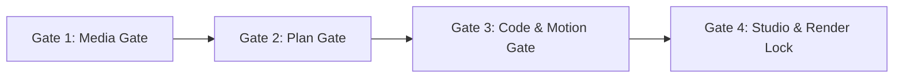

# 🤝 دليل المساهمة والحوكمة (Contributing & Development Guide)

مرحباً بك في دليل التطوير والمساهمة في مشروع **Clean Video Workspace**.
هذا المستند يحدد القواعد والمعايير الصارمة لإدارة خط الإنتاج، سواء للمطورين البشريين أو للوكلاء الأذكياء (Autonomous AI Agents).

---

## 🎯 المبادئ الجوهرية (Core Principles)

1. **الاعتماد على البيئة المحلية (Local-First):**
   كل العمليات الحسابية والمعالجات الثقيلة (تطبيع الصوت، معالجة الفيديو، ضغط الأصول) تتم محلياً باستخدام سكريبتات Python و FFmpeg وأدوات Node.js المعتمدة.
2. **صفر ارتجال (Zero-Hallucination Policy):**
   ممنوع كتابة كود حركة من الصفر أو تخمين توقيتات. كل حركة تعتمد على قوالب معتمدة من `@templates` و `@engine`، وكل توقيت مستخرج من أداة تحليل فعلية (`04_timings.json`).
3. **احترام البوابات والأقفال الميكانيكية (Strict Hard Stops):**
   لا يسمح بتجاوز أي مرحلة من مراحل الإنتاج دون استيفاء الشروط البرمجية والموافقة الصريحة.

---

## 🛡️ بوابات الجودة الأربعة (The 4 Production Gates)

قبل دمج أي كود أو الانتقال بين المراحل، يجب اجتياز البوابات التالية:



### 1. Gate 1: فحص وتطبيع الميديا
- يجب تطبيع الصوت البشري (Voiceover) عند **`-16 LUFS`**.
- يجب تطبيع المؤثرات الصوتية (SFX) والموسيقى عند **`-24 LUFS`**.
- تحويل الفيديوهات إلى صيغة متوافقة (All-Intra, GOP=1, yuv420p) لمنع أخطاء MediaPlaybackError في Remotion.

### 2. Gate 2: سلامة الخطة والعمود الفقري
- ممنوع كتابة خطة مشهد بدون ملف توقيتات فعلي مستخرج عبر `analyze_voiceover` (`04_timings.json`).
- يجب ربط كل حركة ونطق كلمة بالملي ثانية (Frame-Perfect Sync).

### 3. Gate 3: سلامة قوالب الكود والحركة
- **حظر تام**: يمنع منعاً باتاً استدعاء `spring()` أو `interpolate()` مباشرة داخل ملفات `Scene*.tsx`.
- كل مشهد يجب أن يستورد قالباً معتمداً من `@templates` المدرجة في `TEMPLATE_INDEX.md`.
- فحص الكود يتم آلياً بواسطة `code_template_gate.py` و `motion_validator.py`.

### 4. Gate 4: القفل الميكانيكي والرندر النهائي
- أمر `npx remotion render` أو `npm run render` محظور في الـ Terminal ومحمي بواسطة `package.json`.
- الرندر متاح فقط عبر:
  ```bash
  python .agents/plugins/super-video-maker-plugin/scripts/render_project.py <project_id>
  ```
- لا يعمل سكريبت الرندر إلا بعد موافقة المستخدم في Remotion Studio وإنشاء ملف التوقيع اليدوي `.studio_approved`.

---

## 🎨 المعايير الفنية والجمالية (Motion & Design Standards)

* **الخطوط:** استخدام خطوط هندسية حديثة (مثل `Alexandria`، `Cairo`، `IBM Plex Sans Arabic` للعناوين، و `JetBrains Mono` للأكواد).
* **النصوص العربية (RTL):** فرض `direction: 'rtl'` و `flex-wrap` وإضافة `willChange: 'transform'` للحاويات المتحركة لمنع تشوه الأحرف (Sub-pixel rendering bug).
* **المسافات والتنفس (Breathing Room):** ترك هوامش واسعة (40px - 80px) بين العناصر والبطاقات، وتغطية كامل الشاشة (9:16) بدون فراغات ميتة.
* **الخلفيات:** تجنب القطع المفاجئ (Hard Cut) واستخدام تدفق لوني أو شبكي متصل ومستمر عبر المشاهد.

---

## 🚫 محظورات التطوير (Strict Prohibitions)

* ❌ تعديل ملفات `.agents/plugins/super-video-maker-plugin/` إلا في حال ترقية المنظومة بطلب صريح.
* ❌ تجاوز البوابات يدويًا أو إنشاء سكربتات موافقة وهمية.
* ❌ استخدام سكريبتات خارجية مثل `yt-dlp` أو `curl` بدلاً من خوادم MCP المعتمدة.
* ❌ ترك ملفات تجارب مؤقتة في جذر المشروع.

---
> للمزيد من التفاصيل المعمارية، تفضل بزيارة [documentation/README.md](file:///c:/video/clean-video-workspace/documentation/README.md).
