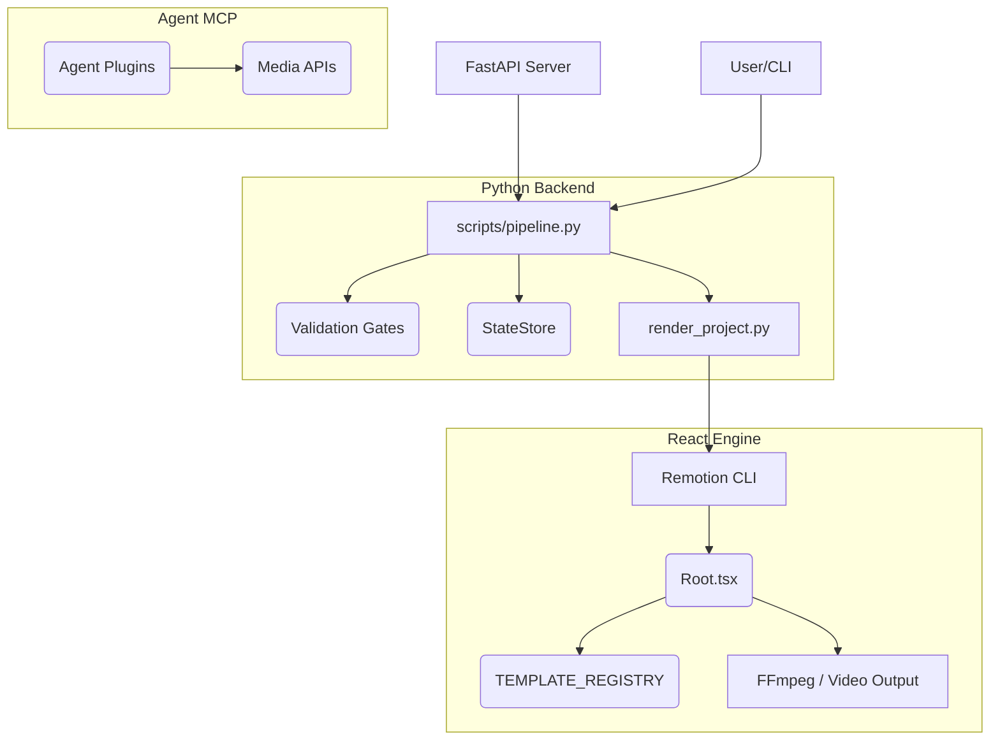
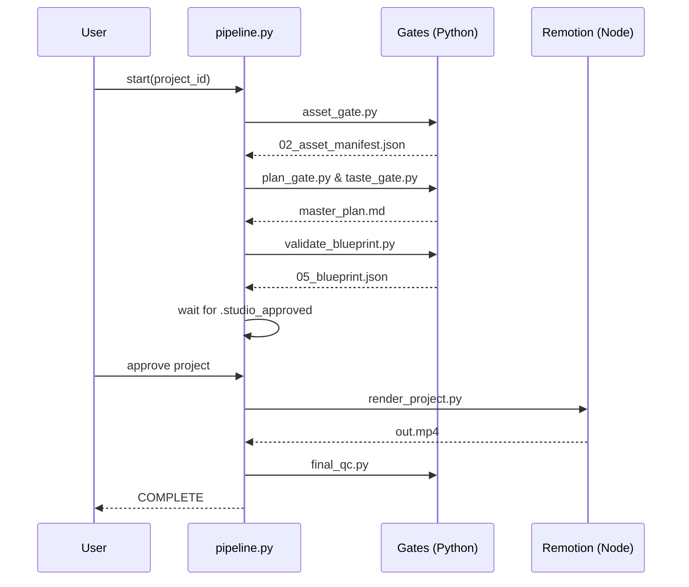
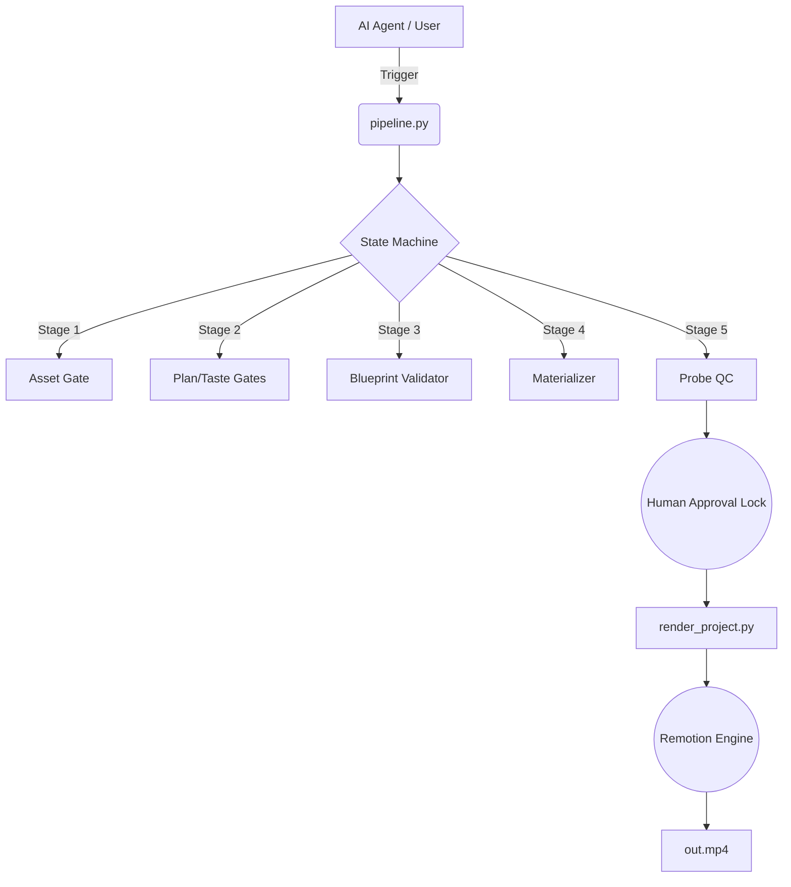

# Clean Video Workspace (Motion Production Engine) - Reconnaissance Report

This document is a deep technical reconnaissance of the `clean-video-workspace` repository. It provides a comprehensive analysis of the system architecture, dependencies, execution flows, and design patterns, mapping out the existing state for developer onboarding and AI tutoring.

## 1. Project Overview

**What this system appears to do:**
The system is an enterprise-grade "agentic video production" pipeline. It programmatically plans, assembles, and renders cinematic videos by bridging AI agents, Python backend orchestration, and a React-based rendering engine (Remotion). 

**The main problem it solves:**
It solves the problem of inconsistently generating high-quality programmatic videos by enforcing a strict stage-gated state machine. It prevents hallucinated steps and guarantees quality by forcing AI-generated plans through automated validation gates before physical rendering.

**Major Capabilities:**
- **Pipeline Orchestration:** A unified, strict 10-stage execution pipeline.
- **Templating & Rendering:** Dynamic composition of visual elements using Remotion templates and a centralized registry.
- **AI Agent Integration:** Extensive Antigravity MCP (Model Context Protocol) plugins for audio processing, media sourcing, and video tools.
- **Resilience:** Idempotent retries, failure injection, and a robust state recovery engine.

**Technologies/Languages/Frameworks:**
- **Backend Orchestration:** Python 3.10+, FastAPI, `uvicorn`.
- **Rendering Engine:** Node.js 18+, React (TSX), Remotion, TypeScript.
- **Media Processing:** FFmpeg.
- **Agent Integration:** Antigravity custom plugins (`.agents/`).

**How the system is expected to run:**
The system can be invoked via CLI (`python scripts/pipeline.py <project_id>`) or via a FastAPI server (`api/main.py`). The final rendering delegates to Node.js/Remotion (`npx remotion`).

---

## 2. Repository Structure

The project is structured with a strict separation of concerns between orchestration, rendering, and agent subsystems.

```text
clean-video-workspace/
├── .agents/                 # AI Agent Plugins and MCP Servers
├── api/                     # Core FastAPI Backend services
├── config/                  # Global configurations (e.g., violations_config.json)
├── contracts/               # TypeScript schemas and pipeline constraints
├── documentation/           # Architecture truth and guides
├── projects/                # Working directories for video generation outputs
├── remotion-app/            # Physical React/Remotion renderer
├── scripts/                 # Core Python engine and pipeline gates
└── templates/               # React TSX visual templates and effects
```

**Key Source Files:**

- [`scripts/pipeline.py`](file:///c:/video/clean-video-workspace/scripts/pipeline.py)
  - **Responsibility:** The canonical state machine and orchestrator.
  - **Why it exists:** To drive a project sequentially through execution gates.
  - **Important Modules:** `run_script`, `LifecycleState`, `StateStore`.
  - **Outputs:** State transitions in `.pipeline_state.json`.

- [`scripts/core/state_model.py`](file:///c:/video/clean-video-workspace/scripts/core/state_model.py)
  - **Responsibility:** Defines the schema for pipeline states and validates transitions.
  - **Important Classes:** `ProjectState`, `LifecycleState`, `StateMachine`.
  - **Depends on:** `pydantic`.

- [`remotion-app/src/Root.tsx`](file:///c:/video/clean-video-workspace/remotion-app/src/Root.tsx)
  - **Responsibility:** The root React component for Remotion.
  - **Why it exists:** Evaluates project data (`05_blueprint.json`) and merges it with templates for the video sequence.
  - **Inputs:** `BlueprintVideoInputProps` containing project data, blueprint, and brand.

- [`api/main.py`](file:///c:/video/clean-video-workspace/api/main.py)
  - **Responsibility:** The entry point for the FastAPI server.
  - **Why it exists:** Provides REST and WebSocket interfaces (e.g., `routers/blueprint.py`, `routers/render.py`).

- [`scripts/render_project.py`](file:///c:/video/clean-video-workspace/scripts/render_project.py)
  - **Responsibility:** Bridging the Python pipeline with the Node.js Remotion renderer.
  - **External side effects:** Spawns `npx remotion` or a Docker container to output `out.mp4`.

---

## 3. System Architecture

The system follows a Pipeline architecture composed of specific sub-systems:

### 1. Orchestration Pipeline (Python)
- **Inputs:** Project ID, CLI arguments.
- **Processing:** Iterates through `LifecycleState` states. Calls specific `_gate.py` scripts via safe subprocesses.
- **Outputs:** Updates `.pipeline_state.json`.
- **Failure modes:** Handles retries via `RetryPolicyEngine`. Can fall back or halt if maximum attempts are reached.

### 2. Validation Gates (Python)
- **Responsibility:** Ensure artifacts (plans, blueprints) meet specifications before advancing.
- **Examples:** `taste_gate.py`, `validate_blueprint.py`, `probe_qc.py`.
- **Data read:** `master_plan.md`, `05_blueprint.json`.

### 3. Rendering Engine (Node.js/React)
- **Inputs:** `render_props.json` (combining blueprint, project config, brand).
- **Processing:** `BlueprintVideo.tsx` evaluates components from `TEMPLATE_REGISTRY`.
- **Outputs:** `out.mp4` video file.
- **What happens if unavailable:** The pipeline halts at `REVIEW_APPROVED -> RENDERED` state.

### 4. Agent Subsystem (Antigravity Plugins)
- **Responsibility:** AI workflow execution (voiceover generation, media search).
- **Integration:** Binds to the system via MCP configurations inside `.agents/plugins/`.

---

## 4. Dependency Map

The dependency flow follows a strict one-way execution path from backend to frontend renderer.



**Highlights:**
- `pipeline.py` is an **unusually central module**. It is the absolute canonical driver of all state.
- Python scripts are loosely coupled to Remotion, passing payloads via the file system (`projects/<project_id>/`).

---

## 5. Execution Flows

### Main Workflow: End-to-End Pipeline Generation

**ENTRY POINT:** `python scripts/pipeline.py <project_id>`
1. **DRAFT -> ASSETS_READY**: Invokes `asset_gate.py`. Validates media paths and creates `02_asset_manifest.json`.
2. **ASSETS_READY -> PLAN_READY**: Invokes `plan_gate.py` & `taste_gate.py`. Validates AI plan and outputs `master_plan.md`.
3. **PLAN_READY -> BLUEPRINT_READY**: Invokes `validate_blueprint.py` & `motion_validator.py`. Validates `05_blueprint.json`.
4. **BLUEPRINT_READY -> MATERIALIZED**: Invokes `materialize_project.py`. Resolves assets to `media_map.json`.
5. **MATERIALIZED -> PROBE_PASSED**: Invokes `probe_qc.py`. Pre-render quality check.
6. **PROBE_PASSED -> AWAITING_REVIEW**: Halts. Waits for a human to add `.studio_approved`.
7. **REVIEW_APPROVED -> RENDERED**: Invokes `render_project.py`. Executes `npx remotion` to generate `out.mp4`.
8. **RENDERED -> COMPLETE**: Invokes `final_qc.py`.



---

## 6. Entry Points

- **`scripts/pipeline.py`**: CLI orchestrator. Reads `.pipeline_state.json` and resumes or starts the state machine.
- **`api/main.py`**: FastAPI app on port 8787. Serves endpoints like `/projects`, `/gates`, and WebSocket rendering updates.
- **`remotion-app/src/index.ts`**: Remotion entry point. Registers `RemotionRoot`.
- **`scripts/open_studio.py`**: Opens the interactive Remotion studio for a specific project.

---

## 7. Data Flow

Data moves asynchronously via file-based persistence inside `projects/<project_id>/`.

- **`02_asset_manifest.json`**: Originated by `asset_gate.py`. Contains raw media pointers.
- **`master_plan.md`**: Created by AI agents, validated by `taste_gate.py`. Contains narrative structure.
- **`05_blueprint.json`**: The central data structure. Defines scenes, frames, text, and transitions. Mapped directly into React components.
- **`media_map.json`**: Maps external assets to local materialized files.
- **`render_props.json`**: Created dynamically by `render_project.py`, aggregates all the above to pass to Remotion.

---

## 8. State and Storage

- **Databases:** None. The system relies entirely on file-system state.
- **Persistent State:**
  - `projects/<project_id>/.pipeline_state.json`: Managed by `StateStore`. Contains `LifecycleState` and artifact signatures (SHA256).
- **Temporary State:** `out.attempt-*.tmp.mp4` during rendering.
- **Configuration Storage:** `.env` and `config/violations_config.json`.

---

## 9. Error and Failure Map

The system has a sophisticated error-handling architecture.

- **Component:** `scripts/pipeline.py` via `scripts/core/retry_policy.py`.
- **Possible Causes:** Script crashes, schema validation failure, missing assets, Remotion OOM errors.
- **Propagation:** Exceptions in gates are caught by `safe_subprocess`.
- **Retry Mechanism:** `RetryPolicyEngine` reads `IdempotencyClass` (e.g., `SAFE_TO_RETRY`, `CONDITIONALLY_RETRYABLE`). Retries with backoff.
- **Fault Injection:** `FailureInjector` simulates errors at `InjectionPoint`s (e.g., `BEFORE_RENDER`) to test resilience.
- **User visibility:** Console logs format failures beautifully, extracting standard error, and state falls back to `FAILED` if retries exhaust.

---

## 10. Configuration

- **`.env`**: Holds API keys (`HEYGEN_API_KEY`, `OPENAI_API_KEY`, etc.).
- **`config/violations_config.json`**: Configures rules for taste gates and validations.
- **`remotion-app/remotion.config.ts`**: Webpack and rendering configs for Remotion.
- **`.agents/plugins/super-video-maker-plugin/mcp_config.json`**: Connects Antigravity MCP servers.

---

## 11. External Dependencies

- **Remotion (`remotion`, `@remotion/cli`)**: The core video rendering framework.
- **FFmpeg (`ffmpeg-python`)**: Used for heavy media processing and normalization.
- **FastAPI / Uvicorn**: Backend REST API.
- **Pydantic**: Contract enforcement (`contracts/` and `schemas/`).
- **Antigravity CLI**: Agentic workflow execution.

---

## 12. Architectural Decisions You Can Infer

- **File-Based State Machine:** Instead of a DB, projects use file hashes (`SHA256`) and a strict state file (`.pipeline_state.json`) to allow easy Git integration and human inspection.
- **Stage-Gate Pattern:** No state advances without independent cryptographic or rule-based validation (e.g., `taste_gate.py`).
- **Language Boundary Split:** Python is strictly for I/O, security, and orchestration. TypeScript/React is strictly for visual presentation. They do not leak into each other.
- **Idempotency by Default:** Scripts are designed to be rerun without causing duplication.

---

## 13. Potential Architectural Problems

*Note: These are observations, not active refactoring targets.*

- **POSSIBLE CONCERN - Brittle Subprocessing:** `scripts/pipeline.py` and `scripts/render_project.py` rely heavily on `subprocess.Popen` to execute node and other python scripts. Environment variable propagation and child process zombies could become an issue at high concurrency. *(Files: `scripts/security/security.py`, `scripts/pipeline.py`)*
- **POSSIBLE CONCERN - File I/O Bottlenecks:** Passing large JSON payloads via disk (`render_props.json`) instead of memory/IPC could be a bottleneck for massive parallel processing. *(Files: `scripts/render_project.py`)*

---

## 14. Important Unknowns

- **Exact MCP Server Implementations:** The capabilities of `ffmpeg-mcp-server` and `audio-tools-mcp` are declared but their exact internal logic is abstracted behind the MCP protocol.
- **Docker Container Base:** `render_project.py` references a `clean-video-builder` Docker image. The Dockerfile for this image was not directly analyzed in this sweep.

---

## 15. Learning Map

Recommended study path for onboarding:

1. **`documentation/architecture/ARCHITECTURE_TRUTH.md`**: Start here to understand the constitutional rules of the project.
2. **`scripts/core/state_model.py` & `scripts/pipeline.py`**: Tracing the state machine is critical to understanding how any video is generated.
3. **`scripts/render_project.py`**: Observe the bridge between Python and Node.js.
4. **`remotion-app/src/Root.tsx`**: Understand how the blueprint JSON translates to React components.
5. **`templates/` and `registry/`**: See the actual visual components.

---

## 16. System Glossary

- **Gate:** An isolated Python script that validates a specific lifecycle stage.
- **Blueprint (`05_blueprint.json`):** The absolute source-of-truth JSON that tells Remotion exactly what frames to render.
- **Taste Engine:** A validation layer (`taste_gate.py`) that prevents AI agents from generating aesthetically poor combinations (e.g., overlapping text).
- **Mechanical Lock:** A security and workflow concept (`.studio_approved`) requiring a human to explicitly approve a project before expensive rendering begins.
- **Materialization:** The act of resolving abstract asset URLs into downloaded, normalized local files (`media_map.json`).

---

## 17. Architecture Summary

**Purpose:** A unified, strict stage-gated agentic video production pipeline mapping AI plans to React-based video rendering.
**Entry Points:** CLI (`scripts/pipeline.py`), API (`api/main.py`).
**Main Subsystems:** Python Orchestrator, Validation Gates, Remotion Renderer, Agent MCP Layer.
**Data Flows:** JSON/MD files in `projects/<id>/` passed between scripts.
**Storage:** Ephemeral file-system storage (`.pipeline_state.json`).
**Failure Points:** Script subprocess execution, Remotion memory limits.


