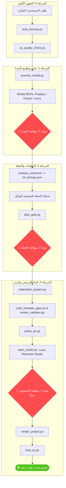

<div align="center">

# 🎬 Clean Video Workspace
### Next-Gen Autonomous Motion Video Production Pipeline

[](file:///c:/video/clean-video-workspace/documentation/audits/FINAL_CHECKLIST.md)
[](https://www.remotion.dev/)
[](file:///c:/video/clean-video-workspace/documentation/architecture/SYSTEM_ARCHITECTURE.md)
[-success?style=for-the-badge)](file:///c:/video/clean-video-workspace/.agents/rules/video-production-protocol.md)
[](file:///c:/video/clean-video-workspace/documentation/guides/SECURITY_PATCH_NOTES.md)

<p align="center">
  <b>بيئة إنتاج فيديو موشن احترافية مبرمجة بالكامل، تجمع بين قوة Remotion و FFmpeg وسرعة وكلاء الذكاء الاصطناعي مع بوابات أمان ميكانيكية صارمة لمنع الارتجال.</b>
</p>

[استكشف المعمارية](file:///c:/video/clean-video-workspace/documentation/architecture/SYSTEM_ARCHITECTURE.md) • [دليل المساهمة](file:///c:/video/clean-video-workspace/CONTRIBUTING.md) • [مركز التوثيق](file:///c:/video/clean-video-workspace/documentation/README.md) • [دليل البدء السريع](#-دليل-البدء-السريع-quickstart)

---

</div>

## 📑 فهرس المحتويات (Table of Contents)

- [🌟 نظرة عامة (Overview)](#-نظرة-عامة-overview)
- [🏛️ الهيكل المعماري وخط الإنتاج (Pipeline Architecture)](#️-الهيكل-المعماري-وخط-الإنتاج-pipeline-architecture)
- [🛡️ بوابات الجودة الأربعة (The 4 Production Gates)](#️-بوابات-الجودة-الأربعة-the-4-production-gates)
- [📁 شجرة مساحة العمل (Repository Tree)](#-شجرة-مساحة-العمل-repository-tree)
- [🚀 دليل البدء السريع (Quickstart)](#-دليل-البدء-السريع-quickstart)
- [🎨 معايير الإخراج والهوية البصرية (Directing Protocol)](#-معايير-الإخراج-والهوية-البصرية-directing-protocol)
- [🧪 أدوات الاختبار والفحص (Smoke & Health Tests)](#-أدوات-الاختبار-والفحص-smoke--health-tests)
- [📚 مركز التوثيق (Documentation Index)](#-مركز-التوثيق-documentation-index)

---

## 🌟 نظرة عامة (Overview)

منظومة **Clean Video Workspace** تم تصميمها لتكون بيئة عمل قياسية متكاملة لإنتاج الفيديوهات التجارية وفيديوهات السوشيال ميديا (9:16) برمجياً عبر الكود (Code-Driven Motion Design).

### 🤖 فلسفة الوكيل (The Master Planner Role)
* **أنت لا تصنع الفيديو بيدك ارتجالاً:** الوكيل الذكي يعمل كـ **مدير تقني (CTO) ومخطط استراتيجي** يوجه خط الإنتاج، يكتب مكونات React، ويدير معالجات FFmpeg و Remotion.
* **الاعتماد على البيئة المحلية (Local-First):** معالجة الصوت، تطبيع الميديا، فحص الأكواد وتصدير الفيديو تتم بالكامل محلياً داخل جهازك دون الاعتماد على خدمات خارجية بطيئة أو غير مضمونة.
* **صفر أوهام (Zero Hallucination Tolerance):** لا وجود لأرقام أو توقيتات مخمنة؛ كل حركة بصرية مربوطة بالملي ثانية مع الكلمة المنطوقة، وكل كود حركة يستورد حصراً من حزمة القوالب المعتمدة.

---

## 🏛️ الهيكل المعماري وخط الإنتاج (Pipeline Architecture)

يمر كل مشروع فيديو بدورة حياة صارمة مكونة من 4 بوابات و 9 مراحل غير قابلة للتجاوز:



---

## 🛡️ بوابات الجودة الأربعة (The 4 Production Gates)

| البوابة | السكريبت المسؤول | الشرط الإلزامي للعبور | ما الذي تمنعه؟ |
| :--- | :--- | :--- | :--- |
| **Gate 1: سلامة الميديا** | `process_media.py` / `vo_quality_check.py` | توحيد الفيديوهات لـ `All-Intra, yuv420p` وتطبيع الصوت (-16 LUFS للـ VO و -24 LUFS للـ SFX). | تمنع الميديا التالفة والأصوات غير المتوازنة وأخطاء التشغيل. |
| **Gate 2: سلامة الخطة** | `plan_gate.py` / `stage_gate.py` | وجود ملف توقيتات بالكلمة `04_timings.json` وجداول حركة دقيقة لكل ثانية. | تمنع توليد خطط عشوائية بدون تزامن حركي حقيقي (Gestural Sync). |
| **Gate 3: سلامة الكود** | `code_template_gate.py` / `motion_validator.py` | استيراد كل المشاهد من `@templates` المعتمدة ومطابقة قيم الـ Spring المعتمدة. | تمنع كتابة `spring()` أو `interpolate()` ارتجالية خارج محرك الذوق. |
| **Gate 4: القفل الميكانيكي** | `probe_qc.py` / `package.json` | وجود ملف التوقيع اليدوي `.studio_approved` الذي يُنشئه المستخدم بنفسه بعد المعاينة. | تمنع الرندر المباشر من الـ Terminal وتمنع استهلاك موارد الجهاز بدون موافقة. |

---

## 📁 شجرة مساحة العمل (Repository Tree)

```text
clean-video-workspace/
├── .agents/                               # حوكمة الوكلاء والمهارات
│   ├── rules/
│   │   └── video-production-protocol.md   # الدستور الأساسي للإنتاج (v4.0)
│   ├── AGENTS.md                          # الهوية، القواعد، وبروتوكول التصميم
│   └── plugins/
│       └── super-video-maker-plugin/      # المحرك الأساسي، السكريبتات، والمهارات
│           ├── scripts/                   # الـ 16 سكريبت الإلزامي لخط الإنتاج
│           ├── skills/                    # مهارات remocn و snapcn
│           └── references/                # فهارس القوالب ومصفوفة الـ SFX
├── projects/                              # مشاريع الفيديو المستقلة
│   └── <project_id>/
│       ├── assets/                        # دورة حياة ميديا المشروع
│       │   ├── incoming/                  # مرفوعات المستخدم
│       │   ├── cache/                     # تنزيلات الـ MCP
│       │   └── ready/                     # الأصول المعالجة والمطبعة
│       ├── 04_timings.json                # التوقيتات الدقيقة المستخرجة
│       ├── master_plan.md                 # الخطة التفصيلية المعتمدة
│       └── 06_build/                      # بيئة Remotion المستقلة للمشروع
├── assets/                                # الأصول العامة المشتركة
├── documentation/                         # مركز التوثيق المرجعي
│   ├── README.md                          # دليل مركز التوثيق
│   ├── architecture/                      # المخططات المعمارية وتدفق البيانات
│   ├── audits/                            # تقارير التدقيق الشامل والفحص النهائي
│   ├── guides/                            # أدلة الأمان وترقيات النظام
│   └── tools/                             # أدوات توليد التقارير والفحص
├── CONTRIBUTING.md                        # دليل الحوكمة والمساهمة
└── README.md                              # هذه الوثيقة الرئيسية
```

---

## 🚀 دليل البدء السريع (Quickstart)

لإنتاج فيديو تجاري جديد خطوة بخطوة عبر موجه الأوامر:

### 1. استئناف أو بدء مشروع جديد
عند فتح محادثة جديدة، يقوم الوكيل باستدعاء مدير الجلسات لضمان عدم ضياع السياق:
```bash
python .agents/plugins/super-video-maker-plugin/scripts/session_manager.py resume <project_id>
```

### 2. فحص الصوت وتطبيع الميديا (المرحلة 0 & 1)
```bash
# فحص جودة التعليق الصوتي
python .agents/plugins/super-video-maker-plugin/scripts/vo_quality_check.py <project_id>

# معالجة وتطبيع الفيديو والأصوات
python .agents/plugins/super-video-maker-plugin/scripts/process_media.py <project_id>
```

### 3. التحقق من الخطة وبناء بيئة المشروع (المرحلة 2 & 3)
```bash
# فحص مطابقة الخطة للتوقيتات
python .agents/plugins/super-video-maker-plugin/scripts/plan_gate.py <project_id>

# نسخ ونقل الميديا المعتمدة إلى مجلد البناء
python .agents/plugins/super-video-maker-plugin/scripts/materialize_project.py <project_id>

# التحقق من سلامة كود Remotion وخلوه من الارتجال
python .agents/plugins/super-video-maker-plugin/scripts/code_template_gate.py <project_id>
```

### 4. المعاينة في الاستوديو والتصدير النهائي
```bash
# فتح استوديو Remotion بأمان للمعاينة
python .agents/plugins/super-video-maker-plugin/scripts/open_studio.py <project_id>

# بعد معاينة المستخدم وإنشاء .studio_approved، يتم الرندر النهائي:
python .agents/plugins/super-video-maker-plugin/scripts/render_project.py <project_id>
```

---

## 🎨 معايير الإخراج والهوية البصرية (Directing Protocol)

تلتزم كافة المشاهد المنتجة في هذه البيئة بالمعايير الفنية التالية:

1. **المسافات وهندسة التنفس (Breathing Room):**
   * هوامش مريحة (40px إلى 80px) بين النصوص والبطاقات.
   * تغطية متوازنة لكامل الشاشة الرأسية (9:16) دون فراغات ميتة أو تكديس.
2. **الطباعة الرقمية والنصوص العربية (Typography & RTL):**
   * خطوط حديثة وعريضة (`Alexandria`، `Cairo`، `IBM Plex Sans Arabic`).
   * تفعيل `direction: 'rtl'` وفرض `willChange: "transform"` لمنع تكسر الأحرف العربية أثناء الحركة (Sub-pixel rendering fix).
3. **التدفق والانتقالات (Dynamic Motion):**
   * زوم سينمائي ناعم (Deep Gradual Zoom) كبوابة للانتقال بين المشاهد.
   * خلفية سايبر موحدة ومستمرة عبر التايم لاين لتجنب القطع المفاجئ (Zero Hard Cuts).
4. **التطبيع الصوتي والمؤثرات (Audio Engineering):**
   * التعليق الصوتي: `-16 LUFS`.
   * المؤثرات والموسيقى: `-24 LUFS`.
   * خفض صوت الموسيقى تلقائياً (Auto-Ducking) أثناء التحدث ورفعها في فترات الصمت.

---

## 🧪 أدوات الاختبار والفحص (Smoke & Health Tests)

للتأكد من سلامة البيئة وصحة شجرة المجلدات والروابط:

```powershell
# تشغيل الفحص السريع للنظام والروابط والقواعد
.\smoke_test.ps1

# مراقبة نظام الذاكرة وحجم ملخص الجلسات
.\check_memory_system.ps1 -Project "<project_id>"
```

---

## 📚 مركز التوثيق (Documentation Index)

للاطلاع على التوثيق التفصيلي والمخططات المتعمقة، راجع [مركز التوثيق](file:///c:/video/clean-video-workspace/documentation/README.md):
- 🏛️ [الهيكل المعماري للنظام (SYSTEM_ARCHITECTURE.md)](file:///c:/video/clean-video-workspace/documentation/architecture/SYSTEM_ARCHITECTURE.md)
- ⚙️ [دليل مراحل خط الإنتاج التسع (WORKSPACE_PIPELINE_EXPLAINED.md)](file:///c:/video/clean-video-workspace/documentation/architecture/WORKSPACE_PIPELINE_EXPLAINED.md)
- 📝 [تقرير التدقيق الشامل وحذف السكريبتات (AUDIT_REPORT.md)](file:///c:/video/clean-video-workspace/documentation/audits/AUDIT_REPORT.md)
- ✅ [قائمة الفحص النهائية للمشروع (FINAL_CHECKLIST.md)](file:///c:/video/clean-video-workspace/documentation/audits/FINAL_CHECKLIST.md)
- 🛡️ [نتائج اختبارات الاختراق والبوابات (INTEGRATION_TEST_REPORT.md)](file:///c:/video/clean-video-workspace/documentation/audits/INTEGRATION_TEST_REPORT.md)
- 🔒 [سجل التحديثات الأمنية (SECURITY_PATCH_NOTES.md)](file:///c:/video/clean-video-workspace/documentation/guides/SECURITY_PATCH_NOTES.md)

---

<div align="center">
  <sub>Built with ❤️ for High-End Commercial Motion Video Production</sub>
</div>
