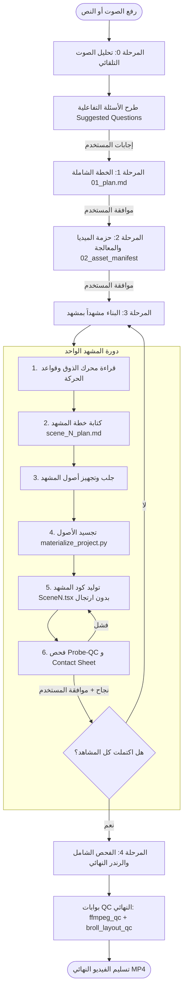
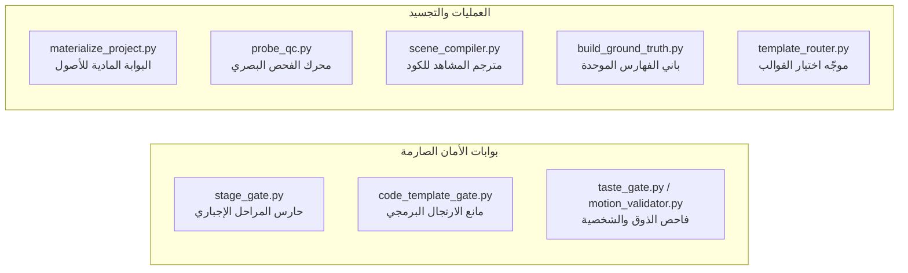

# 🎬 الدليل الشامل لخط إنتاج الفيديو ومحرك الموشن (Workspace Pipeline & Architecture)

> هذا المستند يشرح بالتفصيل المعماري والتقني كل ما يدور داخل مساحة العمل: **الفلسفة، التدفق المرحلي (Flow)، الملفات المتولدة، السكربتات التلقائية، خوادم الـ MCP، وبوابات الأمان وضمان الجودة (Quality Gates).**

---

## 📑 فهرس المحتويات
1. [الهوية والفلسفة الأساسية (Core Identity & Principles)](#1-الهوية-والفلسفة-الأساسية)
2. [الهيكل العام للمجلدات ومساحة العمل (Workspace Hierarchy)](#2-الهيكل-العام-للمجلدات-ومساحة-العمل)
3. [دورة حياة المشروع وتدفق المراحل (The 5-Stage Production Flow)](#3-دورة-حياة-المشروع-وتدفق-المراحل)
   - [المرحلة 0: تحليل الصوت والاستيضاح التفاعلي (VO Analysis & Smart Questions)](#المرحلة-0-تحليل-الصوت-والاستيضاح-التفاعلي)
   - [المرحلة 1: الخطة الشاملة والعمود الفقري (Master Plan & Motion Taste)](#المرحلة-1-الخطة-الشاملة-والعمود-الفقري)
   - [المرحلة 2: دورة حياة الميديا وجلب الحزمة الأولية (Asset Pipeline)](#المرحلة-2-دورة-حياة-الميديا-وجلب-الحزمة-الأولية)
   - [المرحلة 3: البناء مشهداً بمشهد (Agile Visual-First Scene Build)](#المرحلة-3-البناء-مشهداً-بمشهد)
   - [المرحلة 4: الفحص الشامل والرندر النهائي (Final Probe QC & Render)](#المرحلة-4-الفحص-الشامل-والرندر-النهائي)
4. [دليل الملفات ونواتج كل مرحلة (Files & Manifests Breakdown)](#4-دليل-الملفات-ونواتج-كل-مرحلة)
5. [السكربتات والبوابات البرمجية خلف الكواليس (Scripts & Quality Gates)](#5-السكربتات-والبوابات-البرمجية-خلف-الكواليس)
6. [منظومة خوادم الـ MCP والأدوات المحلية (MCP Servers Ecosystem)](#6-منظومة-خوادم-الـ-mcp-والأدوات-المحلية)
7. [قوانين الذوق الإخراجي والتصميم (Design & Directing Protocol)](#7-قوانين-الذوق-الإخراجي-والتصميم)

---

## 1. الهوية والفلسفة الأساسية

### 🎯 هوية النظام (The Pipeline Orchestrator)
النظام ليس مجرد "مولد فيديو بالذكاء الاصطناعي"، بل هو **خط إنتاج برمجي سينمائي متكامل (Programmatic Motion Pipeline)** يجمع بين:
- **المخطط الاستراتيجي (Strategic Architect):** الذكاء الاصطناعي الذي يحلل النص والصوت ويبني المخططات المنطقية والزمنية.
- **محرك الكود (Remotion + React + TypeScript):** بناء المشاهد البرمجية الحركية بدقة الفريم الواحد (Frame-Accurate).
- **أدوات المعالجة الميدانية المحلية (Local Media Engines):** FFmpeg ومعالجات الصوت والـ Vectors لتجهيز كافة العناصر بأعلى معايير البث.

### 🛑 القواعد الذهبية الأربعة (Non-Negotiables)
1. **الصوت أولاً (Sound-First):** لا يُبنى مشهد أو تُكتب خطة دون تحليل صوتي حقيقي ومؤكد عبر أدوات الـ DSP لاستخراج أزمنة الكلمات والجمل.
2. **صفر ارتجال (Zero-Improvisation):** ممنوع اختراع حركات عشوائية (`spring()` / `interpolate()`) من الصفر داخل المشاهد؛ كل حركة يجب أن تنبع من قوالب معتمدة ومختبرة في الكتالوج (`@templates` أو `@engine`).
3. **التوقفات الإجبارية وبوابات الموافقة (Hard Stops & Stage Gates):** لا يمكن الانتقال لمرحلة تالية دون اكتمال مخرجات المرحلة السابقة واجتياز بوابات الفحص الصارم (`stage_gate.py`).
4. **الفحص البصري التنبؤي (Probe-QC Before Studio):** ممنوع فتح استوديو المعاينة أو رندر الفيديو قبل أخذ لقطات ثابتة (Stills) عند كل لحظة حرجة في المشهد والتأكد من خلوها بنسبة 100% من الأخطاء التخطيطية أو النصية.

---

## 2. الهيكل العام للمجلدات ومساحة العمل

```text
clean-video-workspace/
├── assets/                             # المستودع المركزي للأصول والميديا
│   ├── incoming/                       # مرفوعات المستخدم الخام (VO، شعارات، صور خاصة)
│   ├── cache/                          # التنزيلات الخام المؤقتة من خوادم الـ MCP
│   ├── processing/                     # مساحة المعالجة اللحظية (FFmpeg، تطبيع، قص)
│   └── ready/                          # الأصول المعتمدة والمعالجة هندسياً (All-Intra, Normalized)
│
├── projects/                           # مجلد مشاريع الفيديو (مستقلة ومعزولة بالكامل)
│   └── <project_name>/                 # مشروع فيديو محدد
│       ├── 00_answers.md               # إجابات المستخدم على الأسئلة التفاعلية
│       ├── 01_plan.md                  # الخطة الشاملة والعمود الفقري
│       ├── 02_asset_manifest.json      # سجل الأصول وبياناتها الفنية
│       ├── 03_preprocess_report.json   # تقرير المعالجة الهندسية (GOP=1, LUFS)
│       ├── 04_timings.json             # التوقيتات المستخرجة بالكلمة والجملة من الـ VO
│       ├── 05_blueprint.json           # المخطط الزمني الكامل للتنفيذ البرمجي
│       ├── 05_blueprint_human.md       # المخطط المقروء بشرياً
│       ├── probe_qc_report.json        # تقرير الفحص البصري الميكانيكي
│       ├── .materialized.lock          # قفل التجسيد المادي للأصول
│       ├── .studio_unlocked            # قفل الأمان لفتح الاستوديو
│       ├── scenes/                     # خطط وتقارير كل مشهد على حدة
│       │   ├── scene_1_plan.md
│       │   └── scene_1_qc_report.json
│       ├── 03_probe_qc/                # لقطات الفحص البصري الثابتة و Contact Sheet
│       └── 06_build/                   # مشروع Remotion المستقل
│           ├── package.json
│           ├── tsconfig.json           # معرّف مع مسارات Alias (@templates, @engine)
│           ├── public/media/           # الأصول المادية المنسوخة للمشروع
│           └── src/
│               ├── index.ts            # نقطة البداية وتسجيل الـ Root
│               ├── Root.tsx            # تعريف التركيبات والأبعاد ومعدل الفريمات
│               ├── media_map.json      # خريطة الأصول البرمجية
│               ├── templates/          # نسخ القوالب المعتمدة
│               ├── engine/             # مكتبة المحرك السينمائي
│               └── compositions/       # المشاهد البرمجية المولدة (Scene1.tsx, ...)
│
├── .agents/
│   ├── rules/                          # قواعد وبروتوكولات الإنتاج
│   │   └── video-production-protocol.md
│   └── plugins/super-video-maker-plugin/  # قلب المحرك والإضافات المعتمدة
│       ├── templates/                  # مكتبة القوالب الموحدة (scenes, elements, effects)
│       ├── engine/                     # المحرك السينمائي الداخلي (camera, layout, transitions)
│       ├── ground-truth/               # الفهارس المعتمدة والمولدة آلياً (TEMPLATE_INDEX.md)
│       ├── references/deep/motion-taste/ # أدلة ومراجع الذوق الحركي والإخراجي
│       └── scripts/                    # ترسانة السكربتات والبوابات الآلية
```

---

## 3. دورة حياة المشروع وتدفق المراحل (The 5-Stage Production Flow)



---

### المرحلة 0: تحليل الصوت والاستيضاح التفاعلي
1. **التحليل الفوري:** تشغيل أداة `audio-tools-mcp:analyze_voiceover` على ملف الصوت المرفوع في `assets/incoming/`.
2. **استخراج التوقيتات:** إنشاء ملف `04_timings.json` الذي يحتوي على توقيت كل كلمة بالملي ثانية وتفصيل الجمل وحدودها.
3. **توليد الأسئلة الذكية:** تحليل موضوع النص والمشاعر ونقاط التحول، وصياغة 8-12 سؤال استيضاحي تفاعلي (Suggested Questions بصيغة JSON) ليختار منها المستخدم مباشرة.
4. **🛑 التوقف 1:** حفظ اختيارات المستخدم في `00_answers.md`.

---

### المرحلة 1: الخطة الشاملة والعمود الفقري
1. **العمود الفقري (Core Narrative):** تحديد (مشاهد واحد، وعد واحد، آلية واحدة، خطوة تالية).
2. **ربط الذوق الحركي (Motion Taste Citation):** استخراج نمط الحركة المعتمد مع اقتباس رقم السطر من مراجع الذوق (`motion_taste_citation: motion-personality.md:line`).
3. **جدول المشاهد:** تخطيط المشاهد بالوصف البصري والنوع دون اختراع أسماء ملفات وهمية، وتحديد القوالب المناسبة من `TEMPLATE_INDEX.md`.
4. **حزمة الميديا الأولية:** تحديد العناصر المشتركة (خلفية عامة، موسيقى خلفية BGM، هوية الألوان).
5. **🛑 التوقف 2:** إنشاء `01_plan.md` وانتظار موافقة المستخدم الصريحة.

---

### المرحلة 2: دورة حياة الميديا وجلب الحزمة الأولية
1. **فحص الكاش أولاً:** استدعاء `common-tools-mcp:check_cache` والبحث في `ASSET_INDEX.json`؛ إذا كان الأصل معالجاً وموجوداً في `assets/ready/` يُمنع جلبه مجدداً.
2. **الجلب المباشر:** استخدام `media-sources-mcp` لجلب الفيديوات والستوك والأيقونات والمؤثرات الصوتية.
3. **المعالجة الهندسية الإلزامية:**
   - **الفيديوهات:** تحويلها إلى `All-Intra` (GOP=1, yuv420p) لضمان دقة التنقل اللحظي بدون إسقاط إطارات في Remotion.
   - **التعليق الصوتي (VO):** تطبيع مستوى الصوت بدقة إلى `-16 LUFS`.
   - **المؤثرات الصوتية (SFX):** تطبيع مستوى الصوت بدقة إلى `-24 LUFS`.
4. **حفظ وتوثيق:** إنشاء `02_asset_manifest.json` و `03_preprocess_report.json` وحفظ النواتج في `assets/ready/`.
5. **🛑 التوقف 3:** اعتماد الحزمة الأولية.

---

### المرحلة 3: البناء مشهداً بمشهد (Agile Visual-First)
تتم معالجة المشاهد بشكل تكراري ودقيق جداً (Scene by Scene):
1. **القراءة الإلزامية:** قراءة ملفات محرك الذوق (`motion-personality.md`, `emotion-mapping.md`, `choreography.md`, `timing-easing-tables.md`).
2. **خطة المشهد (`scenes/scene_N_plan.md`):** كتابة مصفوفة اللقطات (`shots[]`)، التوقيتات، ونوع الحركة، والإيماءة البصرية المرتبطة بالصوت (Gestural Sync).
3. **تجسيد الأصول (`materialize_project.py`):** نسخ الأصول والقوالب المطلوبة إلى `06_build/` وتوليد `media_map.json`.
4. **توليد كود المشهد (`SceneN.tsx`):** استخدام القوالب المعتمدة من `@templates` و `@engine` مع ربط طبقات الصوت الموضعية.
5. **بوابة الفحص البصري (Probe-QC):**
   - استخراج اللحظات الحرجة (أول فريم، ظهور النصوص، الذروة الحركية، الكابشن، آخر فريم).
   - رندر صور ثابتة باستخدام `npx remotion still`.
   - توليد لوحة الفحص البصري المجمعة (`contact_sheet.png`).
   - فحص وجود أي نصوص مكسورة، تداخل، مشاكل RTL، أو اختفاء غير مقصود.
6. **🛑 التوقف لكل مشهد:** عرض النتائج على المستخدم وأخذ موافقته قبل الانتقال للمشهد التالي.

---

### المرحلة 4: الفحص الشامل والرندر النهائي
1. **Probe-QC الكامل:** إعادة فحص بصري شامل لكل المشاهد المترابطة بالتسلسل.
2. **فتح قفل الاستوديو:** إنشاء ملف `.studio_unlocked` بعد نجاح الـ Probe QC بحالة `pass`.
3. **المعاينة أو الرندر النهائي:** 
   - معاينة عبر Remotion Studio (`npm run studio`).
   - الرندر النهائي عبر `npx remotion render` لإنتاج الفيديو بجودة فائقة في مجلد `out/`.
4. **بوابات الجودة النهائية (QC Gate):**
   - فحص FFmpeg والتأكد من توافق الـ Codecs والصوتيات عبر `ffmpeg_qc.py`.
   - فحص سلامة التخطيطات البصرية عبر `broll_layout_qc.py`.
5. **🛑 التسليم النهائي.**

---

## 4. دليل الملفات ونواتج كل مرحلة

| الملف | المرحلة | الوظيفة والمحتوى |
|---|---|---|
| `00_answers.md` | المرحلة 0 | إجابات وتفضيلات المستخدم المستخرجة من الأسئلة التفاعلية. |
| `01_plan.md` | المرحلة 1 | الخطة الشاملة، العمود الفقري، واقتباسات الذوق الإخراجي والقوالب المعتمدة. |
| `02_asset_manifest.json` | المرحلة 2 | فهرس مفصل لجميع الأصول (المعرفات، المسارات الأصلية والمعالجة، التراخيص، الأبعاد). |
| `03_preprocess_report.json` | المرحلة 2 | تقرير التحقق الهندسي (تأكيد GOP=1 للفيديو، ومستويات الـ LUFS للصوت). |
| `04_timings.json` | المرحلة 0/2 | التوقيتات الزمنية الدقيقة المستخرجة من الـ VO لكل كلمة وجملة ومقطع صامت. |
| `05_blueprint.json` | المرحلة 2/3 | المخطط البرمجي الهيكلي الكامل للمشروع (Timeline, Layers, Elements, SFX cues). |
| `05_blueprint_human.md` | المرحلة 2/3 | نسخة مقروءة بشرياً من المخطط البرمجي لمراجعتها وفهم تدفق المشاهد بسهولة. |
| `scenes/scene_N_plan.md` | المرحلة 3 | الخطة الفردية التفصيلية لبناء وتوقيت ومؤثرات المشهد رقم N. |
| `03_probe_qc/probe_*.png` | المرحلة 3 | لقطات ثابتة عالية الدقة مأخوذة عند اللحظات الحركية الحرجة للمشهد. |
| `03_probe_qc/contact_sheet.png` | المرحلة 3 | لوحة تجميعية تضم لقطات الفحص البصري للمراجعة السريعة دفعة واحدة. |
| `probe_qc_report.json` | المرحلة 3/4 | تقرير حالة الفحص البصري (`status: "pass"` أو `"fail"`) مع تسجيل الملاحظات. |
| `.materialized.lock` | المرحلة 3 | ملف قفل تقني يثبت أن الأصول المادية والقوالب تم نقلها وتثبيتها بنجاح في `06_build`. |
| `.studio_unlocked` | المرحلة 3/4 | مفتاح الأمان الميكانيكي الذي يفتح صلاحية تشغيل الاستوديو أو الرندر النهائي. |
| `06_build/src/media_map.json` | المرحلة 3 | خريطة برمجية تربط معرفات الأصول (Asset IDs) بمساراتها داخل `public/media/`. |

---

## 5. السكربتات والبوابات البرمجية خلف الكواليس

يحتوي مجلد `.agents/plugins/super-video-maker-plugin/scripts/` على مجموعة من السكربتات الذاتية المسؤولة عن الأتمتة وضمان الجودة الصارمة:



### 1. `stage_gate.py` (حارس المراحل)
- **وظيفته:** منع القفز بين المراحل والتأكد من وجود كافة الملفات المطلوبة واستيفائها للشروط قبل الانتقال للمرحلة التالية.
- **آلية الفحص:** 
  - يفحص وجود `01_plan.md` والتأكد من احتوائه على شخصية موشن واقتباس `motion_taste_citation`.
  - يفحص `02_asset_manifest.json` و `03_preprocess_report.json` للتأكد من All-Intra و LUFS.
  - يفحص `probe_qc_report.json` والتأكد أن حالته `pass`.

### 2. `materialize_project.py` (البوابة المادية للمشروع)
- **وظيفته:** هو الناقل الشرعي والوحيد للأصول والقوالب إلى داخل مجلد بناء Remotion (`06_build`).
- **آلية العمل:**
  - ينسخ القوالب من `templates/` و `engine/` إلى `06_build/src/`.
  - يحقن مسارات الـ Aliases (`@templates/*`, `@engine/*`) في `tsconfig.json`.
  - ينسخ الميديا المعالجة من `assets/ready/` إلى `06_build/public/media/`.
  - يولد ملف `media_map.json` وينشئ قفل الأمان `.materialized.lock`.

### 3. `code_template_gate.py` (مانع الارتجال)
- **وظيفته:** التأكد التام من أن كود React المكتوب داخل `06_build/src/compositions/` يستند 100% إلى قوالب معتمدة ولا يحتوي على كود مرتجل من الصفر.
- **آلية العمل:**
  - يفحص استيرادات الـ Components ويتأكد من وجود استيراد صريح من `@templates` أو `@engine`.
  - يتحقق من ترويسة الملفات المولدة وتطابق الـ MD5 Hashes لمنع التعديل العشوائي.
  - يمنع استخدام مكتبات شادكن أو مجلدات خارج الإطار القياسي.

### 4. `probe_qc.py` (محرك الفحص البصري التنبؤي)
- **وظيفته:** استخراج اللحظات الحرجة (Critical Moments) من الـ Blueprint وتحويلها إلى فريمات ورندر صور ثابتة (Stills).
- **آلية العمل:**
  - يحلل بداية ونهاية كل عنصر، ظهور الكابشن، وقمة الحركة (Peak Motion).
  - ينفذ `npx remotion still` لكل فريم حرج.
  - يولد لوحة المراجعة المجمعة `contact_sheet.png` لتمكين الوكيل والمستخدم من فحص كل المشهد بنظرة واحدة.

### 5. `motion_validator.py` & `taste_gate.py` (فاحص الذوق والحركة)
- **وظيفتهما:** التحقق من أن الخطة وكود المشاهد يلتزمان بالمعايير الإخراجية الدقيقة (Beat Density, Safe Zones, Spacing, Transitions).

### 6. `build_ground_truth.py` & `template_router.py` (محرك الفهرسة والتوجيه)
- **وظيفتهما:** مسح جميع القوالب في `templates/` و `engine/` وبناء الفهرس الموحد `TEMPLATE_INDEX.md` وخرائط التصنيف (`collections/`)، وتوفير خوارزمية بحث ذكية لاقتراح القوالب بناءً على:
  $$\text{Score} = \text{Intent} + \text{Use Case} + \text{Mood} + \text{Capabilities}$$

---

## 6. منظومة خوادم الـ MCP والأدوات المحلية

المنظومة تعتمد على 7 خوادم MCP متخصصة تتولى المهام الثقيلة محلياً:

| خادم الـ MCP | أهم الأدوات والوظائف |
|---|---|
| **`audio-tools-mcp`** | • `analyze_voiceover`: تحليل أزمنة الـ VO بدقة الكلمة.<br>• `normalize_loudness`: تطبيع الصوت وفق معايير EBU R128 (-16 للـ VO و -24 للـ SFX).<br>• `split_voiceover_sentences`: تقسيم الصوت لجمل ومشاهد منفصلة.<br>• `detect_and_trim_silence`: رصد وحذف السكون الميت. |
| **`media-sources-mcp`** | • `pixabay_search_videos / images / audio`: جلب ستوك مجاني عالي الدقة.<br>• `pexels_search_videos / images`: جلب لقطات سينمائية ومودرن.<br>• `freesound_search`: جلب مؤثرات صوتية احترافية (SFX).<br>• `iconify_search` & `download_iconify_icon`: جلب أيقونات فيكتورية ملونة بدقة SVG. |
| **`video-tools-mcp`** & **`ffmpeg-mcp-server`** | • تحويل الفيديوهات لنمط `All-Intra` (GOP=1, yuv420p).<br>• `trim_video` & `extend_video`: قص وتمديد الفيديوهات بدقة الفريم.<br>• `resize_video`: تعديل أبعاد الفيديو ونسبة العرض للارتفاع (9:16 للموبايل).<br>• `get_files_info`: فحص الميتاداتا ومعدل الفريمات ومخطط التشفير. |
| **`image-tools-mcp`** | • `upscale_image`: رفع دقة الصور بالذكاء الاصطناعي.<br>• `crop_to_ratio` & `auto_crop_content`: القص الذكي للتركيز على العنصر الأساسي. |
| **`common-tools-mcp`** | • `check_cache`: فحص وجود الأصل مسبقاً لمنع التنزيل المكرر.<br>• `save_to_cache`: فهرسة وحفظ الأصل في الكاش المحلي الدائم. |
| **`Video_Editor_MCP`** | • `execute_command`: تنفيذ أوامر المحرك وعمليات الرندر ومعالجة العمليات الثقيلة. |

---

## 7. قوانين الذوق الإخراجي والتصميم (Design & Directing Protocol)

يخضع كل مشروع إلى بروتوكول إخراجي وتصميمي إلزامي يضمن أعلى درجات الاحترافية:

### 📐 1. المسافات والتنفس (Spacing & Canvas Coverage)
- **قاعدة التنفس (Breathing Room):** هوامش واسعة ومريحة (40px - 80px) بين العناصر والبطاقات.
- **التغطية الكاملة (Full Canvas 9:16):** استغلال الشاشة الرأسية بالكامل ومنع ترك فراغات ميتة في المنتصف أو حشر العناصر في زاوية واحدة.

### ✍️ 2. النصوص والخطوط العربية (Typography & RTL)
- **الخطوط المعتمدة:** خطوط هندسية عصرية وثقيلة (Alexandria, Cairo, IBM Plex Sans Arabic) مع `JetBrains Mono` للأكواد.
- **أحجام النصوص:** خطوط ضخمة مقروءة على الهاتف (العناوين 50px+، النصوص الفرعية 30px+).
- **حل مشكلة تكسر الحروف (Sub-pixel Bug):** إضافة `willChange: "transform"` لحاويات النصوص لمنع ظهور خطوط بيضاء أثناء الحركة، مع فرض `direction: "rtl"` و `flex-wrap`.

### 🎥 3. حركة الكاميرا والعمق البصري (Motion & Camera Choreography)
- **الزوم العميق السلس (Gradual Deep Zoom):** استخدام الزوم كبوابة انتقال طبيعية بين المشاهد بدون قفزات مفاجئة.
- **الخلفية الموحدة (Unified Continuous Canvas):** خلفية متدفقة واحدة عبر التايم لاين لمنع القطع المفاجئ (Hard Cuts).
- **تتبع النصوص ديناميكياً:** حركة كاميرا هادئة (Pan/Tilt) تتبع ظهور العناصر والنصوص في الشاشة.

### 🔊 4. الصوت والمؤثرات المتزامنة (Frame-Perfect Audio)
- **منع تكرار الـ SFX:** كل حدث له صوت مميز وخاص به.
- **التزامن بالملي ثانية (Gestural Sync):** كل حركة بصرية (Pop, Slide, Glow) تصطدم بدقة تامة مع لحظة نطق الكلمة المقابلة في الـ VO.
- **الموسيقى التفاعلية (Dynamic BGM):** رفع صوت الموسيقى تلقائياً لملء الفراغات في لحظات السكون أو التوقف الدراماتيكي.

---

## 🏁 خلاصة دورة العمل
باختصار شديد، المشروع يتبع مبدأ:
$$\textbf{الصوت} \longrightarrow \textbf{الاستيضاح} \longrightarrow \textbf{الخطة} \longrightarrow \textbf{الأصول المعالجة} \longrightarrow \textbf{المشاهد بقوالب معتمدة} \longrightarrow \textbf{فحص بصري Stills} \longrightarrow \textbf{الرندر والـ QC النهائي}$$
وهذا ما يضمن فيديوهات احترافية بأعلى جودة بصرية وصوتية بدون أي أخطاء برمجية أو مفاجآت عند الرندر!
