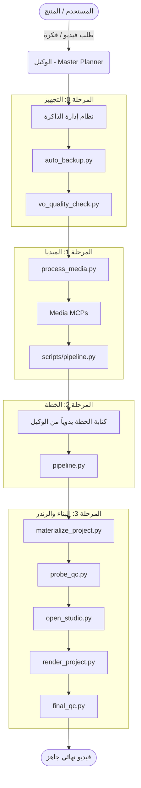

# HISTORICAL DOCUMENT

This document describes a previous architecture.

DO NOT use this document as an implementation reference.

Current authority:
- ARCHITECTURE_TRUTH.md
- AGENTS.md

---
# 🏛️ الهيكل المعماري لنظام Clean Video Workspace (v4.0)

يوضح هذا المستند بنية العمل المعمارية وكيفية تدفق البيانات والتحكم في النظام لمنع الأخطاء وضمان الجودة.

## 1. مخطط تدفق البيانات الأساسي (Core Pipeline)



## 2. بنية طبقات الأمان (Security & Guardians)

النظام مبني على فكرة **"المنسق المركزي" (Smart Orchestrator)** الذي يتحقق من حالة المشروع عبر البوابات.

1. **المنسق الذكي: `scripts/pipeline.py`**
   - هو مركز التحكم الرئيسي الذي يدير الانتقال بين المراحل.
   - يعتمد على حالة المشروع في `.pipeline_state.json`.

2. **بوابة البيانات الواردة**
   - السكريبتات: `process_media.py` / `vo_quality_check.py`
   - تمنع أي ميديا تالفة، أو أي صوت غير متوافق (يجب أن يكون `-16 LUFS`).

3. **بوابة السلامة (Safety & Schema Gates)**
   - يديرها `pipeline.py` داخلياً (استبدلت `plan_gate.py` القديم).
   - تمنع الوكيل من إنشاء خطة بدون تحليل صوتي.
   - تدقق في صحة عقود JSON (`05_blueprint.json` إلخ).

4. **القفل الميكانيكي للبناء (Mechanical Lock)**
   - السكريبتات: `probe_qc.py` و `package.json`
   - `npm run render` محظور كلياً من الـ terminal.
   - الرندر لا يبدأ بدون ملف `.studio_approved` الذي يُنشئه المستخدم يدوياً.

## 3. هندسة الذاكرة وسياق الوكيل (Memory Context Engine)

لحل مشكلة "تعليق المحادثات الطويلة" (Context Bloat)، يعتمد النظام على:
- `selective_reader.py`: يقدم للوكيل فقط الملفات المطلوبة للمرحلة (مثلاً: لا يقرأ القوالب أثناء تحليل الصوت).
- `session_manager.py`: يسمح بإغلاق المحادثة وفتح محادثة جديدة بمجرد كتابة `resume <project_id>`، حيث يحمل السياق المكثف (`resume_brief.md`).
- `context_compactor.py`: يقوم بأرشفة الـ transcript الطويل ويضغط المحادثة.

## 4. شجرة المجلدات الصارمة (Strict Directory Tree)

```text
clean-video-workspace/
├── .agents/
│   ├── rules/
│   │   └── video-production-protocol.md  (القانون الأساسي)
│   ├── AGENTS.md (هوية الوكيل)
│   └── plugins/super-video-maker-plugin/
│       ├── scripts/ (الـ 16 سكريبت الإلزامي)
│       └── skills/  (مهارات الوكيل)
├── projects/
│   └── <project_id>/
│       ├── assets/ (دورة حياة الميديا)
│       │   ├── incoming/ (رفع المستخدم)
│       │   ├── cache/ (تنزيلات MCP)
│       │   └── ready/ (معالَج وجاهز للبناء)
│       ├── 04_timings.json (التحليل الصوتي)
│       ├── master_plan.md (خطة الوكيل)
│       └── 06_build/ (كود Remotion - لا يدخله شيء إلا عبر Materialize)
├── documentation/
│   ├── architecture/ (الهيكل المعماري والـ Pipeline)
│   ├── audits/ (تقارير التدقيق والاختبارات)
│   └── guides/ (أدلة الترقية والأمان)
└── README.md
```
