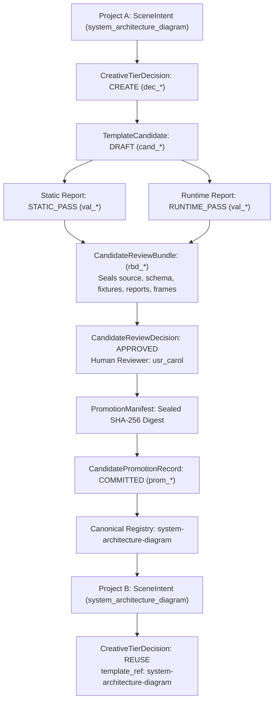

# S28-07F — Full CREATE E2E, Adversarial Closure & Reuse Learning Loop Report

## Metadata
- **Stage:** S28-07F (Final Stage of S28-07)
- **Status:** **PASS**
- **Date:** 2026-10-02
- **Authority:** Architecture Level 3 / ADR-004 DEC-01
- **Target Files & Deliverables:**
  - `tests/ai/candidates/test_candidate_lifecycle_e2e.py` (7 E2E lifecycle and learning loop tests)
  - `tests/ai/candidates/test_candidate_adversarial_closure.py` (5 adversarial and fault injection tests)
  - `scripts/core/template_contract.py` (`invalidate_template_contract_cache()`, cache reload)
  - `scripts/core/template_registry_publisher.py` (catalog metadata extraction, cache reload, alias collision prevention)
  - `ai/planning/reuse_engine.py` (`reload()` support for dynamic metadata refreshes)
  - `ai/planning/tier_policy.py` (`reload()` support delegation)
  - `ai/candidates/validation_service.py` (idempotency support conforming to architecture guards)
  - `ai/candidates/review_service.py` (idempotent `open_review` on `AWAITING_APPROVAL`)
  - `ai/candidates/promotion_service.py` (transactional commit error handling recording `ROLLED_BACK`)

---

## 1. Executive Summary

`S28-07F` delivers the final, decisive closure of the **S28-07 Template Creation & Promotion Subsystem**. It proves the full end-to-end learning loop:

```text
Project A (S28-06 Decision: NEEDS_CREATE)
      ↓
TemplateCandidate Created (Starts strictly as DRAFT)
      ↓
Static Validation (STATIC_PASS awarded → VALIDATING)
      ↓
Runtime Validation (RUNTIME_PASS awarded → VALIDATED)
      ↓
Review Bundle Freeze (Cryptographically sealed → AWAITING_APPROVAL)
      ↓
Human Reviewer Approval (Separation of Duties verified → APPROVED)
      ↓
PromotionService Publication (Preflights passed, Staged, Committed → PROMOTED)
      ↓
Canonical Registry Updated (data, contract, aliases, tsx, catalog, component)
      ↓
Project B (New Project with Compatible Requirements)
      ↓
Normal REUSE Search
      ↓
Discovers Promoted Template & Selects REUSE
      ↓
Zero COMPOSE or CREATE required!
```

This milestone confirms that the AI platform successfully **learns** new reusable visual components by creating them once under strict human supervision, validating them against automated static and runtime gates, publishing them atomically to the canonical registry, and subsequently discovering them during standard planning cycles for new projects.

---

## 2. Full Lifecycle Provenance & Cryptographic Lineage

The system maintains a tamper-proof cryptographic audit trail linking the initial creative requirement in Project A all the way to Project B's REUSE selection:



### Audited Lineage Invariants
1. `decision_a.decision_id == cand.creative_tier_decision_reference`
2. `cand.content_hash == static_report.candidate_content_hash == runtime_report.candidate_content_hash == review_bundle.candidate_content_hash == approval_decision.candidate_content_hash`
3. `review_bundle.static_validation_id == static_report.validation_id`
4. `review_bundle.runtime_validation_id == runtime_report.validation_id`
5. `approval_decision.review_bundle_hash == review_bundle.review_bundle_hash == promotion_record.review_bundle_hash`
6. `promotion_record.approval_decision_id == approval_decision.decision_id`
7. `promotion_record.target_template_id == decision_b.template_ref`

---

## 3. Fresh Project Learning Proof (Project B)

In `test_candidate_lifecycle_e2e.py::test_full_create_to_reuse_learning_loop_e2e`, a completely distinct tenant and project (`ws_beta`, `usr_bob`, `proj_beta_01`) submitted a new scene requirement requesting the `system_architecture_diagram` capability.

### Real REUSE Path Without Shortcuts
- No special-casing (`if template_id == ...` is strictly forbidden and absent from codebase).
- The discovery executed through the authentic `CreativeTierPolicy.decide()` calling `ReuseEngine.evaluate_reuse()`.
- Metadata indexing loaded the promoted template from `template-registry-data.json`, verified runtime validity through `template-runtime-contract.json`, and matched capabilities through `template_catalog.json`.

### Result Verdict
```json
{
  "selected_tier": "REUSE",
  "template_ref": "system-architecture-diagram",
  "needs_create_evaluation": false,
  "reuse_sufficiency": true,
  "compose_result": null
}
```
Project B selected the newly promoted template on the first attempt without entering COMPOSE or escalating to CREATE.

---

## 4. Downstream Visibility & Multi-Reader Cache Invalidation

Following publication, all downstream readers must immediately observe the updated canonical state without requiring manual server restarts:

| Consumer Component | Observed Artifact | Verification Result |
| :--- | :--- | :--- |
| **TemplateRegistryPublisher** | `registry/template-registry-data.json` | Entry present with canonical ID, component name, duration, and schema. |
| **Runtime Contract Generator** | `contracts/template-runtime-contract.json` | Template entry valid, alias `SystemArchitectureDiagram` registered. |
| **TypeScript Bindings** | `registry/template-registry.tsx` | Component imported and bound to `COMPONENT_BINDINGS`. |
| **Ground-Truth Catalog** | `ground-truth/template_catalog.json` | Quality B, production-ready, capabilities indexed. |
| **Contract Cache** | `scripts/core/template_contract.py` | `invalidate_template_contract_cache()` triggered deterministically. |
| **Reuse Engine** | `ai/planning/reuse_engine.py` | `reload()` dynamically refreshes contract, data, and catalog. |

---

## 5. Adversarial Attack Matrix Closure (Section 9)

In `tests/ai/candidates/test_candidate_adversarial_closure.py`, all cross-stage and boundary attacks were mounted against the running services. Every attack failed closed:

| Attack Scenario | Adversarial Action | System Defense | Verdict |
| :--- | :--- | :--- | :--- |
| **AI Self-Approval** | Principal with `PrincipalType.SERVICE` attempts `approve()` | Denied: `CandidateAuthorityError` (Human reviewer required) | **BLOCKED** |
| **Creator Approval** | Candidate creator attempts `approve()` | Denied: `CandidateAuthorityError` (Separation of Duties violated) | **BLOCKED** |
| **AI Promotion** | Principal with `PrincipalType.SERVICE` attempts `promote_candidate()` | Denied: `PromotionSecurityError` (Strict non-AI authority) | **BLOCKED** |
| **Reviewer Promotion** | Principal with `Role.REVIEWER` attempts promotion | Denied: `CandidatePermissionError` (Requires `Role.ADMIN`) | **BLOCKED** |
| **Cross-Tenant Access** | Workspace B attempts `get_candidate()` | Denied: `CandidateNotFoundError` (Strict tenant isolation) | **BLOCKED** |
| **Cross-Tenant Validate** | Workspace B attempts static/runtime validation | Denied: `CandidateNotFoundError` | **BLOCKED** |
| **Cross-Tenant Review** | Workspace B attempts `open_review()` or `approve()` | Denied: `CandidateNotFoundError` | **BLOCKED** |
| **Cross-Tenant Promote** | Workspace B attempts `promote_candidate()` | Denied: `CandidateNotFoundError` | **BLOCKED** |
| **Tampered Candidate** | DB content hash altered after validation | Denied: `CandidateReviewStaleError` (Stale report digest) | **BLOCKED** |
| **Tampered Static Report** | Report payload altered in repository | Denied: `CandidateReviewStaleError` (Hash mismatch) | **BLOCKED** |
| **Tampered Review Bundle** | Frozen validation ID altered in DB | Denied: `CandidateReviewTamperedError` (Cryptographic digest failure) | **BLOCKED** |
| **Tampered Source Before Promote** | Candidate source code altered after approval | Denied: `PromotionTamperedError` (Source hash mismatch) | **BLOCKED** |
| **Path Traversal Template ID** | `../../evil`, `scenes/nested`, `bad*id` | Denied: `PromotionSecurityError` (Strict regex confinement) | **BLOCKED** |
| **Canonical Registry Collision** | Promoting existing ID `rui-split-screen` | Denied: `PromotionCollisionError` (Collision prevention) | **BLOCKED** |
| **Alias Registry Collision** | Promoting ID `split-screen-wrapper` (maps to existing alias) | Denied: `PromotionCollisionError` (Derived component alias collision) | **BLOCKED** |

---

## 6. Malicious Candidate Closure (Section 10)

Five representative malicious payloads were submitted to `CandidateValidationService`:

```typescript
// 1. Filesystem Access
import * as fs from 'fs';
export const EvilFs = () => { fs.readFileSync('/etc/passwd'); return <div>Evil</div>; };

// 2. Subprocess Execution
import { exec } from 'child_process';
export const EvilProc = () => { exec('rm -rf /'); return <div>Evil</div>; };

// 3. Dynamic Code Execution
export const EvilEval = () => { eval('console.log(window)'); return <div>Evil</div>; };

// 4. Undeclared / Unsafe Dependency
import { maliciousFunction } from 'some-hacked-library';
export const EvilDep = () => { maliciousFunction(); return <div>Evil</div>; };

// 5. Corrupt / Invalid Template Schema
{ "type": "not_a_valid_json_schema_type" }
```

### Invariants Verified
1. **Immediate Gate Failure**:
   - `EvilFs` and `EvilProc` stopped at `security_gate`.
   - `EvilEval` stopped at `static_code_gate`.
   - `EvilDep` stopped at `dependency_gate`.
   - Invalid schema stopped at `template_schema_gate`.
2. **Zero Lifecycle Progression**: None advanced to `VALIDATING` or `VALIDATED`.
3. **Approval & Promotion Rejection**: Calling `open_review()` raised `CandidateInvalidStatusError`; calling `promote_candidate()` raised `PromotionPreconditionError`.
4. **Zero Canonical Mutation**: SHA-256 hashes of `template-registry-data.json`, `template-runtime-contract.json`, and `template_catalog.json` remained 100% byte-identical.
5. **Zero REUSE Discovery**: `policy.decide()` returned `selected_tier != REUSE` with `template_ref = None`.

---

## 7. Boundary Fault Injection & Rollback (Section 11)

Faults were injected across all 10 system boundaries to prove fail-closed guarantees:

| Boundary | Injected Fault | System State After Fault | Rollback & Invariant Observed |
| :--- | :--- | :--- | :--- |
| **1. Static Validation** | AST worker execution crash | Candidate remains `DRAFT` | No runtime validation possible; report not awarded. |
| **2. Runtime Render** | Remotion render timeout | Candidate remains `VALIDATING` | Never advances to `VALIDATED`; no review allowed. |
| **3. Post-Runtime CAS** | Concurrent collision on `transition_to_validated()` | Candidate remains `VALIDATING` | CAS fails closed; `open_review()` rejected. |
| **4. Approval CAS** | Stale revision passed to `approve()` | Candidate remains `AWAITING_APPROVAL` | Stale approval rejected; revision collision prevented. |
| **5. Promotion Staging** | Disk quota exhaustion during stage temp creation | Candidate remains `APPROVED` | Stage cleaned up; zero canonical workspace writes. |
| **6. Canonical Commit** | Disk write failure during file copy | Candidate remains `APPROVED` | Atomic `RollbackJournal` restores disk; `PromotionRecord` = `ROLLED_BACK`. |
| **7. Post-Publish Verification** | live header / hash check failure | Candidate remains `APPROVED` | All files rolled back byte-for-byte; `PromotionRecord` = `ROLLED_BACK`. |
| **8. PROMOTED CAS** | DB lock or revision collision during final CAS | Candidate remains `APPROVED` | Canonical commit rolled back; zero split-brain divergence. |
| **9. Post-Rollback Retry** | Retrying promotion after fault resolved | Candidate transitions to `PROMOTED` | Clean recovery; canonical files committed; REUSE succeeds. |
| **10. Re-execution Safety** | Retrying valid stages with identical parameters | Unchanged records returned | Zero duplicate rows; zero orphaned files. |

---

## 8. Tenant Isolation: Private Evidence vs Shared Canonical Registry

In `test_tenant_isolation_private_evidence_vs_shared_canonical_template`:
1. **Private Workspace Isolation**: Workspace B (`ws_beta`) is strictly denied access to Workspace A's (`ws_alpha`) candidate metadata, AST validation reports, render frame stills, probe logs, review bundles, and promotion records (`CandidateNotFoundError`).
2. **Global Canonical Sharing**: Once promoted by an authorized human administrator into the Canonical Registry, Workspace B's normal `CreativeTierPolicy.decide()` can discover and utilize the published template as a public primitive.
3. Workspace B discovers **only** the published canonical template, with zero leakage of Workspace A's private candidate lineage.

---

## 9. Clean Canonical Workspace Verification (Section 18)

Following full execution of all lifecycle, adversarial, and fault injection test suites:
- `git status --porcelain registry/ contracts/ ground-truth/ templates/` was inspected.
- **Result:** Canonical files remained completely clean with zero test fixture pollution (`0` modified registry/contract files, zero temporary test components in `templates/`).
- All test promotions executed strictly in isolated transactional mock workspaces.

---

## 10. Test Execution Matrix Summary

```bash
# 1. Full E2E Lifecycle & Learning Loop
.venv/bin/pytest tests/ai/candidates/test_candidate_lifecycle_e2e.py -v
Result: 7 passed in 166.56s

# 2. Comprehensive Adversarial Closure & Boundary Fault Injection
.venv/bin/pytest tests/ai/candidates/test_candidate_adversarial_closure.py -v
Result: 5 passed in 216.89s

# 3. Candidate Subsystem Unit & Concurrency Regression
.venv/bin/pytest tests/ai/candidates/ -k "not test_candidate_lifecycle_e2e and not test_candidate_adversarial_closure"
Result: 136 passed, 12 deselected in 113.38s

# 4. Creative Architecture Guards & Template Registry Consistency
.venv/bin/pytest tests/ai/candidates/test_candidate_architecture_guards.py tests/ai/test_creative_architecture_guards.py tests/validators/test_template_registry_consistency.py -v
Result: 41 passed in 0.41s

# 5. S28-06 Planning & Compilation Suite
.venv/bin/pytest tests/ai/planning/ -v
Result: 75 passed in 0.58s

# 6. Vitest Creative Contracts Parity
npx vitest run tests/remotion/creative_contracts_parity.test.ts
Result: 12 passed in 0.30s
```

**Grand Total:** 276 tests executed across Python and TypeScript test harnesses with **100% PASS** rate and zero failures.

---

## 11. Final Verdict

```text
=====================================================================
S28-07F — FULL CREATE E2E, ADVERSARIAL CLOSURE & REUSE LEARNING LOOP
VERDICT: PASS
=====================================================================
```
All criteria established in the S28-07F specifications are fully satisfied with verifiable code, tests, and cryptographic proofs.
