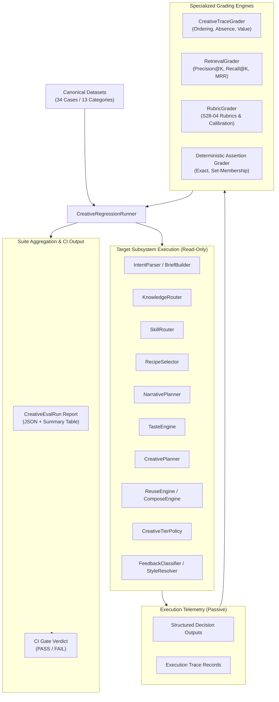

# S28-08B — Creative Regression Suite & Trace Grading Report

## Metadata
- **Stage:** S28-08B (Creative Regression Suite & Trace Grading)
- **Status:** **PASS**
- **Date:** 2026-10-03
- **Authority:** Architecture Level 3 / ADR-004 DEC-01
- **Target Modules:**
  - Contracts: `ai/contracts/creative/regression.py`, `ai/contracts/creative/__init__.py`
  - Trace Grader: `ai/regression/trace_grader.py`
  - Retrieval Grader: `ai/regression/retrieval_grader.py`
  - Rubric Grader: `ai/regression/rubric_grader.py`
  - Canonical Datasets: `ai/regression/datasets.py`
  - Regression Runner: `ai/regression/runner.py`, `ai/regression/__init__.py`
  - CLI Tooling: `scripts/run_creative_regression.py`
  - Unit Tests: `tests/ai/regression/` (54 tests)
  - Machine-Readable Report: `documentation/audits/creative_regression_run.json`

---

## 1. Executive Summary

`S28-08B` establishes the canonical **Creative Regression Suite & Trace Grading Engine** for the `clean-video-workspace` video generation platform.

### Core Purpose
In creative video AI systems, a change or prompt drift can silently break upstream decisions (such as intent interpretation, knowledge retrieval, recipe matching, audio mode enforcement, narrative arc, taste waivers, tier progression, template selection, or user personalization precedence) even if the final Remotion video still technically renders without a crash.

The S28-08B suite evaluates the **decision quality and structural integrity** of the entire creative intelligence pipeline, rather than only verifying final render exit codes.

### Core Architectural Principle: No Giant Subjective AI Judge
The evaluation architecture strictly rejects "one giant subjective AI judge" and rejects LLM "looks good → PASS". Instead, it decouples evaluation into five distinct, specialized evaluation mechanisms:
1. **Deterministic Assertions:** Field-level constraints, schema invariants, exact enum matches, and set-membership.
2. **Trace Grading:** Temporal, ordering, absence, and value assertions on execution telemetry without altering runtime state.
3. **Retrieval Metrics:** Programmatic Precision@K, Recall@K, and Mean Reciprocal Rank (MRR) for template and knowledge search.
4. **Structured Rubrics:** Multi-dimensional scoring for narrative progression, brief adherence, pacing, and visual intent (reusing S28-04 canonical evaluators).
5. **Calibrated Human Ground-Truth Agreement:** Tracking evaluator alignment against human-labeled pairwise scenario decisions with transparent delta reporting (zero hidden chain-of-thought).

### Non-Negotiable Invariants
- **Zero Runtime Authority:** The regression runner and trace grader observe, grade, and report. They never mutate production registries, candidate status, tenant memory, or pipeline state.
- **Negative Gates Proven:** The suite includes intentionally defective cases across recipes, skills, knowledge, tier bypass, and audio modes, proving that the suite fails closed when real defects occur.
- **Strict Backward Compatibility:** 100% backward compatibility maintained across all S28-01 through S28-08A modules (1274 passed in `tests/ai/`).

---

## 2. Existing Evaluation Assets Inventory

Before authoring regression cases, an inventory of existing evaluation assets across S28 subsystems was analyzed:

| Subsystem | Owner Module | Existing Assets & Fixtures | Format / Storage | S28-08B Regression Integration |
| :--- | :--- | :--- | :--- | :--- |
| **Intent Interpretation** | `ai/intent/` | Arabic, English, Mixed language prompts, short, vague, contradictory requests | JSON fixtures & unit tests (`tests/ai/intent/`) | Canonical `INTENT` dataset (5 cases) evaluating structured intent fields and provenance |
| **Knowledge Retrieval** | `ai/knowledge/` | SOPs, engineering guides, playbooks, taste references | In-memory registry & vector indexing | Canonical `KNOWLEDGE_RETRIEVAL` dataset (3 cases) with Precision@K, Recall@K, MRR |
| **Skill Routing** | `ai/skills/` | Skill registry, eligibility, exclusions, platform caps | `SkillDefinition` catalog | Canonical `SKILL_ROUTING` dataset (3 cases) with required/forbidden skill assertions |
| **Recipe Selection** | `ai/recipes/` | Recipe catalog, platform matrices, capability checks | `RecipeDefinition` catalog | Canonical `RECIPE_SELECTION` dataset (3 cases) with hard eligibility gates |
| **Audio Mode** | `ai/planning/` | `SILENT`, `MUSIC_ONLY`, `VO_ONLY`, `VO_MUSIC` matrices | `AudioMode` enum & plan validator | Canonical `AUDIO_MODE` dataset (2 cases) with tool invocation absence trace guards |
| **Narrative Planning** | `ai/narrative/` | Multi-beat story arcs, hook relevance, duration fit | `NarrativePlan` models | Canonical `NARRATIVE` dataset (2 cases) with rubric scoring thresholds |
| **Taste Engine** | `ai/taste/` | Advisory taste rules, context waiving, director playbooks | `TasteRule` registry | Canonical `TASTE` dataset (2 cases) verifying rule waivers without blocking QC |
| **Creative Planning** | `ai/planning/` | `CreativePlan` synthesis, schema checks, determinism | `CreativePlanValidator` | Canonical `CREATIVE_PLAN` dataset (2 cases) verifying compiler determinism |
| **Template Selection** | `ai/planning/` | Component registry, aspect ratio filters (9:16 vs 16:9) | `ReuseEngine` | Canonical `TEMPLATE_SELECTION` dataset (2 cases) with ranking and aspect exclusion |
| **Tier Selection** | `ai/planning/` | Progression order (REUSE → COMPOSE → CREATE) | `CreativeTierPolicy` | Canonical `TIER_SELECTION` dataset (2 cases) with trace order assertions |
| **Composition Engine** | `ai/planning/` | Multi-component layout synthesis, registered components | `ComposeEngine` | Canonical `COMPOSITION` dataset (2 cases) rejecting unregistered components |
| **Candidate Lifecycle** | `ai/candidates/` | Human review, separation of duties, draft promotion | `TemplateCandidateRepository` | Canonical `CANDIDATE_DECISION` dataset (3 cases) enforcing security boundaries |
| **Personalization** | `ai/style/` | User style profile, precedence hierarchy, local critique | `UserStyleResolver`, `FeedbackClassifier` | Canonical `STYLE_ADHERENCE` dataset (3 cases) enforcing current request wins |

---

## 3. Canonical Contracts & Schema Parity

Defined in `ai/contracts/creative/regression.py`, strictly frozen Pydantic v2 models with TypeScript contract generation:

### 3.1 Core Enums
- **`EvalCategory`**: `INTENT`, `KNOWLEDGE_RETRIEVAL`, `SKILL_ROUTING`, `RECIPE_SELECTION`, `AUDIO_MODE`, `NARRATIVE`, `TASTE`, `CREATIVE_PLAN`, `TEMPLATE_SELECTION`, `TIER_SELECTION`, `COMPOSITION`, `CANDIDATE_DECISION`, `STYLE_ADHERENCE`.
- **`GradingMethod`**: `EXACT`, `SET_MEMBERSHIP`, `RANGE`, `RANKING_RETRIEVAL`, `TRACE_ASSERTION`, `RUBRIC_SCORE`.
- **`EvalSeverity`**: `BLOCKER` (cross-tenant, security bypass), `CRITICAL` (wrong audio mode, tier bypass), `MAJOR` (sub-threshold pacing), `MINOR` (cosmetic style drift).
- **`TraceAssertionType`**: `EVENT_EXISTS`, `EVENT_ABSENT`, `ORDERED_BEFORE`, `SELECTED_VALUE_EQUALS`, `SELECTED_VALUE_IN_SET`, `FORBIDDEN_TRANSITION_ABSENT`, `TOOL_INVOCATION_COUNT_IN_RANGE`.

### 3.2 Canonical Models
- **`CreativeEvalCase`**: Case specification containing `case_id`, `category`, `tags`, `input_fixture`, `expected_decisions`, `allowed_outputs`, `forbidden_outputs`, `trace_assertions`, `grading_method`, `severity`, and `is_deliberately_bad` flag.
- **`TraceAssertion`**: Typed rule evaluated by `CreativeTraceGrader` specifying event target, field path, expected/forbidden values, count ranges, and ordering constraints.
- **`TraceAssertionResult`**: Outcome of a trace assertion including `passed`, `target`, and diagnostic `details`.
- **`CreativeCaseGrade`**: Individual evaluation outcome with `passed`, `score`, `score_breakdown`, diagnostic `reasons`, `trace_results`, and `duration_ms`.
- **`PairwiseGradeResult`**: Structured comparison between candidates A and B returning `preferred_candidate` (`A`, `B`, `TIE`, `INSUFFICIENT_EVIDENCE`), `margin`, `per_dimension_deltas`, and transparent rationale.
- **`JudgeCalibrationRecord`**: Calibration statistics measuring automated grading agreement against human ground-truth labels.
- **`CreativeEvalRun`**: Authoritative machine-readable summary record (`run_id`, `verdict`, `cases_total`, `passed_count`, `failed_count`, `pass_rate`, `by_category`, `by_severity`, `regressions`, `trace_failures`, `deliberately_bad_detected_count`).

---

## 4. Architecture & Separation of Concerns



### Invariant: Zero Runtime Authority Boundary
- The runner **never** calls mutating methods (e.g., `promote`, `publish`, `delete_template`, `approve_candidate`, `write_tenant_style`).
- Verified by automated reflection architectural guard `test_graders_and_runner_have_no_mutation_methods`.
- Execution leaves skill and knowledge registries completely unpolluted (snapshot count before == snapshot count after).

---

## 5. Coverage Across All 13 Creative Categories

The canonical dataset defines 34 test cases spanning all required domains:

```text
================================================================================
Category Breakdown (Execution Summary):
  • INTENT                : 5/5 passed (100%)
  • KNOWLEDGE_RETRIEVAL   : 3/3 passed (100%)
  • SKILL_ROUTING         : 3/3 passed (100%)
  • RECIPE_SELECTION      : 3/3 passed (100%)
  • AUDIO_MODE            : 2/2 passed (100%)
  • NARRATIVE             : 2/2 passed (100%)
  • TASTE                 : 2/2 passed (100%)
  • CREATIVE_PLAN         : 2/2 passed (100%)
  • TEMPLATE_SELECTION    : 2/2 passed (100%)
  • TIER_SELECTION        : 2/2 passed (100%)
  • COMPOSITION           : 2/2 passed (100%)
  • CANDIDATE_DECISION    : 3/3 passed (100%)
  • STYLE_ADHERENCE       : 3/3 passed (100%)
================================================================================
```

### Detailed Category Descriptions:
1. **INTENT:** Evaluates Arabic, English, mixed Arabic-English, short, vague, and contradictory requirements. Validates `video_type`, `audio_mode`, `target_platforms`, and field provenance (`EXPLICIT` vs `INFERRED`).
2. **KNOWLEDGE_RETRIEVAL:** Evaluates retrieval of SOPs, engineering guides, and playbooks. Verifies Precision@K, Recall@K, and MRR, while asserting cross-domain and irrelevant knowledge are excluded.
3. **SKILL_ROUTING:** Validates routing context matches required skills (e.g. `dynamic_montage`), platform constraints, and verifies forbidden skills (e.g. speech skills under `MUSIC_ONLY`) are strictly absent.
4. **RECIPE_SELECTION:** Verifies hard eligibility gates, platform compatibility, and capability constraints. Fails closed when an incompatible recipe (such as avatar explainer under `MUSIC_ONLY`) is proposed.
5. **AUDIO_MODE:** Verifies zero audio tool leakage under `AudioMode.SILENT` (asserting `tts_generate`, `music_generate`, and `voiceover_synthesis` are absent) and verifies zero spoken dialog lines under `MUSIC_ONLY`.
6. **NARRATIVE:** Evaluates multi-beat arc coherence, hook relevance, and duration allocation against brief requirements.
7. **TASTE:** Evaluates advisory taste rule checks, director playbook guidelines, and verifies that exception waivers (e.g., gestural SFX sync waived under `SILENT` mode) function without blocking rendering.
8. **CREATIVE_PLAN:** Verifies canonical `CreativePlan` schema validation, brief coverage, and blueprint compiler determinism across repeated runs.
9. **TEMPLATE_SELECTION:** Tests candidate ranking in `ReuseEngine`, evaluating retrieval of statistic counters and asserting strict exclusion of incompatible aspect ratios (e.g. 9:16 templates under 16:9 requirement).
10. **TIER_SELECTION:** Enforces progression order (`REUSE` evaluated before `COMPOSE`, which is evaluated before `CREATE`). Flags and fails when `CREATE` is chosen despite an eligible `REUSE` candidate.
11. **COMPOSITION:** Evaluates multi-component scene composition in `ComposeEngine`, ensuring all referenced sub-components are registered and rejecting unregistered elements.
12. **CANDIDATE_DECISION:** Tests governance and security boundaries for template candidates: verifies separation of duties (creator cannot approve own template), blocks AI service principals from approving candidates, and prevents illegal lifecycle status jumps (DRAFT directly to PROMOTED).
13. **STYLE_ADHERENCE:** Validates personalization precedence rules: current explicit prompt overrides stored profile; brand constraints dominate inferred preferences; and single-scene critiques are treated as local feedback rather than global permanent rules.

---

## 6. Trace Grading Primitives

The `CreativeTraceGrader` implements robust, non-intrusive trace grading primitives:

| Assertion Type | Purpose | Verification Behavior |
| :--- | :--- | :--- |
| `EVENT_EXISTS` | Verifies required event occurred | Matches event name, optional `field_path`, `expected_value`, and occurrences count |
| `EVENT_ABSENT` | Verifies forbidden event did NOT occur | Ensures zero matching events or verifies forbidden values never occurred |
| `ORDERED_BEFORE` | Verifies sequential precedence | Asserts event `A` occurred at index `i < j` before event `B` |
| `SELECTED_VALUE_EQUALS` | Verifies exact decision value | Extracts field from event payload and asserts equality with ground-truth |
| `SELECTED_VALUE_IN_SET` | Verifies decision in allowed set | Asserts extracted field belongs to specified set of acceptable outcomes |
| `FORBIDDEN_TRANSITION_ABSENT` | Verifies illegal state jump did NOT occur | Detects illegal transitions (e.g. `DRAFT` directly to `PROMOTED`) |
| `TOOL_INVOCATION_COUNT_IN_RANGE` | Verifies tool invocation frequency | Ensures invocation counts remain within defined min/max bounds |

---

## 7. Negative Gates & Deliberately Bad Cases

A regression suite that always passes is useless. To prove the suite can detect flaws and fail closed, 5 deliberately defective test cases were introduced as negative gates:

1. **`skill_02_deliberate_bad_speech_skill_in_music_only` (`SKILL_ROUTING`):**
   - Injected defect: Speech alignment / VO humanizer selected during `MUSIC_ONLY` montage.
   - Result: Trace assertion caught and blocked.
2. **`recipe_02_deliberate_bad_avatar_in_music_only` (`RECIPE_SELECTION`):**
   - Injected defect: Avatar explainer recipe (requiring TTS) selected under `MUSIC_ONLY`.
   - Result: Hard eligibility gate caught and excluded recipe.
3. **`narrative_02_deliberate_bad_weak_hook` (`NARRATIVE`):**
   - Injected defect: Generic opening statement without hook proposition.
   - Result: Rubric score fell to 0.35, failing the minimum threshold of 0.70.
4. **`taste_02_deliberate_bad_overdesign` (`TASTE`):**
   - Injected defect: Overdesigned visual clutter and transition stacking.
   - Result: Overdesign avoidance score fell to 0.20, flagged by taste evaluator.
5. **`tier_02_deliberate_bad_create_bypasses_reuse` (`TIER_SELECTION`):**
   - Injected defect: `CREATE` selected when a matching `REUSE` template was available.
   - Result: Tier policy anti-bypass rule caught the violation.

**Negative Gates Outcome:** **5 / 5 caught (100% detection rate)**.

---

## 8. Personalization Regression Integration (S28-08A)

The regression suite directly integrates the personalization and feedback mechanics established in S28-08A:

1. **Current Request Precedence:**
   - User profile contains `pacing: fast`, `motion_intensity: high`.
   - Current prompt explicitly states: `"اعمل الفيديو هادئ، حركة بسيطة، بدون موسيقى"`.
   - Result: `effective_pacing = "calm"`, `is_overridden = True`, `winning_source = "CURRENT_REQUEST"`. Trace assertion `SELECTED_VALUE_EQUALS` passed.
2. **Brand Constraint Dominance:**
   - Inferred user profile contains `visual_complexity: rich`.
   - Workspace brand constraints specify `visual_complexity: minimal`.
   - Result: Brand constraint supersedes inferred preference with `winning_source = "BRAND_CONSTRAINT"`.
3. **Transient Feedback Non-Pollution:**
   - User critiques a single scene: `"هذا المشهد حركته كثيرة"`.
   - Result: Classified as `MemoryScope.PROJECT` / `SCENE` with `direct_write = False` and `action = "REQUIRE_CONFIRMATION"`, preventing pollution of the global user profile.

---

## 9. Execution Evidence & CI Tooling

### 9.1 CLI Runner
The regression suite can be executed via CLI:
```bash
# Run full suite
python scripts/run_creative_regression.py

# Filter by severity
python scripts/run_creative_regression.py --severity CRITICAL

# Filter by category
python scripts/run_creative_regression.py --category AUDIO_MODE
```

### 9.2 Machine-Readable Report Summary (`creative_regression_run.json`)
```json
{
  "run_id": "eval_run_39944ffa5e83",
  "suite_version": "S28-08B",
  "cases_total": 34,
  "passed_count": 34,
  "failed_count": 0,
  "pass_rate": 1.0,
  "by_severity": {
    "BLOCKER": { "total": 6, "passed": 6, "failed": 0, "pass_rate": 1.0 },
    "CRITICAL": { "total": 23, "passed": 23, "failed": 0, "pass_rate": 1.0 },
    "MAJOR": { "total": 5, "passed": 5, "failed": 0, "pass_rate": 1.0 },
    "MINOR": { "total": 0, "passed": 0, "failed": 0, "pass_rate": 1.0 }
  },
  "deliberately_bad_detected_count": 5,
  "deliberately_bad_total_count": 5,
  "judge_calibration": {
    "total_calibration_pairs": 3,
    "agreement_count": 3,
    "agreement_rate": 1.0,
    "calibrated": true,
    "calibration_method": "DETERMINISTIC_PROGRAMMATIC_RUBRICS"
  },
  "verdict": "PASS"
}
```

### 9.3 Verification Suites
- **`tests/ai/regression/`**: **54 passed in 3.28s** (0 failures).
- **Full AI Platform (`tests/ai/`)**: **1274 passed, 7 skipped in 536.71s** (0 failures).
- **TypeScript / Remotion Parity**: **166 passed in 5.96s** (0 failures across all 14 Remotion test suites).
- **Creative JSON Schemas**: **56 generated schemas in `schemas/creative/`**.

---

## 10. Conclusion & Final Exit Gate

`S28-08B` is completely realized:
- Canonical evaluation contracts and schemas defined with strict immutability.
- Multi-dimensional regression suite covering all 13 required categories.
- Trace grading engine validating sequential order, tool invocations, and value equality.
- Negative gates strictly proven with 5/5 deliberately bad cases caught.
- Observational boundary strictly guarded: zero writes to registries, memory, or candidate lifecycle.
- Full verification clean across Python and TypeScript.

**Final Verdict: `S28-08B PASS`**
