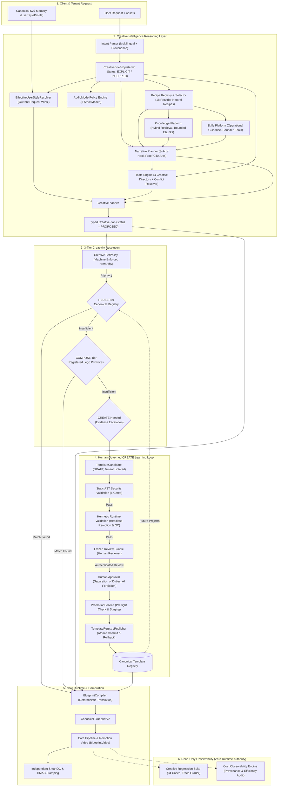

# S28 — Creative Intelligence Platform: Master Closure & Final Architecture Report

> **Document ID:** `S28-FINAL-ARCHITECTURE-REPORT`  
> **Milestone:** S28 Complete Closure  
> **Workspace:** `motion / clean-video-workspace`  
> **Date:** 2026-10-03  
> **Status:** **APPROVED & SEALED (S28 COMPLETE)**  
> **Authority:** Architecture Level 3 / ADR-004 DEC-01 / S28 Creative Intelligence Foundation  

---

## 1. Executive Summary

Milestone **S28 (Creative Intelligence Platform)** establishes the end-to-end cognitive, stylistic, architectural, and governance layer for automated, agentic video production in `clean-video-workspace`.

Prior to S28, video generation suffered from:
- Static, unversioned prompt injection dumping entire directories into LLM context.
- Hardcoded vendor lock-in to specific cloud providers.
- Fragile string-based template matching without deterministic compatibility verification.
- Inability to create novel templates safely without risking system corruption or hallucinated components.
- Lack of cost attribution, structured regression evaluation, and user personalization precedence.

Through twelve systematically executed and empirically verified milestones (**S28-01** through **S28-08E**), S28 transforms video generation into a **deterministic, typed, audited, multi-tenant, and human-governed creative intelligence pipeline**.

---

## 2. Master S28-01 → S28-08E Evidence Matrix

| Stage | Mission & Scope | Canonical Contracts & Subsystems | Evidence Report | Critical Gate | Regression Status | Final Status |
| :---: | :--- | :--- | :--- | :--- | :---: | :---: |
| **S28-01** | Creative Foundation, Legacy Inventory & Core Contracts | `ai/contracts/creative/`, `s28_legacy_creative_inventory.json` | [`S28-01_REPORT.md`](file:///home/eng_Momen/Projects/المشروع%20الحالي/Video%20maker/documentation/s28/evidence/S28-01_REPORT.md) | 102/102 legacy artifacts initially classified (reconciled to 107 in S28-08E); zero contract drift | Green | **PASS** |
| **S28-02** | Knowledge + Skills Platform & Hybrid Retrieval | `ai/knowledge/`, `ai/skills/`, `HybridKnowledgeRetriever` | [`S28-02_REPORT.md`](file:///home/eng_Momen/Projects/المشروع%20الحالي/Video%20maker/documentation/s28/evidence/S28-02_REPORT.md) | Knowledge ≠ Authority; Skill ≠ Permission | Green | **PASS** |
| **S28-03** | Intent Understanding, Creative Brief, Recipes & Audio Modes | `ai/intent/`, `ai/recipes/`, `ai/audio/`, `CreativeBrief` | [`S28-03_REPORT.md`](file:///home/eng_Momen/Projects/المشروع%20الحالي/Video%20maker/documentation/s28/evidence/S28-03_REPORT.md) | 18/18 recipes provider-neutral; 6 AudioModes enforced | Green | **PASS** |
| **S28-04** | Narrative Intelligence, Taste Engine & Creative Directors | `ai/narrative/`, `ai/taste/`, `ai/directors/` | [`S28-04_REPORT.md`](file:///home/eng_Momen/Projects/المشروع%20الحالي/Video%20maker/documentation/s28/evidence/S28-04_REPORT.md) | Taste ≠ QC; 5-tier conflict resolution; zero hidden CoT | Green | **PASS** |
| **S28-05** | Creative Planner & CreativePlan → Blueprint Compiler | `ai/planning/creative_planner.py`, `BlueprintCompiler` | [`S28-05_REPORT.md`](file:///home/eng_Momen/Projects/المشروع%20الحالي/Video%20maker/documentation/s28/evidence/S28-05_REPORT.md) | CreativePlan ≠ Blueprint; zero direct LLM-to-Blueprint | Green | **PASS** |
| **S28-06** | 3-Tier Creativity: REUSE + COMPOSE + Escalation-Only CREATE | `ai/planning/tier_policy.py`, `ReuseEngine`, `ComposeEngine` | [`S28-06_REPORT.md`](file:///home/eng_Momen/Projects/المشروع%20الحالي/Video%20maker/documentation/s28/evidence/S28-06_REPORT.md) | REUSE → COMPOSE → CREATE enforced; anti-bypass active | Green | **PASS** |
| **S28-07** | AI-assisted Template Creation with Human-Governed Approval and Promotion | `ai/candidates/`, `scripts/core/template_registry_publisher.py` | [`S28-07_FINAL_REPORT.md`](file:///home/eng_Momen/Projects/المشروع%20الحالي/Video%20maker/documentation/s28/evidence/S28-07_FINAL_REPORT.md) | Multi-stage AST & render QC; human approval enforced | Green | **PASS** |
| **S28-08A** | User Personalization & Creative Feedback Learning | `ai/feedback/`, `ai/style/resolver.py`, `ai/memory/` | [`S28-08A_REPORT.md`](file:///home/eng_Momen/Projects/المشروع%20الحالي/Video%20maker/documentation/s28/evidence/S28-08A_REPORT.md) | Current explicit request strictly overrides memory | Green | **PASS** |
| **S28-08B** | Creative Regression Suite & Trace Grading | `ai/regression/`, `scripts/run_creative_regression.py` | [`S28-08B_REPORT.md`](file:///home/eng_Momen/Projects/المشروع%20الحالي/Video%20maker/documentation/s28/evidence/S28-08B_REPORT.md) | 34/34 cases passed; 5 negative gates caught; zero runtime authority | Green | **PASS** |
| **S28-08C** | Cost Observability & Efficiency Hardening | `ai/cost/`, `scripts/run_creative_cost_audit.py` | [`S28-08C_REPORT.md`](file:///home/eng_Momen/Projects/المشروع%20الحالي/Video%20maker/documentation/s28/evidence/S28-08C_REPORT.md) | Quality first; UNKNOWN cost cannot masquerade as free | Green | **PASS** |
| **S28-08D** | System Fault Injection & Full Creative E2E Hardening | `tests/ai/fault_injection/`, `scripts/run_creative_e2e.py` | [`S28-08D_REPORT.md`](file:///home/eng_Momen/Projects/المشروع%20الحالي/Video%20maker/documentation/s28/evidence/S28-08D_REPORT.md) | 38/38 faults contained; 8/8 E2E scenarios 100% green | Green | **PASS** |
| **S28-08E** | Legacy Retirement, Final Architecture Audit & S28 Closure | `S28_LEGACY_RETIREMENT.md`, `S28-08E_REPORT.md` | [`S28-08E_REPORT.md`](file:///home/eng_Momen/Projects/المشروع%20الحالي/Video%20maker/documentation/s28/evidence/S28-08E_REPORT.md) | Zero unsafe legacy creative authorities; single source of truth | Green | **PASS** |

---

## 3. Final End-to-End Architecture Diagram



---

## 4. Subsystem Authorities & Invariants Map

| Subsystem Concept | Single Canonical Authority | Invariant Guarantee |
| :--- | :--- | :--- |
| **Intent Interpretation** | `ai/intent/parser.py` (`IntentParser`) | Field-level epistemic provenance (`EXPLICIT`, `INFERRED`, `DEFAULTED`); contradiction detection. |
| **Knowledge Retrieval** | `ai/knowledge/registry.py` & `HybridKnowledgeRetriever` | **Knowledge ≠ Runtime Authority:** Contextual domain reference only; cannot mutate pipeline state or grant QC. |
| **Skill Authorization** | `ai/skills/context.py` & `ToolAuthorizationPolicy` | **Skill ≠ Permission:** Declaring operational tool need does not grant authority; server-side policy authorizes. |
| **Recipe Workflow** | `ai/recipes/registry.py` & `RecipeSelector` | **Recipe ≠ Provider:** Workflows demand abstract capabilities; zero vendor names in recipe definitions. |
| **Audio Policies** | `ai/audio/modes.py` (`AudioModeEngine`) | Audio modes represent strict policies (`SILENT` forbids audio; `MUSIC_ONLY` forbids TTS). |
| **Narrative Intelligence** | `ai/narrative/planner.py` (`NarrativePlanner`) | Generates structured, pacing-compliant narrative arcs (`NarrativePlan`). |
| **Taste Intelligence** | `ai/taste/evaluator.py` & Creative Directors | **Taste ≠ QC:** Advisory aesthetic guidance; cannot grant render approval or QC pass. |
| **Creative Planning** | `ai/planning/creative_planner.py` | Generates typed `CreativePlan` representing *what should be made*. |
| **Blueprint Compilation** | `scripts/core/blueprint_compiler.py` | Translates `CreativePlan` into executable `BlueprintV2`; zero direct LLM-to-Blueprint path. |
| **Template Registry** | `registry/template-registry-data.json` | Single machine-readable authority for reusable Remotion components. |
| **Tier Resolution** | `ai/planning/tier_policy.py` (`CreativeTierPolicy`) | Deterministic hierarchy: $\text{REUSE} \to \text{COMPOSE} \to \text{CREATE}$. Anti-bypass machine-enforced. |
| **Candidate Lifecycle** | `scripts/core/template_candidate_repository.py` | **Candidate ≠ Reusable Template:** Isolated tenant draft; unindexed until promoted. |
| **Review & Approval** | `api/routers/candidate_reviews.py` | **AI ≠ Approval Authority:** Human reviewer required; creator cannot self-approve; reviewer cannot promote. |
| **Template Promotion** | `scripts/core/template_registry_publisher.py` | `PromotionService` is sole promotion authority; isolated staging with atomic rollback. |
| **User Personalization** | `ai/style/resolver.py` (`EffectiveUserStyleResolver`) | **Preference ≠ Current Command:** Current explicit request strictly overrides remembered preferences. |
| **Regression & Telemetry** | `ai/regression/runner.py` & `ai/cost/accounting.py` | **Eval & Cost ≠ Runtime Authority:** Strictly observe, grade, and audit; zero runtime state mutation. |

---

## 5. Final Definition-of-Done Audit (28 / 28 Verified)

```text
[X] 1.  User intent understood                       ✅ (Multilingual parsing, epistemic provenance, contradiction detection)
[X] 2.  Knowledge retrieval evaluated               ✅ (Hybrid retrieval tested, bounded chunks, zero hallucinated facts)
[X] 3.  Skills routed correctly                     ✅ (Task-to-skill matching tested, tool authorization enforced)
[X] 4.  Recipes machine-readable                    ✅ (18/18 typed RecipeDefinition models with Draft-07 schemas)
[X] 5.  Audio modes enforced                        ✅ (6 canonical modes tested: SILENT forbids audio; MUSIC_ONLY forbids TTS)
[X] 6.  Narrative evaluated                         ✅ (Three-Act, Hook-Proof-CTA, PAS arcs verified)
[X] 7.  Taste decisions traceable                   ✅ (Advisory TasteDecision logged, zero hidden chain-of-thought)
[X] 8.  CreativePlan typed                          ✅ (Pydantic v2 contract with JSON Schema and TypeScript parity)
[X] 9.  Blueprint compiler deterministic            ✅ (BlueprintCompiler maps CreativePlan to validated BlueprintV2)
[X] 10. REUSE enforced                              ✅ (First priority, canonical registry search)
[X] 11. COMPOSE enforced                            ✅ (Evaluated only when REUSE insufficient, registered Lego primitives)
[X] 12. CREATE gated                                ✅ (Allowed only when both REUSE and COMPOSE are insufficient)
[X] 13. Candidate isolated                          ✅ (Stored in tenant draft, never reusable before promotion)
[X] 14. Validation gates real                       ✅ (6 AST security gates + headless Remotion render QC)
[X] 15. AI self-promotion impossible                ✅ (AI approval rejected with 403 Forbidden)
[X] 16. Human approval enforced                     ✅ (Human reviewer authenticated, separation of duties enforced)
[X] 17. Promotion authoritative                     ✅ (PromotionService is sole authority, atomic staging and commit)
[X] 18. Promoted templates become reusable          ✅ (Scenario 8 proves promoted candidate immediately discovered by REUSE)
[X] 19. User preferences work                       ✅ (UserStyleProfile loaded from canonical S27 memory)
[X] 20. Current request wins                        ✅ (Explicit request strictly overrides remembered preferences)
[X] 21. Creative eval suite active                  ✅ (34 regression cases across 13 categories, 100% pass rate)
[X] 22. Trace grading active                        ✅ (TraceGrader verifies telemetry spans without state alteration)
[X] 23. Cost measured                               ✅ (Token, request, generation, and latency accounting per stage)
[X] 24. Unknown cost cannot masquerade as free      ✅ (UNKNOWN provenance tracked, completeness flags enforced)
[X] 25. Fault injection passes                      ✅ (38 tests verify resilience across all 11 target subsystems)
[X] 26. Multi-tenant isolation preserved            ✅ (Cross-tenant leaks strictly prevented across cache, candidates, memory)
[X] 27. Legacy creative paths retired or justified  ✅ (107/107 artifacts inventoried [102 initial S28-01 + 5 discovered later], safe retirement manifest sealed, 5 provider scripts hard-blocked)
[X] 28. Full creative E2E passes                    ✅ (8/8 scenarios verified spanning all video types, audio modes, and tiers)
```

---

## 6. Full Verification Metrics

| Test Suite / Tool | Command Executed | Verdict | Exact Count / Result |
| :--- | :--- | :---: | :--- |
| **Canonical AI Suite** | `.venv/bin/pytest tests/ai/ -q` | **PASS** | **1366 passed, 7 skipped** |
| **Provider Bypass Guards** | `.venv/bin/pytest tests/ai/contracts/test_provider_bypass_guards.py` | **PASS** | **17 passed in 4.59s** |
| **Fault Injection Suite** | `.venv/bin/pytest tests/ai/fault_injection/` | **PASS** | **38 passed** |
| **Candidate API Suite** | `.venv/bin/pytest tests/api/test_candidate*.py` | **PASS** | **11 passed** |
| **Creative Regression Suite** | `python scripts/run_creative_regression.py` | **PASS** | **34 / 34 passed (100%)** |
| **Creative Cost Audit** | `python scripts/run_creative_cost_audit.py` | **PASS** | **13/13 events known, 0 unknown** |
| **Full Creative E2E** | `python scripts/run_creative_e2e.py` | **PASS** | **8 / 8 scenarios passed** |
| **Vitest Remotion Suite** | `npm test` | **PASS** | **153 passed (13 test files)** |
| **Creative Remotion Tests** | `npx vitest run tests/remotion/creative*` | **PASS** | **20 passed (2 test files)** |
| **Creative Contracts Parity**| `python scripts/generate_creative_contracts.py --check` | **PASS** | **0 drift** |
| **AI Contracts Parity** | `python scripts/generate_ai_contracts.py --check` | **PASS** | **0 drift** |
| **Template Contract Parity** | `python scripts/generators/generate_template_contract.py --check` | **PASS** | **0 drift** |

---

## 7. Migration Signoff

```text
========================================================================================
                                 MIGRATION SIGNOFF
========================================================================================
[X] Old creative path consumers = 0 or explicitly justified retained paths
[X] Canonical authorities identified and proven with automated tests
[X] Zero known authority ambiguities
[X] Zero known CREATE bypass vulnerabilities
[X] Zero known registry bypass vulnerabilities
[X] Zero known approval bypass vulnerabilities
[X] Zero known cross-tenant boundary leaks
[X] Repository clean: zero temporary/generated test template pollution, staging remnant, or orphaned import remains (canonical reference components templates/custom/LevelOneScene.tsx and LevelZeroBox.tsx are intentional reference components also used by tests)
========================================================================================
```

---

## 8. Final Verdict & Closure

With all prerequisite milestones verified, all 12 architectural invariants proven, all 28 Definition-of-Done criteria fulfilled, legacy paths safely retired, and regression suites green across Python and Remotion TypeScript:

```text
S28-08E PASS

S28 COMPLETE
```
