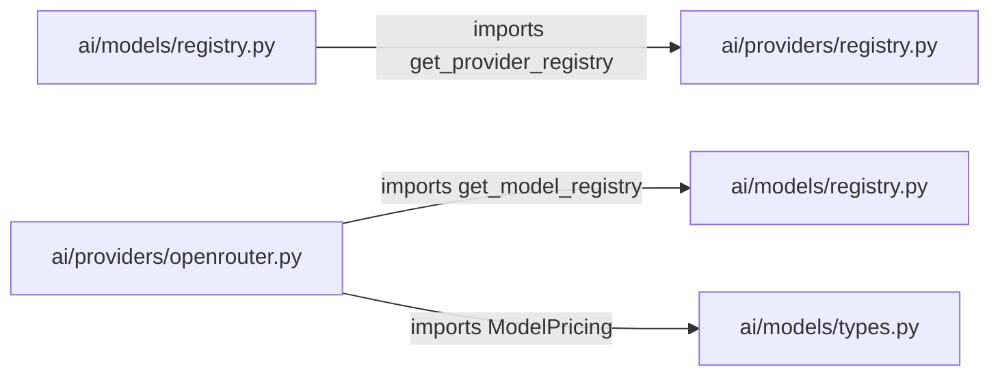
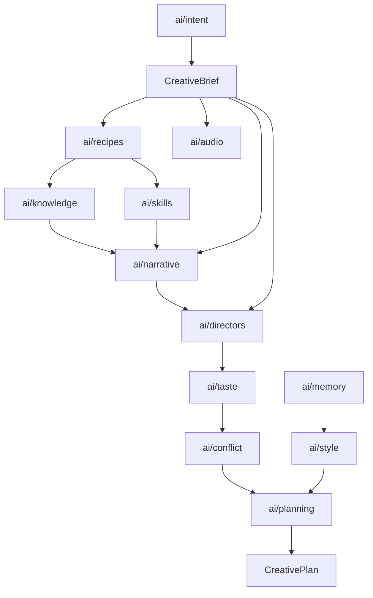

# S28-H01 — AI Package Dependency Graph & Cycle Analysis

> **Milestone:** S28-H01 (AI Package Ownership, Dependency & Duplication Audit)  
> **Workspace:** `motion / clean-video-workspace`  
> **Date:** 2026-10-03  
> **Status:** AUDIT COMPLETED — ZERO EXECUTABLE CODE MODIFICATIONS  

---

## 1. Executive Summary & Graph Metrics

An AST-based import analysis of all 291 Python source files across the 36 top-level packages in `ai/` reveals a highly structured core, but identifies **one circular dependency cycle** and **one inverted layer dependency** that must be addressed prior to or during subsequent milestones.

### Dependency Graph Key Metrics

| Metric | Value | Architectural Interpretation |
| :--- | :---: | :--- |
| **Total Top-Level Nodes** | 36 | 36 top-level packages under `ai/` |
| **Total Inter-Package Dependency Edges** | 89 | Explicit `ai.<pkgA>` importing `ai.<pkgB>` edges |
| **Max Fan-In (Highest Inbound)** | 33 | `ai/contracts` (Imported by 33/36 packages) |
| **Max Fan-Out (Highest Outbound)** | 12 | `ai/regression` (Imports 12 packages for holistic grading) |
| **Circular Dependency Cycles** | **0** | *(Eliminated in S28-H02: models decoupled from providers)* |
| **Inverted Layer Dependencies** | **0** | *(Eliminated in S28-H02: memory enums moved to contracts)* |
| **External Consumers (api/)** | 1 | `ai/contracts` *(ai/candidates migrated to creative_governance in S28-H03)* |
| **External Consumers (scripts/)** | 13 | Core CLI utilities, compilers, publishers, runners |
| **External Consumers (tests/)** | 36 | Comprehensive test coverage across all subsystems |

---

## 2. Dependency Matrix (Fan-In & Fan-Out)

The table below lists all 36 packages, their direct outbound dependencies within `ai/` (Fan-Out), and all inbound packages that import them within `ai/` (Fan-In).

| Package | Fan-Out | Direct Dependencies (Outbound) | Fan-In | Reverse Dependencies (Inbound AI Packages) |
| :--- | :---: | :--- | :---: | :--- |
| `ai/audio` | 2 | `cache`, `contracts` | 2 | `media`, `recipes` |
| `ai/batch` | 6 | `budget`, `cache`, `contracts`, `models`, `orchestration`, `routing` | 0 | *(Entry-point runtime coordinator)* |
| `ai/budget` | 3 | `contracts`, `models`, `routing` | 2 | `batch`, `specialized` |
| `ai/cache` | 3 | `capabilities`, `contracts`, `orchestration` | 5 | `audio`, `batch`, `media`, `specialized`, `vision` |
| `ai/candidates` | 1 | `contracts` (via `creative_governance`) | 0 | *(Migrated to creative_governance/candidates; ai/candidates is thin facade)* |
| `ai/capabilities` | 1 | `contracts` | 4 | `cache`, `models`, `routing`, `specialized` |
| `ai/conflict` | 1 | `contracts` | 1 | `evals` *(and taste engine)* |
| `ai/context` | 2 | `contracts`, `memory` | 0 | *(Runtime context assembler)* |
| **`ai/contracts`** | **0** | *(Pure Layer 0; memory dependency eliminated in H02)* | **33** | Almost all packages across `ai/` |
| `ai/cost` | 5 | `contracts`, `memory`, `models`, `observability`, `routing` | 0 | *(Observability collector & analyzer)* |
| `ai/directors` | 1 | `contracts` | 1 | `evals` *(and taste engine)* |
| `ai/evals` | 7 | `conflict`, `contracts`, `directors`, `narrative`, `planning`, `prompts`, `taste` | 1 | `regression` |
| `ai/feedback` | 2 | `contracts`, `memory` | 1 | `regression` |
| `ai/intent` | 1 | `contracts` | 2 | `recipes`, `regression` |
| `ai/knowledge` | 1 | `contracts` | 3 | `narrative`, `regression`, `skills` |
| `ai/mcp` | 2 | `contracts`, `tools` | 0 | *(Integration adapters)* |
| `ai/media` | 7 | `audio`, `cache`, `contracts`, `providers`, `routing`, `speech`, `vision` | 0 | *(Domain service)* |
| **`ai/memory`** | **0** | *(Pure domain foundation; zero outbound `ai/` deps)* | **7** | `context`, `contracts`, `cost`, `feedback`, `planning`, `regression`, `style` |
| **`ai/models`** | **2** | `capabilities`, `contracts` *(cycle with providers broken in H02)* | **5** | `batch`, `budget`, `cost`, `providers`, `routing` |
| `ai/narrative` | 3 | `contracts`, `knowledge`, `skills` | 2 | `evals`, `regression` |
| `ai/observability` | 1 | `contracts` | 1 | `cost` |
| `ai/orchestration` | 1 | `contracts` | 3 | `batch`, `cache`, `specialized` |
| `ai/planning` | 3 | `contracts`, `memory`, `style` | 2 | `evals`, `regression` |
| `ai/prompts` | 1 | `contracts` | 1 | `evals` |
| **`ai/providers`** | **2** | `contracts`, **`models`** *(CYCLE)* | **5** | `media`, `models`, `routing`, `specialized`, `speech` |
| `ai/recipes` | 3 | `audio`, `contracts`, `intent` | 1 | `regression` |
| **`ai/regression`** | **12**| `contracts`, `evals`, `feedback`, `intent`, `knowledge`, `memory`, `narrative`, `planning`, `recipes`, `skills`, `style`, `taste` | 0 | *(Top-level creative regression testbed)* |
| `ai/routing` | 4 | `capabilities`, `contracts`, `models`, `providers` | 5 | `batch`, `budget`, `cost`, `media`, `specialized` |
| `ai/security` | 0 | *(Zero outbound dependencies)* | 0 | *(Cross-cutting boundary filters)* |
| `ai/skills` | 3 | `contracts`, `knowledge`, `tools` | 2 | `narrative`, `regression` |
| `ai/specialized` | 7 | `budget`, `cache`, `capabilities`, `contracts`, `orchestration`, `providers`, `routing` | 0 | *(Multimodal execution service)* |
| `ai/speech` | 2 | `contracts`, `providers` | 1 | `media` |
| `ai/style` | 2 | `contracts`, `memory` | 2 | `planning`, `regression` |
| `ai/taste` | 1 | `contracts` | 2 | `evals`, `regression` |
| `ai/tools` | 1 | `contracts` | 2 | `mcp`, `skills` |
| `ai/vision` | 2 | `cache`, `contracts` | 1 | `media` |

---

## 3. Deep Dive: Circular Dependency Analysis

### Finding: `CYCLE-01` — `ai/models` $\longleftrightarrow$ `ai/providers`

A direct, bi-directional import cycle exists between `ai/models` and `ai/providers`.



#### Code Evidence

1. **`ai/models/registry.py:18`**:
   ```python
   from ai.providers.registry import ProviderRegistry, UnknownProviderError, get_provider_registry
   ```
   *Rationale in code:* In `ModelRegistry.register(model_def)`, the registry verifies that the model's declared `provider_id` exists in the `ProviderRegistry`.

2. **`ai/providers/openrouter.py:27-28`**:
   ```python
   from ai.models.registry import get_model_registry
   from ai.models.types import ModelPricing
   ```
   *Rationale in code:* `OpenRouterProvider` registers default pricing structures with `ModelRegistry`.

#### Architectural Risk
- Python module initialization race conditions.
- Prevents clean packaging of `models` and `providers` into independent distribution layers.
- High risk of `ImportError: cannot import name ... from partially initialized module`.

#### Recommended Solution (To be scheduled in H02)
- Decouple model validation from eager provider registry instantiation via lazy lookup or pass-through validator interface.
- Move `ModelPricing` to `ai/contracts/model.py` so providers import contracts rather than model definitions.

---

## 4. Deep Dive: Inverted Layer Dependencies

### Finding: `INVERSION-01` — `ai/contracts` importing `ai/memory`

In clean layered architecture, contracts represent the immutable foundation. They must never depend on domain service implementations.

#### Code Evidence
**`ai/contracts/creative/feedback.py:21`**:
```python
from ai.memory.types import EpistemicStatus, MemoryScope, SourceType
```

#### Architectural Risk
- Inverts dependency direction: `contracts` (Foundation) $\longrightarrow$ `memory` (Domain Service).
- Every consumer of creative feedback contracts transitively depends on `ai.memory.types`.
- Prevents compiling contracts independently of the memory domain.

#### Recommended Solution (To be scheduled in H02)
- Move foundational enums (`EpistemicStatus`, `MemoryScope`, `SourceType`) into `ai/contracts/common.py` or `ai/contracts/memory.py`.
- Update `ai/memory/types.py` to import these enums from `ai/contracts/`.

---

## 5. Subsystem Structural Patterns

### A. Creative Intelligence Layer (Clean Directed Acyclic Graph)
The creative intelligence subsystems form a well-behaved DAG without internal cycles:


### B. Evaluation Layer Fan-Out
`ai/regression` acts as a top-level grading harness. It has a high fan-out of 12, directly importing contracts, intent, knowledge, skills, recipes, narrative, taste, style, planning, memory, and evals.
This high fan-out is **architecturally expected** for an end-to-end regression evaluation runner. It has **zero inbound runtime dependencies** (Fan-In = 0), ensuring that no production code depends on regression evaluation code.

### C. Capability & Tool Coupling
- `ai/skills` depends on `ai/tools` (`ai/skills/context.py` imports `ToolAuthorizationPolicy` and `ToolDefinition`).
- `ai/mcp` depends on `ai/tools` (`ai/mcp/adapters/` and `policy.py` import `TrustedToolExecutionContext`).
This coupling demonstrates that `tools` currently acts as the defacto runtime capability anchor. Consolidating tools, capabilities, and MCP adapters is the explicit focus of **S28-M**.
