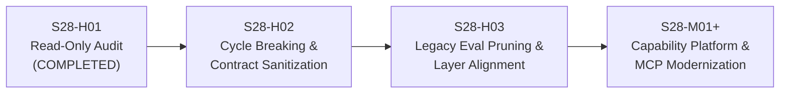

# S28-H01 — AI Restructure Proposal & Package Action Plan

> **Milestone:** S28-H01 (AI Package Ownership, Dependency & Duplication Audit)  
> **Workspace:** `motion / clean-video-workspace`  
> **Date:** 2026-10-03  
> **Status:** AUDIT COMPLETED — ZERO EXECUTABLE CODE MODIFICATIONS  

---

## 1. Executive Summary

This proposal outlines the long-term architectural restructuring plan for the `ai/` tree.  
**Critical Constraint:** In accordance with the S28-H01 mission, **NO files are moved, renamed, merged, or deleted during this milestone**. This document serves as an evidence-based roadmap for subsequent phases (`S28-H02`, `S28-H03`, and `S28-M`).

---

## 2. Package-by-Package Recommended Actions

Every top-level package in `ai/` is assigned a future action:

| Package | Current Layer | Recommended Action | Target Milestone | Rationale & Architectural Target |
| :--- | :--- | :---: | :---: | :--- |
| `ai/audio` | `DOMAIN_SERVICE` | **KEEP** | KEEP | Stable, self-contained native DSP and AudioMode policy enforcement. |
| `ai/batch` | `AI_RUNTIME` | **KEEP** | KEEP | Authoritative batch workload coordinator cleanly leveraging durable runtime. |
| `ai/budget` | `GOVERNANCE` | **MOVE** | Future Restructure | Platform financial limit and reservation engine. Target: `platform/budget`. |
| `ai/cache` | `CROSS_CUTTING_PLATFORM`| **MOVE** | Future Restructure | Generic deterministic caching infrastructure. Target: `platform/cache`. |
| `ai/candidates` | `CREATIVE_GOVERNANCE` | **MOVED** | S28-H03 (COMPLETE) | Template governance subsystem with Remotion render QC. Canonical: `creative_governance/candidates`. |
| `ai/capabilities`| `CAPABILITY_PLATFORM` | **DEFER_TO_S28_M** | S28-M | Core subject of capability modernization. |
| `ai/conflict` | `CREATIVE_INTELLIGENCE` | **KEEP** | KEEP / H03 | Pure arbitration boundary. May be merged with `taste` in future consolidation. |
| `ai/context` | `AI_RUNTIME` | **KEEP** | KEEP | Core request-scoped context assembly and token budgeting engine. |
| `ai/contracts` | `CROSS_CUTTING_PLATFORM`| **KEEP** | H02 (Decouple) | Foundational contract schemas. Retain, but fix `contracts -> memory` inversion in H02. |
| `ai/cost` | `OBSERVABILITY` | **KEEP** | Future Restructure | Read-only cost telemetry and waste analyzer. Future candidate for `platform/cost`. |
| `ai/directors` | `CREATIVE_INTELLIGENCE` | **KEEP** | KEEP / H03 | Advisory director agents. May merge with `taste` in a unified creative advisory package. |
| `ai/evals` | `EVALUATION` | **SPLIT** | H02 | Retain generic eval framework (`runner.py`, `gate.py`); prune legacy milestone scripts (`creative_evals_s28_*.py`). |
| `ai/feedback` | `CREATIVE_INTELLIGENCE` | **KEEP** | KEEP | Structured post-render feedback classifier and learning loop. |
| `ai/intent` | `CREATIVE_INTELLIGENCE` | **KEEP** | KEEP | Multilingual intent parsing and epistemic provenance engine. |
| `ai/knowledge` | `CREATIVE_INTELLIGENCE` | **KEEP** | KEEP | Bounded creative knowledge platform and hybrid retriever. |
| `ai/mcp` | `INTEGRATION` | **DEFER_TO_S28_M** | S28-M | Baseline frozen. Modernization and adapter consolidation deferred to S28-M. |
| `ai/media` | `DOMAIN_SERVICE` | **KEEP** | S28-M | Media intelligence service. Modernization of media tools deferred to S28-M. |
| `ai/memory` | `DOMAIN_SERVICE` | **KEEP** | KEEP | Core long-term project/user memory store. |
| `ai/models` | `MODEL_PLATFORM` | **KEEP_BUT_RENAME_LATER**| H02 / S28-M | Model metadata catalog. Decouple circular dependency with `providers` in H02. |
| `ai/narrative` | `CREATIVE_INTELLIGENCE` | **KEEP** | KEEP | Story arc, pacing, and beat sheet generation. |
| `ai/observability`| `OBSERVABILITY` | **MOVE** | Future Restructure | Distributed tracing and telemetry. Future candidate for `platform/observability`. |
| `ai/orchestration`| `AI_RUNTIME` | **KEEP** | KEEP | Durable DAG execution engine and crash recovery. |
| `ai/planning` | `CREATIVE_INTELLIGENCE` | **KEEP** | KEEP | 3-tier creative planning (REUSE -> COMPOSE -> CREATE). |
| `ai/prompts` | `AI_RUNTIME` | **KEEP** | KEEP | Versioned prompt template repository and interpolation service. |
| `ai/providers` | `MODEL_PLATFORM` | **DEFER_TO_S28_M** | H02 / S28-M | Decouple circular import in H02; modernize provider routing in S28-M. |
| `ai/recipes` | `CREATIVE_INTELLIGENCE` | **KEEP** | KEEP | 18 provider-neutral video recipes. |
| `ai/regression` | `EVALUATION` | **KEEP** | KEEP | Unified creative intelligence regression harness. |
| `ai/routing` | `MODEL_PLATFORM` | **DEFER_TO_S28_M** | S28-M | Model router, fallback chains, and utility ranking. |
| `ai/security` | `CROSS_CUTTING_PLATFORM`| **MOVE** | Future Restructure | General security filters (SSRF, secret scrubbing). Target: `platform/security`. |
| `ai/skills` | `CREATIVE_INTELLIGENCE` | **DEFER_TO_S28_M** | S28-M | Creative skills platform. Tool modernizations deferred to S28-M. |
| `ai/specialized`| `CAPABILITY_PLATFORM` | **DEFER_TO_S28_M** | S28-M | Multimodal capability adapters (TTS, image, video). Consolidate in S28-M. |
| `ai/speech` | `DOMAIN_SERVICE` | **DEFER_TO_S28_M** | S28-M | Speech recognition (STT). Consolidate with TTS in S28-M. |
| `ai/style` | `CREATIVE_INTELLIGENCE` | **KEEP** | KEEP | User style resolution (Current Request Wins invariant). |
| `ai/taste` | `CREATIVE_INTELLIGENCE` | **KEEP** | KEEP | Aesthetic rule engine and taste evaluator. |
| `ai/tools` | `CAPABILITY_PLATFORM` | **DEFER_TO_S28_M** | S28-M | Canonical tool registry and authorization. Modernize in S28-M. |
| `ai/vision` | `DOMAIN_SERVICE` | **DEFER_TO_S28_M** | S28-M | Visual intelligence pipeline. Modernize in S28-M. |

---

## 3. Evaluation of Future Architecture Hypothesis

Section 14 posited a 4-pillar hypothesis:
```text
ai/
├── intelligence/
├── runtime/
└── evaluation/

capability-platform/
├── models/
├── tools/
└── integrations/

platform/
├── security/
├── observability/
├── cache/
├── budget/
└── cost/

creative-governance/
└── candidates/
```

### Empirical Assessment of Hypothesis

1. **`ai/intelligence/` (Pillar 1: Creative Intelligence)**
   - **Verdict: HIGHLY VIABLE.**
   - Packages `intent`, `knowledge`, `recipes`, `narrative`, `directors`, `taste`, `conflict`, `style`, `planning`, and `feedback` share a common domain model (`CreativeBrief` $\to$ `CreativePlan`) and zero infrastructure dependencies. Grouping them eliminates top-level directory clutter while preserving internal modularity.

2. **`ai/runtime/` & `ai/evaluation/` (Pillar 1: AI Engine)**
   - **Verdict: HIGHLY VIABLE.**
   - `orchestration`, `context`, `prompts`, and `batch` represent the execution engine.
   - `evals` (generic) and `regression` (creative) form the evaluation foundation.

3. **`capability-platform/` (Pillar 2: Capability & Model Infrastructure)**
   - **Verdict: VIABLE — Best Executed in S28-M.**
   - Unifies `capabilities`, `tools`, `mcp`, `models`, `providers`, `routing`, `speech`, and `specialized`.
   - Directly resolves the STT vs TTS split and the 3-way Tool vs MCP vs Capability ambiguity.

4. **`platform/` (Pillar 3: General SaaS Infrastructure)**
   - **Verdict: SOUND LONG-TERM, BUT NOT URGENT.**
   - `security` (SSRF, scrubbing), `observability` (tracing, spans), `cache` (storage keying), `budget` (financial limits), and `cost` (telemetry auditing) are indeed domain-agnostic platform infrastructure.
   - However, moving them outside `ai/` right now carries high import churn across the entire codebase without functional gain. Should remain in place until broader platform modularization.

5. **`creative-governance/` (Pillar 4: Template Governance)**
   - **Verdict: ARCHITECTURALLY ACCURATE.**
   - `candidates` is unambiguously a Remotion AST and render verification governance system. Relocating it clarifies that candidate verification is a human-in-the-loop quality gate, not an LLM model.

---

## 4. Staged Execution Roadmap



### Step 1: S28-H01 (Current Milestone — AUDIT COMPLETE)
- Complete comprehensive inventory of all 36 packages.
- Document circular dependencies (`models` $\longleftrightarrow$ `providers`) and inverted contracts (`contracts` $\longrightarrow$ `memory`).
- Inherit green baseline without redundant regression.

### Step 2: S28-H02 (Target: Fast Invariant & Import Sanitization)
- **Break Circular Dependency (`FIND-01`):** Decouple `ai/models/registry.py` from eager `ai.providers.registry` import. Move `ModelPricing` to `ai/contracts/model.py`.
- **Fix Inverted Contract Dependency (`FIND-02`):** Move `EpistemicStatus`, `MemoryScope`, and `SourceType` from `ai.memory.types` into `ai/contracts/common.py`.
- Run targeted unit tests to prove cycle resolution.

### Step 3: S28-H03 (Target: Evaluation Pruning & Candidate Governance Alignment)
- **Prune Legacy Milestone Evaluation Scripts (`FIND-03`):** Relocate `CreativeRubricsEvaluator` to `ai/regression/` and prune `creative_evals_s28_04/05/06.py` from `ai/evals/`.
- Prepare governance boundaries for `ai/candidates/`.

### Step 4: S28-M (Target: Capability & MCP Modernization)
- Modernize `ai/capabilities/`, `ai/tools/`, and `ai/mcp/`.
- Unify STT (`ai/speech`) and TTS (`ai/specialized`) under a coherent multimodal capability platform.
- Unify tool execution and MCP adapters under a consolidated authorization policy.
