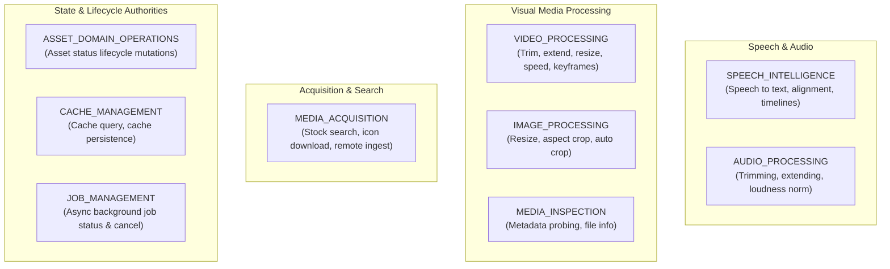

# S28-M02 — Canonical Product Capability Taxonomy

> **Milestone:** S28-M02 — Capability Taxonomy & Contracts  
> **Status:** AUTHORITATIVE SPECIFICATION  
> **Authority Level:** Level 1 Canonical Contract Documentation  
> **Context:** Clean Video Workspace / Motion AI Media Platform  
> **Principle:** `NO CAPABILITY LOSS` | Capability Decoupled From Implementation  

---

## 1. Executive Overview

In Milestone **S28-M01** (*MCP Reality Audit & Baseline*), we answered the empirical question:
> *What implementations actually exist in the repository, and what is their runtime health?*

In Milestone **S28-M02** (*Capability Taxonomy & Contracts*), we answer the architectural question:
> *What real product capabilities does the system deliver, independent of MCP names or current transient implementations?*

Historically, agents, recipes, and production protocols invoked operations tied directly to arbitrary MCP server identities:
```text
audio-tools-mcp::analyze_voiceover
video-tools-mcp::trim_video
media-sources-mcp::pexels_search_videos
ffmpeg-mcp-server::speed_up_video
```

Milestone S28-M02 establishes the formal taxonomy and canonical contracts transitioning the entire system from **MCP-specific tools** to **Product Capabilities**:
```text
SPEECH_TO_TEXT
TRIM_VIDEO
SEARCH_STOCK_VIDEOS
CHANGE_VIDEO_SPEED
```

This decoupling ensures the system can swap, consolidate, repair, or upgrade underlying execution engines (e.g. migrating from an ad-hoc Node.js FFmpeg MCP to native Python workers, or switching stock media providers from Pexels to internal repositories) without mutating agent protocols, creative recipes, or domain semantics.

---

## 2. Fundamental Axioms & Invariants

### 2.1 The Principle of `NO CAPABILITY LOSS`
No capability discovered in M01 is discarded, deprecated, or ignored because of implementation defects.
- A **`BROKEN`** implementation (e.g. `pixabay_search_audio`) does **not** erase the capability (`SEARCH_STOCK_AUDIO`). The capability remains an active product requirement; its legacy implementation is marked for repair or replacement in subsequent milestones.
- An **`UNVERIFIED`** implementation (e.g. `pexels_search_images` lacking API keys) retains its full canonical capability (`SEARCH_STOCK_IMAGES`).
- A **`PARTIALLY_WORKING`** tool with security vulnerabilities (e.g. `concatenate_videos` raw shell interpolation) is mapped to its canonical capability (`CONCATENATE_VIDEOS`) with an explicit migration strategy (`REPAIR_THEN_WRAP`).

### 2.2 Strict Decoupling: Capability vs. Implementation
A **Capability** is an invariant contract representing a distinct product feature, transformation, or domain mutation required by video production workflows.
An **Implementation** is a transient, replaceable mechanism (an MCP tool, Python function, CTranslate2 engine, or external SaaS API) that satisfies that contract.

| Dimension | Canonical Product Capability | Runtime Implementation Descriptor |
|---|---|---|
| **Identity** | Domain-oriented symbol (`TRIM_VIDEO`) | Technical invocation point (`video-tools-mcp::trim_video`) |
| **Stability** | Permanent across platform generations | Ephemeral; refactored across milestones |
| **Vendor Neutrality** | Free of vendor/provider/library names | Explicitly names engine (`FFmpeg`, `faster-whisper`, `Pexels API`) |
| **Authority** | Defined in `ai.contracts.capability` | Bound in runtime registries / dispatchers |
| **Cardinality** | 1 Canonical Capability | 1..N Implementations (failover / providers) |

---

## 3. High-Level Capability Categories

Every canonical capability is strictly classified into one of three authoritative categories (`CapabilityCategory`):

```text
┌────────────────────────────────────────────────────────┐
│                   CapabilityCategory                   │
├───────────────────┬──────────────────┬─────────────────┤
│       MODEL       │       TOOL       │ DOMAIN_SERVICE  │
│  (Non-determ.)    │  (Deterministic) │ (State/Manifest)│
└───────────────────┴──────────────────┴─────────────────┘
```

### 3.1 `MODEL`
A capability that relies fundamentally on machine learning model inference, statistical weights, or non-deterministic neural generation.
- **Characteristics:** High compute intensity, GPU/accelerator acceleration preference, probabilistic latency, confidence scoring.
- **Architectural Owner:** `ModelRouter` / AI Model Subsystem.
- **Discovered M01 Representative:** `SPEECH_TO_TEXT` (powered by `faster-whisper`).
- **Rule on Internal Dependencies:** A machine learning model used strictly as an internal computational dependency within a larger pipeline is **not** elevated to a standalone product capability unless consumers independently invoke it. (See Section 9 for the `Silero VAD` decision).

### 3.2 `TOOL`
A deterministic or near-deterministic operational transformation or operational utility.
- **Characteristics:** Algorithmic execution, reproducible output for identical input parameters, bounded runtime, clear failure modes.
- **Architectural Owner:** `MediaProcessingService`, `StockMediaService`, `MediaAcquisitionService`.
- **Discovered M01 Representatives:** `TRIM_VIDEO`, `EXTEND_AUDIO`, `NORMALIZE_AUDIO_LOUDNESS`, `RESIZE_IMAGE`, `SEARCH_STOCK_VIDEOS`, `DOWNLOAD_REMOTE_MEDIA`.
- **Constraint:** Tools perform primitive data transformations or external queries. They do **not** hold domain authority over business state or project manifests.

### 3.3 `DOMAIN_SERVICE`
An authoritative domain operation that manages business entity lifecycle, project state, database records, storage references, or task execution coordination.
- **Characteristics:** Mutates or queries authoritative system state, enforces transactional consistency, triggers downstream artifact invalidation, enforces tenant/project confinement boundaries.
- **Architectural Owner:** `AssetService`, `RunService`, `DomainArtifactService`.
- **Discovered M01 Representatives:**
  - `MUTATE_ASSET_STATUS` (previously misimplemented as `media-sources-mcp::change_asset_status`)
  - `CHECK_MEDIA_CACHE` & `STORE_MEDIA_CACHE` (previously misimplemented as `common-tools-mcp::check_cache` / `save_to_cache`)
  - `GET_JOB_STATUS` & `CANCEL_PROCESSING_JOB` (previously misimplemented as `ffmpeg-mcp-server::check_processing_status` / `cancel_video_processing`)
  - `GENERATE_SPEECH_MANIFEST` & `BUILD_SPEECH_TIMELINE` (previously in `audio-tools-mcp`)
- **Crucial Invariant:** An MCP utility must **never** be treated as a domain authority. Operations that alter project manifest semantics belong exclusively to Domain Services.

---

## 4. Capability Families

Canonical capabilities are organized into 9 cohesive domain families (`CapabilityFamily`):



| Family | Purpose | Category Mix | Example Capabilities |
|---|---|---|---|
| **`SPEECH_INTELLIGENCE`** | Automated speech transcription, temporal sentence slicing, manifest generation, kinetic typography timeline synchronization. | MODEL (1), TOOL (1), DOMAIN_SERVICE (2) | `SPEECH_TO_TEXT`, `SEGMENT_SPEECH_AUDIO`, `GENERATE_SPEECH_MANIFEST`, `BUILD_SPEECH_TIMELINE` |
| **`AUDIO_PROCESSING`** | Primitive audio stream processing, integrated loudness compliance (-16 LUFS / -24 LUFS), silence trimming. | TOOL (4) | `TRIM_AUDIO`, `EXTEND_AUDIO`, `NORMALIZE_AUDIO_LOUDNESS`, `TRIM_AUDIO_SILENCE` |
| **`VIDEO_PROCESSING`** | Video stream trimming, duration padding, aspect ratio scaling, black frame elimination, playback speed adjustment, keyframe cadence enforcement, multi-clip concatenation. | TOOL (7) | `TRIM_VIDEO`, `EXTEND_VIDEO`, `RESIZE_VIDEO`, `TRIM_BLACK_FRAMES`, `CHANGE_VIDEO_SPEED`, `ENFORCE_KEYFRAME_INTERVAL`, `CONCATENATE_VIDEOS` |
| **`IMAGE_PROCESSING`** | Classical resampling (Lanczos), aspect ratio center-cropping, automatic border stripping. | TOOL (3) | `RESIZE_IMAGE`, `CROP_IMAGE_TO_RATIO`, `AUTO_CROP_IMAGE` |
| **`MEDIA_ACQUISITION`** | Sourcing third-party assets (stock photos, footage, music, sound effects, vector SVG icons), remote media stream downloading, web page media extraction. | TOOL (8) | `SEARCH_STOCK_IMAGES`, `SEARCH_STOCK_VIDEOS`, `SEARCH_STOCK_AUDIO`, `SEARCH_SOUND_EFFECTS`, `SEARCH_ICONS`, `DOWNLOAD_ICON`, `DOWNLOAD_REMOTE_MEDIA`, `EXTRACT_MEDIA_PAGE` |
| **`MEDIA_INSPECTION`** | Technical inspection of media stream headers, container properties, file sizes, and timestamps. | TOOL (1) | `INSPECT_MEDIA` |
| **`ASSET_DOMAIN_OPERATIONS`** | Managing asset registration, status transitions (`incoming` -> `processing` -> `ready`), and downstream invalidation. | DOMAIN_SERVICE (1) | `MUTATE_ASSET_STATUS` |
| **`CACHE_MANAGEMENT`** | Querying and storing pre-computed media variants with deterministic content hashing. | DOMAIN_SERVICE (2) | `CHECK_MEDIA_CACHE`, `STORE_MEDIA_CACHE` |
| **`JOB_MANAGEMENT`** | Monitoring and cancelling long-running asynchronous worker or subprocess jobs. | DOMAIN_SERVICE (2) | `GET_JOB_STATUS`, `CANCEL_PROCESSING_JOB` |

---

## 5. Naming Policy & Provider Decoupling

### 5.1 Syntax & Case
- All canonical capability IDs must be strictly formatted in `UPPER_SNAKE_CASE` (e.g. `TRIM_VIDEO`, `SEARCH_STOCK_VIDEOS`).
- Identifiers must begin with an alphabetic character and contain only uppercase letters and underscores (`^[A-Z][A-Z0-9_]*$`).

### 5.2 Prohibition of Provider, Vendor, and Protocol Tokens
Canonical capability IDs represent what the product does, **never** who currently executes it or what protocol is used.
The following tokens are strictly forbidden in canonical capability IDs:
- ❌ `PEXELS` (Forbidden: e.g. `PEXELS_SEARCH_VIDEOS` -> Canonical: `SEARCH_STOCK_VIDEOS`)
- ❌ `PIXABAY` (Forbidden: e.g. `PIXABAY_SEARCH_IMAGES` -> Canonical: `SEARCH_STOCK_IMAGES`)
- ❌ `WHISPER` (Forbidden: e.g. `WHISPER_VOICEOVER` -> Canonical: `SPEECH_TO_TEXT`)
- ❌ `FFMPEG` (Forbidden: e.g. `FFMPEG_SPEED_UP` -> Canonical: `CHANGE_VIDEO_SPEED`)
- ❌ `MCP` (Forbidden: e.g. `MCP_TRIM_VIDEO` -> Canonical: `TRIM_VIDEO`)
- ❌ `ICONIFY` (Forbidden: e.g. `ICONIFY_SEARCH` -> Canonical: `SEARCH_ICONS`)
- ❌ `FREESOUND` (Forbidden: e.g. `FREESOUND_SEARCH` -> Canonical: `SEARCH_SOUND_EFFECTS`)

This rule is enforced by programmatic Pydantic validators in `CapabilityDefinition` and unit test assertions in `tests/ai/contracts/test_capability_taxonomy_and_contracts.py`.

---

## 6. Semantic Ownership vs. Execution Mechanism

A critical flaw discovered in M01 was the conflation of **execution mechanism** with **semantic authority**.
For example, `media-sources-mcp::change_asset_status` moved files between directories on disk using `shutil.move()`. This made the MCP server an accidental and deficient authority over asset lifecycle, completely bypassing `AssetService`, database transactional boundaries, and downstream invalidation triggers.

In S28-M02, we formalize the distinction:

```text
┌──────────────────────────────────────┐
│            Semantic Owner            │  <-- Defines semantics, authorization,
│     (e.g. AssetService / RunService) │      manifest synchronization, invalidation
└──────────────────┬───────────────────┘
                   │ dispatches to
┌──────────────────▼───────────────────┐
│        Execution Implementation       │  <-- Executes low-level computation,
│     (e.g. POSIX FS, FFmpeg, SaaS API)│      file streaming, transcoding, inference
└──────────────────────────────────────┘
```

1. **Semantic Owner:** The authoritative service that owns the business logic, metadata schema, access control, and state integrity for the capability.
   - Example: `AssetService` owns the lifecycle state of all media assets in `02_asset_manifest.json`.
2. **Execution Implementation:** The engine, CLI, or protocol adapter that performs the physical work.
   - Example: Local filesystem `shutil` or S3 storage driver is merely an execution detail for `AssetService`.

---

## 7. Multi-Side-Effect Model (`side_effects` & `SideEffectClass`)

Capabilities frequently produce compound operational side-effects. In S28-M02.1, every capability defines a canonical list of side-effects (`side_effects: list[SideEffectClass]`):

- `TRIM_VIDEO`: `[SUBPROCESS, PERSISTENT_WRITE]` (executes local FFmpeg and writes persistent video clip)
- `DOWNLOAD_REMOTE_MEDIA`: `[EXTERNAL_NETWORK, PERSISTENT_WRITE]` (queries remote network and writes project asset)
- `CHANGE_VIDEO_SPEED`: `[BACKGROUND_JOB, SUBPROCESS, PERSISTENT_WRITE]` (dispatches async job, spawns FFmpeg, persists video)
- `MUTATE_ASSET_STATUS`: `[DOMAIN_MUTATION, PERSISTENT_WRITE]` (updates database/ManifestV2 state and invalidates caches)
- `SEARCH_ICONS`: `[EXTERNAL_NETWORK, READ_ONLY]` (queries external network statelessly without disk writes)

| Side Effect Class | Description | Replay Safety | Example Capability |
|---|---|---|---|
| **`NONE`** | Pure in-memory computation with zero external interaction. | Safe | Mathematical projection |
| **`READ_ONLY`** | Reads state, metadata, or queries external APIs without mutation. | Safe | `INSPECT_MEDIA`, `CHECK_MEDIA_CACHE`, `SEARCH_STOCK_VIDEOS` |
| **`LOCAL_TEMP_WRITE`** | Writes temporary cache artifacts that can be purged without loss of truth. | Safe / Recomputable | `SPEECH_TO_TEXT` (transcription cache) |
| **`PERSISTENT_WRITE`** | Writes permanent media assets to project storage. | Idempotent with key | `RESIZE_IMAGE`, `STORE_MEDIA_CACHE`, `SEGMENT_SPEECH_AUDIO` |
| **`EXTERNAL_NETWORK`** | Dispatches outbound HTTP/HTTPS traffic to third-party endpoints. | Depends on method | `DOWNLOAD_REMOTE_MEDIA`, `SEARCH_ICONS` |
| **`DOMAIN_MUTATION`** | Modifies authoritative database state, manifest records, or job lifecycle. | Requires transaction | `MUTATE_ASSET_STATUS`, `CANCEL_PROCESSING_JOB` |
| **`SUBPROCESS`** | Launches synchronous local CLI child processes (e.g. `/usr/bin/ffmpeg`). | Idempotent | `TRIM_VIDEO`, `NORMALIZE_AUDIO_LOUDNESS` |
| **`BACKGROUND_JOB`** | Spawns detached or queued asynchronous processing tasks. | Non-idempotent | `CHANGE_VIDEO_SPEED` |

---

## 8. Tenant & Storage Boundaries (`TenantScope` & `target_storage_boundary`)

### 8.1 TenantScope Normalization
`TenantScope` represents the **authorization and resource isolation scope** of the capability, not whether the upstream data provider is public or private.

1. **`PROJECT` (27 Capabilities):** Every capability that operates on, reads, transforms, or writes a Project Asset is strictly scoped to `PROJECT`. Trimming, extending, loudness normalization, resizing, transcription, caching, and manifest mutations all execute in project scope.
2. **`WORKSPACE` (5 Capabilities):** External search queries (`SEARCH_ICONS`, `SEARCH_STOCK_IMAGES`, `SEARCH_STOCK_VIDEOS`, `SEARCH_STOCK_AUDIO`, `SEARCH_SOUND_EFFECTS`) are scoped to `WORKSPACE` where API keys, tenant rate limits, and caller authentication are validated.
3. **`NONE`:** Reserved exclusively for stateless operations that require no tenant authorization context whatsoever. Mutating capabilities are strictly forbidden from having `TenantScope.NONE`.

### 8.2 Canonical Storage Boundary vs. Legacy Storage Behavior
In accordance with S28-M02.1 hardening, the taxonomy enforces a strict separation between target architecture and legacy technical debt:
- **`target_storage_boundary` (Capability Level):** Declares the authoritative architectural system governing storage (`StorageService / Project Media`, `AssetService / ManifestV2 Authority`, `ArtifactService / Speech Manifest`, `RunService / Durable Job Record`, `Stateless In-Memory API`).
- **`legacy_storage_behavior` (Implementation Level):** Encapsulates historical unconfined filesystem interactions (`reads/writes unconfined paths via FFmpeg streamcopy`, `creates ad-hoc .{stem}.analysis.json`, etc.) without polluting the canonical contract.
- **Zero Raw Path Parameters:** Canonical request and response contracts reference assets exclusively via `project_id` and abstract `storage_key`. Host absolute paths are completely forbidden.

---

## 9. Embedded Models: Decisions & Justifications

Milestone M01 confirmed two embedded machine learning models running locally inside `audio-tools-mcp`:
1. `faster-whisper`
2. `Silero VAD`

### 9.1 Decision on `faster-whisper`: Elevated to `SPEECH_TO_TEXT` (MODEL)
- **Status:** **`WORKING`**
- **Decision:** Mapped to canonical capability `SPEECH_TO_TEXT` under `CapabilityCategory.MODEL`.
- **Target Owner:** `ModelRouter` / `SpeechIntelligenceSubsystem`.
- **Rationale:** Automated speech recognition and word-level timestamping are essential product features requested directly by video production recipes (`dynamic-montage-ad.json`), agents, and Remotion kinetic caption renderers. The model runs locally via CTranslate2 with CPU INT8 quantization and CUDA fallback.

### 9.2 Decision on `Silero VAD`: Retained as Internal Implementation Dependency
- **Status:** **`WORKING`**
- **Decision:** **Not** elevated to an independent canonical product capability. Retained as an internal implementation dependency within `SPEECH_TO_TEXT` (and speech analysis).
- **Rationale:** 
  1. No consumer (`ROUTER.md`, `.agents/AGENTS.md`, recipes, or test suites) ever requests Voice Activity Detection as an independent capability.
  2. Silero VAD is invoked purely within `voiceover_ops.py` to calculate speech probabilities across audio frames to aid `analyze_voiceover` in computing speech/silence bounding intervals.
  3. Exposing Silero VAD as a standalone public capability would violate the principle of not creating empty or speculative abstractions. If a future requirement demands independent acoustic voice activity detection, it can be promoted with dedicated consumer evidence.

---

## 10. Legacy Tool Consolidation & Decomposition

The 34 legacy MCP tools map to **32 canonical product capabilities**:

```text
34 Legacy MCP Tools  ──►  Consolidations (-2)  ──►  32 Canonical Product Capabilities
```

### 10.1 Consolidations (Multiple Legacy Tools -> 1 Canonical Capability)
1. **`SEARCH_STOCK_IMAGES`:**
   - Consolidates `media-sources-mcp::pixabay_search_images` and `media-sources-mcp::pexels_search_images`.
   - Both tools fulfill the exact same product intent: finding stock imagery for video scenes. Pexels and Pixabay are alternative provider implementations beneath a unified capability contract.
2. **`SEARCH_STOCK_VIDEOS`:**
   - Consolidates `media-sources-mcp::pixabay_search_videos` and `media-sources-mcp::pexels_search_videos`.
   - Both tools fulfill the exact same product intent: finding B-Roll footage clips.

### 10.2 Decompositions & Secondary Responsibilities
Certain legacy tools accumulated multiple distinct responsibilities in violation of the Single Responsibility Principle:
1. **`audio-tools-mcp::analyze_voiceover`:**
   - Primary: `SPEECH_TO_TEXT`
   - Secondary Responsibilities Recorded: `VOICE_ACTIVITY_DETECTION` (Silero VAD), `AUDIO_METADATA_EXTRACTION` (duration/bitrate probing), `SENTENCE_BOUNDARY_DETECTION`.
2. **`video-tools-mcp::detect_and_trim_black_frames`:**
   - Primary: `TRIM_BLACK_FRAMES`
   - Secondary Responsibilities Recorded: Black intervals detection, timeline logging.
3. **`ffmpeg-mcp-server::concatenate_videos`:**
   - Primary: `CONCATENATE_VIDEOS`
   - Secondary Responsibilities Recorded: Concat text manifest generation and post-render cleanup.

These secondary responsibilities are formally captured in `LEGACY_TOOL_MIGRATION_MAP.json` to guide clean architectural decomposition in future milestones without capability regression.
