# S28-M01 — MCP Dependency & Consumer Graph

> **Milestone:** S28-M01 — MCP Reality Audit & Baseline  
> **Purpose:** Structural and architectural mapping of all discovered consumers, MCP servers, tools, dependencies, embedded models, and execution boundaries.

---

## 1. High-Level Architecture Boundary Diagram

```mermaid
flowchart TD
    subgraph Consumers["Consumers & Trigger Authorities"]
        Agent["AI Agents / Antigravity IDE / Claude"]
        Router["ROUTER.md / Protocol v4"]
        Recipes["Recipes (recipes/*.json)"]
        PluginConfig["super-video-maker-plugin (mcp_config.json)"]
        Adapters["ai/mcp/adapters (S27 AI Abstraction)"]
        ApiServices["api/services (AssetService / Storage)"]
        Tests["pytest / True E2E Suites"]
    end

    subgraph MCPServers["Discovered MCP Servers (6 Servers, 34 Tools)"]
        AudioMCP["audio-tools-mcp (Python/FastMCP, 8 tools)"]
        CommonMCP["common-tools-mcp (Python/FastMCP, 2 tools)"]
        FfmpegMCP["ffmpeg-mcp-server (Node.js/Stdio, 6 tools)"]
        ImageMCP["image-tools-mcp (Python/FastMCP, 3 tools)"]
        MediaMCP["media-sources-mcp (Python/FastMCP, 11 tools)"]
        VideoMCP["video-tools-mcp (Python/FastMCP, 4 tools)"]
    end

    subgraph EnginesAndModels["Local Engines & Embedded Models"]
        Whisper["faster-whisper (CTranslate2, base/tiny)"]
        Silero["Silero VAD (ONNX Runtime)"]
        FFmpegBin["/usr/bin/ffmpeg & ffprobe"]
        Pillow["PIL (Lanczos / ImageChops)"]
    end

    subgraph ExternalProviders["External APIs & Network"]
        Iconify["api.iconify.design (No Key)"]
        Pexels["api.pexels.com (PEXELS_API_KEY)"]
        Pixabay["pixabay.com (PIXABAY_API_KEY)"]
        Freesound["freesound.org (FREESOUND_API_KEY)"]
        PixabayScrape["pixabay.com/music (Playwright Web Scrape)"]
    end

    subgraph SideEffects["Filesystem & Side Effects"]
        RawFs["Raw Workspace Filesystem (assets/incoming, ready, cache)"]
        StateJson[".agents/mcp_state/ffmpeg_jobs.json & logs"]
        Bypass["StorageService / Database Authority Bypass"]
    end

    %% Consumer Links
    Agent -->|stdio JSON-RPC| PluginConfig
    PluginConfig --> AudioMCP
    PluginConfig --> CommonMCP
    PluginConfig --> FfmpegMCP
    PluginConfig --> ImageMCP
    PluginConfig --> MediaMCP
    PluginConfig --> VideoMCP

    Router --> AudioMCP
    Router --> MediaMCP
    Router --> VideoMCP
    Router --> ImageMCP
    Router --> CommonMCP
    Router --> FfmpegMCP

    Recipes --> AudioMCP
    Recipes --> MediaMCP
    Recipes --> VideoMCP
    Recipes --> ImageMCP
    Recipes --> CommonMCP

    Adapters -.->|Direct Subprocess Re-implementation| FFmpegBin
    Adapters -.->|Direct Call| Pillow

    Tests --> AudioMCP
    Tests --> CommonMCP
    Tests --> FfmpegMCP
    Tests --> ImageMCP
    Tests --> MediaMCP
    Tests --> VideoMCP

    %% MCP to Engines & Models
    AudioMCP --> Whisper
    AudioMCP --> Silero
    AudioMCP --> FFmpegBin

    VideoMCP --> FFmpegBin
    FfmpegMCP --> FFmpegBin
    ImageMCP --> Pillow

    %% MCP to External
    MediaMCP --> Iconify
    MediaMCP --> Pexels
    MediaMCP --> Pixabay
    MediaMCP --> Freesound
    MediaMCP --> PixabayScrape

    %% MCP to Side Effects
    AudioMCP --> RawFs
    CommonMCP --> RawFs
    ImageMCP --> RawFs
    VideoMCP --> RawFs
    MediaMCP --> RawFs
    MediaMCP -.->|Bypasses Tenant/DB| Bypass
    FfmpegMCP --> RawFs
    FfmpegMCP --> StateJson
```

---

## 2. Detailed Per-Server Dependency & Boundary Breakdown

### 2.1 `audio-tools-mcp`
- **Inbound Consumers:**
  - `references/ROUTER.md` (§2, §4, §9) — mandatory technical first step when voiceover or audio is present.
  - `.agents/rules/video-production-protocol.md` (§3) — voiceover analysis, silence trimming, and loudness normalization.
  - `recipes/dynamic-montage-ad.json` — audio transcription and sound effect preparation.
  - `.agents/plugins/super-video-maker-plugin/mcp_config.json` — standard stdio agent plugin definition.
  - `ai/mcp/catalog.py` & `ai/mcp/adapters/audio.py` — S27 AI hardened adapter layer.
  - Tests: `tests/ai/mcp/test_mcp_catalog.py`, `tests/ai/mcp/test_mcp_contracts.py`.
- **Server Entrypoint:** `uv run python server.py`
- **Internal Tools:**
  1. `trim_audio` -> Subprocess: `/usr/bin/ffmpeg` -> Output: Raw audio file
  2. `extend_audio` -> Subprocess: `/usr/bin/ffmpeg`, `ffprobe` -> Output: Raw audio file
  3. `normalize_loudness` -> Subprocess: `/usr/bin/ffmpeg` (`loudnorm`) -> Output: Raw audio file
  4. `detect_and_trim_silence` -> Subprocess: `/usr/bin/ffmpeg` (`silencedetect`) -> Output: Raw audio file
  5. `analyze_voiceover` -> **Embedded Models**: `faster-whisper` (CTranslate2) + `Silero VAD` (ONNX Runtime) -> Output: `.{stem}_{hash}.analysis.json`, `.device_capability.json`
  6. `split_voiceover_sentences` -> Subprocess: `/usr/bin/ffmpeg` -> Output: Multiple sentence WAV files
  7. `get_voiceover_manifest` -> Filesystem JSON read/write -> Output: Manifest JSON
  8. `build_voiceover_timeline` -> Filesystem JSON read/write -> Output: Timeline JSON
- **Side Effect Boundaries:**
  - Filesystem: Writes audio slices, manifest JSONs, and `.device_capability.json`.
  - Process: Spawns transient FFmpeg/ffprobe child processes.
  - Network: Transient download of model weights from HuggingFace Hub during cold run; cached locally thereafter.
  - Tenant / Storage: Bypasses multi-tenant storage; operates entirely on arbitrary local filesystem paths.

---

### 2.2 `common-tools-mcp`
- **Inbound Consumers:**
  - `references/ROUTER.md` (§2, §4) — required pre-flight cache lookup (`check_cache`) and post-processing caching (`save_to_cache`).
  - `recipes/dynamic-montage-ad.json` — asset caching stage.
  - `.agents/plugins/super-video-maker-plugin/mcp_config.json` — stdio registration.
  - `ai/mcp/catalog.py` & `ai/mcp/adapters/parity.py` — audited for domain parity against `AssetService`.
  - Tests: `tests/ai/mcp/test_behavior_parity.py`, `tests/architecture/test_plugin_architecture_boundary.py`.
- **Server Entrypoint:** `uv run python server.py`
- **Internal Tools:**
  1. `check_cache` -> Reads: `ground-truth/ASSET_INDEX.json`, `assets/ready`, `assets/cache`
  2. `save_to_cache` -> Reads: source file -> Writes: `assets/cache/{asset_id}_{specs_hash}.ext`
- **Side Effect Boundaries:**
  - Filesystem: Direct file copy via `shutil.copy2` into repo's `assets/cache` directory.
  - Defect Note: Completely ignores the passed `cache_dir` argument and writes to hardcoded `CACHE_DIR`.
  - StorageService: Bypasses canonical database `AssetV2` manifests and S3/StorageService abstraction.

---

### 2.3 `ffmpeg-mcp-server`
- **Inbound Consumers:**
  - `references/ROUTER.md` (§2) — background transcoding, concatenation, keyframes.
  - `.agents/AGENTS.md` — background FFmpeg worker queue.
  - `.agents/plugins/super-video-maker-plugin/mcp_config.json` — Node.js stdio registration.
  - `ai/mcp/catalog.py` — classified as `OBSOLETE / DEPRECATE` in S27 abstraction due to platform locks.
- **Server Entrypoint:** `node server.js`
- **Internal Tools:**
  1. `speed_up_video` -> Spawns detached FFmpeg process -> Writes `.agents/mcp_state/ffmpeg_jobs.json` and `{jobId}.log`
  2. `check_processing_status` -> Reads `ffmpeg_jobs.json` -> Attempts PowerShell WMI process scan (fails on Linux)
  3. `cancel_video_processing` -> Attempts `taskkill` (Windows) -> Falls back to `process.kill(pid, 'SIGKILL')`
  4. `increase_keyframes` -> Spawns detached FFmpeg process (`-g <gop>`) -> Writes job state
  5. `get_files_info` -> Reads filesystem stats (`fs.stat`) across target directory
  6. `concatenate_videos` -> Writes temporary `concat_list.txt` -> Executes shell command `ffmpeg -f concat` -> Deletes `concat_list.txt`
- **Side Effect Boundaries:**
  - Filesystem: Creates `.agents/mcp_state/` directory, persists `ffmpeg_jobs.json`, writes `.log` files, outputs MP4s.
  - Security Risk: Unescaped string interpolation in `concatenateVideos` (`execAsync(`ffmpeg -f concat -safe 0 -i ${tempListFile} -c copy ${output_filename}`)`).
  - Platform Lock: Hardcoded PowerShell WMI queries and Windows `taskkill`.

---

### 2.4 `image-tools-mcp`
- **Inbound Consumers:**
  - `references/ROUTER.md` (§2, §4) — aspect ratio cropping, image upscaling.
  - `recipes/dynamic-montage-ad.json` — image pre-processing.
  - `.agents/plugins/super-video-maker-plugin/mcp_config.json` — stdio registration.
  - `ai/mcp/catalog.py` & `ai/mcp/adapters/image.py` — S27 AI adapter layer.
  - Tests: `tests/ai/mcp/test_behavior_parity.py`, `tests/ai/mcp/test_mcp_catalog.py`.
- **Server Entrypoint:** `uv run python server.py`
- **Internal Tools:**
  1. `upscale_image` -> Engine: Pillow `Image.Resampling.LANCZOS` -> Writes upscaled image
  2. `crop_to_ratio` -> Engine: Pillow center-crop math -> Writes cropped image
  3. `auto_crop_content` -> Engine: Pillow `ImageChops.difference` bounding box -> Writes cropped image
- **Side Effect Boundaries:**
  - Filesystem: Pure file-in / file-out transformations.
  - Deterministic: Zero external network or subprocess calls.

---

### 2.5 `media-sources-mcp`
- **Inbound Consumers:**
  - `references/ROUTER.md` (§2, §4, §10) — primary gateway for all external assets (stock video, images, SFX, SVG icons).
  - `recipes/dynamic-montage-ad.json` — B-Roll and SFX gathering.
  - `.agents/plugins/super-video-maker-plugin/mcp_config.json` — stdio registration.
  - `ai/mcp/catalog.py` — marked `CONVERT_TO_DOMAIN_SERVICE` in S27 catalog.
  - Tests: `tests/ai/mcp/test_behavior_parity.py`, `tests/remediation/reproductions/test_s13_reproductions.py`.
- **Server Entrypoint:** `uv run python server.py`
- **Internal Tools:**
  1. `download_direct_file` -> Network: `httpx` streaming -> Writes `assets/incoming/{asset_type}/`
  2. `download_media_page` -> Subprocess: `yt-dlp` -> Writes `assets/incoming/{asset_type}/`
  3. `change_asset_status` -> Direct raw filesystem `shutil.move` between `incoming`, `processing`, `ready`, `cache`
  4. `iconify_search` -> Network: `api.iconify.design/search` (Public API)
  5. `download_iconify_icon` -> Network: `api.iconify.design` -> Writes `.svg` file
  6. `pixabay_search_images` -> Network: `pixabay.com/api/` (Requires `PIXABAY_API_KEY`)
  7. `pixabay_search_videos` -> Network: `pixabay.com/api/videos/` (Requires `PIXABAY_API_KEY`)
  8. `pixabay_search_audio` -> Subprocess: Playwright Chromium browser scraper (Fails on Linux: binary missing)
  9. `freesound_search` -> Network: `freesound.org/apiv2/search/text/` (Requires `FREESOUND_API_KEY`)
  10. `pexels_search_images` -> Network: `api.pexels.com/v1/search` (Requires `PEXELS_API_KEY`)
  11. `pexels_search_videos` -> Network: `api.pexels.com/videos/search` (Requires `PEXELS_API_KEY`)
- **Side Effect Boundaries:**
  - Network: Broad unrestricted outbound HTTP/HTTPS access.
  - Filesystem: Ingests external assets directly into local repository folders (`assets/incoming/`).
  - Architecture Bypass: `change_asset_status` mutates filesystem state without updating `02_asset_manifest.json` or database tables.
  - Platform Drift: Default directory hardcoded to `c:\video\clean-video-workspace` if `SVM_DATA_DIR` is not set.

---

### 2.6 `video-tools-mcp`
- **Inbound Consumers:**
  - `references/ROUTER.md` (§2, §4) — video trimming, scaling, looping, black frame detection.
  - `recipes/dynamic-montage-ad.json` — video processing.
  - `.agents/plugins/super-video-maker-plugin/mcp_config.json` — stdio registration.
  - `ai/mcp/catalog.py` & `ai/mcp/adapters/video.py` — S27 AI adapter layer.
  - Tests: `tests/ai/mcp/test_mcp_catalog.py`, `tests/ai/mcp/test_mcp_contracts.py`.
- **Server Entrypoint:** `uv run python server.py`
- **Internal Tools:**
  1. `trim_video` -> Subprocess: `/usr/bin/ffmpeg` (`-c copy`) -> Output: Raw video file
  2. `extend_video` -> Subprocess: `/usr/bin/ffmpeg` (`-stream_loop -1` or `tpad`) -> Output: Raw video file
  3. `resize_video` -> Subprocess: `/usr/bin/ffmpeg` (`scale` & `pad` filters) -> Output: Raw video file
  4. `detect_and_trim_black_frames` -> Subprocess: `/usr/bin/ffmpeg` (`blackdetect`) -> Output: Trimmed video file
- **Side Effect Boundaries:**
  - Filesystem: Reads and writes MP4 video files.
  - Process: Spawns transient FFmpeg/ffprobe child processes.
  - Parameter Flaw: Default `threshold=0.1` maps to FFmpeg `pic_th=0.1` causing false-positive black frame identification on normal videos.
