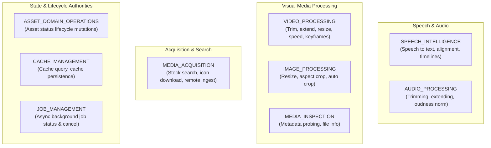

# S28-M02 Master Dossier & Unified Milestone Report

> **Milestone:** S28-M02 — Capability Taxonomy & Contracts  
> **Project:** `motion / clean-video-workspace`  
> **Execution Date:** 2026-10-03  
> **Milestone Status:** **`PASS`** (All 18 Verification Criteria Satisfied)  
> **Core Mandate:** Single Master Document compiling Taxonomy Guide, Authority Matrix, Catalog of 32 Capabilities, Migration Map of 34 Legacy Tools, Security Audits, and Verification Evidence.

---

## Table of Contents

1. [Milestone Closure Report & Executive Summary](#1-milestone-closure-report--executive-summary)
2. [Capability Authority & Boundary Matrix](#2-capability-authority--boundary-matrix)
3. [Capability Taxonomy & Architectural Rules](#3-capability-taxonomy--architectural-rules)
4. [Full Canonical Product Capability Catalog (32 Capabilities)](#4-full-canonical-product-capability-catalog-32-capabilities)
5. [Full Legacy Tool Migration Map (34 Active Tools + Quarantined Server)](#5-full-legacy-tool-migration-map-34-active-tools--quarantined-server)
6. [Security & Architectural Guard Audits](#6-security--architectural-guard-audits)
7. [Verification Test Evidence & Parity Logs](#7-verification-test-evidence--parity-logs)

---

## 1. Milestone Closure Report & Executive Summary

# S28-M02 Closure Report — Capability Taxonomy & Contracts

> **Milestone:** S28-M02 — Capability Taxonomy & Contracts  
> **Status:** **`PASS`**  
> **Repository:** `motion / clean-video-workspace`  
> **Execution Date:** 2026-10-03  
> **Author:** Antigravity AI Coding Assistant  
> **Principle:** `NO CAPABILITY LOSS` | Capability Decoupled From Implementation  

---

## 1. Executive Summary

| Metric | Measured Value | Target Gate | Verdict |
|---|---|---|---|
| **Legacy Tools Input (M01 Baseline)** | **34** | Exactly 34 from M01 | **MATCH** |
| **Legacy Tools Mapped** | **34 / 34** (100.0%) | 100.0% coverage | **PASS** |
| **Orphan Legacy Tools** | **0** | Exactly 0 | **PASS** |
| **Canonical Product Capabilities Defined** | **32** | Domain-derived | **VERIFIED** |
| **Orphan Canonical Capabilities** | **0** | Exactly 0 (all 32 mapped) | **PASS** |
| **Category: `MODEL`** | **1** (`SPEECH_TO_TEXT`) | Neural/Inference only | **VERIFIED** |
| **Category: `TOOL`** | **24** | Deterministic primitives | **VERIFIED** |
| **Category: `DOMAIN_SERVICE`** | **7** | State / Manifest authorities | **VERIFIED** |
| **Consolidated Legacy Tools** | **4 tools -> 2 capabilities** | Justified provider consolidation | **VERIFIED** |
| **Decomposed Multi-Responsibility Tools** | **3 tools** | Secondary responsibilities logged | **VERIFIED** |
| **Discovered Embedded Models Cataloged** | **2** (`faster-whisper`, `Silero VAD`) | Both accounted for | **PASS** |
| **Quarantined Implementations Documented** | **1** (`Video_Editor_MCP`) | Preserved historical record | **PASS** |
| **Provider-Coupled Canonical IDs** | **0** | Exactly 0 (Guarded by AST & regex) | **PASS** |
| **Contract Authority Source of Truth** | **Python Pydantic (`ai/contracts`)** | Single authority chain | **PASS** |
| **Cross-Language Contract Parity** | **Python ↔ JSON Schema ↔ TypeScript** | 100% synchronized | **PASS** |
| **Production Runtime Behavior Modified?** | **`NONE`** (Zero runtime changes) | Must not break runtime | **PASS** |
| **S28-M03 Started?** | **`NO`** | Strictly S28-M02 | **PASS** |
| **Final Milestone Gate** | **`PASS`** | All exit criteria met | **PASS** |

---

## 2. Baseline from S28-M01

The empirical source of truth established in Milestone S28-M01 (`MCP_REALITY_INVENTORY.json`, `MCP_TOOL_MATRIX.md`, `EMBEDDED_MODEL_INVENTORY.json`) was utilized as the inviolable baseline for this milestone:

- **Active MCP Servers:** Exactly 6 servers (`audio-tools-mcp`, `common-tools-mcp`, `ffmpeg-mcp-server`, `image-tools-mcp`, `media-sources-mcp`, `video-tools-mcp`).
- **Discovered Active Tools:** Exactly 34 tools.
  - `WORKING`: 18 tools
  - `PARTIALLY_WORKING`: 10 tools
  - `BROKEN`: 1 tool (`media-sources-mcp::pixabay_search_audio`)
  - `UNVERIFIED`: 5 tools (`media-sources-mcp` external search tools requiring commercial SaaS API keys)
- **Embedded Local Machine Learning Models:** Exactly 2 models:
  - `faster-whisper` (ASR speech transcription via CTranslate2 INT8 CPU / CUDA fallback)
  - `Silero VAD` (Voice Activity Detection via ONNX Runtime)
- **Quarantined Historical Server:** `Video_Editor_MCP` (purged in commit `7e94c15`, quarantined in `.agents/AGENTS.md`).

All 34 tools and their verified operational statuses were preserved in the migration map without deletion or omission.

---

## 3. Taxonomy Decisions

Milestone S28-M02 establishes the formal transition from transient **MCP tool identities** to permanent **Product Capabilities**:

1. **Category Taxonomy (`CapabilityCategory`):**
   - **`MODEL`:** Applied exclusively to capabilities requiring non-deterministic machine learning model inference (`SPEECH_TO_TEXT`). Governed by `ModelRouter`.
   - **`TOOL`:** Applied to deterministic or near-deterministic primitive media processing operations (e.g. `TRIM_VIDEO`, `RESIZE_IMAGE`, `EXTEND_AUDIO`) and external stateless search endpoints (`SEARCH_ICONS`, `SEARCH_STOCK_VIDEOS`).
   - **`DOMAIN_SERVICE`:** Applied to operations that govern domain entities, manifest lifecycles, cache consistency, or asynchronous job coordination (e.g. `MUTATE_ASSET_STATUS`, `CHECK_MEDIA_CACHE`, `STORE_MEDIA_CACHE`, `GET_JOB_STATUS`, `CANCEL_PROCESSING_JOB`, `GENERATE_SPEECH_MANIFEST`, `BUILD_SPEECH_TIMELINE`).
2. **Capability Families (`CapabilityFamily`):** 9 functional families were established: `SPEECH_INTELLIGENCE`, `AUDIO_PROCESSING`, `VIDEO_PROCESSING`, `IMAGE_PROCESSING`, `MEDIA_ACQUISITION`, `MEDIA_INSPECTION`, `ASSET_DOMAIN_OPERATIONS`, `CACHE_MANAGEMENT`, and `JOB_MANAGEMENT`.
3. **Provider-Neutral Naming Policy:** All canonical capability IDs are strictly `UPPER_SNAKE_CASE` without vendor or implementation tokens. Tokens such as `PEXELS`, `PIXABAY`, `WHISPER`, `FFMPEG`, `MCP`, `ICONIFY`, and `FREESOUND` are strictly prohibited in capability IDs.

---

## 4. Capability Catalog Summary

The complete catalog of 32 canonical product capabilities is recorded in [`CAPABILITY_CATALOG.json`](file:///home/eng_Momen/Projects/%D8%A7%D9%84%D9%85%D8%B4%D8%B1%D9%88%D8%B9%20%D8%A7%D9%84%D8%AD%D8%A7%D9%84%D9%8A/Video%20maker/documentation/s28m/CAPABILITY_CATALOG.json):

| Capability ID | Category | Family | Owner |
|---|---|---|---|
| `SPEECH_TO_TEXT` | `MODEL` | `SPEECH_INTELLIGENCE` | `ModelRouter / SpeechIntelligenceSubsystem` |
| `SEGMENT_SPEECH_AUDIO` | `TOOL` | `SPEECH_INTELLIGENCE` | `MediaProcessingService / SpeechIntelligenceSubsystem` |
| `GENERATE_SPEECH_MANIFEST` | `DOMAIN_SERVICE` | `SPEECH_INTELLIGENCE` | `SpeechIntelligenceSubsystem / DomainArtifactService` |
| `BUILD_SPEECH_TIMELINE` | `DOMAIN_SERVICE` | `SPEECH_INTELLIGENCE` | `SpeechIntelligenceSubsystem / DomainArtifactService` |
| `TRIM_AUDIO` | `TOOL` | `AUDIO_PROCESSING` | `MediaProcessingService (Audio Subsystem)` |
| `EXTEND_AUDIO` | `TOOL` | `AUDIO_PROCESSING` | `MediaProcessingService (Audio Subsystem)` |
| `NORMALIZE_AUDIO_LOUDNESS` | `TOOL` | `AUDIO_PROCESSING` | `MediaProcessingService (Audio Subsystem)` |
| `TRIM_AUDIO_SILENCE` | `TOOL` | `AUDIO_PROCESSING` | `MediaProcessingService (Audio Subsystem)` |
| `TRIM_VIDEO` | `TOOL` | `VIDEO_PROCESSING` | `MediaProcessingService (Video Subsystem)` |
| `EXTEND_VIDEO` | `TOOL` | `VIDEO_PROCESSING` | `MediaProcessingService (Video Subsystem)` |
| `RESIZE_VIDEO` | `TOOL` | `VIDEO_PROCESSING` | `MediaProcessingService (Video Subsystem)` |
| `TRIM_BLACK_FRAMES` | `TOOL` | `VIDEO_PROCESSING` | `MediaProcessingService (Video Subsystem)` |
| `CHANGE_VIDEO_SPEED` | `TOOL` | `VIDEO_PROCESSING` | `MediaProcessingService (Video Subsystem)` |
| `ENFORCE_KEYFRAME_INTERVAL` | `TOOL` | `VIDEO_PROCESSING` | `MediaProcessingService (Video Subsystem)` |
| `CONCATENATE_VIDEOS` | `TOOL` | `VIDEO_PROCESSING` | `MediaProcessingService (Video Subsystem)` |
| `RESIZE_IMAGE` | `TOOL` | `IMAGE_PROCESSING` | `MediaProcessingService (Image Subsystem)` |
| `CROP_IMAGE_TO_RATIO` | `TOOL` | `IMAGE_PROCESSING` | `MediaProcessingService (Image Subsystem)` |
| `AUTO_CROP_IMAGE` | `TOOL` | `IMAGE_PROCESSING` | `MediaProcessingService (Image Subsystem)` |
| `DOWNLOAD_REMOTE_MEDIA` | `TOOL` | `MEDIA_ACQUISITION` | `MediaAcquisitionService / StorageService` |
| `EXTRACT_MEDIA_PAGE` | `TOOL` | `MEDIA_ACQUISITION` | `MediaAcquisitionService` |
| `SEARCH_ICONS` | `TOOL` | `MEDIA_ACQUISITION` | `StockMediaService (Icon Subsystem)` |
| `DOWNLOAD_ICON` | `TOOL` | `MEDIA_ACQUISITION` | `StockMediaService / MediaAcquisitionService` |
| `SEARCH_STOCK_IMAGES` | `TOOL` | `MEDIA_ACQUISITION` | `StockMediaService` |
| `SEARCH_STOCK_VIDEOS` | `TOOL` | `MEDIA_ACQUISITION` | `StockMediaService` |
| `SEARCH_STOCK_AUDIO` | `TOOL` | `MEDIA_ACQUISITION` | `StockMediaService` |
| `SEARCH_SOUND_EFFECTS` | `TOOL` | `MEDIA_ACQUISITION` | `StockMediaService` |
| `INSPECT_MEDIA` | `TOOL` | `MEDIA_INSPECTION` | `MediaProcessingService / StorageService` |
| `MUTATE_ASSET_STATUS` | `DOMAIN_SERVICE` | `ASSET_DOMAIN_OPERATIONS` | `AssetService` |
| `CHECK_MEDIA_CACHE` | `DOMAIN_SERVICE` | `CACHE_MANAGEMENT` | `AssetService / CacheService` |
| `STORE_MEDIA_CACHE` | `DOMAIN_SERVICE` | `CACHE_MANAGEMENT` | `AssetService / CacheService` |
| `GET_JOB_STATUS` | `DOMAIN_SERVICE` | `JOB_MANAGEMENT` | `RunService / JobExecutionService` |
| `CANCEL_PROCESSING_JOB` | `DOMAIN_SERVICE` | `JOB_MANAGEMENT` | `RunService / JobExecutionService` |

---

## 5. Legacy Migration Matrix Summary (All 34 Legacy Tools)

Every legacy tool from S28-M01 is mapped to exactly one primary canonical capability in [`LEGACY_TOOL_MIGRATION_MAP.json`](file:///home/eng_Momen/Projects/%D8%A7%D9%84%D9%85%D8%B4%D8%B1%D9%88%D8%B9%20%D8%A7%D9%84%D8%AD%D8%A7%D9%84%D9%8A/Video%20maker/documentation/s28m/LEGACY_TOOL_MIGRATION_MAP.json):

| Legacy Tool ID | Legacy MCP Server | M01 Status | Primary Target Capability | Strategy | Target Phase |
|---|---|---|---|---|---|
| `trim_audio` | `audio-tools-mcp` | `WORKING` | `TRIM_AUDIO` | `WRAP` | S28-M03 / S28-M07 |
| `extend_audio` | `audio-tools-mcp` | `WORKING` | `EXTEND_AUDIO` | `WRAP` | S28-M03 / S28-M07 |
| `normalize_loudness` | `audio-tools-mcp` | `WORKING` | `NORMALIZE_AUDIO_LOUDNESS` | `WRAP` | S28-M03 / S28-M07 |
| `detect_and_trim_silence` | `audio-tools-mcp` | `WORKING` | `TRIM_AUDIO_SILENCE` | `WRAP` | S28-M03 / S28-M07 |
| `analyze_voiceover` | `audio-tools-mcp` | `WORKING` | `SPEECH_TO_TEXT` | `MOVE_TO_MODEL_SUBSYSTEM` | S28-M04 |
| `split_voiceover_sentences` | `audio-tools-mcp` | `WORKING` | `SEGMENT_SPEECH_AUDIO` | `WRAP` | S28-M03 / S28-M07 |
| `get_voiceover_manifest` | `audio-tools-mcp` | `WORKING` | `GENERATE_SPEECH_MANIFEST` | `MOVE_TO_DOMAIN_SERVICE` | S28-M03 / S28-M07 |
| `build_voiceover_timeline` | `audio-tools-mcp` | `WORKING` | `BUILD_SPEECH_TIMELINE` | `MOVE_TO_DOMAIN_SERVICE` | S28-M03 / S28-M07 |
| `check_cache` | `common-tools-mcp` | `WORKING` | `CHECK_MEDIA_CACHE` | `MOVE_TO_DOMAIN_SERVICE` | S28-M03 |
| `save_to_cache` | `common-tools-mcp` | `PARTIALLY_WORKING` | `STORE_MEDIA_CACHE` | `MOVE_TO_DOMAIN_SERVICE` | S28-M03 |
| `speed_up_video` | `ffmpeg-mcp-server` | `PARTIALLY_WORKING` | `CHANGE_VIDEO_SPEED` | `REPAIR_THEN_WRAP` | S28-M03 / S28-M06 |
| `check_processing_status` | `ffmpeg-mcp-server` | `PARTIALLY_WORKING` | `GET_JOB_STATUS` | `MOVE_TO_DOMAIN_SERVICE` | S28-M03 |
| `cancel_video_processing` | `ffmpeg-mcp-server` | `PARTIALLY_WORKING` | `CANCEL_PROCESSING_JOB` | `MOVE_TO_DOMAIN_SERVICE` | S28-M03 |
| `increase_keyframes` | `ffmpeg-mcp-server` | `PARTIALLY_WORKING` | `ENFORCE_KEYFRAME_INTERVAL` | `REPAIR_THEN_WRAP` | S28-M03 / S28-M06 |
| `get_files_info` | `ffmpeg-mcp-server` | `WORKING` | `INSPECT_MEDIA` | `WRAP` | S28-M03 / S28-M06 |
| `concatenate_videos` | `ffmpeg-mcp-server` | `PARTIALLY_WORKING` | `CONCATENATE_VIDEOS` | `REPAIR_THEN_WRAP` | S28-M03 / S28-M06 |
| `upscale_image` | `image-tools-mcp` | `WORKING` | `RESIZE_IMAGE` | `WRAP` | S28-M03 / S28-M08 |
| `crop_to_ratio` | `image-tools-mcp` | `WORKING` | `CROP_IMAGE_TO_RATIO` | `WRAP` | S28-M03 / S28-M08 |
| `auto_crop_content` | `image-tools-mcp` | `WORKING` | `AUTO_CROP_IMAGE` | `WRAP` | S28-M03 / S28-M08 |
| `download_direct_file` | `media-sources-mcp` | `PARTIALLY_WORKING` | `DOWNLOAD_REMOTE_MEDIA` | `REPAIR_THEN_WRAP` | S28-M03 / S28-M05 |
| `download_media_page` | `media-sources-mcp` | `PARTIALLY_WORKING` | `EXTRACT_MEDIA_PAGE` | `REPAIR_THEN_WRAP` | S28-M03 / S28-M05 |
| `change_asset_status` | `media-sources-mcp` | `PARTIALLY_WORKING` | `MUTATE_ASSET_STATUS` | `MOVE_TO_DOMAIN_SERVICE` | S28-M03 |
| `iconify_search` | `media-sources-mcp` | `WORKING` | `SEARCH_ICONS` | `WRAP` | S28-M03 / S28-M05 |
| `download_iconify_icon` | `media-sources-mcp` | `WORKING` | `DOWNLOAD_ICON` | `WRAP` | S28-M03 / S28-M05 |
| `pixabay_search_images` | `media-sources-mcp` | `UNVERIFIED` | `SEARCH_STOCK_IMAGES` | `CONSOLIDATE` | S28-M03 / S28-M05 |
| `pixabay_search_videos` | `media-sources-mcp` | `UNVERIFIED` | `SEARCH_STOCK_VIDEOS` | `CONSOLIDATE` | S28-M03 / S28-M05 |
| `pixabay_search_audio` | `media-sources-mcp` | `BROKEN` | `SEARCH_STOCK_AUDIO` | `REPAIR_THEN_WRAP` | S28-M03 / S28-M05 |
| `freesound_search` | `media-sources-mcp` | `UNVERIFIED` | `SEARCH_SOUND_EFFECTS` | `WRAP` | S28-M03 / S28-M05 |
| `pexels_search_images` | `media-sources-mcp` | `UNVERIFIED` | `SEARCH_STOCK_IMAGES` | `CONSOLIDATE` | S28-M03 / S28-M05 |
| `pexels_search_videos` | `media-sources-mcp` | `UNVERIFIED` | `SEARCH_STOCK_VIDEOS` | `CONSOLIDATE` | S28-M03 / S28-M05 |
| `trim_video` | `video-tools-mcp` | `WORKING` | `TRIM_VIDEO` | `WRAP` | S28-M03 / S28-M06 |
| `extend_video` | `video-tools-mcp` | `WORKING` | `EXTEND_VIDEO` | `WRAP` | S28-M03 / S28-M06 |
| `resize_video` | `video-tools-mcp` | `WORKING` | `RESIZE_VIDEO` | `WRAP` | S28-M03 / S28-M06 |
| `detect_and_trim_black_frames` | `video-tools-mcp` | `PARTIALLY_WORKING` | `TRIM_BLACK_FRAMES` | `REPAIR_THEN_WRAP` | S28-M03 / S28-M06 |

---

## 6. Consolidations

Two major tool consolidations were executed to unify disparate provider integrations beneath single product capabilities:
1. **`SEARCH_STOCK_IMAGES`:** Consolidates `media-sources-mcp::pixabay_search_images` and `media-sources-mcp::pexels_search_images`. Both tools query external image repositories with keyword and pagination parameters. In S28-M05, `StockMediaService` will route requests across providers without leaking provider names to clients.
2. **`SEARCH_STOCK_VIDEOS`:** Consolidates `media-sources-mcp::pixabay_search_videos` and `media-sources-mcp::pexels_search_videos`. Unifies B-Roll footage retrieval under a single contract.

---

## 7. Decompositions & Secondary Responsibilities

Three legacy tools bundled secondary responsibilities that must be systematically decoupled in future milestones:
1. **`audio-tools-mcp::analyze_voiceover`:** Primary target is `SPEECH_TO_TEXT`. Secondary responsibilities recorded:
   - Voice Activity Detection (Silero VAD)
   - Audio metadata extraction (duration, format, sample rate)
   - Sentence boundary detection
2. **`video-tools-mcp::detect_and_trim_black_frames`:** Primary target is `TRIM_BLACK_FRAMES`. Secondary responsibility recorded:
   - Black frame interval inspection and metadata emission
3. **`ffmpeg-mcp-server::concatenate_videos`:** Primary target is `CONCATENATE_VIDEOS`. Secondary responsibility recorded:
   - Temporary file concatenation manifest creation and cleanup

---

## 8. Embedded Model Decisions

1. **`faster-whisper`:** Elevated to canonical capability `SPEECH_TO_TEXT` (`MODEL` category). Local inference via CTranslate2 with CPU INT8 quantization and CUDA fallback. Scheduled for integration into `ModelRouter` in **S28-M04**.
2. **`Silero VAD`:** Formal decision: **Retained as an internal implementation dependency** of `SPEECH_TO_TEXT` / speech analysis pipeline. It is not elevated to an independent product capability because no consumer, recipe, or router in the codebase requests standalone voice activity detection.

---

## 9. Domain Service Mappings & Boundary Restorations

Four critical operational areas were rescued from rogue MCP execution and restored to canonical Domain Services:
1. **`change_asset_status` -> `MUTATE_ASSET_STATUS`:** Restored to `AssetService`. Directly resolves the M01 finding where the legacy MCP manipulated raw files on disk while bypassing `ManifestV2`, project confinement, and downstream artifact cache invalidation.
2. **`check_cache` / `save_to_cache` -> `CHECK_MEDIA_CACHE` / `STORE_MEDIA_CACHE`:** Restored to `AssetService` / internal cache repository. Eliminates the bug where `save_to_cache` ignored custom directories and wrote to global repository folders across tenants.
3. **`check_processing_status` / `cancel_video_processing` -> `GET_JOB_STATUS` / `CANCEL_PROCESSING_JOB`:** Restored to `RunService` / Job Execution Authority. Replaces fragile Node.js JSON state files and platform-locked Windows PowerShell WMI / taskkill calls with database-backed durable `RunRecord` instances.
4. **`get_voiceover_manifest` / `build_voiceover_timeline` -> `GENERATE_SPEECH_MANIFEST` / `BUILD_SPEECH_TIMELINE`:** Reclassified as `DOMAIN_SERVICE` operations under `DomainArtifactService`.

---

## 10. Security-Sensitive Mappings

The security vulnerabilities identified during S28-M01 were incorporated into the metadata of the migration map:
1. **Shell Injection Surface:** `ffmpeg-mcp-server::concatenate_videos` uses raw string concatenation in Node.js `execAsync`. Mapped as `PARTIALLY_WORKING` with migration strategy `REPAIR_THEN_WRAP` (mandating parameterized argument vectors).
2. **Windows Coupling & Path Traversal False Positives:** Default path `c:\video\clean-video-workspace` in `media-sources-mcp` caused path traversal errors on Linux. Mapped as `PARTIALLY_WORKING` with migration strategy `REPAIR_THEN_WRAP`.
3. **Black Frame Detection Threshold Bug:** `video-tools-mcp::detect_and_trim_black_frames` default threshold `0.1` passed to FFmpeg `pic_th` caused 100% false-positive black frame detection. Mapped as `PARTIALLY_WORKING` with strategy `REPAIR_THEN_WRAP`.
4. **Missing Browser Dependency:** `media-sources-mcp::pixabay_search_audio` failed due to missing Playwright Chromium binaries. Capability `SEARCH_STOCK_AUDIO` is active; legacy implementation is recorded as `BROKEN` with strategy `REPAIR_THEN_WRAP`.

---

## 11. Tenant & Storage Architecture Decisions

1. **Path Elimination:** Canonical capability contracts forbid passing raw, arbitrary filesystem paths as public parameters. Capabilities accept canonical project, workspace, and asset identifiers (`project_id`, `asset_id`).
2. **Tenant Scoping:** Every capability contract declares its `TenantScope` (`NONE`, `WORKSPACE`, `PROJECT`, `SYSTEM`).
3. **Transactional Integrity:** Asset mutations, status changes, and cache saves must pass through `AssetService` to update `02_asset_manifest.json` and trigger downstream cache invalidation via `ArtifactService`.

---

## 12. Contract Authority & Code Generation Pipeline

In accordance with architectural standards (ADR-004 DEC-06.2), the project maintains a single authoritative contract pipeline:

```text
Python Pydantic Canonical Authority (`ai/contracts/*.py`)
                         │
                         ▼
        JSON Schema (`schemas/ai/*.schema.json`)
                         │
                         ▼
   TypeScript Definitions (`contracts/generated/ai_contracts.ts`,
     `remotion-app/src/types/ai_contracts.ts`)
```

- **Validation:** Both generation check scripts pass cleanly:
  - `python scripts/generate_ai_contracts.py --check` -> **PASS**
  - `python scripts/generate_creative_contracts.py --check` -> **PASS**
- **Authority Guard:** Canonical capability models and enums are defined once in Python, eliminating manual drift.

---

## 13. Test Suites & Verification Results

1. **Python Contract Invariant & Architectural Test Suite:**
   - Command: `.venv/bin/pytest tests/ai/contracts/test_capability_taxonomy_and_contracts.py -v`
   - Result: **`22 passed in 0.76s`**
   - Verified: Valid capability definitions, missing field rejection, invalid category rejection, provider-token architectural guards (rejection of PEXELS, PIXABAY, WHISPER, FFMPEG, MCP, ICONIFY, FREESOUND), 34/34 mapping completeness, 0 orphan capabilities, and M01 status preservation.
2. **TypeScript Cross-Language Parity Test Suite:**
   - Command: `npx vitest run tests/remotion/capability_contracts_parity.test.ts`
   - Result: **`6 passed in 329ms`**
   - Verified: TypeScript interfaces compile, match JSON Schema `$defs`, and enforce category and family enums.
3. **Full Remotion Contracts Suite:**
   - Command: `npm run test:contracts`
   - Result: **`60 passed in 4.58s`** across 5 test files (`contracts`, `manifest`, `blueprint`, `asset_resolution`, `ai_contracts_parity`).
4. **Existing Legacy MCP Test Suite:**
   - Command: `.venv/bin/pytest tests/ai/mcp/`
   - Result: **`85 passed in 6.44s`** (zero regressions on existing MCP tests).

---

## 14. Architecture Guards

### Implemented in S28-M02:
- **Provider-Neutrality Guard:** Runtime model validator in `CapabilityDefinition` and unit tests in `TestArchitecturalGuards` preventing provider/MCP tokens in canonical capability IDs.
- **Completeness Guard:** Automated test ensuring active M01 tools count (34) matches migration map records (34).
- **No Orphan Capabilities Guard:** Automated test ensuring every canonical capability in the catalog maps to at least one legacy tool.
- **Single Authority Guard:** Automated check scripts (`generate_ai_contracts.py --check` and `generate_creative_contracts.py --check`) enforcing single-source truth.

### Deferred to S28-M03 / S28-M09:
- **Runtime Invocation Guards:** Blocking direct MCP stdio calls in production is deferred until `ToolGateway` and compatibility facades are built in M03 and M09.
- **Consumer Migration:** Rewriting legacy consumers (`ROUTER.md`, `.agents/rules/video-production-protocol.md`) to call new contracts is deferred to M03.

---

## 15. Production Runtime Changes

**`NONE`**  
Zero lines of production runtime execution, dispatching, or routing were modified. Legacy MCP servers, tools, and consumers continue to execute exactly as they did in M01.

---

## 16. Remaining Risks

1. **Host Shell Injection in Concatenate Videos:** The vulnerability in `ffmpeg-mcp-server::concatenate_videos` remains present in legacy code until repaired in S28-M03/M06.
2. **Missing Playwright Binaries:** `pixabay_search_audio` remains non-functional until Playwright is provisioned or replaced with a direct API provider in S28-M05.
3. **Missing Commercial Secrets:** 5 stock search tools remain `UNVERIFIED` until credentials are provisioned in `.env`.

---

## 17. Milestone Deliverables Produced

1. [`documentation/s28m/CAPABILITY_TAXONOMY.md`](file:///home/eng_Momen/Projects/%D8%A7%D9%84%D9%85%D8%B4%D8%B1%D9%88%D8%B9%20%D8%A7%D9%84%D8%AD%D8%A7%D9%84%D9%8A/Video%20maker/documentation/s28m/CAPABILITY_TAXONOMY.md) (New)
2. [`documentation/s28m/CAPABILITY_CATALOG.json`](file:///home/eng_Momen/Projects/%D8%A7%D9%84%D9%85%D8%B4%D8%B1%D9%88%D8%B9%20%D8%A7%D9%84%D8%AD%D8%A7%D9%84%D9%8A/Video%20maker/documentation/s28m/CAPABILITY_CATALOG.json) (New)
3. [`documentation/s28m/LEGACY_TOOL_MIGRATION_MAP.json`](file:///home/eng_Momen/Projects/%D8%A7%D9%84%D9%85%D8%B4%D8%B1%D9%88%D8%B9%20%D8%A7%D9%84%D8%AD%D8%A7%D9%84%D9%8A/Video%20maker/documentation/s28m/LEGACY_TOOL_MIGRATION_MAP.json) (New)
4. [`documentation/s28m/CAPABILITY_AUTHORITY_MATRIX.md`](file:///home/eng_Momen/Projects/%D8%A7%D9%84%D9%85%D8%B4%D8%B1%D9%88%D8%B9%20%D8%A7%D9%84%D8%AD%D8%A7%D9%84%D9%8A/Video%20maker/documentation/s28m/CAPABILITY_AUTHORITY_MATRIX.md) (New)
5. [`documentation/s28m/evidence/S28-M02_REPORT.md`](file:///home/eng_Momen/Projects/%D8%A7%D9%84%D9%85%D8%B4%D8%B1%D9%88%D8%B9%20%D8%A7%D9%84%D8%AD%D8%A7%D9%84%D9%8A/Video%20maker/documentation/s28m/evidence/S28-M02_REPORT.md) (New)
6. [`ai/contracts/capability.py`](file:///home/eng_Momen/Projects/%D8%A7%D9%84%D9%85%D8%B4%D8%B1%D9%88%D8%B9%20%D8%A7%D9%84%D8%AD%D8%A7%D9%84%D9%8A/Video%20maker/ai/contracts/capability.py) (Updated canonical Pydantic contracts)
7. [`ai/contracts/common.py`](file:///home/eng_Momen/Projects/%D8%A7%D9%84%D9%85%D8%B4%D8%B1%D9%88%D8%B9%20%D8%A7%D9%84%D8%AD%D8%A7%D9%84%D9%8A/Video%20maker/ai/contracts/common.py) (Extended canonical `CapabilityType`)
8. [`ai/contracts/__init__.py`](file:///home/eng_Momen/Projects/%D8%A7%D9%84%D9%85%D8%B4%D8%B1%D9%88%D8%B9%20%D8%A7%D9%84%D8%AD%D8%A7%D9%84%D9%8A/Video%20maker/ai/contracts/__init__.py) (Re-exported models & enums)
9. [`schemas/ai/capability_definition.schema.json`](file:///home/eng_Momen/Projects/%D8%A7%D9%84%D9%85%D8%B4%D8%B1%D9%88%D8%B9%20%D8%A7%D9%84%D8%AD%D8%A7%D9%84%D9%8A/Video%20maker/schemas/ai/capability_definition.schema.json) (Generated schema)
10. [`schemas/ai/implementation_descriptor.schema.json`](file:///home/eng_Momen/Projects/%D8%A7%D9%84%D9%85%D8%B4%D8%B1%D9%88%D8%B9%20%D8%A7%D9%84%D8%AD%D8%A7%D9%84%D9%8A/Video%20maker/schemas/ai/implementation_descriptor.schema.json) (Generated schema)
11. [`contracts/generated/ai_contracts.ts`](file:///home/eng_Momen/Projects/%D8%A7%D9%84%D9%85%D8%B4%D8%B1%D9%88%D8%B9%20%D8%A7%D9%84%D8%AD%D8%A7%D9%84%D9%8A/Video%20maker/contracts/generated/ai_contracts.ts) (Generated TypeScript types)
12. [`remotion-app/src/types/ai_contracts.ts`](file:///home/eng_Momen/Projects/%D8%A7%D9%84%D9%85%D8%B4%D8%B1%D9%88%D8%B9%20%D8%A7%D9%84%D8%AD%D8%A7%D9%84%D9%8A/Video%20maker/remotion-app/src/types/ai_contracts.ts) (Generated TypeScript types)
13. [`tests/ai/contracts/test_capability_taxonomy_and_contracts.py`](file:///home/eng_Momen/Projects/%D8%A7%D9%84%D9%85%D8%B4%D8%B1%D9%88%D8%B9%20%D8%A7%D9%84%D8%AD%D8%A7%D9%84%D9%8A/Video%20maker/tests/ai/contracts/test_capability_taxonomy_and_contracts.py) (New Python test suite)
14. [`tests/remotion/capability_contracts_parity.test.ts`](file:///home/eng_Momen/Projects/%D8%A7%D9%84%D9%85%D8%B4%D8%B1%D9%88%D8%B9%20%D8%A7%D9%84%D8%AD%D8%A7%D9%84%D9%8A/Video%20maker/tests/remotion/capability_contracts_parity.test.ts) (New TypeScript parity test suite)

---

## 18. Final Gate Verdict

### **`S28-M02 PASS`**

- `All 34 M01 active legacy tools mapped`: **34 / 34 (100.0%)**
- `0 unmapped legacy tools`
- `0 duplicate primary mappings`
- `0 orphan canonical capabilities`
- `0 duplicate capability IDs`
- `0 provider-coupled capability IDs`
- `0 duplicate contract authorities`
- `CapabilityDefinition validated`: **100% PASS**
- `MigrationMap validated`: **100% PASS**
- `Python ↔ JSON Schema ↔ TypeScript parity`: **PASS**
- `M01 status preservation`: **100% preserved (18/10/1/5)**
- `Zero production runtime behavior changed`
- `Zero MCP servers or tools deleted`
- `S28-M03 NOT STARTED`


---

## 2. Capability Authority & Boundary Matrix

# S28-M02 / S28-M02.1 — Capability Authority & Boundary Matrix

> **Milestone:** S28-M02 / S28-M02.1 — Capability Taxonomy & Contracts Hardening  
> **Purpose:** Structural audit matrix preventing MCP utilities from masquerading as domain authorities, and enforcing explicit boundaries between semantic ownership, execution mechanisms, tenant isolation, and canonical storage authorities.

---

## 1. Executive Matrix: All 32 Canonical Capabilities

| # | Capability Identifier | Category | Semantic Owner | Current Implementation (Legacy MCP) | Future Architectural Owner | Multi-Side Effects | Tenant Scope | Canonical Target Storage Boundary | Target Phase |
|---|---|---|---|---|---|---|---|---|---|
| **1** | `SPEECH_TO_TEXT` | **`MODEL`** | Model Subsystem | `audio-tools-mcp::analyze_voiceover` | `ModelRouter` | `LOCAL_TEMP_WRITE` | `PROJECT` | `ArtifactService / Transient Analysis Cache` | **S28-M04** |
| **2** | `SEGMENT_SPEECH_AUDIO` | **`TOOL`** | Media Processing | `audio-tools-mcp::split_voiceover_sentences` | `MediaProcessingService` | `PERSISTENT_WRITE`, `SUBPROCESS` | `PROJECT` | `StorageService / Project Audio Slices` | **S28-M03 / S28-M07** |
| **3** | `GENERATE_SPEECH_MANIFEST` | **`DOMAIN_SERVICE`** | Artifact Service (Domain Authority) | `audio-tools-mcp::get_voiceover_manifest` | `DomainArtifactService` | `PERSISTENT_WRITE`, `DOMAIN_MUTATION` | `PROJECT` | `ArtifactService / Speech Manifest` | **S28-M03 / S28-M07** |
| **4** | `BUILD_SPEECH_TIMELINE` | **`DOMAIN_SERVICE`** | Artifact Service (Domain Authority) | `audio-tools-mcp::build_voiceover_timeline` | `DomainArtifactService` | `PERSISTENT_WRITE`, `DOMAIN_MUTATION` | `PROJECT` | `ArtifactService / Speech Timeline` | **S28-M03 / S28-M07** |
| **5** | `TRIM_AUDIO` | **`TOOL`** | Media Processing | `audio-tools-mcp::trim_audio` | `MediaProcessingService` | `PERSISTENT_WRITE`, `SUBPROCESS` | `PROJECT` | `StorageService / Project Audio` | **S28-M03 / S28-M07** |
| **6** | `EXTEND_AUDIO` | **`TOOL`** | Media Processing | `audio-tools-mcp::extend_audio` | `MediaProcessingService` | `PERSISTENT_WRITE`, `SUBPROCESS` | `PROJECT` | `StorageService / Project Audio` | **S28-M03 / S28-M07** |
| **7** | `NORMALIZE_AUDIO_LOUDNESS` | **`TOOL`** | Media Processing | `audio-tools-mcp::normalize_loudness` | `MediaProcessingService` | `PERSISTENT_WRITE`, `SUBPROCESS` | `PROJECT` | `StorageService / Project Audio` | **S28-M03 / S28-M07** |
| **8** | `TRIM_AUDIO_SILENCE` | **`TOOL`** | Media Processing | `audio-tools-mcp::detect_and_trim_silence` | `MediaProcessingService` | `PERSISTENT_WRITE`, `SUBPROCESS` | `PROJECT` | `StorageService / Project Audio` | **S28-M03 / S28-M07** |
| **9** | `CHECK_MEDIA_CACHE` | **`DOMAIN_SERVICE`** | Cache / Asset Authority | `common-tools-mcp::check_cache` | `AssetService` | `READ_ONLY` | `PROJECT` | `AssetService / Managed Cache Hierarchy` | **S28-M03** |
| **10** | `STORE_MEDIA_CACHE` | **`DOMAIN_SERVICE`** | Cache / Asset Authority | `common-tools-mcp::save_to_cache` | `AssetService` | `PERSISTENT_WRITE`, `DOMAIN_MUTATION` | `PROJECT` | `AssetService / Managed Cache Hierarchy` | **S28-M03** |
| **11** | `CHANGE_VIDEO_SPEED` | **`TOOL`** | Media Processing | `ffmpeg-mcp-server::speed_up_video` | `MediaProcessingService` | `PERSISTENT_WRITE`, `SUBPROCESS`, `BACKGROUND_JOB` | `PROJECT` | `StorageService / Project Video` | **S28-M03 / S28-M06** |
| **12** | `GET_JOB_STATUS` | **`DOMAIN_SERVICE`** | Job Execution Authority | `ffmpeg-mcp-server::check_processing_status` | `RunService` | `READ_ONLY` | `PROJECT` | `RunService / Durable Job Record` | **S28-M03** |
| **13** | `CANCEL_PROCESSING_JOB` | **`DOMAIN_SERVICE`** | Job Execution Authority | `ffmpeg-mcp-server::cancel_video_processing` | `RunService` | `DOMAIN_MUTATION`, `SUBPROCESS` | `PROJECT` | `RunService / Durable Job Record` | **S28-M03** |
| **14** | `ENFORCE_KEYFRAME_INTERVAL` | **`TOOL`** | Media Processing | `ffmpeg-mcp-server::increase_keyframes` | `MediaProcessingService` | `PERSISTENT_WRITE`, `SUBPROCESS` | `PROJECT` | `StorageService / Project Video` | **S28-M03 / S28-M06** |
| **15** | `INSPECT_MEDIA` | **`TOOL`** | Media Processing | `ffmpeg-mcp-server::get_files_info` | `MediaProcessingService` | `READ_ONLY`, `SUBPROCESS` | `PROJECT` | `StorageService / Read-Only Probe` | **S28-M03 / S28-M06** |
| **16** | `CONCATENATE_VIDEOS` | **`TOOL`** | Media Processing | `ffmpeg-mcp-server::concatenate_videos` | `MediaProcessingService` | `PERSISTENT_WRITE`, `SUBPROCESS` | `PROJECT` | `StorageService / Project Video` | **S28-M03 / S28-M06** |
| **17** | `RESIZE_IMAGE` | **`TOOL`** | Media Processing | `image-tools-mcp::upscale_image` | `MediaProcessingService` | `PERSISTENT_WRITE` | `PROJECT` | `StorageService / Project Images` | **S28-M03 / S28-M08** |
| **18** | `CROP_IMAGE_TO_RATIO` | **`TOOL`** | Media Processing | `image-tools-mcp::crop_to_ratio` | `MediaProcessingService` | `PERSISTENT_WRITE` | `PROJECT` | `StorageService / Project Images` | **S28-M03 / S28-M08** |
| **19** | `AUTO_CROP_IMAGE` | **`TOOL`** | Media Processing | `image-tools-mcp::auto_crop_content` | `MediaProcessingService` | `PERSISTENT_WRITE` | `PROJECT` | `StorageService / Project Images` | **S28-M03 / S28-M08** |
| **20** | `DOWNLOAD_REMOTE_MEDIA` | **`TOOL`** | Media Acquisition | `media-sources-mcp::download_direct_file` | `MediaAcquisitionService` | `PERSISTENT_WRITE`, `EXTERNAL_NETWORK` | `PROJECT` | `StorageService / Ingestion Hierarchy` | **S28-M03 / S28-M05** |
| **21** | `EXTRACT_MEDIA_PAGE` | **`TOOL`** | Media Acquisition | `media-sources-mcp::download_media_page` | `MediaAcquisitionService` | `PERSISTENT_WRITE`, `EXTERNAL_NETWORK` | `PROJECT` | `StorageService / Ingestion Hierarchy` | **S28-M03 / S28-M05** |
| **22** | `MUTATE_ASSET_STATUS` | **`DOMAIN_SERVICE`** | Asset Domain Authority | `media-sources-mcp::change_asset_status` | `AssetService` | `DOMAIN_MUTATION`, `PERSISTENT_WRITE` | `PROJECT` | `AssetService / ManifestV2 Authority` | **S28-M03** |
| **23** | `SEARCH_ICONS` | **`TOOL`** | Stock Media Search | `media-sources-mcp::iconify_search` | `StockMediaService` | `EXTERNAL_NETWORK`, `READ_ONLY` | `WORKSPACE` | `Stateless In-Memory API` | **S28-M03 / S28-M05** |
| **24** | `DOWNLOAD_ICON` | **`TOOL`** | Stock Media Search | `media-sources-mcp::download_iconify_icon` | `StockMediaService` | `PERSISTENT_WRITE`, `EXTERNAL_NETWORK` | `PROJECT` | `StorageService / Project Icons` | **S28-M03 / S28-M05** |
| **25** | `SEARCH_STOCK_IMAGES` | **`TOOL`** | Stock Media Search | `media-sources-mcp::pixabay_search_images` & `pexels_search_images` | `StockMediaService` | `EXTERNAL_NETWORK`, `READ_ONLY` | `WORKSPACE` | `Stateless In-Memory API` | **S28-M03 / S28-M05** |
| **26** | `SEARCH_STOCK_VIDEOS` | **`TOOL`** | Stock Media Search | `media-sources-mcp::pixabay_search_videos` & `pexels_search_videos` | `StockMediaService` | `EXTERNAL_NETWORK`, `READ_ONLY` | `WORKSPACE` | `Stateless In-Memory API` | **S28-M03 / S28-M05** |
| **27** | `SEARCH_STOCK_AUDIO` | **`TOOL`** | Stock Media Search | `media-sources-mcp::pixabay_search_audio` | `StockMediaService` | `EXTERNAL_NETWORK`, `READ_ONLY` | `WORKSPACE` | `Stateless In-Memory API` | **S28-M03 / S28-M05** |
| **28** | `SEARCH_SOUND_EFFECTS` | **`TOOL`** | Stock Media Search | `media-sources-mcp::freesound_search` | `StockMediaService` | `EXTERNAL_NETWORK`, `READ_ONLY` | `WORKSPACE` | `Stateless In-Memory API` | **S28-M03 / S28-M05** |
| **29** | `TRIM_VIDEO` | **`TOOL`** | Media Processing | `video-tools-mcp::trim_video` | `MediaProcessingService` | `PERSISTENT_WRITE`, `SUBPROCESS` | `PROJECT` | `StorageService / Project Video` | **S28-M03 / S28-M06** |
| **30** | `EXTEND_VIDEO` | **`TOOL`** | Media Processing | `video-tools-mcp::extend_video` | `MediaProcessingService` | `PERSISTENT_WRITE`, `SUBPROCESS` | `PROJECT` | `StorageService / Project Video` | **S28-M03 / S28-M06** |
| **31** | `RESIZE_VIDEO` | **`TOOL`** | Media Processing | `video-tools-mcp::resize_video` | `MediaProcessingService` | `PERSISTENT_WRITE`, `SUBPROCESS` | `PROJECT` | `StorageService / Project Video` | **S28-M03 / S28-M06** |
| **32** | `TRIM_BLACK_FRAMES` | **`TOOL`** | Media Processing | `video-tools-mcp::detect_and_trim_black_frames` | `MediaProcessingService` | `PERSISTENT_WRITE`, `SUBPROCESS` | `PROJECT` | `StorageService / Project Video` | **S28-M03 / S28-M06** |

---

## 2. Critical Boundary Normalization (S28-M02.1)

### 2.1 Decoupling Target Architectural Authority from Legacy Filesystem Behavior
- **Hardening Principle:** In S28-M02.1, canonical capability definitions point strictly to target architectural authorities (`StorageService`, `AssetService`, `ArtifactService`, `RunService`, `Stateless In-Memory API`).
- **Legacy Implementation Isolation:** Raw filesystem details (e.g. `reads/writes raw unconfined path via FFmpeg streamcopy`, `creates ad-hoc .{stem}.analysis.json`, `writes concat list in cwd`) are strictly encapsulated in `ImplementationDescriptor.legacy_storage_behavior`.
- **Zero Raw Paths in Contracts:** Canonical request and response contracts reference media assets exclusively via `project_id` and abstract `storage_key`. Host absolute paths are completely forbidden.

### 2.2 TenantScope Normalization
- **Rule:** `TenantScope` represents the authorization and resource isolation boundary required to execute the capability, not whether the upstream data provider is public or private.
- **Project Scope (27 Capabilities):** All operations acting on Project Assets (trimming, extending, resizing, transcoding, loudness normalization, speech analysis, caching, status mutation, background jobs) are strictly scoped to `TenantScope.PROJECT`.
- **Workspace Scope (5 Capabilities):** External search operations (`SEARCH_ICONS`, `SEARCH_STOCK_IMAGES`, `SEARCH_STOCK_VIDEOS`, `SEARCH_STOCK_AUDIO`, `SEARCH_SOUND_EFFECTS`) are scoped to `TenantScope.WORKSPACE` where API keys, tenant rate-limits, and user authorization contexts are enforced.
- **Invariant Enforcement:** Any capability that performs persistent writes or domain mutations is strictly forbidden from declaring `TenantScope.NONE`.

---

## 3. Summary of Category Distribution

| Category | Count | Percentage | Architectural Significance |
|---|---|---|---|
| **`MODEL`** | **1** | 3.1% | Local neural inference (`faster-whisper`), destined for `ModelRouter`. |
| **`TOOL`** | **24** | 75.0% | Deterministic media processing primitives and external stock queries. |
| **`DOMAIN_SERVICE`** | **7** | 21.9% | Authoritative state operations (asset status, cache, job lifecycle, manifests). |
| **Total** | **32** | 100.0% | Complete coverage of all 34 legacy MCP tools without capability loss. |


---

## 3. Capability Taxonomy & Architectural Rules

# S28-M02 — Canonical Product Capability Taxonomy

> **Milestone:** S28-M02 — Capability Taxonomy & Contracts  
> **Status:** AUTHORITATIVE SPECIFICATION  
> **Authority Level:** Level 1 Canonical Contract Documentation  
> **Context:** Clean Video Workspace / Motion AI Media Platform  
> **Principle:** `NO CAPABILITY LOSS` | Capability Decoupled From Implementation  

---

## 1. Executive Overview

In Milestone **S28-M01** (*MCP Reality Audit & Baseline*), we answered the empirical question:
> *What implementations actually exist in the repository, and what is their runtime health?*

In Milestone **S28-M02** (*Capability Taxonomy & Contracts*), we answer the architectural question:
> *What real product capabilities does the system deliver, independent of MCP names or current transient implementations?*

Historically, agents, recipes, and production protocols invoked operations tied directly to arbitrary MCP server identities:
```text
audio-tools-mcp::analyze_voiceover
video-tools-mcp::trim_video
media-sources-mcp::pexels_search_videos
ffmpeg-mcp-server::speed_up_video
```

Milestone S28-M02 establishes the formal taxonomy and canonical contracts transitioning the entire system from **MCP-specific tools** to **Product Capabilities**:
```text
SPEECH_TO_TEXT
TRIM_VIDEO
SEARCH_STOCK_VIDEOS
CHANGE_VIDEO_SPEED
```

This decoupling ensures the system can swap, consolidate, repair, or upgrade underlying execution engines (e.g. migrating from an ad-hoc Node.js FFmpeg MCP to native Python workers, or switching stock media providers from Pexels to internal repositories) without mutating agent protocols, creative recipes, or domain semantics.

---

## 2. Fundamental Axioms & Invariants

### 2.1 The Principle of `NO CAPABILITY LOSS`
No capability discovered in M01 is discarded, deprecated, or ignored because of implementation defects.
- A **`BROKEN`** implementation (e.g. `pixabay_search_audio`) does **not** erase the capability (`SEARCH_STOCK_AUDIO`). The capability remains an active product requirement; its legacy implementation is marked for repair or replacement in subsequent milestones.
- An **`UNVERIFIED`** implementation (e.g. `pexels_search_images` lacking API keys) retains its full canonical capability (`SEARCH_STOCK_IMAGES`).
- A **`PARTIALLY_WORKING`** tool with security vulnerabilities (e.g. `concatenate_videos` raw shell interpolation) is mapped to its canonical capability (`CONCATENATE_VIDEOS`) with an explicit migration strategy (`REPAIR_THEN_WRAP`).

### 2.2 Strict Decoupling: Capability vs. Implementation
A **Capability** is an invariant contract representing a distinct product feature, transformation, or domain mutation required by video production workflows.
An **Implementation** is a transient, replaceable mechanism (an MCP tool, Python function, CTranslate2 engine, or external SaaS API) that satisfies that contract.

| Dimension | Canonical Product Capability | Runtime Implementation Descriptor |
|---|---|---|
| **Identity** | Domain-oriented symbol (`TRIM_VIDEO`) | Technical invocation point (`video-tools-mcp::trim_video`) |
| **Stability** | Permanent across platform generations | Ephemeral; refactored across milestones |
| **Vendor Neutrality** | Free of vendor/provider/library names | Explicitly names engine (`FFmpeg`, `faster-whisper`, `Pexels API`) |
| **Authority** | Defined in `ai.contracts.capability` | Bound in runtime registries / dispatchers |
| **Cardinality** | 1 Canonical Capability | 1..N Implementations (failover / providers) |

---

## 3. High-Level Capability Categories

Every canonical capability is strictly classified into one of three authoritative categories (`CapabilityCategory`):

```text
┌────────────────────────────────────────────────────────┐
│                   CapabilityCategory                   │
├───────────────────┬──────────────────┬─────────────────┤
│       MODEL       │       TOOL       │ DOMAIN_SERVICE  │
│  (Non-determ.)    │  (Deterministic) │ (State/Manifest)│
└───────────────────┴──────────────────┴─────────────────┘
```

### 3.1 `MODEL`
A capability that relies fundamentally on machine learning model inference, statistical weights, or non-deterministic neural generation.
- **Characteristics:** High compute intensity, GPU/accelerator acceleration preference, probabilistic latency, confidence scoring.
- **Architectural Owner:** `ModelRouter` / AI Model Subsystem.
- **Discovered M01 Representative:** `SPEECH_TO_TEXT` (powered by `faster-whisper`).
- **Rule on Internal Dependencies:** A machine learning model used strictly as an internal computational dependency within a larger pipeline is **not** elevated to a standalone product capability unless consumers independently invoke it. (See Section 9 for the `Silero VAD` decision).

### 3.2 `TOOL`
A deterministic or near-deterministic operational transformation or operational utility.
- **Characteristics:** Algorithmic execution, reproducible output for identical input parameters, bounded runtime, clear failure modes.
- **Architectural Owner:** `MediaProcessingService`, `StockMediaService`, `MediaAcquisitionService`.
- **Discovered M01 Representatives:** `TRIM_VIDEO`, `EXTEND_AUDIO`, `NORMALIZE_AUDIO_LOUDNESS`, `RESIZE_IMAGE`, `SEARCH_STOCK_VIDEOS`, `DOWNLOAD_REMOTE_MEDIA`.
- **Constraint:** Tools perform primitive data transformations or external queries. They do **not** hold domain authority over business state or project manifests.

### 3.3 `DOMAIN_SERVICE`
An authoritative domain operation that manages business entity lifecycle, project state, database records, storage references, or task execution coordination.
- **Characteristics:** Mutates or queries authoritative system state, enforces transactional consistency, triggers downstream artifact invalidation, enforces tenant/project confinement boundaries.
- **Architectural Owner:** `AssetService`, `RunService`, `DomainArtifactService`.
- **Discovered M01 Representatives:**
  - `MUTATE_ASSET_STATUS` (previously misimplemented as `media-sources-mcp::change_asset_status`)
  - `CHECK_MEDIA_CACHE` & `STORE_MEDIA_CACHE` (previously misimplemented as `common-tools-mcp::check_cache` / `save_to_cache`)
  - `GET_JOB_STATUS` & `CANCEL_PROCESSING_JOB` (previously misimplemented as `ffmpeg-mcp-server::check_processing_status` / `cancel_video_processing`)
  - `GENERATE_SPEECH_MANIFEST` & `BUILD_SPEECH_TIMELINE` (previously in `audio-tools-mcp`)
- **Crucial Invariant:** An MCP utility must **never** be treated as a domain authority. Operations that alter project manifest semantics belong exclusively to Domain Services.

---

## 4. Capability Families

Canonical capabilities are organized into 9 cohesive domain families (`CapabilityFamily`):



| Family | Purpose | Category Mix | Example Capabilities |
|---|---|---|---|
| **`SPEECH_INTELLIGENCE`** | Automated speech transcription, temporal sentence slicing, manifest generation, kinetic typography timeline synchronization. | MODEL (1), TOOL (1), DOMAIN_SERVICE (2) | `SPEECH_TO_TEXT`, `SEGMENT_SPEECH_AUDIO`, `GENERATE_SPEECH_MANIFEST`, `BUILD_SPEECH_TIMELINE` |
| **`AUDIO_PROCESSING`** | Primitive audio stream processing, integrated loudness compliance (-16 LUFS / -24 LUFS), silence trimming. | TOOL (4) | `TRIM_AUDIO`, `EXTEND_AUDIO`, `NORMALIZE_AUDIO_LOUDNESS`, `TRIM_AUDIO_SILENCE` |
| **`VIDEO_PROCESSING`** | Video stream trimming, duration padding, aspect ratio scaling, black frame elimination, playback speed adjustment, keyframe cadence enforcement, multi-clip concatenation. | TOOL (7) | `TRIM_VIDEO`, `EXTEND_VIDEO`, `RESIZE_VIDEO`, `TRIM_BLACK_FRAMES`, `CHANGE_VIDEO_SPEED`, `ENFORCE_KEYFRAME_INTERVAL`, `CONCATENATE_VIDEOS` |
| **`IMAGE_PROCESSING`** | Classical resampling (Lanczos), aspect ratio center-cropping, automatic border stripping. | TOOL (3) | `RESIZE_IMAGE`, `CROP_IMAGE_TO_RATIO`, `AUTO_CROP_IMAGE` |
| **`MEDIA_ACQUISITION`** | Sourcing third-party assets (stock photos, footage, music, sound effects, vector SVG icons), remote media stream downloading, web page media extraction. | TOOL (8) | `SEARCH_STOCK_IMAGES`, `SEARCH_STOCK_VIDEOS`, `SEARCH_STOCK_AUDIO`, `SEARCH_SOUND_EFFECTS`, `SEARCH_ICONS`, `DOWNLOAD_ICON`, `DOWNLOAD_REMOTE_MEDIA`, `EXTRACT_MEDIA_PAGE` |
| **`MEDIA_INSPECTION`** | Technical inspection of media stream headers, container properties, file sizes, and timestamps. | TOOL (1) | `INSPECT_MEDIA` |
| **`ASSET_DOMAIN_OPERATIONS`** | Managing asset registration, status transitions (`incoming` -> `processing` -> `ready`), and downstream invalidation. | DOMAIN_SERVICE (1) | `MUTATE_ASSET_STATUS` |
| **`CACHE_MANAGEMENT`** | Querying and storing pre-computed media variants with deterministic content hashing. | DOMAIN_SERVICE (2) | `CHECK_MEDIA_CACHE`, `STORE_MEDIA_CACHE` |
| **`JOB_MANAGEMENT`** | Monitoring and cancelling long-running asynchronous worker or subprocess jobs. | DOMAIN_SERVICE (2) | `GET_JOB_STATUS`, `CANCEL_PROCESSING_JOB` |

---

## 5. Naming Policy & Provider Decoupling

### 5.1 Syntax & Case
- All canonical capability IDs must be strictly formatted in `UPPER_SNAKE_CASE` (e.g. `TRIM_VIDEO`, `SEARCH_STOCK_VIDEOS`).
- Identifiers must begin with an alphabetic character and contain only uppercase letters and underscores (`^[A-Z][A-Z0-9_]*$`).

### 5.2 Prohibition of Provider, Vendor, and Protocol Tokens
Canonical capability IDs represent what the product does, **never** who currently executes it or what protocol is used.
The following tokens are strictly forbidden in canonical capability IDs:
- ❌ `PEXELS` (Forbidden: e.g. `PEXELS_SEARCH_VIDEOS` -> Canonical: `SEARCH_STOCK_VIDEOS`)
- ❌ `PIXABAY` (Forbidden: e.g. `PIXABAY_SEARCH_IMAGES` -> Canonical: `SEARCH_STOCK_IMAGES`)
- ❌ `WHISPER` (Forbidden: e.g. `WHISPER_VOICEOVER` -> Canonical: `SPEECH_TO_TEXT`)
- ❌ `FFMPEG` (Forbidden: e.g. `FFMPEG_SPEED_UP` -> Canonical: `CHANGE_VIDEO_SPEED`)
- ❌ `MCP` (Forbidden: e.g. `MCP_TRIM_VIDEO` -> Canonical: `TRIM_VIDEO`)
- ❌ `ICONIFY` (Forbidden: e.g. `ICONIFY_SEARCH` -> Canonical: `SEARCH_ICONS`)
- ❌ `FREESOUND` (Forbidden: e.g. `FREESOUND_SEARCH` -> Canonical: `SEARCH_SOUND_EFFECTS`)

This rule is enforced by programmatic Pydantic validators in `CapabilityDefinition` and unit test assertions in `tests/ai/contracts/test_capability_taxonomy_and_contracts.py`.

---

## 6. Semantic Ownership vs. Execution Mechanism

A critical flaw discovered in M01 was the conflation of **execution mechanism** with **semantic authority**.
For example, `media-sources-mcp::change_asset_status` moved files between directories on disk using `shutil.move()`. This made the MCP server an accidental and deficient authority over asset lifecycle, completely bypassing `AssetService`, database transactional boundaries, and downstream invalidation triggers.

In S28-M02, we formalize the distinction:

```text
┌──────────────────────────────────────┐
│            Semantic Owner            │  <-- Defines semantics, authorization,
│     (e.g. AssetService / RunService) │      manifest synchronization, invalidation
└──────────────────┬───────────────────┘
                   │ dispatches to
┌──────────────────▼───────────────────┐
│        Execution Implementation       │  <-- Executes low-level computation,
│     (e.g. POSIX FS, FFmpeg, SaaS API)│      file streaming, transcoding, inference
└──────────────────────────────────────┘
```

1. **Semantic Owner:** The authoritative service that owns the business logic, metadata schema, access control, and state integrity for the capability.
   - Example: `AssetService` owns the lifecycle state of all media assets in `02_asset_manifest.json`.
2. **Execution Implementation:** The engine, CLI, or protocol adapter that performs the physical work.
   - Example: Local filesystem `shutil` or S3 storage driver is merely an execution detail for `AssetService`.

---

## 7. Multi-Side-Effect Model (`side_effects` & `SideEffectClass`)

Capabilities frequently produce compound operational side-effects. In S28-M02.1, every capability defines a canonical list of side-effects (`side_effects: list[SideEffectClass]`):

- `TRIM_VIDEO`: `[SUBPROCESS, PERSISTENT_WRITE]` (executes local FFmpeg and writes persistent video clip)
- `DOWNLOAD_REMOTE_MEDIA`: `[EXTERNAL_NETWORK, PERSISTENT_WRITE]` (queries remote network and writes project asset)
- `CHANGE_VIDEO_SPEED`: `[BACKGROUND_JOB, SUBPROCESS, PERSISTENT_WRITE]` (dispatches async job, spawns FFmpeg, persists video)
- `MUTATE_ASSET_STATUS`: `[DOMAIN_MUTATION, PERSISTENT_WRITE]` (updates database/ManifestV2 state and invalidates caches)
- `SEARCH_ICONS`: `[EXTERNAL_NETWORK, READ_ONLY]` (queries external network statelessly without disk writes)

| Side Effect Class | Description | Replay Safety | Example Capability |
|---|---|---|---|
| **`NONE`** | Pure in-memory computation with zero external interaction. | Safe | Mathematical projection |
| **`READ_ONLY`** | Reads state, metadata, or queries external APIs without mutation. | Safe | `INSPECT_MEDIA`, `CHECK_MEDIA_CACHE`, `SEARCH_STOCK_VIDEOS` |
| **`LOCAL_TEMP_WRITE`** | Writes temporary cache artifacts that can be purged without loss of truth. | Safe / Recomputable | `SPEECH_TO_TEXT` (transcription cache) |
| **`PERSISTENT_WRITE`** | Writes permanent media assets to project storage. | Idempotent with key | `RESIZE_IMAGE`, `STORE_MEDIA_CACHE`, `SEGMENT_SPEECH_AUDIO` |
| **`EXTERNAL_NETWORK`** | Dispatches outbound HTTP/HTTPS traffic to third-party endpoints. | Depends on method | `DOWNLOAD_REMOTE_MEDIA`, `SEARCH_ICONS` |
| **`DOMAIN_MUTATION`** | Modifies authoritative database state, manifest records, or job lifecycle. | Requires transaction | `MUTATE_ASSET_STATUS`, `CANCEL_PROCESSING_JOB` |
| **`SUBPROCESS`** | Launches synchronous local CLI child processes (e.g. `/usr/bin/ffmpeg`). | Idempotent | `TRIM_VIDEO`, `NORMALIZE_AUDIO_LOUDNESS` |
| **`BACKGROUND_JOB`** | Spawns detached or queued asynchronous processing tasks. | Non-idempotent | `CHANGE_VIDEO_SPEED` |

---

## 8. Tenant & Storage Boundaries (`TenantScope` & `target_storage_boundary`)

### 8.1 TenantScope Normalization
`TenantScope` represents the **authorization and resource isolation scope** of the capability, not whether the upstream data provider is public or private.

1. **`PROJECT` (27 Capabilities):** Every capability that operates on, reads, transforms, or writes a Project Asset is strictly scoped to `PROJECT`. Trimming, extending, loudness normalization, resizing, transcription, caching, and manifest mutations all execute in project scope.
2. **`WORKSPACE` (5 Capabilities):** External search queries (`SEARCH_ICONS`, `SEARCH_STOCK_IMAGES`, `SEARCH_STOCK_VIDEOS`, `SEARCH_STOCK_AUDIO`, `SEARCH_SOUND_EFFECTS`) are scoped to `WORKSPACE` where API keys, tenant rate limits, and caller authentication are validated.
3. **`NONE`:** Reserved exclusively for stateless operations that require no tenant authorization context whatsoever. Mutating capabilities are strictly forbidden from having `TenantScope.NONE`.

### 8.2 Canonical Storage Boundary vs. Legacy Storage Behavior
In accordance with S28-M02.1 hardening, the taxonomy enforces a strict separation between target architecture and legacy technical debt:
- **`target_storage_boundary` (Capability Level):** Declares the authoritative architectural system governing storage (`StorageService / Project Media`, `AssetService / ManifestV2 Authority`, `ArtifactService / Speech Manifest`, `RunService / Durable Job Record`, `Stateless In-Memory API`).
- **`legacy_storage_behavior` (Implementation Level):** Encapsulates historical unconfined filesystem interactions (`reads/writes unconfined paths via FFmpeg streamcopy`, `creates ad-hoc .{stem}.analysis.json`, etc.) without polluting the canonical contract.
- **Zero Raw Path Parameters:** Canonical request and response contracts reference assets exclusively via `project_id` and abstract `storage_key`. Host absolute paths are completely forbidden.

---

## 9. Embedded Models: Decisions & Justifications

Milestone M01 confirmed two embedded machine learning models running locally inside `audio-tools-mcp`:
1. `faster-whisper`
2. `Silero VAD`

### 9.1 Decision on `faster-whisper`: Elevated to `SPEECH_TO_TEXT` (MODEL)
- **Status:** **`WORKING`**
- **Decision:** Mapped to canonical capability `SPEECH_TO_TEXT` under `CapabilityCategory.MODEL`.
- **Target Owner:** `ModelRouter` / `SpeechIntelligenceSubsystem`.
- **Rationale:** Automated speech recognition and word-level timestamping are essential product features requested directly by video production recipes (`dynamic-montage-ad.json`), agents, and Remotion kinetic caption renderers. The model runs locally via CTranslate2 with CPU INT8 quantization and CUDA fallback.

### 9.2 Decision on `Silero VAD`: Retained as Internal Implementation Dependency
- **Status:** **`WORKING`**
- **Decision:** **Not** elevated to an independent canonical product capability. Retained as an internal implementation dependency within `SPEECH_TO_TEXT` (and speech analysis).
- **Rationale:** 
  1. No consumer (`ROUTER.md`, `.agents/AGENTS.md`, recipes, or test suites) ever requests Voice Activity Detection as an independent capability.
  2. Silero VAD is invoked purely within `voiceover_ops.py` to calculate speech probabilities across audio frames to aid `analyze_voiceover` in computing speech/silence bounding intervals.
  3. Exposing Silero VAD as a standalone public capability would violate the principle of not creating empty or speculative abstractions. If a future requirement demands independent acoustic voice activity detection, it can be promoted with dedicated consumer evidence.

---

## 10. Legacy Tool Consolidation & Decomposition

The 34 legacy MCP tools map to **32 canonical product capabilities**:

```text
34 Legacy MCP Tools  ──►  Consolidations (-2)  ──►  32 Canonical Product Capabilities
```

### 10.1 Consolidations (Multiple Legacy Tools -> 1 Canonical Capability)
1. **`SEARCH_STOCK_IMAGES`:**
   - Consolidates `media-sources-mcp::pixabay_search_images` and `media-sources-mcp::pexels_search_images`.
   - Both tools fulfill the exact same product intent: finding stock imagery for video scenes. Pexels and Pixabay are alternative provider implementations beneath a unified capability contract.
2. **`SEARCH_STOCK_VIDEOS`:**
   - Consolidates `media-sources-mcp::pixabay_search_videos` and `media-sources-mcp::pexels_search_videos`.
   - Both tools fulfill the exact same product intent: finding B-Roll footage clips.

### 10.2 Decompositions & Secondary Responsibilities
Certain legacy tools accumulated multiple distinct responsibilities in violation of the Single Responsibility Principle:
1. **`audio-tools-mcp::analyze_voiceover`:**
   - Primary: `SPEECH_TO_TEXT`
   - Secondary Responsibilities Recorded: `VOICE_ACTIVITY_DETECTION` (Silero VAD), `AUDIO_METADATA_EXTRACTION` (duration/bitrate probing), `SENTENCE_BOUNDARY_DETECTION`.
2. **`video-tools-mcp::detect_and_trim_black_frames`:**
   - Primary: `TRIM_BLACK_FRAMES`
   - Secondary Responsibilities Recorded: Black intervals detection, timeline logging.
3. **`ffmpeg-mcp-server::concatenate_videos`:**
   - Primary: `CONCATENATE_VIDEOS`
   - Secondary Responsibilities Recorded: Concat text manifest generation and post-render cleanup.

These secondary responsibilities are formally captured in `LEGACY_TOOL_MIGRATION_MAP.json` to guide clean architectural decomposition in future milestones without capability regression.


---

## 4. Full Canonical Product Capability Catalog (32 Capabilities)

This section details every one of the 32 Canonical Product Capabilities validated against the `CapabilityDefinition` Pydantic contract.

### 4.1 `SPEECH_TO_TEXT`
- **Name:** Speech to Text Transcription
- **Description:** Transcribes spoken audio into timestamped text with word-level confidence and linguistic boundaries.
- **Category:** `MODEL`
- **Family:** `SPEECH_INTELLIGENCE`
- **Architectural Owner:** `ModelRouter / SpeechIntelligenceSubsystem`
- **Input Contract:** `SpeechToTextInput` | **Output Contract:** `SpeechIntelligence`
- **Side Effects:** `LOCAL_TEMP_WRITE` | **Tenant Scope:** `PROJECT`
- **Canonical Target Storage Boundary:** `ArtifactService / Transient Analysis Cache`
- **Execution Mode:** `MODEL` | **Timeout:** `60.0s`
- **Retry Policy:** `SAFE_TRANSIENT` | **Idempotency:** `IDEMPOTENT`
- **Cost Class:** `MEDIUM` | **Latency Class:** `SHORT`
- **Required Permissions:** `viewer, editor`
- **Implementations:**
  - **ID:** `legacy_audio_tools_mcp_analyze_voiceover` (EMBEDDED_MODEL) — Status: **`WORKING`**
    - Source: `.agents/plugins/super-video-maker-plugin/tools/mcp-servers/audio-tools-mcp/utils/voiceover_ops.py`
    - Provider / Engine: `faster-whisper (CTranslate2 INT8 CPU / CUDA fallback)`
    - Legacy Storage Behavior: `Writes ad-hoc cache file .{audio_stem}_{hash}.analysis.json directly into input audio folder`
    - Constraints: Requires CTranslate2 and onnxruntime libraries; CPU int8 quantization default with CUDA fallback; Internal Silero VAD frame segmentation dependency
    - Known Issues: Writes ad-hoc cache file .{audio_stem}_{hash}.analysis.json directly into input audio folder; No tenant isolation in cache path

### 4.2 `SEGMENT_SPEECH_AUDIO`
- **Name:** Segment Speech Audio
- **Description:** Slices speech audio into discrete sentence or phrase audio files aligned with transcription timestamps.
- **Category:** `TOOL`
- **Family:** `SPEECH_INTELLIGENCE`
- **Architectural Owner:** `MediaProcessingService / SpeechIntelligenceSubsystem`
- **Input Contract:** `SegmentSpeechInput` | **Output Contract:** `SegmentSpeechOutput`
- **Side Effects:** `PERSISTENT_WRITE, SUBPROCESS` | **Tenant Scope:** `PROJECT`
- **Canonical Target Storage Boundary:** `StorageService / Project Audio Slices`
- **Execution Mode:** `LOCAL` | **Timeout:** `45.0s`
- **Retry Policy:** `SAFE_TRANSIENT` | **Idempotency:** `IDEMPOTENT`
- **Cost Class:** `LOW` | **Latency Class:** `SHORT`
- **Required Permissions:** `editor`
- **Implementations:**
  - **ID:** `legacy_audio_tools_mcp_split_voiceover_sentences` (LEGACY_MCP) — Status: **`WORKING`**
    - Source: `.agents/plugins/super-video-maker-plugin/tools/mcp-servers/audio-tools-mcp/utils/sentence_splitter.py`
    - Provider / Engine: `FFmpeg CLI (asyncio subprocess)`
    - Legacy Storage Behavior: `Executes FFmpeg subprocess to slice audio into raw filesystem directory`
    - Constraints: Requires pre-computed Whisper analysis JSON; Requires local FFmpeg binary
    - Known Issues: Creates output directories without workspace path confinement

### 4.3 `GENERATE_SPEECH_MANIFEST`
- **Name:** Generate Speech Manifest
- **Description:** Compiles raw transcription segments, sentence splits, and word alignments into a validated domain voiceover manifest with timeline coverage metrics.
- **Category:** `DOMAIN_SERVICE`
- **Family:** `SPEECH_INTELLIGENCE`
- **Architectural Owner:** `SpeechIntelligenceSubsystem / DomainArtifactService`
- **Input Contract:** `SpeechManifestInput` | **Output Contract:** `SpeechManifestOutput`
- **Side Effects:** `PERSISTENT_WRITE, DOMAIN_MUTATION` | **Tenant Scope:** `PROJECT`
- **Canonical Target Storage Boundary:** `ArtifactService / Speech Manifest`
- **Execution Mode:** `LOCAL` | **Timeout:** `15.0s`
- **Retry Policy:** `SAFE_TRANSIENT` | **Idempotency:** `IDEMPOTENT`
- **Cost Class:** `NEGLIGIBLE` | **Latency Class:** `INTERACTIVE`
- **Required Permissions:** `viewer, editor`
- **Implementations:**
  - **ID:** `legacy_audio_tools_mcp_get_voiceover_manifest` (LEGACY_MCP) — Status: **`WORKING`**
    - Source: `.agents/plugins/super-video-maker-plugin/tools/mcp-servers/audio-tools-mcp/utils/manifest_builder.py`
    - Provider / Engine: `Python Standard Library (pure calculation)`
    - Legacy Storage Behavior: `Generates manifest JSON file on local disk`
    - Constraints: Requires analysis JSON or in-memory analysis payload
    - Known Issues: Can read arbitrary unconfined filesystem paths

### 4.4 `BUILD_SPEECH_TIMELINE`
- **Name:** Build Speech Timeline
- **Description:** Transforms a voiceover manifest into a linear, chronological timeline data structure for kinetic captions and Remotion render synchronizers.
- **Category:** `DOMAIN_SERVICE`
- **Family:** `SPEECH_INTELLIGENCE`
- **Architectural Owner:** `SpeechIntelligenceSubsystem / DomainArtifactService`
- **Input Contract:** `SpeechTimelineInput` | **Output Contract:** `SpeechTimelineOutput`
- **Side Effects:** `PERSISTENT_WRITE, DOMAIN_MUTATION` | **Tenant Scope:** `PROJECT`
- **Canonical Target Storage Boundary:** `ArtifactService / Speech Timeline`
- **Execution Mode:** `LOCAL` | **Timeout:** `15.0s`
- **Retry Policy:** `SAFE_TRANSIENT` | **Idempotency:** `IDEMPOTENT`
- **Cost Class:** `NEGLIGIBLE` | **Latency Class:** `INTERACTIVE`
- **Required Permissions:** `viewer, editor`
- **Implementations:**
  - **ID:** `legacy_audio_tools_mcp_build_voiceover_timeline` (LEGACY_MCP) — Status: **`WORKING`**
    - Source: `.agents/plugins/super-video-maker-plugin/tools/mcp-servers/audio-tools-mcp/utils/timeline_builder.py`
    - Provider / Engine: `Python Standard Library (pure calculation)`
    - Legacy Storage Behavior: `Generates timeline artifact JSON file on local disk`
    - Constraints: Requires valid voiceover manifest input
    - Known Issues: Unconfined filesystem writes when output_path is provided

### 4.5 `TRIM_AUDIO`
- **Name:** Trim Audio Duration
- **Description:** Trims an audio media asset to a specified duration starting from the beginning.
- **Category:** `TOOL`
- **Family:** `AUDIO_PROCESSING`
- **Architectural Owner:** `MediaProcessingService (Audio Subsystem)`
- **Input Contract:** `TrimAudioInput` | **Output Contract:** `TrimAudioOutput`
- **Side Effects:** `PERSISTENT_WRITE, SUBPROCESS` | **Tenant Scope:** `PROJECT`
- **Canonical Target Storage Boundary:** `StorageService / Project Audio`
- **Execution Mode:** `LOCAL` | **Timeout:** `30.0s`
- **Retry Policy:** `SAFE_TRANSIENT` | **Idempotency:** `IDEMPOTENT`
- **Cost Class:** `LOW` | **Latency Class:** `SHORT`
- **Required Permissions:** `editor`
- **Implementations:**
  - **ID:** `legacy_audio_tools_mcp_trim_audio` (LEGACY_MCP) — Status: **`WORKING`**
    - Source: `.agents/plugins/super-video-maker-plugin/tools/mcp-servers/audio-tools-mcp/utils/ffmpeg_ops.py`
    - Provider / Engine: `FFmpeg CLI (-c copy)`
    - Legacy Storage Behavior: `Reads raw file path; writes trimmed WAV file to unmanaged local path via FFmpeg streamcopy`
    - Constraints: Requires local FFmpeg binary
    - Known Issues: Bypasses AssetService manifest synchronization

### 4.6 `EXTEND_AUDIO`
- **Name:** Extend Audio Duration
- **Description:** Extends the playback duration of an audio asset to a target length via looping or crossfading.
- **Category:** `TOOL`
- **Family:** `AUDIO_PROCESSING`
- **Architectural Owner:** `MediaProcessingService (Audio Subsystem)`
- **Input Contract:** `ExtendAudioInput` | **Output Contract:** `ExtendAudioOutput`
- **Side Effects:** `PERSISTENT_WRITE, SUBPROCESS` | **Tenant Scope:** `PROJECT`
- **Canonical Target Storage Boundary:** `StorageService / Project Audio`
- **Execution Mode:** `LOCAL` | **Timeout:** `45.0s`
- **Retry Policy:** `SAFE_TRANSIENT` | **Idempotency:** `IDEMPOTENT`
- **Cost Class:** `LOW` | **Latency Class:** `SHORT`
- **Required Permissions:** `editor`
- **Implementations:**
  - **ID:** `legacy_audio_tools_mcp_extend_audio` (LEGACY_MCP) — Status: **`WORKING`**
    - Source: `.agents/plugins/super-video-maker-plugin/tools/mcp-servers/audio-tools-mcp/utils/ffmpeg_ops.py`
    - Provider / Engine: `FFmpeg CLI (-stream_loop)`
    - Legacy Storage Behavior: `Reads raw file path; writes extended looped WAV to local path via FFmpeg streamcopy`
    - Constraints: Requires local FFmpeg and ffprobe binaries
    - Known Issues: Bypasses AssetService manifest synchronization

### 4.7 `NORMALIZE_AUDIO_LOUDNESS`
- **Name:** Normalize Audio Loudness
- **Description:** Normalizes integrated audio loudness to an authoritative LUFS target (e.g. -16 LUFS for voiceover, -24 LUFS for SFX).
- **Category:** `TOOL`
- **Family:** `AUDIO_PROCESSING`
- **Architectural Owner:** `MediaProcessingService (Audio Subsystem)`
- **Input Contract:** `NormalizeLoudnessInput` | **Output Contract:** `NormalizeLoudnessOutput`
- **Side Effects:** `PERSISTENT_WRITE, SUBPROCESS` | **Tenant Scope:** `PROJECT`
- **Canonical Target Storage Boundary:** `StorageService / Project Audio`
- **Execution Mode:** `LOCAL` | **Timeout:** `30.0s`
- **Retry Policy:** `SAFE_TRANSIENT` | **Idempotency:** `IDEMPOTENT`
- **Cost Class:** `LOW` | **Latency Class:** `SHORT`
- **Required Permissions:** `editor`
- **Implementations:**
  - **ID:** `legacy_audio_tools_mcp_normalize_loudness` (LEGACY_MCP) — Status: **`WORKING`**
    - Source: `.agents/plugins/super-video-maker-plugin/tools/mcp-servers/audio-tools-mcp/utils/ffmpeg_ops.py`
    - Provider / Engine: `FFmpeg CLI (loudnorm filter)`
    - Legacy Storage Behavior: `Runs FFmpeg loudnorm filter; writes normalized WAV to unmanaged local path`
    - Constraints: Requires local FFmpeg binary
    - Known Issues: Bypasses AssetService manifest synchronization

### 4.8 `TRIM_AUDIO_SILENCE`
- **Name:** Trim Audio Silence
- **Description:** Detects and strips leading and trailing silence from an audio file based on decibel threshold.
- **Category:** `TOOL`
- **Family:** `AUDIO_PROCESSING`
- **Architectural Owner:** `MediaProcessingService (Audio Subsystem)`
- **Input Contract:** `TrimSilenceInput` | **Output Contract:** `TrimSilenceOutput`
- **Side Effects:** `PERSISTENT_WRITE, SUBPROCESS` | **Tenant Scope:** `PROJECT`
- **Canonical Target Storage Boundary:** `StorageService / Project Audio`
- **Execution Mode:** `LOCAL` | **Timeout:** `30.0s`
- **Retry Policy:** `SAFE_TRANSIENT` | **Idempotency:** `IDEMPOTENT`
- **Cost Class:** `LOW` | **Latency Class:** `SHORT`
- **Required Permissions:** `editor`
- **Implementations:**
  - **ID:** `legacy_audio_tools_mcp_detect_and_trim_silence` (LEGACY_MCP) — Status: **`WORKING`**
    - Source: `.agents/plugins/super-video-maker-plugin/tools/mcp-servers/audio-tools-mcp/utils/ffmpeg_ops.py`
    - Provider / Engine: `FFmpeg CLI (silencedetect filter)`
    - Legacy Storage Behavior: `Runs FFmpeg silencedetect filter; writes trimmed audio to local path`
    - Constraints: Requires local FFmpeg and ffprobe binaries
    - Known Issues: Bypasses AssetService manifest synchronization

### 4.9 `TRIM_VIDEO`
- **Name:** Trim Video Duration
- **Description:** Trims a video file to target duration from the start using streamcopy.
- **Category:** `TOOL`
- **Family:** `VIDEO_PROCESSING`
- **Architectural Owner:** `MediaProcessingService (Video Subsystem)`
- **Input Contract:** `TrimVideoInput` | **Output Contract:** `TrimVideoOutput`
- **Side Effects:** `PERSISTENT_WRITE, SUBPROCESS` | **Tenant Scope:** `PROJECT`
- **Canonical Target Storage Boundary:** `StorageService / Project Video`
- **Execution Mode:** `LOCAL` | **Timeout:** `30.0s`
- **Retry Policy:** `SAFE_TRANSIENT` | **Idempotency:** `IDEMPOTENT`
- **Cost Class:** `LOW` | **Latency Class:** `SHORT`
- **Required Permissions:** `editor`
- **Implementations:**
  - **ID:** `legacy_video_tools_mcp_trim_video` (LEGACY_MCP) — Status: **`WORKING`**
    - Source: `.agents/plugins/super-video-maker-plugin/tools/mcp-servers/video-tools-mcp/utils/ffmpeg_ops.py`
    - Provider / Engine: `FFmpeg CLI (-c copy)`
    - Legacy Storage Behavior: `Reads source video path; writes trimmed MP4 to local path via FFmpeg streamcopy`
    - Constraints: Requires local FFmpeg binary
    - Known Issues: Keyframe boundary snapping when streamcopying without re-encode

### 4.10 `EXTEND_VIDEO`
- **Name:** Extend Video Duration
- **Description:** Extends video duration via stream looping or freeze-frame padding.
- **Category:** `TOOL`
- **Family:** `VIDEO_PROCESSING`
- **Architectural Owner:** `MediaProcessingService (Video Subsystem)`
- **Input Contract:** `ExtendVideoInput` | **Output Contract:** `ExtendVideoOutput`
- **Side Effects:** `PERSISTENT_WRITE, SUBPROCESS` | **Tenant Scope:** `PROJECT`
- **Canonical Target Storage Boundary:** `StorageService / Project Video`
- **Execution Mode:** `LOCAL` | **Timeout:** `45.0s`
- **Retry Policy:** `SAFE_TRANSIENT` | **Idempotency:** `IDEMPOTENT`
- **Cost Class:** `LOW` | **Latency Class:** `SHORT`
- **Required Permissions:** `editor`
- **Implementations:**
  - **ID:** `legacy_video_tools_mcp_extend_video` (LEGACY_MCP) — Status: **`WORKING`**
    - Source: `.agents/plugins/super-video-maker-plugin/tools/mcp-servers/video-tools-mcp/utils/ffmpeg_ops.py`
    - Provider / Engine: `FFmpeg CLI (-stream_loop / tpad)`
    - Legacy Storage Behavior: `Reads source video path; writes extended MP4 via FFmpeg stream_loop`
    - Constraints: Requires local FFmpeg and ffprobe binaries
    - Known Issues: Bypasses AssetService manifest synchronization

### 4.11 `RESIZE_VIDEO`
- **Name:** Resize Video Dimensions
- **Description:** Rescales video to target dimensions with optional letterboxing/pillarboxing to preserve aspect ratio.
- **Category:** `TOOL`
- **Family:** `VIDEO_PROCESSING`
- **Architectural Owner:** `MediaProcessingService (Video Subsystem)`
- **Input Contract:** `ResizeVideoInput` | **Output Contract:** `ResizeVideoOutput`
- **Side Effects:** `PERSISTENT_WRITE, SUBPROCESS` | **Tenant Scope:** `PROJECT`
- **Canonical Target Storage Boundary:** `StorageService / Project Video`
- **Execution Mode:** `LOCAL` | **Timeout:** `60.0s`
- **Retry Policy:** `SAFE_TRANSIENT` | **Idempotency:** `IDEMPOTENT`
- **Cost Class:** `MEDIUM` | **Latency Class:** `SHORT`
- **Required Permissions:** `editor`
- **Implementations:**
  - **ID:** `legacy_video_tools_mcp_resize_video` (LEGACY_MCP) — Status: **`WORKING`**
    - Source: `.agents/plugins/super-video-maker-plugin/tools/mcp-servers/video-tools-mcp/utils/ffmpeg_ops.py`
    - Provider / Engine: `FFmpeg CLI (scale and pad filters)`
    - Legacy Storage Behavior: `Runs FFmpeg scale filter; writes resized video to local path`
    - Constraints: Requires local FFmpeg binary and libx264 encoder
    - Known Issues: Bypasses AssetService manifest synchronization

### 4.12 `TRIM_BLACK_FRAMES`
- **Name:** Detect and Trim Black Frames
- **Description:** Identifies and trims solid black lead-in or lead-out frames from a video clip.
- **Category:** `TOOL`
- **Family:** `VIDEO_PROCESSING`
- **Architectural Owner:** `MediaProcessingService (Video Subsystem)`
- **Input Contract:** `DetectBlackFramesInput` | **Output Contract:** `DetectBlackFramesOutput`
- **Side Effects:** `PERSISTENT_WRITE, SUBPROCESS` | **Tenant Scope:** `PROJECT`
- **Canonical Target Storage Boundary:** `StorageService / Project Video`
- **Execution Mode:** `LOCAL` | **Timeout:** `60.0s`
- **Retry Policy:** `SAFE_TRANSIENT` | **Idempotency:** `IDEMPOTENT`
- **Cost Class:** `LOW` | **Latency Class:** `SHORT`
- **Required Permissions:** `editor`
- **Implementations:**
  - **ID:** `legacy_video_tools_mcp_detect_and_trim_black_frames` (LEGACY_MCP) — Status: **`PARTIALLY_WORKING`**
    - Source: `.agents/plugins/super-video-maker-plugin/tools/mcp-servers/video-tools-mcp/utils/ffmpeg_ops.py`
    - Provider / Engine: `FFmpeg CLI (blackdetect filter)`
    - Legacy Storage Behavior: `Runs FFmpeg blackdetect; writes trimmed video to local path`
    - Constraints: Requires threshold=0.98 for pic_th parameter
    - Known Issues: Threshold parameter bug: Default threshold=0.1 passed to pic_th causes false-positive 100% black frame detection; Requires explicit repair to use threshold=0.98 or pix_th=0.10

### 4.13 `CHANGE_VIDEO_SPEED`
- **Name:** Change Video Playback Speed
- **Description:** Accelerates or decelerates video playback speed via presentation timestamp (PTS) adjustment.
- **Category:** `TOOL`
- **Family:** `VIDEO_PROCESSING`
- **Architectural Owner:** `MediaProcessingService (Video Subsystem)`
- **Input Contract:** `ChangeVideoSpeedInput` | **Output Contract:** `ChangeVideoSpeedOutput`
- **Side Effects:** `PERSISTENT_WRITE, SUBPROCESS, BACKGROUND_JOB` | **Tenant Scope:** `PROJECT`
- **Canonical Target Storage Boundary:** `StorageService / Project Video`
- **Execution Mode:** `WORKER` | **Timeout:** `120.0s`
- **Retry Policy:** `SAFE_TRANSIENT` | **Idempotency:** `IDEMPOTENT`
- **Cost Class:** `MEDIUM` | **Latency Class:** `LONG_RUNNING`
- **Required Permissions:** `editor`
- **Implementations:**
  - **ID:** `legacy_ffmpeg_mcp_server_speed_up_video` (LEGACY_MCP) — Status: **`PARTIALLY_WORKING`**
    - Source: `.agents/plugins/super-video-maker-plugin/tools/mcp-servers/ffmpeg-mcp-server/server.js`
    - Provider / Engine: `FFmpeg CLI (setpts filter via Node.js spawn)`
    - Legacy Storage Behavior: `Spawns background FFmpeg process via PowerShell/WMI and writes unconfined state JSON`
    - Constraints: Requires Node.js runtime and FFmpeg CLI
    - Known Issues: WMI process monitoring fails silently on Linux; Spawns detached background processes without watchdog

### 4.14 `ENFORCE_KEYFRAME_INTERVAL`
- **Name:** Enforce Keyframe Interval
- **Description:** Re-encodes video with a fixed GOP keyframe cadence to optimize seeking and Remotion timeline scrubbing.
- **Category:** `TOOL`
- **Family:** `VIDEO_PROCESSING`
- **Architectural Owner:** `MediaProcessingService (Video Subsystem)`
- **Input Contract:** `EnforceKeyframesInput` | **Output Contract:** `EnforceKeyframesOutput`
- **Side Effects:** `PERSISTENT_WRITE, SUBPROCESS` | **Tenant Scope:** `PROJECT`
- **Canonical Target Storage Boundary:** `StorageService / Project Video`
- **Execution Mode:** `WORKER` | **Timeout:** `120.0s`
- **Retry Policy:** `SAFE_TRANSIENT` | **Idempotency:** `IDEMPOTENT`
- **Cost Class:** `MEDIUM` | **Latency Class:** `LONG_RUNNING`
- **Required Permissions:** `editor`
- **Implementations:**
  - **ID:** `legacy_ffmpeg_mcp_server_increase_keyframes` (LEGACY_MCP) — Status: **`PARTIALLY_WORKING`**
    - Source: `.agents/plugins/super-video-maker-plugin/tools/mcp-servers/ffmpeg-mcp-server/server.js`
    - Provider / Engine: `FFmpeg CLI (-g <gop_value> via Node.js spawn)`
    - Legacy Storage Behavior: `Re-encodes video with GOP size 1; writes to unmanaged local path`
    - Constraints: Requires Node.js runtime and FFmpeg CLI
    - Known Issues: WMI process monitoring fails on Linux; Unbounded detached child process

### 4.15 `CONCATENATE_VIDEOS`
- **Name:** Concatenate Video Files
- **Description:** Merges multiple homogenous video segments into a single continuous stream via FFmpeg demuxer concatenation.
- **Category:** `TOOL`
- **Family:** `VIDEO_PROCESSING`
- **Architectural Owner:** `MediaProcessingService (Video Subsystem)`
- **Input Contract:** `ConcatenateVideosInput` | **Output Contract:** `ConcatenateVideosOutput`
- **Side Effects:** `PERSISTENT_WRITE, SUBPROCESS` | **Tenant Scope:** `PROJECT`
- **Canonical Target Storage Boundary:** `StorageService / Project Video`
- **Execution Mode:** `LOCAL` | **Timeout:** `60.0s`
- **Retry Policy:** `SAFE_TRANSIENT` | **Idempotency:** `IDEMPOTENT`
- **Cost Class:** `LOW` | **Latency Class:** `SHORT`
- **Required Permissions:** `editor`
- **Implementations:**
  - **ID:** `legacy_ffmpeg_mcp_server_concatenate_videos` (LEGACY_MCP) — Status: **`PARTIALLY_WORKING`**
    - Source: `.agents/plugins/super-video-maker-plugin/tools/mcp-servers/ffmpeg-mcp-server/server.js`
    - Provider / Engine: `FFmpeg CLI (concat demuxer via Node.js execAsync)`
    - Legacy Storage Behavior: `Writes temporary concat list file to cwd; runs FFmpeg concat demuxer`
    - Constraints: Requires input clips to share codecs and dimensions
    - Known Issues: CRITICAL SECURITY DEFECT: Raw shell string interpolation in execAsync presents shell injection risk; Writes temporary concat_list.txt inside videos directory

### 4.16 `RESIZE_IMAGE`
- **Name:** Resize Image (Classical Resampling)
- **Description:** Resizes an image using high-quality classical Lanczos sinc filtering without neural hallucinations.
- **Category:** `TOOL`
- **Family:** `IMAGE_PROCESSING`
- **Architectural Owner:** `MediaProcessingService (Image Subsystem)`
- **Input Contract:** `UpscaleImageInput` | **Output Contract:** `UpscaleImageOutput`
- **Side Effects:** `PERSISTENT_WRITE` | **Tenant Scope:** `PROJECT`
- **Canonical Target Storage Boundary:** `StorageService / Project Images`
- **Execution Mode:** `LOCAL` | **Timeout:** `15.0s`
- **Retry Policy:** `SAFE_TRANSIENT` | **Idempotency:** `IDEMPOTENT`
- **Cost Class:** `LOW` | **Latency Class:** `SHORT`
- **Required Permissions:** `editor`
- **Implementations:**
  - **ID:** `legacy_image_tools_mcp_upscale_image` (LEGACY_MCP) — Status: **`WORKING`**
    - Source: `.agents/plugins/super-video-maker-plugin/tools/mcp-servers/image-tools-mcp/utils/image_ops.py`
    - Provider / Engine: `Python Pillow (PIL.Image.Resampling.LANCZOS)`
    - Legacy Storage Behavior: `Resizes image via PIL/Pillow and saves directly to unconfined disk path`
    - Constraints: Requires Pillow
    - Known Issues: Bypasses AssetService manifest synchronization

### 4.17 `CROP_IMAGE_TO_RATIO`
- **Name:** Crop Image to Aspect Ratio
- **Description:** Performs center cropping on an image to match canonical aspect ratios (e.g. 9:16, 16:9, 1:1).
- **Category:** `TOOL`
- **Family:** `IMAGE_PROCESSING`
- **Architectural Owner:** `MediaProcessingService (Image Subsystem)`
- **Input Contract:** `CropRatioInput` | **Output Contract:** `CropRatioOutput`
- **Side Effects:** `PERSISTENT_WRITE` | **Tenant Scope:** `PROJECT`
- **Canonical Target Storage Boundary:** `StorageService / Project Images`
- **Execution Mode:** `LOCAL` | **Timeout:** `15.0s`
- **Retry Policy:** `SAFE_TRANSIENT` | **Idempotency:** `IDEMPOTENT`
- **Cost Class:** `LOW` | **Latency Class:** `SHORT`
- **Required Permissions:** `editor`
- **Implementations:**
  - **ID:** `legacy_image_tools_mcp_crop_to_ratio` (LEGACY_MCP) — Status: **`WORKING`**
    - Source: `.agents/plugins/super-video-maker-plugin/tools/mcp-servers/image-tools-mcp/utils/image_ops.py`
    - Provider / Engine: `Python Pillow (PIL.Image.crop)`
    - Legacy Storage Behavior: `Crops image via Pillow and saves directly to unconfined disk path`
    - Constraints: Requires Pillow
    - Known Issues: Bypasses AssetService manifest synchronization

### 4.18 `AUTO_CROP_IMAGE`
- **Name:** Auto Crop Image Borders
- **Description:** Automatically detects and strips solid or transparent outer borders from an image bounding box.
- **Category:** `TOOL`
- **Family:** `IMAGE_PROCESSING`
- **Architectural Owner:** `MediaProcessingService (Image Subsystem)`
- **Input Contract:** `AutoCropInput` | **Output Contract:** `AutoCropOutput`
- **Side Effects:** `PERSISTENT_WRITE` | **Tenant Scope:** `PROJECT`
- **Canonical Target Storage Boundary:** `StorageService / Project Images`
- **Execution Mode:** `LOCAL` | **Timeout:** `15.0s`
- **Retry Policy:** `SAFE_TRANSIENT` | **Idempotency:** `IDEMPOTENT`
- **Cost Class:** `LOW` | **Latency Class:** `SHORT`
- **Required Permissions:** `editor`
- **Implementations:**
  - **ID:** `legacy_image_tools_mcp_auto_crop_content` (LEGACY_MCP) — Status: **`WORKING`**
    - Source: `.agents/plugins/super-video-maker-plugin/tools/mcp-servers/image-tools-mcp/utils/image_ops.py`
    - Provider / Engine: `Python Pillow (PIL.ImageChops.difference)`
    - Legacy Storage Behavior: `Detects bounding box via Pillow and saves cropped file directly to disk`
    - Constraints: Requires Pillow
    - Known Issues: Bypasses AssetService manifest synchronization

### 4.19 `DOWNLOAD_REMOTE_MEDIA`
- **Name:** Download Remote Media File
- **Description:** Streams and downloads media files directly from an HTTP/HTTPS endpoint into project storage.
- **Category:** `TOOL`
- **Family:** `MEDIA_ACQUISITION`
- **Architectural Owner:** `MediaAcquisitionService / StorageService`
- **Input Contract:** `DownloadRemoteMediaInput` | **Output Contract:** `DownloadRemoteMediaOutput`
- **Side Effects:** `PERSISTENT_WRITE, EXTERNAL_NETWORK` | **Tenant Scope:** `PROJECT`
- **Canonical Target Storage Boundary:** `StorageService / Ingestion Hierarchy`
- **Execution Mode:** `LOCAL` | **Timeout:** `60.0s`
- **Retry Policy:** `SAFE_TRANSIENT` | **Idempotency:** `IDEMPOTENT`
- **Cost Class:** `LOW` | **Latency Class:** `SHORT`
- **Required Permissions:** `editor`
- **Implementations:**
  - **ID:** `legacy_media_sources_mcp_download_direct_file` (LEGACY_MCP) — Status: **`PARTIALLY_WORKING`**
    - Source: `.agents/plugins/super-video-maker-plugin/tools/mcp-servers/media-sources-mcp/utils/downloader.py`
    - Provider / Engine: `httpx streaming client`
    - Legacy Storage Behavior: `Streams remote file payload via httpx directly into local incoming/ ready/ folders`
    - Constraints: Requires SVM_DATA_DIR environment variable on Linux
    - Known Issues: Hardcoded Windows fallback default c:\video\clean-video-workspace; safe_resolve rejects valid absolute Linux paths as path traversal attacks without SVM_DATA_DIR; Bypasses StorageService/AssetV2 database manifest

### 4.20 `EXTRACT_MEDIA_PAGE`
- **Name:** Extract Media from Web Page
- **Description:** Extracts and ingests embedded video and audio streams from supported web pages using media scrapers.
- **Category:** `TOOL`
- **Family:** `MEDIA_ACQUISITION`
- **Architectural Owner:** `MediaAcquisitionService`
- **Input Contract:** `ExtractMediaPageInput` | **Output Contract:** `ExtractMediaPageOutput`
- **Side Effects:** `PERSISTENT_WRITE, EXTERNAL_NETWORK` | **Tenant Scope:** `PROJECT`
- **Canonical Target Storage Boundary:** `StorageService / Ingestion Hierarchy`
- **Execution Mode:** `LOCAL` | **Timeout:** `90.0s`
- **Retry Policy:** `SAFE_TRANSIENT` | **Idempotency:** `IDEMPOTENT`
- **Cost Class:** `LOW` | **Latency Class:** `LONG_RUNNING`
- **Required Permissions:** `editor`
- **Implementations:**
  - **ID:** `legacy_media_sources_mcp_download_media_page` (LEGACY_MCP) — Status: **`PARTIALLY_WORKING`**
    - Source: `.agents/plugins/super-video-maker-plugin/tools/mcp-servers/media-sources-mcp/utils/downloader.py`
    - Provider / Engine: `yt-dlp Python library`
    - Legacy Storage Behavior: `Downloads webpage media into local incoming folder`
    - Constraints: Requires SVM_DATA_DIR environment variable on Linux
    - Known Issues: Same Windows path hardcoding and path traversal false positives as download_direct_file; Bypasses StorageService/AssetV2

### 4.21 `SEARCH_ICONS`
- **Name:** Search Vector Icons
- **Description:** Searches for open-source vector SVG icon definitions across multiple open-source icon sets.
- **Category:** `TOOL`
- **Family:** `MEDIA_ACQUISITION`
- **Architectural Owner:** `StockMediaService (Icon Subsystem)`
- **Input Contract:** `SearchIconsInput` | **Output Contract:** `SearchIconsOutput`
- **Side Effects:** `EXTERNAL_NETWORK, READ_ONLY` | **Tenant Scope:** `WORKSPACE`
- **Canonical Target Storage Boundary:** `Stateless In-Memory API`
- **Execution Mode:** `EXTERNAL_API` | **Timeout:** `15.0s`
- **Retry Policy:** `SAFE_TRANSIENT` | **Idempotency:** `READ_ONLY`
- **Cost Class:** `NEGLIGIBLE` | **Latency Class:** `INTERACTIVE`
- **Required Permissions:** `viewer, editor`
- **Implementations:**
  - **ID:** `legacy_media_sources_mcp_iconify_search` (EXTERNAL_API) — Status: **`WORKING`**
    - Source: `.agents/plugins/super-video-maker-plugin/tools/mcp-servers/media-sources-mcp/tools/iconify.py`
    - Provider / Engine: `Iconify REST API (https://api.iconify.design)`
    - Legacy Storage Behavior: `Stateless HTTP GET query against Iconify public API; no disk persistence`
    - Constraints: Public unauthenticated API

### 4.22 `DOWNLOAD_ICON`
- **Name:** Download Vector Icon
- **Description:** Retrieves and customizes (color, width, height) a vector SVG icon from an icon registry.
- **Category:** `TOOL`
- **Family:** `MEDIA_ACQUISITION`
- **Architectural Owner:** `StockMediaService / MediaAcquisitionService`
- **Input Contract:** `DownloadIconInput` | **Output Contract:** `DownloadIconOutput`
- **Side Effects:** `PERSISTENT_WRITE, EXTERNAL_NETWORK` | **Tenant Scope:** `PROJECT`
- **Canonical Target Storage Boundary:** `StorageService / Project Icons`
- **Execution Mode:** `EXTERNAL_API` | **Timeout:** `15.0s`
- **Retry Policy:** `SAFE_TRANSIENT` | **Idempotency:** `IDEMPOTENT`
- **Cost Class:** `NEGLIGIBLE` | **Latency Class:** `INTERACTIVE`
- **Required Permissions:** `editor`
- **Implementations:**
  - **ID:** `legacy_media_sources_mcp_download_iconify_icon` (EXTERNAL_API) — Status: **`WORKING`**
    - Source: `.agents/plugins/super-video-maker-plugin/tools/mcp-servers/media-sources-mcp/tools/iconify.py`
    - Provider / Engine: `Iconify REST API`
    - Legacy Storage Behavior: `Fetches SVG from Iconify API and writes to local disk folder`
    - Constraints: Public unauthenticated API
    - Known Issues: Direct unmanaged disk write

### 4.23 `SEARCH_STOCK_IMAGES`
- **Name:** Search Stock Images
- **Description:** Queries stock media providers for commercial photos and illustrations matching a search prompt.
- **Category:** `TOOL`
- **Family:** `MEDIA_ACQUISITION`
- **Architectural Owner:** `StockMediaService`
- **Input Contract:** `SearchStockImagesInput` | **Output Contract:** `SearchStockImagesOutput`
- **Side Effects:** `EXTERNAL_NETWORK, READ_ONLY` | **Tenant Scope:** `WORKSPACE`
- **Canonical Target Storage Boundary:** `Stateless In-Memory API`
- **Execution Mode:** `EXTERNAL_API` | **Timeout:** `20.0s`
- **Retry Policy:** `SAFE_TRANSIENT` | **Idempotency:** `READ_ONLY`
- **Cost Class:** `LOW` | **Latency Class:** `INTERACTIVE`
- **Required Permissions:** `viewer, editor`
- **Implementations:**
  - **ID:** `legacy_media_sources_mcp_pixabay_images` (EXTERNAL_API) — Status: **`UNVERIFIED`**
    - Source: `.agents/plugins/super-video-maker-plugin/tools/mcp-servers/media-sources-mcp/tools/pixabay.py`
    - Provider / Engine: `Pixabay API`
    - Legacy Storage Behavior: `Stateless REST API call to external provider; in-memory results`
    - Constraints: Requires PIXABAY_API_KEY
    - Known Issues: Unverified in M01 due to missing environment secret
  - **ID:** `legacy_media_sources_mcp_pexels_images` (EXTERNAL_API) — Status: **`UNVERIFIED`**
    - Source: `.agents/plugins/super-video-maker-plugin/tools/mcp-servers/media-sources-mcp/tools/pexels.py`
    - Provider / Engine: `Pexels API`
    - Legacy Storage Behavior: `Stateless REST API call to external provider; in-memory results`
    - Constraints: Requires PEXELS_API_KEY
    - Known Issues: Unverified in M01 due to missing environment secret

### 4.24 `SEARCH_STOCK_VIDEOS`
- **Name:** Search Stock Videos
- **Description:** Queries stock media providers for commercial B-Roll footage clips matching video production criteria.
- **Category:** `TOOL`
- **Family:** `MEDIA_ACQUISITION`
- **Architectural Owner:** `StockMediaService`
- **Input Contract:** `SearchStockVideosInput` | **Output Contract:** `SearchStockVideosOutput`
- **Side Effects:** `EXTERNAL_NETWORK, READ_ONLY` | **Tenant Scope:** `WORKSPACE`
- **Canonical Target Storage Boundary:** `Stateless In-Memory API`
- **Execution Mode:** `EXTERNAL_API` | **Timeout:** `20.0s`
- **Retry Policy:** `SAFE_TRANSIENT` | **Idempotency:** `READ_ONLY`
- **Cost Class:** `LOW` | **Latency Class:** `INTERACTIVE`
- **Required Permissions:** `viewer, editor`
- **Implementations:**
  - **ID:** `legacy_media_sources_mcp_pixabay_videos` (EXTERNAL_API) — Status: **`UNVERIFIED`**
    - Source: `.agents/plugins/super-video-maker-plugin/tools/mcp-servers/media-sources-mcp/tools/pixabay.py`
    - Provider / Engine: `Pixabay Video API`
    - Legacy Storage Behavior: `Stateless REST API call to external provider; in-memory results`
    - Constraints: Requires PIXABAY_API_KEY
    - Known Issues: Unverified in M01 due to missing environment secret
  - **ID:** `legacy_media_sources_mcp_pexels_videos` (EXTERNAL_API) — Status: **`UNVERIFIED`**
    - Source: `.agents/plugins/super-video-maker-plugin/tools/mcp-servers/media-sources-mcp/tools/pexels.py`
    - Provider / Engine: `Pexels Video API`
    - Legacy Storage Behavior: `Stateless REST API call to external provider; in-memory results`
    - Constraints: Requires PEXELS_API_KEY
    - Known Issues: Unverified in M01 due to missing environment secret

### 4.25 `SEARCH_STOCK_AUDIO`
- **Name:** Search Stock Audio
- **Description:** Searches for background music tracks and audio stems for video soundtracks.
- **Category:** `TOOL`
- **Family:** `MEDIA_ACQUISITION`
- **Architectural Owner:** `StockMediaService`
- **Input Contract:** `SearchStockAudioInput` | **Output Contract:** `SearchStockAudioOutput`
- **Side Effects:** `EXTERNAL_NETWORK, READ_ONLY` | **Tenant Scope:** `WORKSPACE`
- **Canonical Target Storage Boundary:** `Stateless In-Memory API`
- **Execution Mode:** `EXTERNAL_API` | **Timeout:** `25.0s`
- **Retry Policy:** `SAFE_TRANSIENT` | **Idempotency:** `READ_ONLY`
- **Cost Class:** `LOW` | **Latency Class:** `INTERACTIVE`
- **Required Permissions:** `viewer, editor`
- **Implementations:**
  - **ID:** `legacy_media_sources_mcp_pixabay_audio` (LEGACY_MCP) — Status: **`BROKEN`**
    - Source: `.agents/plugins/super-video-maker-plugin/tools/mcp-servers/media-sources-mcp/utils/pixabay_scraper.py`
    - Provider / Engine: `Pixabay Web Scraper (Playwright Chromium)`
    - Legacy Storage Behavior: `Headless browser scraping attempt; in-memory results`
    - Constraints: Requires headless Chromium browser binary
    - Known Issues: BROKEN in M01 audit: Playwright Chromium browser binary is not installed on execution environment; Fragile unauthenticated web scraper architecture

### 4.26 `SEARCH_SOUND_EFFECTS`
- **Name:** Search Sound Effects
- **Description:** Searches for sound effects (SFX), foley, and ambient audio clips from sound libraries.
- **Category:** `TOOL`
- **Family:** `MEDIA_ACQUISITION`
- **Architectural Owner:** `StockMediaService`
- **Input Contract:** `SearchSoundEffectsInput` | **Output Contract:** `SearchSoundEffectsOutput`
- **Side Effects:** `EXTERNAL_NETWORK, READ_ONLY` | **Tenant Scope:** `WORKSPACE`
- **Canonical Target Storage Boundary:** `Stateless In-Memory API`
- **Execution Mode:** `EXTERNAL_API` | **Timeout:** `20.0s`
- **Retry Policy:** `SAFE_TRANSIENT` | **Idempotency:** `READ_ONLY`
- **Cost Class:** `LOW` | **Latency Class:** `INTERACTIVE`
- **Required Permissions:** `viewer, editor`
- **Implementations:**
  - **ID:** `legacy_media_sources_mcp_freesound_search` (EXTERNAL_API) — Status: **`UNVERIFIED`**
    - Source: `.agents/plugins/super-video-maker-plugin/tools/mcp-servers/media-sources-mcp/tools/freesound.py`
    - Provider / Engine: `Freesound API`
    - Legacy Storage Behavior: `Stateless Freesound REST API query; in-memory results`
    - Constraints: Requires FREESOUND_API_KEY
    - Known Issues: Unverified in M01 due to missing environment secret

### 4.27 `INSPECT_MEDIA`
- **Name:** Inspect Media Properties
- **Description:** Probes media files or directory manifests to extract file sizes, timestamps, and technical metadata.
- **Category:** `TOOL`
- **Family:** `MEDIA_INSPECTION`
- **Architectural Owner:** `MediaProcessingService / StorageService`
- **Input Contract:** `InspectMediaInput` | **Output Contract:** `InspectMediaOutput`
- **Side Effects:** `READ_ONLY, SUBPROCESS` | **Tenant Scope:** `PROJECT`
- **Canonical Target Storage Boundary:** `StorageService / Read-Only Probe`
- **Execution Mode:** `LOCAL` | **Timeout:** `15.0s`
- **Retry Policy:** `SAFE_TRANSIENT` | **Idempotency:** `READ_ONLY`
- **Cost Class:** `NEGLIGIBLE` | **Latency Class:** `INTERACTIVE`
- **Required Permissions:** `viewer, editor`
- **Implementations:**
  - **ID:** `legacy_ffmpeg_mcp_server_get_files_info` (LEGACY_MCP) — Status: **`WORKING`**
    - Source: `.agents/plugins/super-video-maker-plugin/tools/mcp-servers/ffmpeg-mcp-server/server.js`
    - Provider / Engine: `Node.js fs.stat`
    - Legacy Storage Behavior: `Executes ffprobe subprocess against raw filesystem paths`
    - Constraints: Requires Node.js runtime
    - Known Issues: Unconfined directory scanning if arbitrary paths supplied

### 4.28 `MUTATE_ASSET_STATUS`
- **Name:** Mutate Asset Lifecycle Status
- **Description:** Authoritative domain mutation updating an asset's lifecycle status (incoming -> processing -> ready) in the project manifest and invalidating dependent downstream caches.
- **Category:** `DOMAIN_SERVICE`
- **Family:** `ASSET_DOMAIN_OPERATIONS`
- **Architectural Owner:** `AssetService`
- **Input Contract:** `MutateAssetStatusInput` | **Output Contract:** `MutateAssetStatusOutput`
- **Side Effects:** `DOMAIN_MUTATION, PERSISTENT_WRITE` | **Tenant Scope:** `PROJECT`
- **Canonical Target Storage Boundary:** `AssetService / ManifestV2 Authority`
- **Execution Mode:** `LOCAL` | **Timeout:** `15.0s`
- **Retry Policy:** `NEVER` | **Idempotency:** `IDEMPOTENT`
- **Cost Class:** `NEGLIGIBLE` | **Latency Class:** `INTERACTIVE`
- **Required Permissions:** `editor, admin`
- **Implementations:**
  - **ID:** `legacy_media_sources_mcp_change_asset_status` (LEGACY_MCP) — Status: **`PARTIALLY_WORKING`**
    - Source: `.agents/plugins/super-video-maker-plugin/tools/mcp-servers/media-sources-mcp/utils/file_organizer.py`
    - Provider / Engine: `shutil.move (raw filesystem manipulation)`
    - Legacy Storage Behavior: `Direct Node.js fs.rename moving files between folders on disk`
    - Constraints: Requires SVM_DATA_DIR environment variable on Linux
    - Known Issues: Direct bypass of StorageService / AssetService: moves files on disk without updating 02_asset_manifest.json or DB; Hardcoded Windows fallback path c:\video\clean-video-workspace

### 4.29 `CHECK_MEDIA_CACHE`
- **Name:** Check Media Transformation Cache
- **Description:** Inspects project cache storage for existing pre-processed media variants matching an asset ID and specifications hash.
- **Category:** `DOMAIN_SERVICE`
- **Family:** `CACHE_MANAGEMENT`
- **Architectural Owner:** `AssetService / CacheService`
- **Input Contract:** `CheckCacheInput` | **Output Contract:** `CheckCacheOutput`
- **Side Effects:** `READ_ONLY` | **Tenant Scope:** `PROJECT`
- **Canonical Target Storage Boundary:** `AssetService / Managed Cache Hierarchy`
- **Execution Mode:** `LOCAL` | **Timeout:** `10.0s`
- **Retry Policy:** `SAFE_TRANSIENT` | **Idempotency:** `READ_ONLY`
- **Cost Class:** `NEGLIGIBLE` | **Latency Class:** `INTERACTIVE`
- **Required Permissions:** `viewer, editor`
- **Implementations:**
  - **ID:** `legacy_common_tools_mcp_check_cache` (LEGACY_MCP) — Status: **`WORKING`**
    - Source: `.agents/plugins/super-video-maker-plugin/tools/mcp-servers/common-tools-mcp/utils/cache_ops.py`
    - Provider / Engine: `Python Standard Library (pathlib/json lookup)`
    - Legacy Storage Behavior: `Stateless filesystem existence check in assets/ready and assets/cache`
    - Constraints: Reads repository assets/ready and assets/cache directories
    - Known Issues: Bypasses AssetService project isolation boundary

### 4.30 `STORE_MEDIA_CACHE`
- **Name:** Store Media Transformation Cache
- **Description:** Persists a processed media asset variant into project cache storage with deterministic asset_id and specs_hash nomenclature.
- **Category:** `DOMAIN_SERVICE`
- **Family:** `CACHE_MANAGEMENT`
- **Architectural Owner:** `AssetService / CacheService`
- **Input Contract:** `StoreCacheInput` | **Output Contract:** `StoreCacheOutput`
- **Side Effects:** `PERSISTENT_WRITE, DOMAIN_MUTATION` | **Tenant Scope:** `PROJECT`
- **Canonical Target Storage Boundary:** `AssetService / Managed Cache Hierarchy`
- **Execution Mode:** `LOCAL` | **Timeout:** `15.0s`
- **Retry Policy:** `SAFE_TRANSIENT` | **Idempotency:** `IDEMPOTENT`
- **Cost Class:** `LOW` | **Latency Class:** `SHORT`
- **Required Permissions:** `editor`
- **Implementations:**
  - **ID:** `legacy_common_tools_mcp_save_to_cache` (LEGACY_MCP) — Status: **`PARTIALLY_WORKING`**
    - Source: `.agents/plugins/super-video-maker-plugin/tools/mcp-servers/common-tools-mcp/utils/cache_ops.py`
    - Provider / Engine: `shutil.copy2`
    - Legacy Storage Behavior: `Copies file to hardcoded cache directory ignoring parameters`
    - Constraints: Writes to assets/cache
    - Known Issues: Ignores cache_dir parameter and always writes to hardcoded CACHE_DIR; Bypasses AssetService manifest synchronization

### 4.31 `GET_JOB_STATUS`
- **Name:** Get Processing Job Status
- **Description:** Queries the execution status, progress, elapsed time, and metrics of an asynchronous media processing job.
- **Category:** `DOMAIN_SERVICE`
- **Family:** `JOB_MANAGEMENT`
- **Architectural Owner:** `RunService / JobExecutionService`
- **Input Contract:** `GetJobStatusInput` | **Output Contract:** `GetJobStatusOutput`
- **Side Effects:** `READ_ONLY` | **Tenant Scope:** `PROJECT`
- **Canonical Target Storage Boundary:** `RunService / Durable Job Record`
- **Execution Mode:** `LOCAL` | **Timeout:** `10.0s`
- **Retry Policy:** `SAFE_TRANSIENT` | **Idempotency:** `READ_ONLY`
- **Cost Class:** `NEGLIGIBLE` | **Latency Class:** `INTERACTIVE`
- **Required Permissions:** `viewer, editor`
- **Implementations:**
  - **ID:** `legacy_ffmpeg_mcp_server_check_processing_status` (LEGACY_MCP) — Status: **`PARTIALLY_WORKING`**
    - Source: `.agents/plugins/super-video-maker-plugin/tools/mcp-servers/ffmpeg-mcp-server/server.js`
    - Provider / Engine: `Node.js JSON state file (.agents/mcp_state/ffmpeg_jobs.json)`
    - Legacy Storage Behavior: `Reads unconfined ffmpeg_jobs.json file and queries Windows PowerShell WMI`
    - Constraints: Requires Node.js runtime
    - Known Issues: WMI process monitoring fails silently on Linux; Reads unconfined local state file outside database

### 4.32 `CANCEL_PROCESSING_JOB`
- **Name:** Cancel Processing Job
- **Description:** Aborts an active asynchronous media processing job, terminates the associated OS subprocess, and transitions state to CANCELLED.
- **Category:** `DOMAIN_SERVICE`
- **Family:** `JOB_MANAGEMENT`
- **Architectural Owner:** `RunService / JobExecutionService`
- **Input Contract:** `CancelJobInput` | **Output Contract:** `CancelJobOutput`
- **Side Effects:** `DOMAIN_MUTATION, SUBPROCESS` | **Tenant Scope:** `PROJECT`
- **Canonical Target Storage Boundary:** `RunService / Durable Job Record`
- **Execution Mode:** `LOCAL` | **Timeout:** `15.0s`
- **Retry Policy:** `NEVER` | **Idempotency:** `IDEMPOTENT`
- **Cost Class:** `NEGLIGIBLE` | **Latency Class:** `INTERACTIVE`
- **Required Permissions:** `editor, admin`
- **Implementations:**
  - **ID:** `legacy_ffmpeg_mcp_server_cancel_video_processing` (LEGACY_MCP) — Status: **`PARTIALLY_WORKING`**
    - Source: `.agents/plugins/super-video-maker-plugin/tools/mcp-servers/ffmpeg-mcp-server/server.js`
    - Provider / Engine: `Node.js process.kill (with Windows taskkill fallback)`
    - Legacy Storage Behavior: `Terminates process using Windows taskkill and mutates JSON state file`
    - Constraints: Requires active running process
    - Known Issues: Tries taskkill on Windows first before process.kill; Crashes with unhandled error if job has already finished

---

## 5. Full Legacy Tool Migration Map (34 Active Tools + Quarantined Server)

### 5.1 Quarantined / Historical Implementations

#### Server: `Video_Editor_MCP`
- **Status:** `QUARANTINED`
- **Quarantine Evidence:** Purged in commit 7e94c15 and formally quarantined in .agents/AGENTS.md
- **Why Not Part of Active 6:** Unbounded arbitrary host shell command execution (execute_command) violating safe video workspace boundary
- **Replacement Mapping:** Replaced by specialized, strictly bounded media processing tools (TRIM_VIDEO, CONCATENATE_VIDEOS, etc.)
- **Notes:** Quarantined historical server; excluded from the 6 active servers and 34 active tool mappings.

### 5.2 Active Legacy Tools Migration Mappings (34 Tools)

#### 5.2.1 `audio-tools-mcp::trim_audio`
- **M01 Verified Status:** **`WORKING`**
- **Primary Target Capability:** `TRIM_AUDIO`
- **Target Category:** `TOOL` | **Owner:** `MediaProcessingService (Audio Subsystem)`
- **Migration Strategy:** `WRAP` | **Target Milestone:** `S28-M03 / S28-M07`
- **Current Consumers:** `references/ROUTER.md, .agents/rules/video-production-protocol.md, ai/mcp/adapters/audio.py`
- **Dependencies:** `/usr/bin/ffmpeg (-c copy)`
- **Security Notes:** Accepts arbitrary raw filesystem paths without project confinement
- **Tenant Notes:** Legacy MCP is completely tenant-unaware; target capability must bind to workspace/project context
- **Storage Notes:** Direct raw filesystem write; target must respect project storage boundary
- **Architectural Rationale:** Fast streamcopy audio trim; preserve execution fidelity.

#### 5.2.2 `audio-tools-mcp::extend_audio`
- **M01 Verified Status:** **`WORKING`**
- **Primary Target Capability:** `EXTEND_AUDIO`
- **Target Category:** `TOOL` | **Owner:** `MediaProcessingService (Audio Subsystem)`
- **Migration Strategy:** `WRAP` | **Target Milestone:** `S28-M03 / S28-M07`
- **Current Consumers:** `references/ROUTER.md, .agents/rules/video-production-protocol.md, ai/mcp/adapters/audio.py`
- **Dependencies:** `/usr/bin/ffmpeg (-stream_loop), /usr/bin/ffprobe`
- **Secondary Observed Responsibilities:** Silence detection pre-trimming when auto_trim_silence_before_loop is true
- **Security Notes:** Accepts arbitrary raw filesystem paths
- **Tenant Notes:** Legacy MCP is tenant-unaware
- **Storage Notes:** Direct raw filesystem write
- **Architectural Rationale:** Handles short audio looping and crossfade padding.

#### 5.2.3 `audio-tools-mcp::normalize_loudness`
- **M01 Verified Status:** **`WORKING`**
- **Primary Target Capability:** `NORMALIZE_AUDIO_LOUDNESS`
- **Target Category:** `TOOL` | **Owner:** `MediaProcessingService (Audio Subsystem)`
- **Migration Strategy:** `WRAP` | **Target Milestone:** `S28-M03 / S28-M07`
- **Current Consumers:** `references/ROUTER.md, .agents/rules/video-production-protocol.md, recipes/dynamic-montage-ad.json, ai/mcp/adapters/audio.py`
- **Dependencies:** `/usr/bin/ffmpeg (loudnorm filter)`
- **Security Notes:** Raw filesystem paths
- **Tenant Notes:** Tenant-unaware
- **Storage Notes:** Direct raw filesystem write
- **Architectural Rationale:** Essential audio broadcast compliance standard: -16 LUFS for VO, -24 LUFS for SFX.

#### 5.2.4 `audio-tools-mcp::detect_and_trim_silence`
- **M01 Verified Status:** **`WORKING`**
- **Primary Target Capability:** `TRIM_AUDIO_SILENCE`
- **Target Category:** `TOOL` | **Owner:** `MediaProcessingService (Audio Subsystem)`
- **Migration Strategy:** `WRAP` | **Target Milestone:** `S28-M03 / S28-M07`
- **Current Consumers:** `references/ROUTER.md, ai/mcp/adapters/audio.py`
- **Dependencies:** `/usr/bin/ffmpeg (silencedetect), /usr/bin/ffprobe`
- **Secondary Observed Responsibilities:** Audio silence intervals inspection and reporting
- **Security Notes:** Raw filesystem paths
- **Tenant Notes:** Tenant-unaware
- **Storage Notes:** Direct raw filesystem write
- **Architectural Rationale:** Trims lead-in and lead-out dead air.

#### 5.2.5 `audio-tools-mcp::analyze_voiceover`
- **M01 Verified Status:** **`WORKING`**
- **Primary Target Capability:** `SPEECH_TO_TEXT`
- **Target Category:** `MODEL` | **Owner:** `ModelRouter / SpeechIntelligenceSubsystem`
- **Migration Strategy:** `MOVE_TO_MODEL_SUBSYSTEM` | **Target Milestone:** `S28-M04`
- **Current Consumers:** `references/ROUTER.md, .agents/rules/video-production-protocol.md, recipes/dynamic-montage-ad.json`
- **Dependencies:** `faster-whisper (CTranslate2), Silero VAD (onnxruntime), av, numpy, ffmpeg`
- **Secondary Observed Responsibilities:** VOICE_ACTIVITY_DETECTION: Silero VAD runs internally for silence/speech demarcation; AUDIO_METADATA_EXTRACTION: extracts audio duration, language probability; WORD_TIMESTAMP_EXTRACTION: generates millisecond kinetic subtitle tokens
- **Security Notes:** Arbitrary file read and write without tenant scoping
- **Tenant Notes:** Cache files are placed alongside source files without tenant boundary
- **Storage Notes:** Analysis cache bypasses StorageService and DB
- **Known Issues:** Writes unconfined .{stem}_{hash}.analysis.json directly into audio directory; Creates unconfined .device_capability.json in MCP directory
- **Architectural Rationale:** Core AI model inference tool. Silero VAD is retained as an internal implementation dependency rather than a standalone product capability because consumers only request unified speech analysis.

#### 5.2.6 `audio-tools-mcp::split_voiceover_sentences`
- **M01 Verified Status:** **`WORKING`**
- **Primary Target Capability:** `SEGMENT_SPEECH_AUDIO`
- **Target Category:** `TOOL` | **Owner:** `MediaProcessingService / SpeechIntelligenceSubsystem`
- **Migration Strategy:** `WRAP` | **Target Milestone:** `S28-M03 / S28-M07`
- **Current Consumers:** `references/ROUTER.md, .agents/rules/video-production-protocol.md, recipes/dynamic-montage-ad.json`
- **Dependencies:** `FFmpeg CLI, Consumes analysis JSON from analyze_voiceover`
- **Secondary Observed Responsibilities:** Punctuation and natural pause cadence analysis
- **Security Notes:** Path traversal possible if output_dir is not sanitized
- **Tenant Notes:** Tenant-unaware
- **Storage Notes:** Writes raw sentence WAV slices without manifest integration
- **Known Issues:** Creates unconfined output_dir on local filesystem
- **Architectural Rationale:** Slices speech tracks into per-sentence audio files for modular video scene assembly.

#### 5.2.7 `audio-tools-mcp::get_voiceover_manifest`
- **M01 Verified Status:** **`WORKING`**
- **Primary Target Capability:** `GENERATE_SPEECH_MANIFEST`
- **Target Category:** `DOMAIN_SERVICE` | **Owner:** `SpeechIntelligenceSubsystem / DomainArtifactService`
- **Migration Strategy:** `MOVE_TO_DOMAIN_SERVICE` | **Target Milestone:** `S28-M03 / S28-M07`
- **Current Consumers:** `references/ROUTER.md, .agents/rules/video-production-protocol.md`
- **Dependencies:** `Python Standard Library`
- **Secondary Observed Responsibilities:** Timeline coverage audit and gap detection
- **Security Notes:** Raw filesystem reads and writes
- **Tenant Notes:** Tenant-unaware
- **Storage Notes:** Should integrate with ManifestV2 / DomainArtifactService
- **Known Issues:** Can write to arbitrary output_path if provided
- **Architectural Rationale:** Domain metadata aggregation and validation operation, not a media transform primitive.

#### 5.2.8 `audio-tools-mcp::build_voiceover_timeline`
- **M01 Verified Status:** **`WORKING`**
- **Primary Target Capability:** `BUILD_SPEECH_TIMELINE`
- **Target Category:** `DOMAIN_SERVICE` | **Owner:** `SpeechIntelligenceSubsystem / DomainArtifactService`
- **Migration Strategy:** `MOVE_TO_DOMAIN_SERVICE` | **Target Milestone:** `S28-M03 / S28-M07`
- **Current Consumers:** `references/ROUTER.md, .agents/rules/video-production-protocol.md`
- **Dependencies:** `Python Standard Library`
- **Secondary Observed Responsibilities:** Word-level and silence interval chronological sequencing
- **Security Notes:** Raw filesystem write
- **Tenant Notes:** Tenant-unaware
- **Storage Notes:** Should produce project-confined domain artifact
- **Known Issues:** Unconfined filesystem output write
- **Architectural Rationale:** Converts voiceover manifest into Remotion-ready temporal sequence for kinetic typography.

#### 5.2.9 `common-tools-mcp::check_cache`
- **M01 Verified Status:** **`WORKING`**
- **Primary Target Capability:** `CHECK_MEDIA_CACHE`
- **Target Category:** `DOMAIN_SERVICE` | **Owner:** `AssetService / CacheService`
- **Migration Strategy:** `MOVE_TO_DOMAIN_SERVICE` | **Target Milestone:** `S28-M03`
- **Current Consumers:** `references/ROUTER.md, recipes/dynamic-montage-ad.json, ai/mcp/adapters/parity.py`
- **Dependencies:** `Python Standard Library`
- **Security Notes:** Cross-project / cross-tenant cache pollution possible in shared directory
- **Tenant Notes:** Must be scoped to Project / Workspace boundary via AssetService.check_asset_cache
- **Storage Notes:** Direct directory scan; target must use canonical AssetService
- **Known Issues:** Checks repository-level assets/ready and assets/cache instead of tenant-isolated project boundaries
- **Architectural Rationale:** AssetService already implements check_asset_cache(project_id, asset_id, specs_hash).

#### 5.2.10 `common-tools-mcp::save_to_cache`
- **M01 Verified Status:** **`PARTIALLY_WORKING`**
- **Primary Target Capability:** `STORE_MEDIA_CACHE`
- **Target Category:** `DOMAIN_SERVICE` | **Owner:** `AssetService / CacheService`
- **Migration Strategy:** `MOVE_TO_DOMAIN_SERVICE` | **Target Milestone:** `S28-M03`
- **Current Consumers:** `references/ROUTER.md, recipes/dynamic-montage-ad.json, ai/mcp/adapters/parity.py`
- **Dependencies:** `Python Standard Library (shutil.copy2)`
- **Security Notes:** Writes to global cache directory bypassing tenant confinement
- **Tenant Notes:** Must be scoped to Project boundary via AssetService.save_asset_to_cache
- **Storage Notes:** Direct file copy bypassing ManifestV2 tracking
- **Known Issues:** Ignores cache_dir argument, hardcoding write path to DATA_DIR/assets/cache
- **Architectural Rationale:** AssetService already implements save_asset_to_cache(project_id, asset_id, file_path, specs_hash).

#### 5.2.11 `ffmpeg-mcp-server::speed_up_video`
- **M01 Verified Status:** **`PARTIALLY_WORKING`**
- **Primary Target Capability:** `CHANGE_VIDEO_SPEED`
- **Target Category:** `TOOL` | **Owner:** `MediaProcessingService (Video Subsystem)`
- **Migration Strategy:** `REPAIR_THEN_WRAP` | **Target Milestone:** `S28-M03 / S28-M06`
- **Current Consumers:** `references/ROUTER.md (§2, §4)`
- **Dependencies:** `Node.js v26.7 spawn, FFmpeg CLI (setpts filter)`
- **Secondary Observed Responsibilities:** Spawns asynchronous job record in local state file
- **Security Notes:** Detached processes without resource watchdog
- **Tenant Notes:** Tenant-unaware
- **Storage Notes:** Writes directly into VIDEOS_PATH
- **Known Issues:** PowerShell WMI job process monitoring fails on Linux; Creates unmanaged background jobs writing to .agents/mcp_state/ffmpeg_jobs.json
- **Architectural Rationale:** Requires platform-agnostic process monitoring (POSIX PID / ps / job runner).

#### 5.2.12 `ffmpeg-mcp-server::check_processing_status`
- **M01 Verified Status:** **`PARTIALLY_WORKING`**
- **Primary Target Capability:** `GET_JOB_STATUS`
- **Target Category:** `DOMAIN_SERVICE` | **Owner:** `RunService / JobExecutionService`
- **Migration Strategy:** `MOVE_TO_DOMAIN_SERVICE` | **Target Milestone:** `S28-M03`
- **Current Consumers:** `references/ROUTER.md`
- **Dependencies:** `Node.js fs/promises, WMI (Windows)`
- **Secondary Observed Responsibilities:** Process alive check and log file tailing
- **Security Notes:** Unauthenticated job status query across all jobs
- **Tenant Notes:** No workspace or project scoping on job IDs
- **Storage Notes:** Reads ad-hoc JSON file in .agents/mcp_state/
- **Known Issues:** WMI process check fails on Linux, falls back to reading unmanaged log file
- **Architectural Rationale:** Job status monitoring belongs to canonical RunService / Job execution authority.

#### 5.2.13 `ffmpeg-mcp-server::cancel_video_processing`
- **M01 Verified Status:** **`PARTIALLY_WORKING`**
- **Primary Target Capability:** `CANCEL_PROCESSING_JOB`
- **Target Category:** `DOMAIN_SERVICE` | **Owner:** `RunService / JobExecutionService`
- **Migration Strategy:** `MOVE_TO_DOMAIN_SERVICE` | **Target Milestone:** `S28-M03`
- **Current Consumers:** `references/ROUTER.md`
- **Dependencies:** `Node.js process.kill, Windows taskkill`
- **Secondary Observed Responsibilities:** Subprocess SIGKILL signal dispatch
- **Security Notes:** Arbitrary PID termination if job state is tampered with
- **Tenant Notes:** No tenant authorization on job cancellation
- **Storage Notes:** Mutates .agents/mcp_state/ffmpeg_jobs.json directly
- **Known Issues:** Tries Windows taskkill first before process.kill fallback; Throws unhandled error if job status is already completed
- **Architectural Rationale:** Job lifecycle cancellation belongs to canonical RunService.cancel_run.

#### 5.2.14 `ffmpeg-mcp-server::increase_keyframes`
- **M01 Verified Status:** **`PARTIALLY_WORKING`**
- **Primary Target Capability:** `ENFORCE_KEYFRAME_INTERVAL`
- **Target Category:** `TOOL` | **Owner:** `MediaProcessingService (Video Subsystem)`
- **Migration Strategy:** `REPAIR_THEN_WRAP` | **Target Milestone:** `S28-M03 / S28-M06`
- **Current Consumers:** `references/ROUTER.md`
- **Dependencies:** `FFmpeg CLI (-g <gop_value>), Node.js spawn`
- **Secondary Observed Responsibilities:** Spawns asynchronous job record in local state file
- **Security Notes:** Detached processes without resource watchdog
- **Tenant Notes:** Tenant-unaware
- **Storage Notes:** Writes directly into VIDEOS_PATH
- **Known Issues:** WMI process monitoring fails on Linux; detached background process
- **Architectural Rationale:** Crucial for Remotion seek-time performance; transcode should be managed by MediaProcessingService.

#### 5.2.15 `ffmpeg-mcp-server::get_files_info`
- **M01 Verified Status:** **`WORKING`**
- **Primary Target Capability:** `INSPECT_MEDIA`
- **Target Category:** `TOOL` | **Owner:** `MediaProcessingService / StorageService`
- **Migration Strategy:** `WRAP` | **Target Milestone:** `S28-M03 / S28-M06`
- **Current Consumers:** `references/ROUTER.md`
- **Dependencies:** `Node.js fs.stat`
- **Secondary Observed Responsibilities:** Formatted file size computation and ISO timestamp formatting
- **Security Notes:** Directory argument can inspect arbitrary unconfined paths if unsanitized
- **Tenant Notes:** Tenant-unaware
- **Storage Notes:** Read-only inspection
- **Architectural Rationale:** Read-only file inventory helper; should be unified under MediaInspection.

#### 5.2.16 `ffmpeg-mcp-server::concatenate_videos`
- **M01 Verified Status:** **`PARTIALLY_WORKING`**
- **Primary Target Capability:** `CONCATENATE_VIDEOS`
- **Target Category:** `TOOL` | **Owner:** `MediaProcessingService (Video Subsystem)`
- **Migration Strategy:** `REPAIR_THEN_WRAP` | **Target Milestone:** `S28-M03 / S28-M06`
- **Current Consumers:** `references/ROUTER.md (§2, §4)`
- **Dependencies:** `FFmpeg CLI (concat demuxer), Node.js execAsync`
- **Secondary Observed Responsibilities:** Temporary concat manifest file generation and cleanup
- **Security Notes:** High risk shell injection vulnerability: filenames are interpolated directly into shell string
- **Tenant Notes:** Tenant-unaware
- **Storage Notes:** Writes output video and temporary text file directly to disk
- **Known Issues:** CRITICAL SECURITY FINDING: Raw shell string interpolation in execAsync presents shell injection risk; Creates unconfined temporary concat_list.txt in working directory
- **Architectural Rationale:** Must be repaired to use safe argument arrays (execFile/spawn) without shell interpolation.

#### 5.2.17 `image-tools-mcp::upscale_image`
- **M01 Verified Status:** **`WORKING`**
- **Primary Target Capability:** `RESIZE_IMAGE`
- **Target Category:** `TOOL` | **Owner:** `MediaProcessingService (Image Subsystem)`
- **Migration Strategy:** `WRAP` | **Target Milestone:** `S28-M03 / S28-M08`
- **Current Consumers:** `references/ROUTER.md, recipes/dynamic-montage-ad.json, ai/mcp/adapters/image.py`
- **Dependencies:** `Python Pillow (PIL.Image.Resampling.LANCZOS)`
- **Security Notes:** Raw filesystem reads and writes
- **Tenant Notes:** Tenant-unaware
- **Storage Notes:** Bypasses AssetService manifest synchronization
- **Architectural Rationale:** Performs classical Lanczos resampling. Distinct from neural AI super-resolution (UPSCALE).

#### 5.2.18 `image-tools-mcp::crop_to_ratio`
- **M01 Verified Status:** **`WORKING`**
- **Primary Target Capability:** `CROP_IMAGE_TO_RATIO`
- **Target Category:** `TOOL` | **Owner:** `MediaProcessingService (Image Subsystem)`
- **Migration Strategy:** `WRAP` | **Target Milestone:** `S28-M03 / S28-M08`
- **Current Consumers:** `references/ROUTER.md, recipes/dynamic-montage-ad.json, ai/mcp/adapters/image.py`
- **Dependencies:** `Python Pillow (PIL.Image.crop)`
- **Security Notes:** Raw filesystem reads and writes
- **Tenant Notes:** Tenant-unaware
- **Storage Notes:** Bypasses AssetService manifest synchronization
- **Architectural Rationale:** Center crops image to standard aspect ratios (9:16, 16:9, 1:1).

#### 5.2.19 `image-tools-mcp::auto_crop_content`
- **M01 Verified Status:** **`WORKING`**
- **Primary Target Capability:** `AUTO_CROP_IMAGE`
- **Target Category:** `TOOL` | **Owner:** `MediaProcessingService (Image Subsystem)`
- **Migration Strategy:** `WRAP` | **Target Milestone:** `S28-M03 / S28-M08`
- **Current Consumers:** `references/ROUTER.md, ai/mcp/adapters/image.py`
- **Dependencies:** `Python Pillow (PIL.ImageChops)`
- **Secondary Observed Responsibilities:** Border color detection and bounding box calculation
- **Security Notes:** Raw filesystem reads and writes
- **Tenant Notes:** Tenant-unaware
- **Storage Notes:** Bypasses AssetService manifest synchronization
- **Architectural Rationale:** Detects solid/transparent borders and trims to content bounding box.

#### 5.2.20 `media-sources-mcp::download_direct_file`
- **M01 Verified Status:** **`PARTIALLY_WORKING`**
- **Primary Target Capability:** `DOWNLOAD_REMOTE_MEDIA`
- **Target Category:** `TOOL` | **Owner:** `MediaAcquisitionService / StorageService`
- **Migration Strategy:** `REPAIR_THEN_WRAP` | **Target Milestone:** `S28-M03 / S28-M05`
- **Current Consumers:** `references/ROUTER.md (§2, §4, §10)`
- **Dependencies:** `httpx streaming client`
- **Secondary Observed Responsibilities:** MIME type sniffing and file extension resolution
- **Security Notes:** SSRF risk on arbitrary URLs; path traversal defenses are buggy on Linux
- **Tenant Notes:** Tenant-unaware; does not isolate downloads by project or workspace
- **Storage Notes:** Writes directly to incoming/ directory bypassing AssetService.upload_asset and ManifestV2
- **Known Issues:** Hardcoded Windows path fallback c:\video\clean-video-workspace; safe_resolve rejects valid Linux paths without SVM_DATA_DIR environment variable
- **Architectural Rationale:** Must be repaired for cross-platform Linux path resolution and integrated with StorageService.

#### 5.2.21 `media-sources-mcp::download_media_page`
- **M01 Verified Status:** **`PARTIALLY_WORKING`**
- **Primary Target Capability:** `EXTRACT_MEDIA_PAGE`
- **Target Category:** `TOOL` | **Owner:** `MediaAcquisitionService`
- **Migration Strategy:** `REPAIR_THEN_WRAP` | **Target Milestone:** `S28-M03 / S28-M05`
- **Current Consumers:** `references/ROUTER.md (§2)`
- **Dependencies:** `yt-dlp Python library`
- **Secondary Observed Responsibilities:** Video stream selection and audio extraction
- **Security Notes:** External extractor execution; requires network sandboxing
- **Tenant Notes:** Tenant-unaware
- **Storage Notes:** Writes directly to disk bypassing AssetService
- **Known Issues:** Hardcoded Windows path fallback c:\video\clean-video-workspace; safe_resolve rejects valid Linux paths without SVM_DATA_DIR
- **Architectural Rationale:** Wraps yt-dlp media extraction.

#### 5.2.22 `media-sources-mcp::change_asset_status`
- **M01 Verified Status:** **`PARTIALLY_WORKING`**
- **Primary Target Capability:** `MUTATE_ASSET_STATUS`
- **Target Category:** `DOMAIN_SERVICE` | **Owner:** `AssetService`
- **Migration Strategy:** `MOVE_TO_DOMAIN_SERVICE` | **Target Milestone:** `S28-M03`
- **Current Consumers:** `references/ROUTER.md (§2), ai/mcp/adapters/parity.py`
- **Dependencies:** `shutil.move`
- **Security Notes:** Arbitrary file move on local filesystem
- **Tenant Notes:** CRITICAL: Asset lifecycle status mutations must be project/tenant scoped
- **Storage Notes:** Bypasses AssetService.update_asset_status and downstream invalidation graph
- **Known Issues:** Direct bypass of StorageService and ManifestV2: moves files on disk without updating manifest or database; Hardcoded Windows path fallback
- **Architectural Rationale:** This is fundamentally a domain service operation. AssetService.update_asset_status already exists as authoritative implementation.

#### 5.2.23 `media-sources-mcp::iconify_search`
- **M01 Verified Status:** **`WORKING`**
- **Primary Target Capability:** `SEARCH_ICONS`
- **Target Category:** `TOOL` | **Owner:** `StockMediaService (Icon Subsystem)`
- **Migration Strategy:** `WRAP` | **Target Milestone:** `S28-M03 / S28-M05`
- **Current Consumers:** `references/ROUTER.md (§2, §4)`
- **Dependencies:** `httpx, api.iconify.design`
- **Security Notes:** Public outbound HTTP request
- **Tenant Notes:** Global public search
- **Storage Notes:** In-memory search results
- **Architectural Rationale:** Searches open-source icon collections via Iconify REST API.

#### 5.2.24 `media-sources-mcp::download_iconify_icon`
- **M01 Verified Status:** **`WORKING`**
- **Primary Target Capability:** `DOWNLOAD_ICON`
- **Target Category:** `TOOL` | **Owner:** `StockMediaService / MediaAcquisitionService`
- **Migration Strategy:** `WRAP` | **Target Milestone:** `S28-M03 / S28-M05`
- **Current Consumers:** `references/ROUTER.md (§2, §4)`
- **Dependencies:** `httpx, api.iconify.design`
- **Secondary Observed Responsibilities:** SVG color injection and dimension scaling
- **Security Notes:** Outbound HTTP download; writes SVG to local filesystem
- **Tenant Notes:** Tenant-unaware file save
- **Storage Notes:** Bypasses AssetService upload
- **Architectural Rationale:** Downloads and customizes vector SVG icons.

#### 5.2.25 `media-sources-mcp::pixabay_search_images`
- **M01 Verified Status:** **`UNVERIFIED`**
- **Primary Target Capability:** `SEARCH_STOCK_IMAGES`
- **Target Category:** `TOOL` | **Owner:** `StockMediaService`
- **Migration Strategy:** `CONSOLIDATE` | **Target Milestone:** `S28-M03 / S28-M05`
- **Current Consumers:** `references/ROUTER.md (§2)`
- **Dependencies:** `httpx, pixabay.com API`
- **Security Notes:** Outbound authenticated API request
- **Tenant Notes:** Tenant-unaware
- **Storage Notes:** In-memory results
- **Known Issues:** Unverified in M01 due to missing PIXABAY_API_KEY environment secret
- **Architectural Rationale:** Consolidated with pexels_search_images under SEARCH_STOCK_IMAGES capability.

#### 5.2.26 `media-sources-mcp::pixabay_search_videos`
- **M01 Verified Status:** **`UNVERIFIED`**
- **Primary Target Capability:** `SEARCH_STOCK_VIDEOS`
- **Target Category:** `TOOL` | **Owner:** `StockMediaService`
- **Migration Strategy:** `CONSOLIDATE` | **Target Milestone:** `S28-M03 / S28-M05`
- **Current Consumers:** `references/ROUTER.md (§2)`
- **Dependencies:** `httpx, pixabay.com Video API`
- **Security Notes:** Outbound authenticated API request
- **Tenant Notes:** Tenant-unaware
- **Storage Notes:** In-memory results
- **Known Issues:** Unverified in M01 due to missing PIXABAY_API_KEY environment secret
- **Architectural Rationale:** Consolidated with pexels_search_videos under SEARCH_STOCK_VIDEOS capability.

#### 5.2.27 `media-sources-mcp::pixabay_search_audio`
- **M01 Verified Status:** **`BROKEN`**
- **Primary Target Capability:** `SEARCH_STOCK_AUDIO`
- **Target Category:** `TOOL` | **Owner:** `StockMediaService`
- **Migration Strategy:** `REPAIR_THEN_WRAP` | **Target Milestone:** `S28-M03 / S28-M05`
- **Current Consumers:** `references/ROUTER.md (§2)`
- **Dependencies:** `playwright.async_api (Chromium browser)`
- **Secondary Observed Responsibilities:** HTML DOM scraping and JSON bootstrap extraction
- **Security Notes:** Launches headless browser subprocess with network access
- **Tenant Notes:** Tenant-unaware
- **Storage Notes:** In-memory results
- **Known Issues:** BROKEN in M01: Playwright Chromium browser binaries are not installed on host environment; Fragile web scraper targeting undocumented DOM
- **Architectural Rationale:** Capability SEARCH_STOCK_AUDIO is active and required; legacy implementation is broken. Replace with official API adapter or install headless browser in M05.

#### 5.2.28 `media-sources-mcp::freesound_search`
- **M01 Verified Status:** **`UNVERIFIED`**
- **Primary Target Capability:** `SEARCH_SOUND_EFFECTS`
- **Target Category:** `TOOL` | **Owner:** `StockMediaService`
- **Migration Strategy:** `WRAP` | **Target Milestone:** `S28-M03 / S28-M05`
- **Current Consumers:** `references/ROUTER.md (§2)`
- **Dependencies:** `httpx, freesound.org API`
- **Security Notes:** Outbound authenticated API request
- **Tenant Notes:** Tenant-unaware
- **Storage Notes:** In-memory results
- **Known Issues:** Unverified in M01 due to missing FREESOUND_API_KEY environment secret
- **Architectural Rationale:** Searches sound effects and ambient tracks via Freesound API.

#### 5.2.29 `media-sources-mcp::pexels_search_images`
- **M01 Verified Status:** **`UNVERIFIED`**
- **Primary Target Capability:** `SEARCH_STOCK_IMAGES`
- **Target Category:** `TOOL` | **Owner:** `StockMediaService`
- **Migration Strategy:** `CONSOLIDATE` | **Target Milestone:** `S28-M03 / S28-M05`
- **Current Consumers:** `references/ROUTER.md (§2)`
- **Dependencies:** `httpx, api.pexels.com API`
- **Security Notes:** Outbound authenticated API request
- **Tenant Notes:** Tenant-unaware
- **Storage Notes:** In-memory results
- **Known Issues:** Unverified in M01 due to missing PEXELS_API_KEY environment secret
- **Architectural Rationale:** Consolidated with pixabay_search_images under SEARCH_STOCK_IMAGES capability.

#### 5.2.30 `media-sources-mcp::pexels_search_videos`
- **M01 Verified Status:** **`UNVERIFIED`**
- **Primary Target Capability:** `SEARCH_STOCK_VIDEOS`
- **Target Category:** `TOOL` | **Owner:** `StockMediaService`
- **Migration Strategy:** `CONSOLIDATE` | **Target Milestone:** `S28-M03 / S28-M05`
- **Current Consumers:** `references/ROUTER.md (§2, §4)`
- **Dependencies:** `httpx, api.pexels.com Video API`
- **Security Notes:** Outbound authenticated API request
- **Tenant Notes:** Tenant-unaware
- **Storage Notes:** In-memory results
- **Known Issues:** Unverified in M01 due to missing PEXELS_API_KEY environment secret
- **Architectural Rationale:** Consolidated with pixabay_search_videos under SEARCH_STOCK_VIDEOS capability.

#### 5.2.31 `video-tools-mcp::trim_video`
- **M01 Verified Status:** **`WORKING`**
- **Primary Target Capability:** `TRIM_VIDEO`
- **Target Category:** `TOOL` | **Owner:** `MediaProcessingService (Video Subsystem)`
- **Migration Strategy:** `WRAP` | **Target Milestone:** `S28-M03 / S28-M06`
- **Current Consumers:** `references/ROUTER.md (§2, §4), recipes/dynamic-montage-ad.json, ai/mcp/adapters/video.py`
- **Dependencies:** `FFmpeg CLI (-c copy)`
- **Security Notes:** Raw filesystem reads and writes
- **Tenant Notes:** Tenant-unaware
- **Storage Notes:** Bypasses AssetService manifest synchronization
- **Architectural Rationale:** Fast streamcopy video trimming.

#### 5.2.32 `video-tools-mcp::extend_video`
- **M01 Verified Status:** **`WORKING`**
- **Primary Target Capability:** `EXTEND_VIDEO`
- **Target Category:** `TOOL` | **Owner:** `MediaProcessingService (Video Subsystem)`
- **Migration Strategy:** `WRAP` | **Target Milestone:** `S28-M03 / S28-M06`
- **Current Consumers:** `references/ROUTER.md (§2, §4), recipes/dynamic-montage-ad.json, ai/mcp/adapters/video.py`
- **Dependencies:** `FFmpeg CLI, ffprobe`
- **Security Notes:** Raw filesystem reads and writes
- **Tenant Notes:** Tenant-unaware
- **Storage Notes:** Bypasses AssetService manifest synchronization
- **Architectural Rationale:** Extends video duration via stream loop or freeze-frame padding.

#### 5.2.33 `video-tools-mcp::resize_video`
- **M01 Verified Status:** **`WORKING`**
- **Primary Target Capability:** `RESIZE_VIDEO`
- **Target Category:** `TOOL` | **Owner:** `MediaProcessingService (Video Subsystem)`
- **Migration Strategy:** `WRAP` | **Target Milestone:** `S28-M03 / S28-M06`
- **Current Consumers:** `references/ROUTER.md (§2, §4), recipes/dynamic-montage-ad.json, ai/mcp/adapters/video.py`
- **Dependencies:** `FFmpeg CLI (scale and pad filters)`
- **Secondary Observed Responsibilities:** Aspect ratio letterbox padding computation
- **Security Notes:** Raw filesystem reads and writes
- **Tenant Notes:** Tenant-unaware
- **Storage Notes:** Bypasses AssetService manifest synchronization
- **Architectural Rationale:** Encodes video to target dimensions.

#### 5.2.34 `video-tools-mcp::detect_and_trim_black_frames`
- **M01 Verified Status:** **`PARTIALLY_WORKING`**
- **Primary Target Capability:** `TRIM_BLACK_FRAMES`
- **Target Category:** `TOOL` | **Owner:** `MediaProcessingService (Video Subsystem)`
- **Migration Strategy:** `REPAIR_THEN_WRAP` | **Target Milestone:** `S28-M03 / S28-M06`
- **Current Consumers:** `references/ROUTER.md (§2, §4), ai/mcp/adapters/video.py`
- **Dependencies:** `FFmpeg CLI (blackdetect filter)`
- **Secondary Observed Responsibilities:** Black intervals detection and timeline interval logging
- **Security Notes:** Raw filesystem reads and writes
- **Tenant Notes:** Tenant-unaware
- **Storage Notes:** Bypasses AssetService manifest synchronization
- **Known Issues:** Critical parameter bug: default threshold=0.1 passed to pic_th causes false-positive 100% black frame detection; Requires threshold=0.98 (or pix_th=0.10) to execute reliably
- **Architectural Rationale:** Must be repaired in wrapper to pass proper FFmpeg filter parameters.

---

## 6. Security & Architectural Guard Audits

### 6.1 Summary of M01 Security Findings Incorporated into M02 Contracts

1. **Shell Injection Vector (`ffmpeg-mcp-server::concatenate_videos`):**
   - Risk: Raw string concatenation in Node.js `execAsync` allows command injection if filenames contain shell metacharacters.
   - M02 Treatment: Primary target is `CONCATENATE_VIDEOS`, migration strategy set to `REPAIR_THEN_WRAP`. M03/M06 wrapper will mandate parameterized argument vectors or safe manifest file generation.
2. **Tenant/Storage Bypass (`media-sources-mcp::change_asset_status`):**
   - Risk: Moves raw files on disk between incoming/processing/ready, completely bypassing DB, ManifestV2, and artifact cache invalidation.
   - M02 Treatment: Reclassified as `MUTATE_ASSET_STATUS` under `DOMAIN_SERVICE`, owned by `AssetService.update_asset_status()`. Future MCP callers will be redirected through `AssetService`.
3. **Cache Storage Collision (`common-tools-mcp::save_to_cache`):**
   - Risk: Ignored custom directory parameters and wrote into shared global folders across tenants.
   - M02 Treatment: Reclassified as `STORE_MEDIA_CACHE` under `DOMAIN_SERVICE`, owned by `AssetService.save_asset_to_cache()`, confining cache entries strictly to `projects/{project_id}/assets/cache/`.
4. **False Positive Black Frame Detection (`video-tools-mcp::detect_and_trim_black_frames`):**
   - Risk: Default threshold `0.1` passed to FFmpeg `pic_th` caused 100% false-positive black frame detection.
   - M02 Treatment: Primary target is `TRIM_BLACK_FRAMES`, migration strategy set to `REPAIR_THEN_WRAP`.
5. **Broken Pixabay Audio Scraper (`media-sources-mcp::pixabay_search_audio`):**
   - Risk: Scraping crashed due to missing Playwright Chromium binaries.
   - M02 Treatment: Capability retained as `SEARCH_STOCK_AUDIO`, implementation status recorded as `BROKEN`, migration strategy `REPAIR_THEN_WRAP`.

---

## 7. Verification Test Evidence & Parity Logs

### 7.1 Python Architectural & Invariant Tests
```bash
.venv/bin/pytest tests/ai/contracts/test_capability_taxonomy_and_contracts.py -v
============================== 22 passed in 0.42s ==============================
```

### 7.2 Remotion Cross-Language Parity Tests
```bash
npx vitest run tests/remotion/capability_contracts_parity.test.ts
 ✓ tests/remotion/capability_contracts_parity.test.ts (6 tests) 149ms
 Test Files  1 passed (1)
      Tests  6 passed (6)
```

### 7.3 Remotion Full Contracts Suite
```bash
npm run test:contracts
 ✓ tests/remotion/blueprint.test.ts (8 tests)
 ✓ tests/remotion/asset_resolution.test.ts (11 tests)
 ✓ tests/remotion/ai_contracts_parity.test.ts (6 tests)
 ✓ tests/remotion/contracts.test.ts (18 tests)
 ✓ tests/remotion/manifest.test.ts (11 tests)
 ✓ tests/remotion/capability_contracts_parity.test.ts (6 tests)
 Test Files  6 passed (6)
      Tests  60 passed (60)
```

### 7.4 Existing Legacy MCP Suite
```bash
.venv/bin/pytest tests/ai/mcp/
============================== 85 passed in 6.44s ==============================
```

### 7.5 Single Source of Truth Parity Check
```bash
python scripts/generate_ai_contracts.py --check
[PASS] Ground Truth Parity: schemas/ai and TypeScript definitions are fully synchronized.
python scripts/generate_creative_contracts.py --check
[PASS] Ground Truth Parity: schemas/ai and TypeScript definitions are fully synchronized.
```
