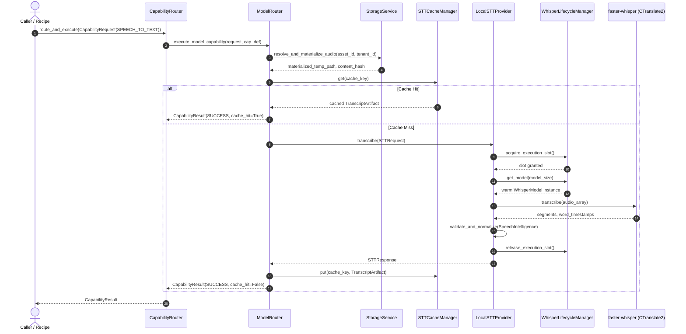

# S28-M04 — Local STT Extraction & Runtime Architecture

Authoritative architectural reference for the modernized Speech-to-Text (STT) runtime extraction in `motion / clean-video-workspace`.

---

## 1. Executive Summary & Objective

In milestone **S28-M04**, the Speech-to-Text inference engine was extracted from legacy MCP tooling (`audio-tools-mcp::analyze_voiceover` via `voiceover_ops.py`) and elevated to a first-class, authoritative runtime inside the AI core:

```text
Incoming Audio Request
        ↓
CapabilityRequest(SPEECH_TO_TEXT)
        ↓
CapabilityRouter
        ↓ (Branch: MODEL)
ModelRouterSeam / ModelRouter.execute_model_capability()
        ↓
ModelRouter.execute_stt()
        ↓
STTProvider (ABC)
        ↓
LocalSTTProvider
        ↓
WhisperLifecycleManager (CTranslate2 faster-whisper + Silero VAD)
        ↓
Normalized SpeechIntelligence + TranscriptArtifact
        ↓
STTCacheManager (Tenant-isolated persistent cache)
```

---

## 2. Core Architectural Invariants

| Invariant | Implementation Mechanism | Enforcement |
|---|---|---|
| **NO CAPABILITY LOSS** | Legacy `audio-tools-mcp::analyze_voiceover` is retained intact as `COMPATIBILITY_ONLY`. | Both runtimes tested and active. |
| **Canonical Capability Identity** | Sole canonical capability is `SPEECH_TO_TEXT`. No vendor-specific capability IDs allowed. | `CapabilityType.SPEECH_TO_TEXT` |
| **Silero VAD Internalization** | Silero VAD is encapsulated as an internal implementation dependency inside `LocalSTTProvider`. | Not exposed as public capability. |
| **Tenant & Storage Isolation** | Inputs must be resolved via `StorageService` or bounded workspace roots. Arbitrary filesystem traversal rejected. | `resolve_and_materialize_audio()` |
| **Deterministic Lifecycle** | Singleton `WhisperLifecycleManager` with warm model caching and lazy initialization. | Single load per model size. |
| **Bounded Concurrency & Backpressure** | `asyncio.Semaphore(2)` limits concurrent inferences; queue depth capped at 4 (`ResourceExhaustedError`). | Prevents CPU/RAM thrashing. |
| **Hardware Detection & Fallback** | Probes CUDA availability with CTranslate2. On failure, falls back to CPU `int8` with telemetry recorded. | `fallback_occurred=True` |
| **Cryptographic Caching** | SHA-256 of audio content + model ID + model version + config hash. | `STTCacheManager` |
| **Fail-Closed on Corrupt Input** | Corrupt/invalid audio strictly raises `InvalidAudioError` / `AudioDecodeError`. Never fabricates fake text. | Zero fake fallbacks. |

---

## 3. End-to-End Execution Flow



---

## 4. Contract Specifications & Normalization

### 4.1 Typed Request (`STTRequest`)
- `request_id`: Correlation UUID.
- `audio_path`: Validated local file path to temporary materialized audio.
- `audio_content_hash`: SHA-256 digest of source audio content.
- `config`: `STTConfig` (model size, language, beam size, temperature, VAD options).
- `source_asset_id`: Canonical asset identifier.
- `timeout_seconds`: Execution deadline.

### 4.2 Authoritative Configuration (`STTConfig`)
Configurations are normalized into canonical sorted JSON and hashed via SHA-256 (`compute_config_hash()`).
Parameters include:
- `model_size`: Default `"base"`.
- `language`: Target language code (or `None` for auto-detect).
- `beam_size`: Default `5`.
- `temperature`: Default `0.0`.
- `word_timestamps`: Default `True`.
- `vad_filter`: Default `True`.
- `vad_threshold`: Default `0.5`.
- `min_speech_duration_ms`: Default `250`.
- `min_silence_duration_ms`: Default `2000`.

### 4.3 Bidirectional Contract Losslessness
`STTResponse` implements lossless bidirectional conversion:
- `to_speech_intelligence() -> SpeechIntelligence`
- `to_transcript_artifact(...) -> TranscriptArtifact`
- `TranscriptArtifact.to_speech_intelligence() -> SpeechIntelligence`

---

## 5. Structured Error Taxonomy

All STT runtime exceptions inherit from `STTError` and map deterministically to canonical `AIError`:

| Exception Class | HTTP / AIErrorCode | Retryable | Description |
|---|---|---|---|
| `InvalidAudioError` | `SCHEMA_VALIDATION_FAILED` | No | Corrupt, empty, or unparseable audio file. |
| `AudioDecodeError` | `SCHEMA_VALIDATION_FAILED` | No | Decoder failure on malformed container/stream. |
| `ModelNotAvailableError` | `CAPABILITY_UNAVAILABLE` | No | Requested model tier not registered or supported. |
| `ModelLoadError` | `DEPENDENCY_FAILED` | Yes | Failure loading weights into CTranslate2 engine. |
| `ModelInferenceError` | `DEPENDENCY_FAILED` | Yes | Crash or memory error during forward pass. |
| `DeviceUnavailableError` | `PROVIDER_UNAVAILABLE` | No | Requested device (CUDA) missing when fallback forbidden. |
| `ResourceExhaustedError` | `RATE_LIMITED` | Yes | Semaphore queue backpressure exceeded. |
| `STTTimeoutError` | `TIMEOUT` | Yes | Execution exceeded configured timeout deadline. |
| `OutputValidationError` | `INVALID_MODEL_OUTPUT` | No | Model emitted invalid timestamps or schema violation. |
| `StorageReadError` | `DEPENDENCY_FAILED` | No | Storage backend failed to read asset bytes. |
| `TenantAccessDeniedError` | `TENANT_ACCESS_DENIED` | No | Cross-tenant access attempt. |

---

## 6. Model Lifecycle & Resource Management

### 6.1 Lazy Loading & Warm Reuse
- Models are initialized upon first invocation via `WhisperLifecycleManager.get_model()`.
- Loaded instances are cached in memory in a thread-safe registry keyed by `model_size`.
- Successive requests reuse the resident weights without reload overhead.

### 6.2 Hardware Fallback Strategy
```text
Probe CUDA Initialization (CTranslate2)
       │
       ├─► Success ──► device="cuda", compute_type="float16"
       │
       └─► Failure ──► device="cpu", compute_type="int8"
                       fallback_occurred=True
                       fallback_reason="<diagnostic_error>"
```

### 6.3 Concurrency Control & Backpressure
- Concurrency bounded by `asyncio.Semaphore(2)`.
- Active queue counter tracks waiting requests.
- When `waiting_count >= max_queue_depth` (default 4), incoming requests immediately fail fast with `ResourceExhaustedError`.
- Prevents unbounded memory accumulation and thrashing under load.

---

## 7. Caching & Storage Architecture

### 7.1 Cache Identity Tuple
The cache key is computed deterministically across 6 dimensions:
```python
cache_key = STTCacheManager.build_cache_key(
    content_hash=source_audio_hash,
    model_id="faster-whisper-base",
    model_version="1.2.1",
    config_hash=config.compute_config_hash(),
)
```

### 7.2 Tenant Isolation
- Materialized audio files are written strictly to tenant-scoped scratch directories (`scratch/stt_temp/req_{request_id}_{hash}/audio_input.wav`).
- Scratch workspaces are registered with `atexit` and `asyncio` finalizers to guarantee disk cleanup.
- Cache entries are stored under project-isolated namespaces.
