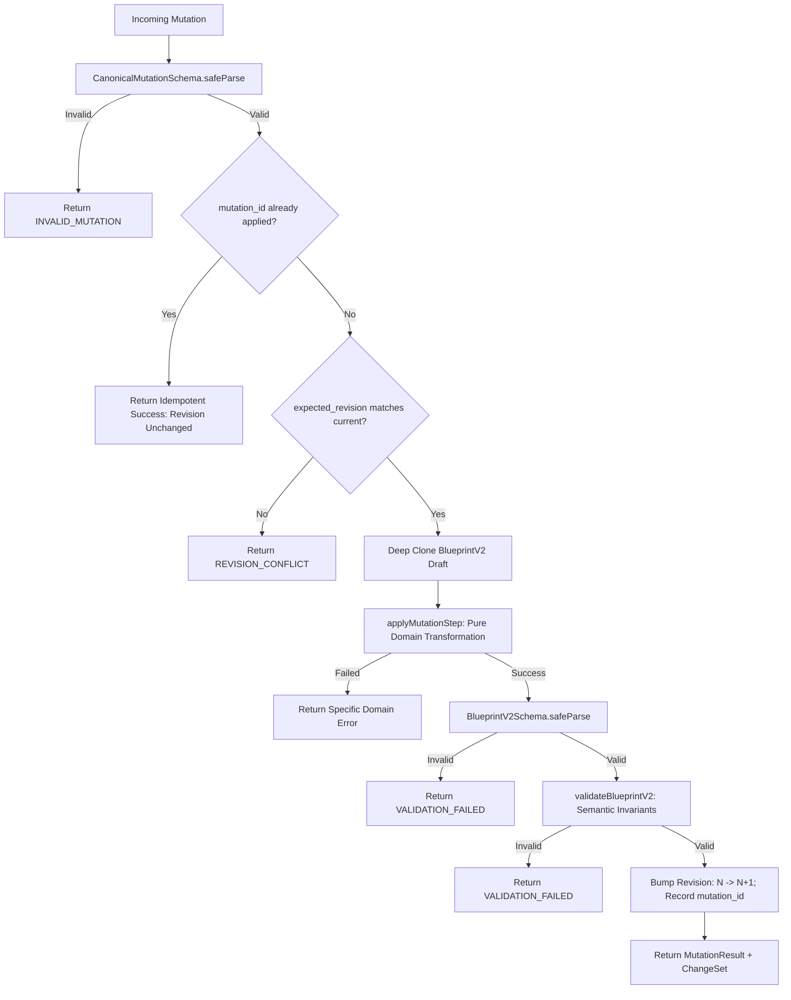

# Canonical Mutation Model Specification: Single Video Authority & Pure Mutation Engine

**Status**: Formally Adopted Architecture Standard  
**Milestone**: S28-R04 Part 1  
**Parent Initiative**: S28-R — Renderer Independence & Live Editor Core  
**Governing Modules**: `contracts/mutations.ts`, `contracts/canonical-video.ts`, `contracts/blueprint.ts`  
**Date**: 2026-10-06  

---

## 1. Executive Summary & Core Mandate

The primary architectural mandate of **S28-R04 Part 1** is to establish the official mutation substrate for editable video projects, ensuring that **`BlueprintV2` remains the singular source of truth**.

Under no circumstances does the platform introduce a secondary persistent or authoring document model (such as an `EditorDocument` or runtime session fork). Every user gesture, autonomous AI decision, and automated system operation is translated into a **typed canonical mutation** that flows through the exact same pure functional pipeline:

```text
USER / AI / SYSTEM
  │
  ▼
[Typed Mutation: CanonicalMutation]
  │
  ▼
[Validation Gate: Zod Schema & Stable IDs]
  │
  ▼
[Pure Mutation Engine: applyMutation / applyBatch]
  │
  ▼
[Mutated BlueprintV2: Revision N -> N+1]
  │
  ▼
[Pure Domain Normalization: normalizeCanonicalVideo]
  │
  ▼
[Pure Frame Evaluation: evaluateVideoAtFrame]
```

---

## 2. Invariants of the Pure Mutation Core

1. **Single Canonical Authority**: `BlueprintV2` is the only persistent authority. All editing operations directly produce a validated, evolved `BlueprintV2`.
2. **Zero Framework Pollution**: The mutation engine imports **0** symbols from React, Remotion, Canvas, DOM, WebGL, filesystem, network, or databases.
3. **Purity & Determinism**: Absolutely zero reliance on `Date.now()`, `performance.now()`, or `Math.random()`. The engine is bit-deterministic across all environments.
4. **No Untyped JSON Patches**: Mutations are domain-aware algebraic operations, not arbitrary RFC 6902 JSON patch objects.
5. **Stable Identity Mandatory**: Every mutation targets entities exclusively via stable alphanumeric identifiers (`scene_id`, `layer_id`, `clip_id`, `track_id`, `keyframe_id`). Array index targeting is strictly rejected.
6. **Immutable & Fail-Closed**: The input document is never mutated in place. If an error or invariant violation occurs, the engine aborts immediately, leaving the original document untouched and returning a structured error.
7. **Unified User/AI Path**: User actions and AI director commands share the identical mutation schemas, validation pipeline, and concurrency semantics.

---

## 3. Canonical Mutation Taxonomy (`CanonicalMutation`)

All mutations are modeled as a discriminated union on `type` conforming to `CanonicalMutationSchema`:

```typescript
export type CanonicalMutation =
  | UpdateTextMutation
  | UpdateTransformMutation
  | AddLayerMutation
  | RemoveLayerMutation
  | DuplicateLayerMutation
  | ReorderLayerMutation
  | MoveClipMutation
  | TrimClipMutation
  | SplitClipMutation
  | SetKeyframeMutation
  | UpdateKeyframeMutation
  | RemoveKeyframeMutation
  | SetTransitionMutation
  | RemoveTransitionMutation
  | AddSceneMutation
  | RemoveSceneMutation
  | DuplicateSceneMutation
  | ReorderSceneMutation
  | UpdateProjectMutation
  | UpdateAudioMutation;
```

### 3.1 Taxonomy Catalog & Behaviors

| Mutation Type | Target Specifier | Payload Highlights | Domain Invariants Enforced |
| :--- | :--- | :--- | :--- |
| `UPDATE_TEXT` | `{ scene_id, layer_id? }` | `text: string`, `typography?: Partial<Typography>` | Updates layer text and/or scene surface text. Keeps surface and layer in sync. |
| `UPDATE_TRANSFORM` | `{ scene_id, layer_id? }` | `transform: Partial<Transform>` | Immutable transform composition. Preserves unpatched spatial properties. |
| `ADD_LAYER` | `{ scene_id }` | `layer: CanonicalLayer`, `placement?` | `layer_id` must be globally unique. Enforces DAG hierarchy (no cycles, no dangling parents). |
| `REMOVE_LAYER` | `{ scene_id, layer_id }` | `cascade?: boolean` | Fail-closed if child layers are parented to it without `cascade=true`. |
| `DUPLICATE_LAYER` | `{ scene_id, layer_id }` | `new_layer_id: string`, `offset?` | Clones layer, verifies `new_layer_id` uniqueness, offsets position, increments z-index. |
| `REORDER_LAYER` | `{ scene_id, layer_id }` | `relative_to?`, `position?`, `new_z_index?` | Re-orders layers in display list and updates z-index explicitly. |
| `MOVE_CLIP` | `{ clip_id?, scene_id?, layer_id? }` | `new_start_frame: number` | Translates startFrame. On scene move, shifts child layer time ranges proportionally. |
| `TRIM_CLIP` | `{ clip_id?, scene_id?, layer_id? }` | `start_trim_frames?`, `end_trim_frames?`, `new_duration_frames?` | Enforces final duration $\ge 1$. Adjusts startFrame and durationFrames safely. |
| `SPLIT_CLIP` | `{ clip_id?, scene_id?, layer_id? }` | `split_frame: number`, `new_scene_id?`, `new_layer_id?` | Splits scene or layer at frame $F$. Reallocates transitions and layer instances safely. |
| `SET_KEYFRAME` | `{ scene_id, layer_id, channel_id?, channel_target? }` | `keyframe: Keyframe` | Upserts keyframe, preserves sorted frame order, validates interpolation parameters. |
| `UPDATE_KEYFRAME` | `{ scene_id, layer_id, keyframe_id }` | `patch: Partial<Keyframe>` | Updates value or timing. Re-sorts and validates channel monotonicity. |
| `REMOVE_KEYFRAME` | `{ scene_id, layer_id, keyframe_id }` | `{}` | Deletes keyframe by stable ID. Channel remains valid. |
| `SET_TRANSITION` | `{ scene_id }` | `transition: TransitionRef` | Validates transition type in catalog and duration $\le$ scene duration. |
| `REMOVE_TRANSITION` | `{ scene_id }` | `{}` | Clears declarative transition out from target scene. |
| `ADD_SCENE` | Project | `scene: BlueprintScene`, `placement?` | `scene_id` must be unique. Inserts at specified position. |
| `REMOVE_SCENE` | `{ scene_id }` | `{}` | Enforces minimum scenes invariant: cannot delete last remaining scene. |
| `DUPLICATE_SCENE` | `{ scene_id }` | `new_scene_id: string`, `new_layer_ids_map?` | Deep-clones scene and remaps child layer IDs to guarantee global uniqueness. |
| `REORDER_SCENE` | `{ scene_id }` | `relative_to: string`, `position: "before" \| "after"` | Relocates scene in timeline sequence. |
| `UPDATE_PROJECT` | Project | `fps?`, `aspect_ratio?`, `meta?` | Updates global video project configuration. |
| `UPDATE_AUDIO` | Project | `voiceover?`, `music?` | Updates voiceover or background music timing, volume, ducking. |

---

## 4. Execution Pipeline & Post-Mutation Gate



1. **Idempotency Gate**: Replaying an already applied `mutation_id` immediately returns a successful result with `idempotent: true` without duplicating work or bumping the revision.
2. **Optimistic Concurrency Gate**: If `expected_revision` does not match `blueprint.revision`, execution fails closed with `REVISION_CONFLICT`.
3. **Step Execution**: The pure transformation runs on an isolated clone.
4. **Validation Gate**: The post-mutation draft is validated against `BlueprintV2Schema` and `validateBlueprintV2`. If any invariant is violated, the transaction aborts.
5. **Commit**: Revision is incremented $N \to N+1$, `mutation_id` is appended to `applied_mutations`, and the updated immutable document is returned alongside the computed `ChangeSet`.
