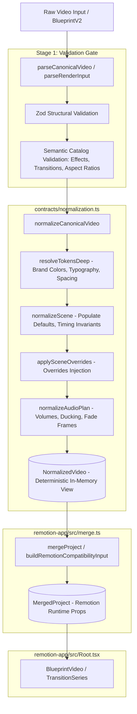

# Canonical Video Normalization Specification

**Status**: Formally Adopted Architecture Standard  
**Milestone**: S28-R02  
**Parent Initiative**: S28-R — Renderer Independence & Live Editor Core  
**Governing Module**: `contracts/normalization.ts`  
**Compatibility Consumer**: `remotion-app/src/merge.ts`  
**Implementation Date**: 2026-10-06  

---

## 1. Executive Summary & Purpose

In S28-R01, the reality audit identified **CPL-008**: domain normalization logic was housed inside `remotion-app/src/merge.ts`. Even though `merge.ts` contained no direct Remotion imports, its location inside the Remotion application directory coupled core video normalization to the Remotion execution container, preventing headless engines or future editor components from reusing project normalization.

**S28-R02** extracts this domain logic into **`contracts/normalization.ts`**, establishing a clean separation between:
1. **Pure Domain Normalization**: Engine-neutral defaults, brand token resolution, override merging, and timeline calculations.
2. **Runtime Engine Preparation**: Packaging normalized domain data into engine-specific formats required by Remotion (`Composition` props, `TransitionSeries` parameters).

---

## 2. Architecture & Normalization Pipeline

The normalization process is a unidirectional, pure functional pipeline:



---

## 3. Pure Domain Normalization vs Runtime Preparation

The normalization responsibilities are divided with strict boundaries:

| Concern | Pure Domain Normalization (`contracts/normalization.ts`) | Runtime Engine Preparation (`remotion-app/src/merge.ts`) |
| :--- | :--- | :--- |
| **Execution Environment** | Any JS/TS environment (Node, Bun, Web Worker, Deno, Browser) | Remotion runtime environment |
| **Dependencies** | Pure Zod schemas, zero UI or rendering libraries | Remotion-compatible type signatures |
| **Brand Token Resolution** | Deep recursive replacement of `{brand.key}` into resolved values | Passthrough of resolved brand tokens |
| **Scene Normalization** | Derives `startFrame`, `endFrame`, `startMs`, `endMs`, clamps durations | Adapts scenes to Remotion sequence format |
| **Overrides Merging** | Pure functional merge of `SceneOverride` into scene template props | Passthrough to composition props |
| **Transition Calculation** | Validates transition types and computes nominal total frames | Prepares series transition specs for `TransitionSeries` |
| **Audio Plan** | Normalizes volume bounds $[0.0, 1.0]$, ducking thresholds, fade frames | Maps audio to Remotion `<Audio>` tags |
| **Deterministic Guarantee** | Pure function: identical input $\to$ bit-identical output | Prepares metadata for `calculateMetadata` |

---

## 4. Normalization Invariants & Mathematical Guarantees

All normalizers in `contracts/normalization.ts` satisfy the following formal invariants:

### 4.1 Invariant 1: Pure Function & Zero Side Effects
- Normalization performs zero disk I/O, zero network calls, and zero mutable modifications of the input arguments.
- Deep clones or immutable spreads are used for all transformations.

### 4.2 Invariant 2: Idempotency
For any already normalized video document $V_{norm}$:
$$\operatorname{normalizeCanonicalVideo}(\operatorname{normalizeCanonicalVideo}(V)) \equiv \operatorname{normalizeCanonicalVideo}(V)$$

### 4.3 Invariant 3: Temporal Monotonicity & Validity
For all normalized scenes $S_i$ ($i \in [0, N-1]$):
1. $S_i.\text{durationFrames} > 0$
2. $S_i.\text{startFrame} \ge 0$
3. $S_i.\text{endFrame} = S_i.\text{startFrame} + S_i.\text{durationFrames}$
4. $\text{startMs} = \operatorname{round}\left(\frac{S_i.\text{startFrame} \times 1000}{\text{fps}}\right)$
5. $\text{endMs} = \operatorname{round}\left(\frac{S_i.\text{endFrame} \times 1000}{\text{fps}}\right)$

### 4.4 Invariant 4: Audio Volume Clamping
For all audio volumes $V_{audio}$:
$$0.0 \le V_{audio} \le 1.0$$
Ducking target volumes, fade in frames, and fade out frames are strictly non-negative.

---

## 5. API Reference (`contracts/normalization.ts`)

### `normalizeCanonicalVideo(blueprint, options?)`
```typescript
export function normalizeCanonicalVideo(
  blueprint: BlueprintV2,
  options?: NormalizationOptions
): NormalizedVideo
```
The primary entrypoint. Accepts a parsed `BlueprintV2` and optional overrides/defaults, returning an immutable `NormalizedVideo`.

### `normalizeScene(scene, index, defaultFps, overrides?)`
```typescript
export function normalizeScene(
  scene: BlueprintScene,
  index: number,
  defaultFps: number,
  overrides?: SceneOverride
): NormalizedScene
```
Normalizes an individual scene, injecting index-based timing if `startFrame` is omitted, resolving template-specific default values, and merging scene-level overrides.

### `resolveTokensDeep(target, tokens)`
```typescript
export function resolveTokensDeep<T>(target: T, tokens: Record<string, any>): T
```
Recursively traverses objects, arrays, and strings, replacing pattern tokens like `{brand.colors.primary}` with resolved primitive values.

### `calculateTotalDurationFrames(scenes, transitions?)`
```typescript
export function calculateTotalDurationFrames(
  scenes: Array<{ startFrame?: number; durationFrames: number }>,
  transitions?: Array<{ duration_frames?: number }>
): number
```
Calculates total duration in frames. Returns the max scene end frame for non-overlapped timelines, or adjusts for declarative transition overlaps.

### `framesToMs(frames, fps)` & `msToFrames(ms, fps)`
Pure mathematical utilities for bidirectional frame-millisecond conversion.

---

## 6. Compatibility Layer (`remotion-app/src/merge.ts`)

To ensure **100% backwards compatibility** with the existing render pipeline, `remotion-app/src/merge.ts` has been refactored into a thin adapter:

```typescript
// remotion-app/src/merge.ts
import { 
  normalizeCanonicalVideo, 
  normalizeScene, 
  resolveTokensDeep,
  type NormalizedVideo,
  type NormalizedScene 
} from "../../contracts/normalization";
import type { BlueprintV2, SceneOverride } from "../../contracts/blueprint";

// Preserve legacy type aliases
export type MergedProject = NormalizedVideo;
export type MergedScene = NormalizedScene;
export { resolveTokensDeep, normalizeScene };

export function mergeProject(
  blueprint: BlueprintV2,
  overrides?: Record<string, SceneOverride>
): MergedProject {
  return normalizeCanonicalVideo(blueprint, { sceneOverrides: overrides });
}
```

This guarantees that `Root.tsx`, `render_project.py`, `probe_qc.py`, and existing test suites continue executing with zero code changes, while migrating the entire domain authority into `contracts/`.
