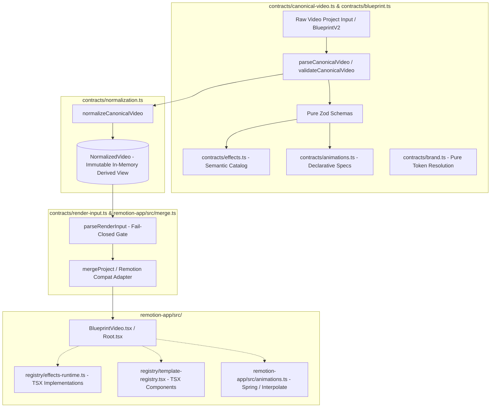

# Canonical Editable Video Contract Specification

**Status**: Formally Adopted Architecture Standard  
**Milestone**: S28-R02  
**Parent Initiative**: S28-R — Renderer Independence & Live Editor Core  
**Governing Authority**: `contracts/canonical-video.ts` (`BlueprintV2` Evolved)  
**Implementation Date**: 2026-10-06  

---

## 1. Executive Summary & Architectural Mandate

The primary goal of **S28-R02** is to transform the video project specification into a **pure data contract**, 100% independent of React, Remotion, and any specific rendering engine or filesystem layout. This contract establishes the singular foundational substrate upon which both the headless render pipeline and future Live Editor capabilities (S28-R03 through S28-R10) operate.

### Core Architectural Invariants:
1. **Single Authority (No Dual Truth)**: We do NOT introduce a secondary persistent model (e.g. `VideoDocument` vs `BlueprintV2`). The canonical video authority is the evolved, purified `BlueprintV2` contract accessible via `contracts/canonical-video.ts` and `contracts/blueprint.ts`.
2. **Zero Framework Pollution**: The contract layer (`contracts/*`) has **0 imports** from `react`, `remotion`, `@remotion/*`, or runtime UI components.
3. **Engine Neutrality**: All spatial, temporal, styling, transition, and effect properties are declarative, serializable, and engine-agnostic data structures.
4. **Deterministic Fail-Closed Validation**: Schema parsing (`parseCanonicalVideo`, `parseRenderInput`) validates inputs strictly before runtime execution, guaranteeing complete semantic and structural integrity.

---

## 2. Single Video Authority Architecture

Prior to S28-R02, `contracts/blueprint.ts` leaked dependencies transitively into the Remotion engine (`registry/effects-runtime.ts` $\to$ `templates/effects/engine-bridge.tsx` $\to$ `@/engine/*`). Simultaneously, `contracts/render-input.ts` pulled concrete React TSX components across all 105 templates via `registry/template-registry.tsx`.

S28-R02 purifies this architecture while maintaining a single, unambiguous authority:



---

## 3. Raw Input vs Normalized Representation

The system strictly distinguishes between persistent raw input and the deterministic normalized in-memory representation.

### 3.1 Raw Canonical Input (`BlueprintV2`)
- **Nature**: Persistent, user-authored or AI-generated input document (e.g. `05_blueprint.json`).
- **Characteristics**:
  - May omit optional default fields (e.g., transition durations, volume envelopes, ducking parameters).
  - May contain project-level or scene-level overrides (`SceneOverride`).
  - May contain unresolved brand tokens (e.g., `brand.primary_color`).
  - Contains logical asset references (`asset_id`) or relative URIs.

### 3.2 Canonical Normalized Video (`NormalizedVideo`)
- **Nature**: In-memory, deterministic, fully resolved representation derived exclusively from valid canonical input.
- **Characteristics**:
  - **Not a secondary persistent authority**: It is ephemeral, fully reproducible, and immutable.
  - All brand tokens resolved into concrete RGBA/Hex values.
  - All scene overrides merged and resolved deterministically.
  - All default timing parameters, transition overlaps, and audio envelopes populated.
  - Absolute timeline timing (`startFrame`, `endFrame`, `startMs`, `endMs`) verified and calculated.

---

## 4. Time & Duration Model

The Canonical Video Contract enforces a robust, engine-neutral timing model:

### 4.1 Invariants
- `fps`: Positive integer, strictly greater than 0 (Standard: 24, 25, 30, 60; default: 30).
- `durationFrames`: Positive integer, strictly greater than 0.
- `startFrame`: Non-negative integer ($\ge 0$).
- `endFrame`: Derived deterministically as $\text{startFrame} + \text{durationFrames}$.

### 4.2 Time Conversion Semantics
Timing conversion between discrete video frames and continuous milliseconds is defined by pure deterministic functions:

$$\text{framesToMs}(\text{frame}, \text{fps}) = \operatorname{round}\left(\frac{\text{frame} \times 1000}{\text{fps}}\right)$$

$$\text{msToFrames}(\text{ms}, \text{fps}) = \operatorname{round}\left(\frac{\text{ms} \times \text{fps}}{1000}\right)$$

### 4.3 Transition Invariants
When transitions exist between consecutive scenes:
- Transition duration $\le \min(\text{scene}_A\text{.durationFrames}, \text{scene}_B\text{.durationFrames})$.
- Supported declarative transition types: `fade`, `wipe`, `slide`, `zoom`, `flip`, `dissolve`, `crossfade`, `glitch`, `blur`, `none`.
- Canonical video retains raw scene boundaries and declarative transition specs. Calculation of overlapped playback duration is isolated to the Remotion runtime adapter (`calculateTotalDurationFrames` or Remotion `TransitionSeries`).

---

## 5. Asset & Media Identity

To eliminate filesystem and engine lock-in, asset resolution adheres to logical asset identity:

### 5.1 Asset References (`AssetRef`)
- Assets are identified by logical identifiers (`asset_id`) or platform-neutral URIs (`media_url`, `storage_uri`).
- **Forbidden in Canonical Contract**: Hardcoded filesystem paths to engine bundles, such as `/remotion-app/public/projects/...` or `staticFile(...)`.
- Resolving logical asset IDs to physical or cached paths is the responsibility of external materializers (`scripts/core/materializer.py`, `ai/contracts/media_ops.py`), NOT the contract layer.

### 5.2 Supported Asset Media Types
- `image`: PNG, JPEG, WebP, SVG.
- `video`: MP4, WebM (with metadata: duration, aspect ratio, audio stream present).
- `audio`: MP3, WAV, AAC (voiceover, background score, sound effects).

---

## 6. Semantic Effects & Animation Identity

Prior to S28-R02, importing effect schemas loaded React component trees and Remotion packages. S28-R02 completely decouples semantic identity from execution.

### 6.1 Semantic Effects Catalog (`contracts/effects.ts`)
Effect definitions are pure metadata structures:

```typescript
export interface SemanticEffectDefinition {
  effect_id: string;
  name: string;
  category: EffectCategory; // 'motion' | 'visual' | 'overlay' | 'filter' | '3d' | 'transition'
  description: string;
  parameter_schema: Record<string, EffectParamMeta>;
  semantic_behavior: string;
  required_capabilities: string[];
  executable: boolean;
}
```

- **Catalog Completeness**: All 45 registered effects are represented in `SEMANTIC_EFFECTS_CATALOG`.
- **Executable Capability Boundary**:
  - `11` effects are flagged `executable: true` (have working runtime implementations in `registry/effects-runtime.ts`).
  - `34` effects are flagged `executable: false` (documented unbridged effects).
- **Validation Semantics**: Fail-closed validation enforces that every effect referenced in a canonical project exists in the semantic catalog. Project validation rejects non-executable effects if execution is required by policy.

### 6.2 Declarative Animation Specifications (`contracts/animations.ts`)
Animation specs define abstract mathematical motions without depending on Remotion's `spring()` or `interpolate()`:

```typescript
export interface AnimationSpec {
  name: string;
  type: AnimationType; // 'fade' | 'slide' | 'scale' | 'rotate' | 'combined'
  duration_frames: number;
  easing: EasingType; // 'linear' | 'ease_in' | 'ease_out' | 'ease_in_out' | 'spring'
  spring?: SpringConfig; // { damping: number; stiffness: number; mass: number; overshootClamping?: boolean }
  params: Record<string, number | string>;
}
```

Execution logic (`applyAnimation`, `spring`, `interpolate`) is housed strictly within the Remotion runtime layer at `remotion-app/src/animations.ts`.

---

## 7. Audio Identity & Mixing Plan

Audio orchestration is completely captured in the pure canonical contract:

```typescript
export interface AudioPlan {
  voiceover?: {
    asset_id?: string;
    url?: string;
    volume: number; // 0.0 - 1.0
    start_frame?: number;
    ducking?: {
      target_volume: number;
      fade_in_frames: number;
      fade_out_frames: number;
    };
  };
  bgm?: {
    asset_id?: string;
    url?: string;
    volume: number; // 0.0 - 1.0
    loop?: boolean;
    fade_in_frames?: number;
    fade_out_frames?: number;
  };
  sfx?: Array<{
    asset_id?: string;
    url?: string;
    volume: number;
    start_frame: number;
  }>;
}
```

The canonical normalizer verifies volume envelope bounds, clamps ducking parameters, and aligns voiceover start frames with scene boundaries.

---

## 8. Versioning & Evolution Guarantees

1. **Backwards Compatibility**: Any valid Blueprint V2 document remains 100% valid under `parseCanonicalVideo()` and `parseRenderInput()`.
2. **Deterministic Upgrades**: As the schema evolves towards S28-R03 (Tracks, Clips, Layers), fields will be introduced additively with backward-compatible normalization defaults.
3. **Automated Conformance**: Automated architecture guards (`test_s28_r02_architecture_guards.test.ts` and `test_s28_r02_architecture_guards.py`) run in CI to reject any commit introducing React or Remotion imports into `contracts/`.
