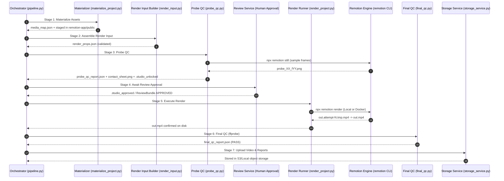

# Current Render Flow: End-to-End Reality Audit

**Status**: Verified Reality Specification  
**Milestone**: S28-R01  
**Audited SHA**: `69b8798b2e2296bc5a24af411ac44133c072a029`  

---

## 1. Engine vs. Executor Separation

An essential architectural distinction in the current system is between the **Rendering Engine** and the **Execution Environment (Executor)**:

```text
+-----------------------------------------------------------------------------------+
| RENDER ENGINE (What evaluates frames and composes pixels)                         |
| Remotion 4.0.525 + React 19.3.0 + Chrome Headless Shell + Webpack Bundler          |
+-----------------------------------------------------------------------------------+
                                         |
                                         v
+-----------------------------------------------------------------------------------+
| RENDER EXECUTORS (Where and how the engine is invoked)                             |
| 1. Local Host Executor:    npx remotion render (Node.js subprocess in remotion-app)|
| 2. Docker Executor:        clean-video-builder container with volume mounts        |
| 3. Worker Daemon:          PipelineWorker leasing jobs via SQLite/Postgres CAS     |
| 4. Probe Still Runner:     npx remotion still (headless frame extraction)          |
+-----------------------------------------------------------------------------------+
```

Docker is **not** a renderer; it is an isolated execution container for the Remotion engine. Remotion is **not** an environment; it is the software rendering engine.

---

## 2. Step-by-Step Render Pipeline

The production render pipeline follows a strictly ordered, 10-stage lifecycle governed by `scripts/pipeline.py` and guarded by fail-closed gates:



---

## 3. End-to-End Pipeline Step Audit Matrix

| Step # | Stage Name | Authority | Input | Output | Artifact Type | Remotion Specific? | Replaceable? | Failure Semantics | Retry Policy |
| :---: | :--- | :--- | :--- | :--- | :--- | :---: | :---: | :--- | :--- |
| **1** | **Asset Materialization** | `scripts/core/materializer.py` | `05_blueprint.json`, `02_asset_manifest.json` | `media_map.json`, files in `remotion-app/public/...` | Persistent (versioned generation) | **YES** (staged in remotion-app/public) | **YES** | Preflight abort; rollback temporary media map | `SAFE_TO_RETRY` |
| **2** | **Render Input Assembly** | `scripts/core/render_input.py` | Blueprint, Manifest, Brand, Overrides, Media Map | `render_props.json` | Persistent project artifact | **NO** (Neutral envelope matching contracts) | **NO** (Domain standard) | Fail-closed on missing artifact or schema error | `SAFE_TO_RETRY` |
| **3** | **Probe Frame Planning** | `scripts/core/probe_planner.py` | `05_blueprint.json`, canonical `fps` | `ProbeFramePlan` (frame list, reasons) | In-memory / embedded in report | **NO** | **NO** | Fail-closed on missing FPS or malformed timings | `SAFE_TO_RETRY` |
| **4** | **Probe Still Rendering** | `scripts/gates/probe_qc.py` | `render_props.json`, sampled frame list | `probe_XX_fYY.png`, `contact_sheet.png` | Persistent evidence artifacts | **YES** (calls `remotion still`) | **YES** | `EXECUTION_FAILURE` if render crashes; `CONTENT_FAILURE` if blank | `SAFE_TO_RETRY` |
| **5** | **Probe Report & Seal** | `scripts/gates/probe_qc.py` | Rendered stills, contact sheet, hashes | `probe_qc_report.json`, `.seal`, `.studio_unlocked` | Cryptographically signed evidence | **NO** | **NO** | Seal mismatch aborts; locks studio & render | `SAFE_TO_RETRY` |
| **6** | **Human Review Gate** | `scripts/core/review_service.py` | ReviewBundle, `.studio_approved` marker | `ReviewDecision` (APPROVED) | Durable SQLite/JSON record | **NO** | **NO** | Halts pipeline in `AWAITING_REVIEW`; render blocked | N/A (State pause) |
| **7** | **Pre-Render Authorization** | `scripts/render_project.py` | Project state, active ReviewDecision | Authorization token / validation pass | Runtime check | **NO** | **NO** | `RenderNotAuthorizedError` (Hard block) | Non-retryable without approval |
| **8** | **Remotion Webpack Check** | `remotion-app/remotion.config.ts` | CLI args, `.studio_unlocked` | Webpack build configuration | Runtime check | **YES** | **YES** | `process.exit(1)` with `HARD STOP` message | Must satisfy Probe QC |
| **9** | **Render Execution** | `scripts/render_project.py` | `render_props.json`, Remotion CLI | `out.attempt-N.tmp.mp4` $\to$ `out.mp4` | Final heavy media artifact | **YES** (executes Remotion engine) | **YES** | Subprocess error code; temp file cleaned or replaced | `CONDITIONALLY_RETRYABLE` |
| **10**| **Final QC Gate** | `scripts/gates/final_qc.py` | `out.mp4`, `05_blueprint.json` | `final_qc_report.json` (PASS / FAIL) | Auditable QC report | **NO** (pure `ffprobe`) | **NO** | `FAIL` aborts pipeline; prevents release | `SAFE_TO_RETRY` |
| **11**| **Storage Upload** | `scripts/core/worker.py` | `out.mp4`, QC reports | S3/Local object key | Durable cloud artifact | **NO** | **NO** | Network/permission error; run marked FAILED | `SAFE_TO_RETRY` |

---

## 4. Where Remotion Begins and Where It Ends

- **Remotion Begins**:
  - In asset layout: When `materializer.py` copies files into `remotion-app/public/`.
  - In verification: When `probe_qc.py` calls `npx remotion still`.
  - In rendering: When `render_project.py` invokes `npx remotion render`.
- **Remotion Ends**:
  - The exact moment `npx remotion render` closes the video stream and exits with code 0, producing `out.mp4`.
  - Everything after that point (`final_qc.py`, AV-sync analysis, stream probing, ReviewService updates, and StorageService uploads) has **zero dependency on Remotion**.
