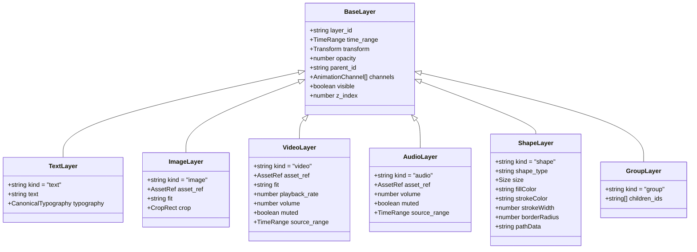

# Canonical Layer Model & Spatial Coordinates Specification

**Status**: Formally Adopted Architecture Standard  
**Milestone**: S28-R03  
**Parent Initiative**: S28-R — Renderer Independence & Live Editor Core  
**Governing Module**: `contracts/layers.ts`  
**Date**: 2026-10-06  

---

## 1. Executive Summary

The Canonical Layer Model establishes a pure, engine-neutral representation of visual and audio elements. It contains **ZERO** imports from React, Remotion, Canvas, DOM, WebGL, or CSSProperties, allowing visual elements to be evaluated, positioned, animated, and composed deterministically by any runtime.

---

## 2. Canonical Layer Taxonomy (`CanonicalLayer`)

All visual and audio items are represented as a discriminated union on `kind`:

---

## 3. Spatial Coordinates & Coordinate System

To ensure bit-level layout parity between headless renderers and future web/canvas editor viewports, the coordinate system is explicitly locked:

1. **Origin `(0, 0)`**: Top-left corner of the canvas.
2. **$+X$ Direction**: Extends to the right.
3. **$+Y$ Direction**: Extends downwards.
4. **Coordinate Unit**: Absolute pixel values based on canvas dimensions:
   - `16:9`: $1920 \times 1080$ px
   - `9:16`: $1080 \times 1920$ px
   - `1:1`: $1080 \times 1080$ px
5. **Anchor Point `(anchor.x, anchor.y)`**:
   - `(0.0, 0.0)`: Top-left
   - `(0.5, 0.5)`: Center (default)
   - `(1.0, 1.0)`: Bottom-right

---

## 4. Transform Composition Mathematics

Hierarchical groups compose transforms without creating DOM or React component trees. Given parent transform $T_p$ and child transform $T_c$:

$$\theta_p = \frac{T_p.\text{rotation} \times \pi}{180}$$

$$\begin{bmatrix} x_{\text{child\_rot}} \\ y_{\text{child\_rot}} \end{bmatrix} = \begin{bmatrix} \cos(\theta_p) & -\sin(\theta_p) \\ \sin(\theta_p) & \cos(\theta_p) \end{bmatrix} \begin{bmatrix} T_c.\text{position.x} \times T_p.\text{scale.x} \\ T_c.\text{position.y} \times T_p.\text{scale.y} \end{bmatrix}$$

$$T_{\text{composed}}.\text{position} = T_p.\text{position} + \begin{bmatrix} x_{\text{child\_rot}} \\ y_{\text{child\_rot}} \end{bmatrix}$$

$$T_{\text{composed}}.\text{scale} = \begin{bmatrix} T_p.\text{scale.x} \times T_c.\text{scale.x} \\ T_p.\text{scale.y} \times T_c.\text{scale.y} \end{bmatrix}$$

$$T_{\text{composed}}.\text{rotation} = T_p.\text{rotation} + T_c.\text{rotation}$$

$$T_{\text{composed}}.\text{opacity} = \operatorname{clamp}(T_p.\text{opacity} \times T_c.\text{opacity}, 0.0, 1.0)$$

This pure composition is implemented in `composeTransform()` in `contracts/layers.ts`.

---

## 5. Group Graph Safety & Fail-Closed Invariants

Groups form a Directed Acyclic Graph (DAG). The validator (`validateLayerHierarchy`) strictly enforces:
1. **No Self-Parenting**: A layer cannot specify `parent_id === layer_id`.
2. **No Missing Parents**: Any `parent_id` referenced must exist in the layer set.
3. **No Cycles**: A path $A \to B \to A$ is rejected fail-closed during validation.
4. **Unique Stable IDs**: All `layer_id`s in a project must be strictly unique.
