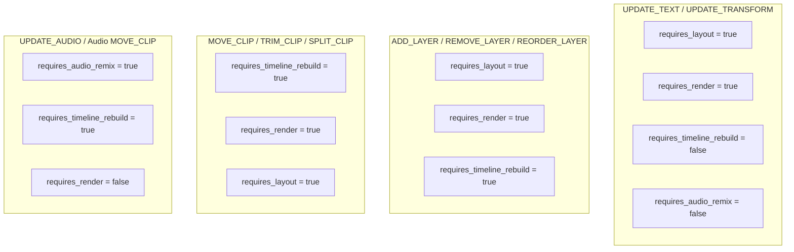

# Mutation Invalidation Model & ChangeSet Specification

**Status**: Formally Adopted Architecture Standard  
**Milestone**: S28-R04 Part 1  
**Parent Initiative**: S28-R — Renderer Independence & Live Editor Core  
**Governing Module**: `contracts/mutations.ts`  
**Date**: 2026-10-06  

---

## 1. Executive Summary

When editing video projects at interactive frame rates, re-rendering or re-evaluating the entire project on every keystroke or transform update causes prohibitive latency. The **Mutation Invalidation Model** provides granular metadata describing precisely what entities, temporal windows, and computational subsystems were dirtied by an edit.

This metadata enables downstream consumers (Live Preview Engine, Canvas Viewport, Audio Mixer, and Cache Layers) to perform **targeted, selective invalidation** instead of global invalidation.

---

## 2. ChangeSet Architecture (`ChangeSet`)

Every mutation or batch result includes a computed `ChangeSet`:

```typescript
export interface InvalidationMetadata {
  requires_layout: boolean;
  requires_render: boolean;
  requires_audio_remix: boolean;
  requires_timeline_rebuild: boolean;
}

export interface ChangeSet {
  affected_scene_ids: string[];
  affected_layer_ids: string[];
  affected_track_ids: string[];
  affected_clip_ids: string[];
  affected_keyframe_ids: string[];
  time_range?: {
    startFrame: number;
    endFrame: number;
  };
  invalidation: InvalidationMetadata;
  mutations_count: number;
}
```

---

## 3. Subsystem Invalidation Flags

| Flag | Purpose | Triggered By | Consumer Action |
| :--- | :--- | :--- | :--- |
| `requires_layout` | Spatial layout / bounding rects altered | `UPDATE_TEXT`, `UPDATE_TRANSFORM`, `ADD_LAYER`, `REMOVE_LAYER`, `REORDER_LAYER` | Recalculate text dimensions, anchor offsets, and transform matrices. |
| `requires_render` | Visual pixel output altered | Text changes, transforms, visual layers, keyframes, transitions, scenes | Evict frame cache for frames within `time_range`. Trigger canvas repaint. |
| `requires_audio_remix` | Audio mix or envelope altered | Audio layer edits, voiceover/bgm clip move, audio plan volume/ducking | Invalidate audio render buffer. Re-run Web Audio / mixer graph. |
| `requires_timeline_rebuild` | Track/clip structure altered | Layer add/remove/reorder, clip move/trim/split, scene add/remove/reorder | Rebuild `CanonicalTimeline` and derived track lanes. Update timeline UI rulers. |

---

## 4. Invalidation Profiles by Mutation Category



---

## 5. Temporal Invalidation Range (`time_range`)

The `time_range` attribute specifies the exact temporal boundary $[t_{\text{start}}, t_{\text{end}})$ impacted by the modification:
- For a layer edit: matches `layer.time_range`.
- For a scene edit: matches $[s.\text{startFrame}, s.\text{startFrame} + s.\text{durationFrames})$.
- For compound batches: computed as the union bounding box:
  $$t_{\text{batch\_start}} = \min(t_{\text{mut\_start}}), \quad t_{\text{batch\_end}} = \max(t_{\text{mut\_end}})$$

This enables frame caches to retain pre-rendered frames outside this temporal window, drastically reducing evaluation and preview latency.

---

## 6. Undo/Redo & Transient Gesture Invalidation

### 6.1 Transient Gestures (Live Drag)
- During pointer drag, `applyTransientMutation()` invalidates spatial layout and immediate viewport frame cache without pushing invalidation to durable track builders.
- On `commitGesture()`, the combined invalidation `ChangeSet` across all affected entities is emitted to update the broader UI and background pre-renderer.

### 6.2 Undo / Redo Invalidation
- When `undo()` or `redo()` is called, `HistoryEntry.changed_entities` identifies the exact scenes, layers, tracks, clips, and keyframes that reverted.
- Downstream viewports and timeline rulers selectively re-evaluate only the inverted components, preserving peak 60fps interactivity.

