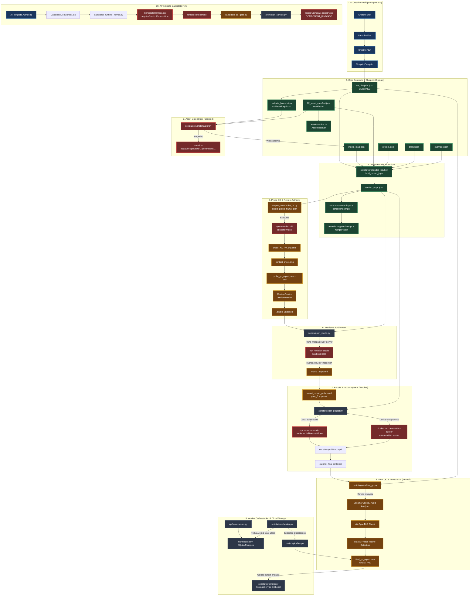
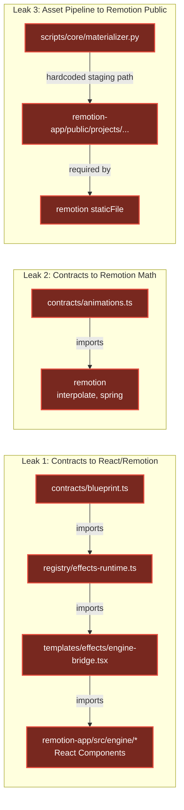

# Render & Editor Dependency Graph

**Status**: Verified Reality Graph  
**Milestone**: S28-R01  
**Audited SHA**: `69b8798b2e2296bc5a24af411ac44133c072a029`  

---

## 1. Global System Architecture & Dependency Flow

This diagram captures the **actual reality** of data, code, and execution flow across the system today, clearly distinguishing:
- **CORE DOMAIN** (Engine-neutral business logic and canonical models)
- **AI INTELLIGENCE** (Creative direction, narrative, compilation)
- **REMOTION RUNTIME** (Engine-specific TSX components, hooks, bundler)
- **INFRASTRUCTURE & ORCHESTRATION** (CLI, workers, storage, API)
- **QC & VERIFICATION** (Probe gates, final container validation)

---

## 2. Dependency Inversions & Architecture Leaks

Detailed inspection of the repository reveals three architectural inversion loops where high-level or neutral layers depend on lower-level runtime implementation:

---

## 3. Boundary Ownership Summary

| Architectural Boundary | Current Boundary Status | Target Future Status (S28-R) |
| :--- | :--- | :--- |
| **CreativePlan $\to$ Blueprint** | **100% Clean** (via `BlueprintCompiler`) | Maintain clean separation |
| **Blueprint $\to$ Contracts** | **Leaked** (`EFFECTS_RUNTIME`, `animations.ts`) | Purify contracts; eliminate React/Remotion imports |
| **Template Identity $\to$ Component** | **Coupled** (`registry.tsx` binds directly to TSX) | Split into Semantic Catalog and Remotion Bindings |
| **Asset Resolution $\to$ Filesystem** | **Coupled** (`remotion-app/public`) | Decouple asset storage; serve via URL or provider |
| **Probe QC $\to$ Render Engine** | **Coupled** (`npx remotion still`) | Wrap behind `VideoRenderer.render_still()` |
| **Render Execution $\to$ Engine** | **Coupled** (`remotion render`) | Wrap behind `RemotionRendererAdapter` |
| **Final QC $\to$ Output Container** | **100% Clean** (`ffprobe` on `out.mp4`) | Maintain as permanent standard |
| **Worker / Storage $\to$ Engine** | **100% Clean** (subprocess & S3 abstraction) | Maintain as permanent standard |
