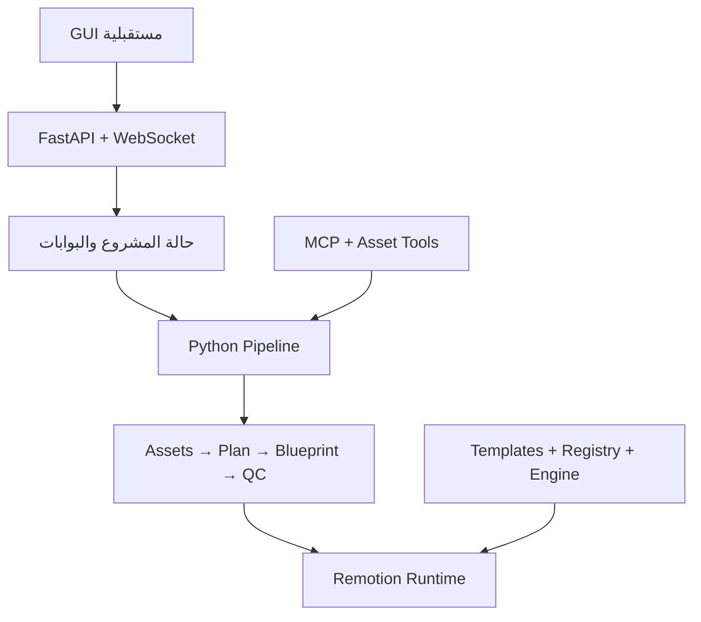
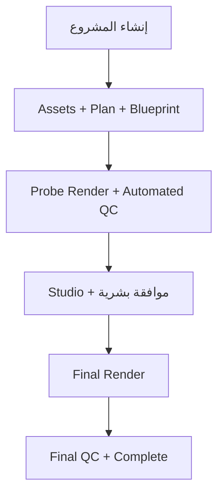

## الحكم الصريح

**لا تبدأ ببناء الـGUI فوق النسخة الحالية.**
المشروع قوي جدًا كفكرة وبنية أولية، لكنه الآن في حالة: **أنظمة كثيرة ممتازة منفردة، لكنها لا تتفق بالكامل على حقيقة واحدة عند التشغيل**.

المشكلة ليست “كم bug صغير”. عندك اختلافات في العقود والحالة وترتيب المراحل ستجعل الـGUI يعرض نجاحًا بينما الـpipeline يستخدم بيانات مختلفة.

## كيف فهمت المشروع

عمليًا عندك سبعة أجزاء:

1. Python orchestration والبوابات.
2. FastAPI الذي سيخدم الـGUI.
3. العقود بين Python وTypeScript.
4. Remotion renderer.
5. Registry والقوالب.
6. Engine والمؤثرات.
7. Plugin وMCP وإدارة الأصول.

الفكرة المعمارية ممتازة. المشكلة في الحدود بينها.

## أخطر الموانع قبل الـGUI

| الخطورة | المشكلة                                                                                                         | النتيجة                                                |
| ------- | --------------------------------------------------------------------------------------------------------------- | ------------------------------------------------------ |
| حرج     | الـAPI يكتب `blueprint.json` بينما الـpipeline والرندر يقرآن `05_blueprint.json`                                | المستخدم يعدّل شيئًا والـrenderer يستخدم شيئًا آخر     |
| حرج     | `blueprint.schema.json` فارغ فعليًا ويقبل `{}`                                                                  | أي بيانات تالفة يمكن أن تمر على أنها سليمة             |
| حرج     | توجد ثلاث حالات: `.pipeline_state.json` و`.pipeline_checkpoint.json` و`.session_state.json`                     | لا يوجد مصدر حقيقة واحد                                |
| حرج     | ترتيب الـpipeline هو Render ثم Probe-QC، بينما Remotion يمنع الرندر قبل أن ينشئ Probe-QC ملف `.studio_unlocked` | دورة تشغيل جديدة لا تستطيع الوصول للرندر بشكل صحيح     |
| حرج     | `probe_qc.py` يمكن أن ينتج تقرير `fail` ثم ينتهي بـexit code 0                                                  | الـpipeline يستطيع إعلان `QC_PASSED` رغم فشل الفحص     |
| حرج     | ملف `.studio_approved` يُنشأ تلقائيًا أثناء Scaffold رغم أن الوثائق تقول إن المستخدم ينشئه بعد المعاينة         | الموافقة البشرية حاليًا غير حقيقية                     |
| حرج     | البوابات في API لا تفرض ترتيبًا؛ الاختبار نفسه يتوقع نجاح بدء مرحلة لاحقة دون موافقة                            | الـGUI gates ستكون تجميلية فقط                         |
| حرج     | `BlueprintVideo` يعرّف `EngineBridge` محليًا كـFragment بدل استخدام الجسر الرسمي                                | الـEngine مدمج جزئيًا فقط خلاف ما تقوله الوثائق        |
| عالٍ    | أبعاد Composition ثابتة 1080×1920 رغم دعم المشروع لـ16:9 و1:1                                                   | كل المشاريع سترندر عموديًا                             |
| عالٍ    | `startFrame` يدخل في حساب المدة لكنه لا يدخل فعليًا في ترتيب `TransitionSeries`                                 | فجوات وتداخلات التوقيت قد تظهر بشكل خاطئ               |
| عالٍ    | أسماء audio في العقد تختلف عن الأسماء التي يقرأها الرندر                                                        | الصوت المطابق للعقد قد لا يعمل                         |
| عالٍ    | Registry يحتوي 105 قوالب، وجميعها تقريبًا `schema: {}` و`defaults: {}`                                          | الـGUI لا يملك وصفًا موثوقًا لبناء controls لكل قالب   |
| عالٍ    | 34 من 45 عناصر Engine مصنفة `unbridged`                                                                         | لا يجب عرضها للمستخدم على أنها إمكانيات جاهزة          |
| عالٍ    | `materialize_project.py` يرفض IDs قانونية مثل `rui-title-card` لأنه يبحث عن ملف بنفس الاسم                      | Registry والرندر يقبلان الاسم بينما مرحلة الأصول ترفضه |
| متوسط   | بعض mutation endpoints لا تستدعي `validate_project_id` ولا تكتب Atomically                                      | مخاطرة مسارات وسباقات كتابة                            |
| متوسط   | WebSocket ليس live فعليًا؛ stdout يُجمع حتى انتهاء العملية ثم يُرسل                                             | الـGUI لن يعرض تقدم الرندر لحظيًا                      |
| متوسط   | الإلغاء غير مدعوم فعليًا                                                                                        | زر Cancel في الواجهة لن يكون موثوقًا                   |

أبرز الأدلة موجودة في [pipeline.py](https://github.com/m2menqawsh-maker/motion/blob/main/scripts/pipeline.py)، [pipeline_service.py](https://github.com/m2menqawsh-maker/motion/blob/main/api/services/pipeline_service.py)، [blueprint.py](https://github.com/m2menqawsh-maker/motion/blob/main/api/routers/blueprint.py)، [BlueprintVideo.tsx](https://github.com/m2menqawsh-maker/motion/blob/main/remotion-app/src/BlueprintVideo.tsx)، و[remotion.config.ts](https://github.com/m2menqawsh-maker/motion/blob/main/remotion-app/remotion.config.ts).

## حقيقة الاختبارات الحالية

آخر GitHub Action على `main` ناجح، وهذا جيد، لكنه يعطي ثقة أعلى من الواقع لأن الـworkflow يشغّل Python فقط ولا يشغّل اختبارات Remotion/TypeScript.

نتيجة الفحص:

* Python: `160 passed`.
* تغطية Python الكلية: **22% فقط**.
* أجزاء حاسمة بتغطية `0%`:

  * `render_project.py`
  * `probe_qc.py`
  * `materialize_project.py`
  * `validate_blueprint.py`
  * `motion_validator.py`
* `npm test`: يفشل حاليًا؛ الاختبار يجد 108 قوالب نشطة بينما يتوقع 105.
* مجموعة Vitest الكاملة: `667 failed / 441 passed`؛ جزء منها ناتج عن test harness مكسور، لكنه يعني أن المجموعة نفسها ليست بوابة موثوقة.
* TypeScript للجذر: يفشل بسبب مراجع لأنظمة قديمة أو محذوفة.
* TypeScript الخاص بـ`remotion-app`: ينجح.
* `scripts/ci_run_all.py`: يفشل في 3 فحوص لأن طبقة الأمان تمنعه من تشغيل أوامره هو نفسه.
* Plugin verification: يفشل بثلاث مشكلات ويقول `NEEDS FIXES`.
* Python dependencies: لا توجد ثغرات معروفة.
* Root npm: لا توجد ثغرات معروفة.
* Remotion app: ثغرة واحدة متوسطة في `qs`.
* توجد نسخة Remotion مختلطة: معظم الحزم `4.0.524` لكن transitions/shapes أصبحت `4.0.525`، إضافة إلى تعارض Zod. Remotion نفسه حذّر من احتمالات hooks ورندر غير واضح.

كذلك أجريت Probe-QC فعليًا: الرندر التجريبي فشل، ومع ذلك السكربت خرج بنجاح برمجيًا وكتب تقرير فشل. هذه وحدها تمنع أي شهادة “100% جاهز”.

## الشكل الصحيح قبل بناء الواجهة

ويجب أن تتشارك كل الطبقات:

* ملف Blueprint واحد.
* State machine واحدة.
* أسماء مراحل واحدة.
* Registry واحد.
* Schema مولّد واحد صالح.
* Run ID واحد من API حتى logs والرندر.

## بوابة الجاهزية التي أنصحك بها

لا تقل “جاهز للـGUI” إلا عندما تتحقق هذه الشروط كلها:

1. مشروع جديد من clean clone يعمل بأمر واحد.
2. نفس الـBlueprint يقرأه API والـpipeline والرندر.
3. `{}` يُرفض كـBlueprint.
4. الحالة الناتجة من Scaffold تطابق `state.schema.json`.
5. لا يمكن القفز فوق أي Gate.
6. لا يمكن الرندر دون موافقة بشرية حقيقية.
7. أي QC fail يعيد exit code غير صفري.
8. تشغيل فعلي بدون mocks لثلاثة مشاريع:

   * 9:16 مع صوت وأصول.
   * 16:9 مع transitions.
   * 1:1 بدون صوت.
9. إيقاف العملية في كل مرحلة ثم استئنافها بدون تلف.
10. نفس النتائج على Windows وLinux CI.
11. كل Template يظهر في GUI لديه:

* schema حقيقية.
* defaults.
* thumbnail.
* min/max duration.
* supported aspect ratios.
* certification status.

12. CI يشغّل Python + TypeScript + Vitest + Remotion smoke render.
13. تغطية الأجزاء الحرجة لا تقل عن 80%، حتى لو كانت التغطية العامة أقل.
14. لا توجد ملفات أو سكربتات تشير إلى subsystems محذوفة.
15. WebSocket يعرض logs أثناء التشغيل، وليس بعد انتهائه.

## ترتيب الإصلاح الصحيح

1. **Architecture Truth Reset**
   اختر عقد Blueprint واحدًا: إما `scenes` أو `timeline`، ولا تحتفظ بنسختين يدويتين للمعلومة.

2. **Canonical State Machine**
   دمج state وcheckpoint والموافقة في نموذج واحد، والـAPI يصبح واجهة له فقط.

3. **إصلاح دورة التشغيل**
   Blueprint → Probe → Studio review → Approval → Render → Final QC.

4. **تجميد API Contract v1**
   تحديد endpoints وPydantic models والأخطاء وrun status قبل React.

5. **إصلاح Registry**
   لا تعرض 105 قوالب. ابدأ فقط بمجموعة صغيرة Certified بالكامل، مثل 10–15 قالبًا.

6. **بناء True E2E Suite**
   بدون mocks للرندر أو FFmpeg أو state transitions.

7. **بعدها ابدأ GUI integration**.

يمكنك الآن تصميم شكل الواجهة وUX باستخدام mock data، لكن **لا تربطها بالـAPI الحالي ولا تعتمد أسماء مراحله وملفاته**. أول milestone حقيقي عندك يجب أن يكون:

> **Core Contract Freeze + One Real Project End-to-End**

بعد نجاحه، بناء الـGUI سيصبح آمنًا بدل أن يثبت الأخطاء الموجودة داخل واجهة كبيرة.
