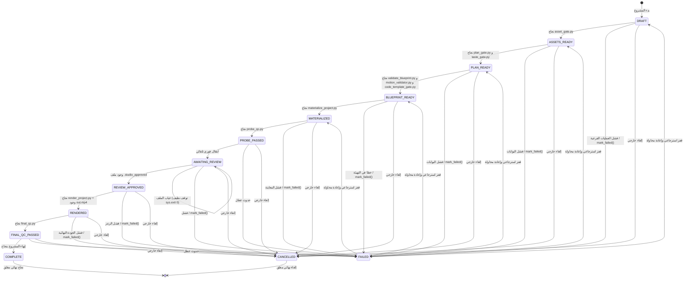
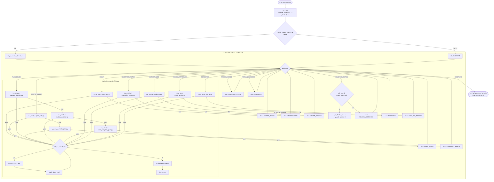

# تقرير التدقيق المعماري البرمجي لخط الإنتاج وآلة الحالة

**اسم الملف:** `CODE_VERIFIED_PIPELINE_AND_STATE_MACHINE.md`  
**المسار الجذري:** `c:\video\clean-video-workspace`  
**منهجية الفحص:** تتبع شجرة بناء الجمل البرمجية (AST) والكود المصدري التنفيذي حصراً (دون أي اعتماد على الوثائق).  
**التركيز الأساسي:** [`scripts/core/state_model.py`](file:///c:/video/clean-video-workspace/scripts/core/state_model.py) و [`scripts/pipeline.py`](file:///c:/video/clean-video-workspace/scripts/pipeline.py) وجميع التبعيات البرمجية المباشرة لهما.

---

## 1. قواعد الأدلة وتصنيف النتائج (Evidence Rules)

كل عبارة فنية ومعمارية واردة في هذا التقرير مستندة بشكل صارم ومباشر إلى الكود المصدري التنفيذي الموجود على القرص. تم استبعاد ملفات التوثيق (`README.md`، و `ARCHITECTURE_TRUTH.md`، و `PROJECT_RECONNAISSANCE.md`)، والتعليقات التوضيحية التي تصف معمارية مثالية مستهدفة، من أن تكون دليلاً معتمداً.

تم تصنيف جميع النتائج ضمن خمس فئات صارمة:
- **`تم التحقق من الكود` (VERIFIED FROM CODE)**: مُثبت ومُنفذ حرفياً في المنطق البرمجي التنفيذي.
- **`تم التحقق جزئياً` (PARTIALLY VERIFIED)**: مُنفذ جزئياً، لكنه غير مكتمل أو يتعارض مع التصريح النظري أو مقيد بحالات خاصة.
- **`غير مثبت بالكود` (NOT VERIFIED)**: تم الادعاء به في التقارير السابقة أو الوثائق، لكن لا يوجد له أي أثر تنفيذي في الكود.
- **`مناقض للكود` (CONTRADICTED BY CODE)**: الكود الفعلي ينفذ عكس ما زعمته الوثائق تماماً.
- **`استنتاج منطقي` (INFERENCE)**: استنباط منطقي مباشر من سلوك الكود المصدري (موضح بسببه المنطقي).

> [!IMPORTANT]
> **ملاحظة تصحيح المسار**: طلبت تعليمات الفحص الأصلية فحص `scripts/state_model.py`. أظهر الفحص المباشر للشجرة البرمجية أن هذا الملف **غير موجود** في ذلك المسار، ومساره الحقيقي هو [`scripts/core/state_model.py`](file:///c:/video/clean-video-workspace/scripts/core/state_model.py)، كما تم استيراده في [`scripts/pipeline.py:184`](file:///c:/video/clean-video-workspace/scripts/pipeline.py#L184). جميع الإحالات في هذا التقرير تشير إلى المسار الحقيقي.

---

## 2. التحقق من نموذج الحالة (State Model Verification)

الملف المصدري: [`scripts/core/state_model.py`](file:///c:/video/clean-video-workspace/scripts/core/state_model.py)

### 2.1 حالات دورة الحياة الفعلية في الكود
**`تم التحقق من الكود`** — الفئة [`LifecycleState`](file:///c:/video/clean-video-workspace/scripts/core/state_model.py#L6-L19):
مُعرفة كفئة تعداد ترث من `str` و `Enum`:
```python
class LifecycleState(str, Enum):
    DRAFT = "DRAFT"
    ASSETS_READY = "ASSETS_READY"
    PLAN_READY = "PLAN_READY"
    BLUEPRINT_READY = "BLUEPRINT_READY"
    MATERIALIZED = "MATERIALIZED"
    PROBE_PASSED = "PROBE_PASSED"
    AWAITING_REVIEW = "AWAITING_REVIEW"
    REVIEW_APPROVED = "REVIEW_APPROVED"
    RENDERED = "RENDERED"
    FINAL_QC_PASSED = "FINAL_QC_PASSED"
    COMPLETE = "COMPLETE"
    FAILED = "FAILED"
    CANCELLED = "CANCELLED"
```
توجد في الكود **13 حالة بالضبط**: 11 حالة تسلسلية متقدمة في المسار الإيجابي، وحالتان للأخطاء والإلغاء (`FAILED` و `CANCELLED`).

### 2.2 الحالة الابتدائية / الافتراضية
**`تم التحقق من الكود`**:
- في السطر 38 من `scripts/core/state_model.py`، داخل الفئة [`ProjectState`](file:///c:/video/clean-video-workspace/scripts/core/state_model.py#L38):
  ```python
  lifecycle_state: LifecycleState = LifecycleState.DRAFT
  ```
- في [`RecoveryEngine.evaluate`](file:///c:/video/clean-video-workspace/scripts/core/recovery_engine.py#L22): إذا لم يتم العثور على ملف حالة، يتم تعيين `next_state` تلقائياً إلى `LifecycleState.DRAFT`.
- إذن: الحالة الابتدائية الحتمية هي `DRAFT`.

### 2.3 الحالات النهائية (Terminal States)
**`تم التحقق من الكود`**:
- **`COMPLETE`**: بمجرد بلوغها، تحظر دالة `StateMachine.validate_transition` صراحة الانتقال إلى `FAILED` أو `CANCELLED` (السطور 74-76: `if current_state in (LifecycleState.COMPLETE, LifecycleState.CANCELLED): return False`). كما لا يوجد لها أي قيد في قاموس الانتقالات الأمامية `VALID_FORWARD_TRANSITIONS`. بالتالي، لا يمكن الخروج منها لأي حالة أخرى.
- **`CANCELLED`**: لا يمكن الانتقال منها للأمام أو الفشل؛ فهي تقبل فقط الانتقال الذاتي المطابق لنفسها (Idempotency).

### 2.4 حالات الخطأ والفشل
**`تم التحقق من الكود`**:
- **`FAILED`**: حالة الفشل الصريحة.
  - **طبيعتها الاسترجاعية**: حالة `FAILED` **ليست حالة نهائية**! ينص الكود صراحة في السطور (80-82) على:
    ```python
    if current_state == LifecycleState.FAILED:
        # Can jump back to any previous state to retry
        return True
    ```
    من حالة `FAILED`، يسمح النظام بالقفز التراجعي إلى **أي مرحلة سابقة** لبدء إعادة المحاولة والتعافي.
- **`CANCELLED`**: حالة إلغاء المشروع نهائياً.

### 2.5 آلية التحقق من الانتقالات وتنفيذها
**`تم التحقق من الكود`**:
- **محرك التحقق:** الفئة [`StateMachine`](file:///c:/video/clean-video-workspace/scripts/core/state_model.py#L52-L99).
- **خريطة الانتقالات الأمامية:** قاموس بايثون ثابت `VALID_FORWARD_TRANSITIONS` (السطور 54-65):
  - `DRAFT` $\rightarrow$ `ASSETS_READY`
  - `ASSETS_READY` $\rightarrow$ `PLAN_READY`
  - `PLAN_READY` $\rightarrow$ `BLUEPRINT_READY`
  - `BLUEPRINT_READY` $\rightarrow$ `MATERIALIZED`
  - `MATERIALIZED` $\rightarrow$ `PROBE_PASSED`
  - `PROBE_PASSED` $\rightarrow$ `AWAITING_REVIEW`
  - `AWAITING_REVIEW` $\rightarrow$ `REVIEW_APPROVED`
  - `REVIEW_APPROVED` $\rightarrow$ `RENDERED`
  - `RENDERED` $\rightarrow$ `FINAL_QC_PASSED`
  - `FINAL_QC_PASSED` $\rightarrow$ `COMPLETE`
- **دالة التحويل:** [`StateMachine.transition(state: ProjectState, target_state: LifecycleState)`](file:///c:/video/clean-video-workspace/scripts/core/state_model.py#L88-L98).
- **قواعد الانتقال الصارمة:**
  1. **التكرار الذاتي المأمون (Idempotency):** `current_state == target_state` يرجع `True` فوراً.
  2. **الانتقال للفشل والإلغاء:** أي حالة (باستثناء `COMPLETE` و `CANCELLED`) يمكنها الانتقال إلى `FAILED` أو `CANCELLED`.
  3. **التعافي من الفشل:** الحالة الحالية `FAILED` مسموح لها بالانتقال لأي حالة تالية مستهدفة.
  4. **المسار الطبيعي:** يجب أن يطابق تماماً `VALID_FORWARD_TRANSITIONS.get(current_state) == target_state`.
- **ما يحدث عند محاولة انتقال غير شرعي:**
  تطلق الدالة استثناء صريحاً يوقف التنفيذ:
  ```python
  raise StateTransitionError(f"Invalid transition from {current_state.value} to {target_state_enum.value}")
  ```
- **طبيعة الانتقالات:** مشفرة ثابتاً في الكود (Hardcoded Python Dictionary)، وليست ديناميكية مستندة إلى ملفات تكوين خارجية.

### 2.6 سلوكيات خفية لنموذج الحالة
**`تم التحقق من الكود`**:
1. **تجاوز `StateMachine` يدوياً عند الفشل داخل `pipeline.py`**:
   في [`scripts/pipeline.py:212-216`](file:///c:/video/clean-video-workspace/scripts/pipeline.py#L212-L216)، تقوم دالة `mark_failed()` بالآتي:
   ```python
   def mark_failed():
       state = StateStore.load(proj_dir)
       if state:
           state.lifecycle_state = LifecycleState.FAILED
           StateStore.save(proj_dir, state)
   ```
   **الدالة تتجاهل تماماً استدعاء `StateMachine.transition()`!** تقوم بتعديل الخاصية مباشرة في الكائن، مما يترتب عليه:
   - تخطي التحقق المنطقي.
   - عدم زيادة رقم المراجعة (`state.revision`).
   - عدم تحديث الطابع الزمني (`state.updated_at`).
2. **تجاوز `StateMachine` يدوياً داخل واجهة برمجة التطبيقات (`PipelineService`)**:
   في [`api/services/pipeline_service.py`](file:///c:/video/clean-video-workspace/api/services/pipeline_service.py) في السطرين 122 و 145، يتم تعيين `state.lifecycle_state` مباشرة وتخطي الفئة `StateMachine`.

---

### 2.7 جدول الانتقالات المعتمد من واقع الكود الفعلي

| الحالة الحالية | الحالة التالية المسموحة | الشرط البرمجي | موقع الكود |
| :--- | :--- | :--- | :--- |
| `DRAFT` | `ASSETS_READY` | اجتياز `asset_gate.py` بنجاح | `state_model.py:55`, `pipeline.py:235` |
| `DRAFT` | `FAILED`, `CANCELLED` | فشل العمليات الفرعية أو طلب إلغاء | `state_model.py:74`, `pipeline.py:233` |
| `DRAFT` | `DRAFT` | إعادة تشغيل ذاتية مأمونة | `state_model.py:70` |
| `ASSETS_READY` | `PLAN_READY` | اجتياز `plan_gate.py` و `taste_gate.py` | `state_model.py:56`, `pipeline.py:248` |
| `ASSETS_READY` | `FAILED`, `CANCELLED` | فشل أي من البوابتين أو طلب إلغاء | `state_model.py:74`, `pipeline.py:242` |
| `ASSETS_READY` | `ASSETS_READY` | إعادة تشغيل ذاتية مأمونة | `state_model.py:70` |
| `PLAN_READY` | `BLUEPRINT_READY` | اجتياز `validate_blueprint.py` و `motion_validator.py` و `code_template_gate.py` | `state_model.py:57`, `pipeline.py:264` |
| `PLAN_READY` | `FAILED`, `CANCELLED` | فشل التحقق أو إلغاء | `state_model.py:74`, `pipeline.py:256` |
| `PLAN_READY` | `PLAN_READY` | إعادة تشغيل ذاتية مأمونة | `state_model.py:70` |
| `BLUEPRINT_READY` | `MATERIALIZED` | اجتياز `materialize_project.py` بنجاح | `state_model.py:58`, `pipeline.py:276` |
| `BLUEPRINT_READY` | `FAILED`, `CANCELLED` | فشل نسخ الملفات وتجهيزها | `state_model.py:74`, `pipeline.py:274` |
| `BLUEPRINT_READY` | `BLUEPRINT_READY`| إعادة تشغيل ذاتية مأمونة | `state_model.py:70` |
| `MATERIALIZED` | `PROBE_PASSED` | اجتياز الفحص الاختباري `probe_qc.py` | `state_model.py:59`, `pipeline.py:289` |
| `MATERIALIZED` | `FAILED`, `CANCELLED` | فشل رندر لقطات المعاينة | `state_model.py:74`, `pipeline.py:287` |
| `MATERIALIZED` | `MATERIALIZED` | إعادة تشغيل ذاتية مأمونة | `state_model.py:70` |
| `PROBE_PASSED` | `AWAITING_REVIEW` | انتقال تلقائي فوري | `state_model.py:60`, `pipeline.py:299` |
| `PROBE_PASSED` | `FAILED`, `CANCELLED` | حدوث خطأ أو إلغاء | `state_model.py:74` |
| `PROBE_PASSED` | `PROBE_PASSED` | إعادة تشغيل ذاتية مأمونة | `state_model.py:70` |
| `AWAITING_REVIEW` | `REVIEW_APPROVED` | العثور على ملف `.studio_approved` | `state_model.py:61`, `pipeline.py:307` |
| `AWAITING_REVIEW` | `FAILED`, `CANCELLED` | رفض يدوي أو إلغاء | `state_model.py:74` |
| `AWAITING_REVIEW` | `AWAITING_REVIEW`| الملف مفقود $\rightarrow$ يتوقف البرنامج بـ exit 0 | `state_model.py:70`, `pipeline.py:312` |
| `REVIEW_APPROVED` | `RENDERED` | نجاح رندر Remotion ووجود `out.mp4` | `state_model.py:62`, `pipeline.py:322` |
| `REVIEW_APPROVED` | `FAILED`, `CANCELLED` | فشل عملية الرندر | `state_model.py:74`, `pipeline.py:319` |
| `REVIEW_APPROVED` | `REVIEW_APPROVED`| إعادة تشغيل ذاتية مأمونة | `state_model.py:70` |
| `RENDERED` | `FINAL_QC_PASSED`| اجتياز الفحص النهائي `final_qc.py` | `state_model.py:63`, `pipeline.py:335` |
| `RENDERED` | `FAILED`, `CANCELLED` | فشل معايير الجودة النهائية | `state_model.py:74`, `pipeline.py:333` |
| `RENDERED` | `RENDERED` | إعادة تشغيل ذاتية مأمونة | `state_model.py:70` |
| `FINAL_QC_PASSED` | `COMPLETE` | الإتمام النهائي للمشروع | `state_model.py:64`, `pipeline.py:345` |
| `FINAL_QC_PASSED` | `FAILED`, `CANCELLED` | فشل أو إلغاء | `state_model.py:74` |
| `FINAL_QC_PASSED` | `FINAL_QC_PASSED`| إعادة تشغيل ذاتية مأمونة | `state_model.py:70` |
| `COMPLETE` | `COMPLETE` فقط | حالة نهائية تحظر أي انتقال لأي حالة أخرى | `state_model.py:70, 75` |
| `FAILED` | *أي حالة* | استرجاع حر والقفز لأي خطوة سابقة | `state_model.py:80-82` |
| `CANCELLED` | `CANCELLED` فقط| حالة نهائية مغلقة | `state_model.py:70, 75` |

---

### 2.8 مخطط آلة الحالة الفعلي المستخرج من الكود



---

## 3. التحقق من تخزين واستدامة الحالة (State Persistence)

الملفات المصدرية: [`scripts/core/state_store.py`](file:///c:/video/clean-video-workspace/scripts/core/state_store.py)، [`scripts/core/state_model.py`](file:///c:/video/clean-video-workspace/scripts/core/state_model.py)، [`scripts/core/recovery_engine.py`](file:///c:/video/clean-video-workspace/scripts/core/recovery_engine.py)

### 3.1 المسار الدقيق لملف الحالة
**`تم التحقق من الكود`**:
- مُعرف كثابت داخل الفئة [`StateStore`](file:///c:/video/clean-video-workspace/scripts/core/state_store.py#L10):
  `STATE_FILE = ".pipeline_state.json"`
- المسار الدقيق لكل مشروع:
  `projects/<project_id>/.pipeline_state.json` (يتم تركيبه عبر `project_dir / StateStore.STATE_FILE`).

### 3.2 صيغة التخزين والحقول المحفوظة
**`تم التحقق من الكود`**:
- **الصيغة:** JSON بترميز UTF-8 مع إزاحة سطرين ومسافات بادئة (`indent=2`).
- **الحقول المحفوظة:** نموذج `ProjectState` المبني على Pydantic:
  1. `project_id: str`: معرف المشروع.
  2. `schema_version: int = 1`: إصدار المخطط.
  3. `revision: int = 1`: رقم المراجعة التراكمي.
  4. `lifecycle_state: LifecycleState = LifecycleState.DRAFT`: الحالة الحالية.
  5. `run_metadata: Dict[str, Any]`: بيانات التشغيل التتبعية.
  6. `approval_metadata: Dict[str, Any]`: بيانات الاعتماد والموافقة البشرية.
  7. `structured_errors: List[Dict[str, Any]]`: الأخطاء المهيكلة.
  8. `artifact_records: List[ArtifactRecord]`: مصفوفة البصمات الرقمية للملفات، ويحتوي كل سجل على:
     - `path`: المسار النسبي للملف.
     - `validation`: مستوى التحقق (`EXISTS` أو `SIZE` أو `SHA256`).
     - `size_bytes`: حجم الملف بالبايت.
     - `sha256`: بصمة الهاش المشفرة.
  9. `created_at`: طابع وقت الإنشاء بتوقيت UTC بصيغة ISO 8601.
  10. `updated_at`: طابع وقت آخر تحديث.

### 3.3 متى يُنشأ ويُحدث الملف؟
**`تم التحقق من الكود`**:
- **الإنشاء:** عند أول استدعاء لـ `save_state` في `pipeline.py:206` في حال عدم وجود ملف مسبق، أو عند استدعاء `scaffold_project` عبر الـ API.
- **التحديث:** 
  - في نهاية كل مرحلة ناجحة من مراحل `pipeline.py`.
  - عند حدوث فشل عبر استدعاء `mark_failed()` في `pipeline.py:216`.
  - عبر نقاط نهاية واجهة برمجة التطبيقات في `PipelineService`.

### 3.4 مَن يقرأ ومَن يكتب؟
**`تم التحقق من الكود`**:
- **القراءة (`StateStore.load`)**:
  - `RecoveryEngine.evaluate()` (`recovery_engine.py:19`).
  - دالتا `save_state` و `mark_failed` في `pipeline.py`.
  - سكريبت الرندر `render_project.py:78`.
  - دوال `PipelineService` في السطور (81, 93, 103, 116, 140, 181).
- **الكتابة (`StateStore.save`)**:
  - دالتا `save_state` و `mark_failed` في `pipeline.py`.
  - دوال `PipelineService` في السطور (84, 108, 125, 151).

### 3.5 الكتابة الذرية (Atomic Writes)
**`تم التحقق من الكود`**:
الكتابة الذرية **مطبقة بالفعل واحترافية** داخل [`StateStore.save`](file:///c:/video/clean-video-workspace/scripts/core/state_store.py#L41-L59):
```python
state_file = project_dir / StateStore.STATE_FILE
tmp_file = project_dir / f"{StateStore.STATE_FILE}.tmp"

with open(tmp_file, "w", encoding="utf-8") as f:
    if hasattr(state, "model_dump"):
        data = state.model_dump(mode='json')
    else:
        data = state.dict()
    json.dump(data, f, ensure_ascii=False, indent=2)
    f.flush()
    os.fsync(f.fileno())

os.replace(tmp_file, state_file)
```
- الكتابة أولاً لملف مؤقت `.tmp`.
- تفريغ ذاكرة بايثون للقرص عبر `f.flush()`.
- إجبار نظام التشغيل على الكتابة الفيزيائية للقرص الصلب عبر `os.fsync()`.
- استبدال الملف الأصلي ذرياً عبر `os.replace()` (عملية ذرية حتمية في أنظمة POSIX و Windows NTFS).

### 3.6 التعامل مع تلف الملف (Corruption Handling)
**`تم التحقق جزئياً`**:
- في `StateStore.load` (`state_store.py:70-75`):
  ```python
  try:
      with open(state_file, "r", encoding="utf-8") as f:
          data = json.load(f)
      return ProjectState(**data)
  except Exception:
      return None
  ```
  عند حدوث أي تلف أو خطأ في قراءة JSON، تلتقط الدالة الاستثناء وترجع `None`.
- في `RecoveryEngine.evaluate` (`recovery_engine.py:21`):
  إذا كانت النتيجة `None`، ترجع قراراً بأن المشروع جديد: `next_state = LifecycleState.DRAFT`.
  **النتيجة التنفيذية**: التلف لا يوقف البرنامج بخطأ واضح، بل يؤدي صمتاً إلى إعادة تشغيل المشروع من نقطة الصفر كأنه مشروع مسودة لم يُنشأ قط.

### 3.7 أمان الوصول المتزامن (Concurrency Safety)
**`مناقض للكود`**:
- **لا يوجد قفل للملفات (File Lock)** على مستوى نظام التشغيل (مثل `msvcrt` أو `fcntl` أو `filelock`).
- إذا تم تشغيل أمرين في نفس الوقت عبر سطر الأوامر على نفس المشروع، ستحدث حالة سباق (Race Condition) ويقوم الأخير بمسح تعديلات الأول.
- القفل الوحيد الموجود هو `asyncio.Lock` داخل خادم الـ FastAPI، وهو قفل محلي على مستوى الخيط الداخلي للخادم ولا يحمي من تشغيل سطر الأوامر المستقل.

### 3.8 التحقق من بصمات الهاش الرقمية (SHA-256)
**`تم التحقق من الكود`**:
- دالة `StateStore._compute_sha256` تحسب الهاش للملفات ذات المستوى `ValidationLevel.SHA256`.
- محرك التعافي [`RecoveryEngine.evaluate`](file:///c:/video/clean-video-workspace/scripts/core/recovery_engine.py#L46-L55) يقوم بإعادة حساب بصمة الهاش لكل ملف ومقارنتها بالبصمة المحفوظة، وإذا اختلف بايت واحد يرفض الاستئناف فوراً.

### 3.9 الاستئناف والتعافي الفعلي بعد التوقف
**`تم التحقق من الكود`**:
مُطبق بالكامل عبر [`RecoveryEngine.evaluate`](file:///c:/video/clean-video-workspace/scripts/core/recovery_engine.py#L16-L63). عند إعادة تشغيل المشروع، يتأكد المحرك من وجود كافة المخرجات ومطابقة أحجامها وبصماتها، ويرجع `can_resume=True` بالحالة التي توقف عندها، مما يسمح لخط الإنتاج بالبدء مباشرة من المرحلة التالية دون تكرار المراحل السابقة.

---

## 4. التحقق من خط الإنتاج (Pipeline Verification)

الملف المصدري: [`scripts/pipeline.py`](file:///c:/video/clean-video-workspace/scripts/pipeline.py)

### 4.1 معمارية التحكم وسير العمليات
- **نقطة الدخول:** السطر 351: `if __name__ == "__main__": main()`.
- **الدالة الرئيسية:** `main()` (السطور 157-350).
- **مشغل العمليات:** `run_script()` (السطور 31-155).
- **المعاملات المدخلة:** `sys.argv[1]` يحمل معرف المشروع `project_id` المفحوص عبر التعبير النمطي `^[a-zA-Z0-9_-]+$`.
- **خطوات التهيئة:**
  1. التحقق من صحة الاسم ووجود المجلد `projects/<project_id>`.
  2. إنشاء أو تمرير معرفات التتبع الموزع (`AGY_RUN_ID` و `AGY_SPAN_ID`).
  3. إنشاء مسجل الأحداث `RuntimeLogger`.
  4. استدعاء `RecoveryEngine.evaluate()` لتحديد ما إذا كان المشروع سيستأنف أم سيبدأ من `DRAFT`.
  5. الدخول في حلقة آلة الحالة: `while next_state != LifecycleState.COMPLETE:`.

### 4.2 كود زائف للخوارزمية التنفيذية الحقيقية

```text
START
│
├── التحقق من وجود المعامل sys.argv[1]
│   └── إذا كان مفقوداً ──► طباعة طريقة الاستخدام والخروج بـ sys.exit(1)
│
├── التحقق من أمان اسم المشروع validate_project_id()
│   └── إذا كان غير آمن ──► إطلاق استثناء ValueError والخروج بـ sys.exit(1)
│
├── التحقق من وجود مجلد projects/{project_id}
│   └── إذا لم يوجد ──► طباعة رسالة خطأ والخروج بـ sys.exit(1)
│
├── ضبط التتبع الموزع (RunContext, AGY_RUN_ID, span_id)
├── تسجيل بداية التنفيذ في سجلات JSONL
│
├── تقييم الاستئناف عبر RecoveryEngine.evaluate(proj_dir)
│   ├── إذا can_resume == True:
│   │   ├── تعيين next_state = decision.next_state
│   │   └── تسجيل حدث recovery.resumed
│   └── وإلا:
│       ├── تعيين next_state = LifecycleState.DRAFT
│       └── تسجيل حدث recovery.detected
│
├── حلقة التكرار: طالما next_state != LifecycleState.COMPLETE:
│   │
│   ├── إذا كانت next_state == FAILED ──► طباعة رسالة الفشل والخروج بـ exit(1)
│   ├── إذا كانت next_state == CANCELLED ──► طباعة رسالة الإلغاء والخروج بـ exit(1)
│   │
│   ├── 1. مرحلة DRAFT:
│   │   ├── تشغيل run_script("assets", "asset_gate", "gates/asset_gate.py", SAFE_TO_RETRY, project_id)
│   │   │   └── في حال الفشل ──► mark_failed() والخروج بـ exit(1)
│   │   ├── حفظ الحالة: ASSETS_READY مع فحص وجود ("02_asset_manifest.json", EXISTS)
│   │   └── الانتقال إلى ASSETS_READY
│   │
│   ├── 2. مرحلة ASSETS_READY:
│   │   ├── تشغيل run_script("plan", "plan_gate", "gates/plan_gate.py", SAFE_TO_RETRY, project_id)
│   │   │   └── في حال الفشل ──► mark_failed() والخروج بـ exit(1)
│   │   ├── تشغيل run_script("plan", "taste_gate", "gates/taste_gate.py", SAFE_TO_RETRY, "master_plan.md")
│   │   │   └── في حال الفشل ──► mark_failed() والخروج بـ exit(1)
│   │   ├── حفظ الحالة: PLAN_READY مع بصمة ("master_plan.md", SHA256)
│   │   └── الانتقال إلى PLAN_READY
│   │
│   ├── 3. مرحلة PLAN_READY:
│   │   ├── تشغيل run_script("blueprint", "validate_blueprint", "gates/validate_blueprint.py", SAFE_TO_RETRY, "05_blueprint.json")
│   │   │   └── في حال الفشل ──► mark_failed() والخروج بـ exit(1)
│   │   ├── تشغيل run_script("blueprint", "motion_validator", "gates/motion_validator.py", SAFE_TO_RETRY, "05_blueprint.json")
│   │   │   └── في حال الفشل ──► mark_failed() والخروج بـ exit(1)
│   │   ├── تشغيل run_script("blueprint", "code_template_gate", "gates/code_template_gate.py", SAFE_TO_RETRY, project_id)
│   │   │   └── في حال الفشل ──► mark_failed() والخروج بـ exit(1)
│   │   ├── حفظ الحالة: BLUEPRINT_READY مع بصمات master_plan.md و 05_blueprint.json
│   │   └── الانتقال إلى BLUEPRINT_READY
│   │
│   ├── 4. مرحلة BLUEPRINT_READY:
│   │   ├── تشغيل run_script("blueprint", "materialize_project", "generators/materialize_project.py", SAFE_TO_RETRY, proj_dir)
│   │   │   └── في حال الفشل ──► mark_failed() والخروج بـ exit(1)
│   │   ├── حفظ الحالة: MATERIALIZED مع بصمات master_plan.md و 05_blueprint.json و media_map.json
│   │   └── الانتقال إلى MATERIALIZED
│   │
│   ├── 5. مرحلة MATERIALIZED:
│   │   ├── تشغيل run_script("qc", "probe_qc", "gates/probe_qc.py", SAFE_TO_RETRY, project_id)
│   │   │   └── في حال الفشل ──► mark_failed() والخروج بـ exit(1)
│   │   ├── حفظ الحالة: PROBE_PASSED مع probe_qc_report.json
│   │   └── الانتقال إلى PROBE_PASSED
│   │
│   ├── 6. مرحلة PROBE_PASSED:
│   │   ├── حفظ الحالة: AWAITING_REVIEW
│   │   └── الانتقال الفوري إلى AWAITING_REVIEW
│   │
│   ├── 7. مرحلة AWAITING_REVIEW:
│   │   ├── فحص وجود ملف projects/{project_id}/.studio_approved
│   │   ├── إذا كان موجوداً:
│   │   │   ├── حفظ الحالة: REVIEW_APPROVED
│   │   │   └── الانتقال إلى REVIEW_APPROVED
│   │   └── إذا لم يكن موجوداً:
│   │       ├── طباعة: "⏸️ المنسق متوقف مؤقتاً... يرجى مراجعة الفيديو وإنشاء ملف .studio_approved"
│   │       └── خروج نظيف فوري بـ sys.exit(0)  [نقطة توقف خط الإنتاج]
│   │
│   ├── 8. مرحلة REVIEW_APPROVED:
│   │   ├── نقطة حقن محتملة: FailureInjector.maybe_inject(BEFORE_RENDER)
│   │   ├── تشغيل run_script("render", "remotion", "render_project.py", CONDITIONALLY_RETRYABLE, project_id, expected=["out.mp4"])
│   │   │   └── في حال الفشل ──► mark_failed() والخروج بـ exit(1)
│   │   ├── نقطة حقن محتملة: FailureInjector.maybe_inject(AFTER_RENDER)
│   │   ├── حفظ الحالة: RENDERED مع فحص حجم out.mp4
│   │   └── الانتقال إلى RENDERED
│   │
│   ├── 9. مرحلة RENDERED:
│   │   ├── تشغيل run_script("qc", "final_qc", "gates/final_qc.py", SAFE_TO_RETRY, project_id)
│   │   │   └── في حال الفشل ──► mark_failed() والخروج بـ exit(1)
│   │   ├── حفظ الحالة: FINAL_QC_PASSED مع فحص حجم out.mp4
│   │   └── الانتقال إلى FINAL_QC_PASSED
│   │
│   └── 10. مرحلة FINAL_QC_PASSED:
│       ├── حفظ الحالة: COMPLETE
│       └── تعيين next_state = COMPLETE
│
├── تسجيل حدث النجاح في سجلات JSONL
├── طباعة رسالة الإتمام التام: "🎉 انتهى الفحص بنجاح! جميع ملفاتك وحالتك الحالية سليمة 100%. (الحالة: COMPLETE)"
└── خروج بنجاح sys.exit(0)
```

---

## 5. المراحل الحقيقية لخط الإنتاج (مستخرجة من الكود التنفيذي)

### المرحلة 1: بوابة فحص الأصول (Asset Gate)
- **اسم المرحلة البرمجي:** `assets`
- **الحالة الحالية:** `LifecycleState.DRAFT`
- **الكود المنفذ:** `run_script(logger, "assets", "asset_gate", "gates/asset_gate.py", IdempotencyClass.SAFE_TO_RETRY, project_id)` (`pipeline.py:232`)
- **المدخلات:** `projects/<project_id>/02_asset_manifest.json`، وفهرس الأصول `ground-truth/ASSET_INDEX.json`.
- **المخرجات:** لا يكتب أي ملفات جديدة؛ يتحقق فقط من وجود كاش الأصول وعدم التكرار.
- **شرط النجاح:** خروج العملية الفرعية بكود `0`.
- **شرط الفشل:** كود خروج غير صفري.
- **الحالة التالية:** `LifecycleState.ASSETS_READY`.
- **الآثار الجانبية:** تحديث `.pipeline_state.json` وتسجيل `02_asset_manifest.json` بمستوى `ValidationLevel.EXISTS`. *(ملاحظة: إذا لم يكن الملف موجوداً على القرص أصلاً، ستفشل دالة الحفظ باستثناء `FileNotFoundError`)*.

### المرحلة 2: بوابتا الخطة والذوق السينمائي (Plan & Taste Gates)
- **اسم المرحلة البرمجي:** `plan`
- **الحالة الحالية:** `LifecycleState.ASSETS_READY`
- **الكود المنفذ:**
  1. `run_script(logger, "plan", "plan_gate", "gates/plan_gate.py", IdempotencyClass.SAFE_TO_RETRY, project_id)` (`pipeline.py:241`)
  2. `run_script(logger, "plan", "taste_gate", "gates/taste_gate.py", IdempotencyClass.SAFE_TO_RETRY, str(plan_file))` (`pipeline.py:245`)
- **المدخلات:** `projects/<project_id>/04_timings.json`، و `master_plan.md`، و `config/violations_config.json`.
- **المخرجات:** لا يوجد (فحص وتدقيق؛ مع استدعاء تحكيم خارجي من OpenAI gpt-4o إذا توفر مفتاح البيئة).
- **شرط النجاح:** خروج البوابتين بكود `0`.
- **شرط الفشل:** غياب التوقيتات، وجود حشو متكرر، مخالفة قواعد الذوق والحركة وتنوع القوالب.
- **الحالة التالية:** `LifecycleState.PLAN_READY`.
- **الآثار الجانبية:** تحديث ملف الحالة وبصمة `master_plan.md` بـ SHA-256.

### المرحلة 3: بوابات المخطط وقواعد الحركة والقوالب (Blueprint & Code Template Gates)
- **اسم المرحلة البرمجي:** `blueprint`
- **الحالة الحالية:** `LifecycleState.PLAN_READY`
- **الكود المنفذ:**
  1. `run_script(logger, "blueprint", "validate_blueprint", "gates/validate_blueprint.py", IdempotencyClass.SAFE_TO_RETRY, str(blueprint_file))` (`pipeline.py:255`)
  2. `run_script(logger, "blueprint", "motion_validator", "gates/motion_validator.py", IdempotencyClass.SAFE_TO_RETRY, str(blueprint_file))` (`pipeline.py:258`)
  3. `run_script(logger, "blueprint", "code_template_gate", "gates/code_template_gate.py", IdempotencyClass.SAFE_TO_RETRY, project_id)` (`pipeline.py:261`)
- **المدخلات:** `05_blueprint.json`، ومخطط JSON، وقوالب الحركة، وحالة Git لمجلد `templates/`، وملفات `06_build/`، ومجلد `scratch/`.
- **المخرجات:** لا يوجد.
- **شرط النجاح:** خروج البوابات الثلاث بكود `0`.
- **شرط الفشل:** فشل الـ Schema، استخدام قوالب محظورة أو ارتجال كود محلي غير مصرح، أو التلاعب في القوالب الأساسية.
- **الحالة التالية:** `LifecycleState.BLUEPRINT_READY`.
- **الآثار الجانبية:** حفظ بصمتي `master_plan.md` و `05_blueprint.json` بـ SHA-256.

### المرحلة 4: تهيئة ونقل الأصول (Materialize Project)
- **اسم المرحلة البرمجي:** `blueprint` (مكون: `materialize_project`)
- **الحالة الحالية:** `LifecycleState.BLUEPRINT_READY`
- **الكود المنفذ:** `run_script(logger, "blueprint", "materialize_project", "generators/materialize_project.py", IdempotencyClass.SAFE_TO_RETRY, str(proj_dir))` (`pipeline.py:273`)
- **المدخلات:** `02_asset_manifest.json`، و `05_blueprint.json`، و `master_plan.md`.
- **المخرجات:** نسخ الملفات الصوتية والصور إلى `remotion-app/public/projects/<project_id>/media/` وتوليد خريطة الوسائط `media_map.json`.
- **شرط النجاح:** كود خروج `0` وربط جميع الأصول بنجاح.
- **شرط الفشل:** ملفات وسائط مفقودة أو قوالب غير موجودة على القرص.
- **الحالة التالية:** `LifecycleState.MATERIALIZED`.
- **الآثار الجانبية:** نقل فيزيائي للملفات وحفظ بصمة `media_map.json`.

### المرحلة 5: فحص الجودة التمهيدي باللقطات (Probe QC)
- **اسم المرحلة البرمجي:** `qc` (مكون: `probe_qc`)
- **الحالة الحالية:** `LifecycleState.MATERIALIZED`
- **الكود المنفذ:** `run_script(logger, "qc", "probe_qc", "gates/probe_qc.py", IdempotencyClass.SAFE_TO_RETRY, project_id)` (`pipeline.py:286`)
- **المدخلات:** `05_blueprint.json`، و `media_map.json`، ومحرك Remotion.
- **المخرجات:** توليد ملف `render_props.json`، ورندر اللقطات الحرجة `03_probe_qc/probe_*.png`، ولوحة الاتصال `contact_sheet.png`، وتقرير `probe_qc_report.json` مع الختم الرقمي `.seal`، وملف الفتح `.studio_unlocked`.
- **شرط النجاح:** اكتمال رندر كل اللقطات وسلامة الختم الرقمي المشفر بالملح (Salt).
- **شرط الفشل:** انهيار رندر Remotion still أو نقص أي لقطة.
- **الحالة التالية:** `LifecycleState.PROBE_PASSED`.
- **الآثار الجانبية:** إنشاء ملف فتح الاستوديو `.studio_unlocked` وحفظ التقرير.

### المرحلة 6: التجهيز للمراجعة البشرية (Auto-Advance to Review)
- **اسم المرحلة البرمجي:** انتقال داخلي
- **الحالة الحالية:** `LifecycleState.PROBE_PASSED`
- **الكود المنفذ:** `save_state(LifecycleState.AWAITING_REVIEW, [])` (`pipeline.py:299`)
- **المدخلات:** لا يوجد.
- **المخرجات:** لا يوجد.
- **شرط النجاح:** حتمي فوري.
- **شرط الفشل:** لا يوجد.
- **الحالة التالية:** `LifecycleState.AWAITING_REVIEW`.
- **الآثار الجانبية:** تحديث ملف الحالة.

### المرحلة 7: قفل الموافقة البشرية (Studio Human Review Gate)
- **اسم المرحلة البرمجي:** حد التوقف والموافقة
- **الحالة الحالية:** `LifecycleState.AWAITING_REVIEW`
- **الكود المنفذ:** `approved_marker = proj_dir / ".studio_approved"` (`pipeline.py:304-312`)
- **المدخلات:** التحقق من وجود الملف `projects/<project_id>/.studio_approved`.
- **المخرجات:** لا يوجد.
- **شرط النجاح:** وجود الملف على القرص.
- **شرط التوقف:** عدم وجود الملف $\rightarrow$ يطبع رسالة الانتظار ويغلق خط الإنتاج فوراً بكود خروج نظيف `sys.exit(0)`.
- **الحالة التالية:** `LifecycleState.REVIEW_APPROVED`.
- **الآثار الجانبية:** في حال وجود الملف، يتم تحديث الحالة تمهيداً للرندر.

### المرحلة 8: رندر الفيديو النهائي (Remotion Rendering)
- **اسم المرحلة البرمجي:** `render` (مكون: `remotion`)
- **الحالة الحالية:** `LifecycleState.REVIEW_APPROVED`
- **الكود المنفذ:** `run_script(logger, "render", "remotion", "render_project.py", IdempotencyClass.CONDITIONALLY_RETRYABLE, project_id, expected_artifacts=[str(proj_dir / "out.mp4")])` (`pipeline.py:318`)
- **المدخلات:** `render_props.json`، ومحرك Remotion.
- **المخرجات:** رندر الفيديو إلى ملف مؤقت `out.attempt-{attempt}.tmp.mp4` ثم استبداله ذرياً إلى `out.mp4`.
- **شرط النجاح:** خروج كود `0` والتأكد الفيزيائي اللاحق من وجود `out.mp4`.
- **شرط الفشل:** فشل Remotion أو عدم العثور على `out.mp4`.
- **الحالة التالية:** `LifecycleState.RENDERED`.
- **الآثار الجانبية:** استهلاك مكثف للـ CPU/GPU وحفظ حجم `out.mp4` في ملف الحالة.

### المرحلة 9: الفحص النهائي لجودة الفيديو (Final QC)
- **اسم المرحلة البرمجي:** `qc` (مكون: `final_qc`)
- **الحالة الحالية:** `LifecycleState.RENDERED`
- **الكود المنفذ:** `run_script(logger, "qc", "final_qc", "gates/final_qc.py", IdempotencyClass.SAFE_TO_RETRY, project_id)` (`pipeline.py:332`)
- **المدخلات:** `out.mp4`، و `05_blueprint.json`، و `04_timings.json`.
- **المخرجات:** تقرير الجودة النهائي `final_qc_report.json`.
- **شرط النجاح:** مطابقة أبعاد الفيديو، خلوه من الشاشات السوداء المستمرة، انضباط مقياس LUFS الصوتي بين -18 و -14، وتزامن الصوت والصورة (AV Sync خطأ أقل من 200ms).
- **شرط الفشل:** فشل أي معيار حرج في الفحص.
- **الحالة التالية:** `LifecycleState.FINAL_QC_PASSED`.
- **الآثار الجانبية:** كتابة التقرير النهائي.

### المرحلة 10: إنهاء المشروع (Complete)
- **اسم المرحلة البرمجي:** الإنهاء
- **الحالة الحالية:** `LifecycleState.FINAL_QC_PASSED`
- **الكود المنفذ:** `save_state(LifecycleState.COMPLETE, [])` (`pipeline.py:345`)
- **المدخلات:** لا يوجد.
- **المخرجات:** لا يوجد.
- **شرط النجاح:** حتمي.
- **الحالة التالية:** `LifecycleState.COMPLETE`.
- **الآثار الجانبية:** قفل المشروع نهائياً في الحالة المكتملة وطباعة رسالة الاحتفال بنجاح المشروع بنسبة 100%.

---

## 6. التحقق من آلية استدعاء البوابات (Gate Invocation Verification)

### معمارية الاستدعاء البرمجي
**`تم التحقق من الكود`**:
خط الإنتاج [`scripts/pipeline.py`](file:///c:/video/clean-video-workspace/scripts/pipeline.py) **لا يقوم باستيراد البوابات كدوال بايثون نهائياً**، بل يستدعي كل بوابة كعملية فرعية معزولة (Subprocess) على نظام التشغيل بواسطة الدالة المؤمنة [`safe_subprocess`](file:///c:/video/clean-video-workspace/scripts/security/security.py#L21):
`cmd = [sys.executable, str(script_path)] + list(args)`

### جدول استدعاء البوابات التفصيلي

| البوابة / السكريبت | توقيع الاستدعاء | المعاملات الممررة | كود الخروج المتوقع | الملفات المقروءة | الملفات المكتوبة | آلية التخاطب مع المنظم |
| :--- | :--- | :--- | :--- | :--- | :--- | :--- |
| [`scripts/gates/asset_gate.py`](file:///c:/video/clean-video-workspace/scripts/gates/asset_gate.py) | `[python, scripts/gates/asset_gate.py, <id>]` | `project_id` | `0` | `02_asset_manifest.json`, `ASSET_INDEX.json` | لا يوجد | كود الخروج + المخرجات النصية |
| [`scripts/gates/plan_gate.py`](file:///c:/video/clean-video-workspace/scripts/gates/plan_gate.py) | `[python, scripts/gates/plan_gate.py, <id>]` | `project_id` | `0` | `04_timings.json`, `master_plan.md`, `violations_config.json` | لا يوجد | كود الخروج + المخرجات النصية |
| [`scripts/gates/taste_gate.py`](file:///c:/video/clean-video-workspace/scripts/gates/taste_gate.py) | `[python, scripts/gates/taste_gate.py, <path>]`| `master_plan.md` | `0` | `master_plan.md` | لا يوجد | كود الخروج + المخرجات النصية |
| [`scripts/gates/validate_blueprint.py`](file:///c:/video/clean-video-workspace/scripts/gates/validate_blueprint.py) | `[python, scripts/gates/validate_blueprint.py, <path>]` | `05_blueprint.json` | `0` | `05_blueprint.json`, `blueprint.schema.json`, `TEMPLATE_INDEX.md` | لا يوجد | كود الخروج + المخرجات النصية |
| [`scripts/gates/motion_validator.py`](file:///c:/video/clean-video-workspace/scripts/gates/motion_validator.py) | `[python, scripts/gates/motion_validator.py, <path>]` | `05_blueprint.json` | `0` | `05_blueprint.json`, `motion-personality.md` | لا يوجد | كود الخروج + المخرجات النصية |
| [`scripts/gates/code_template_gate.py`](file:///c:/video/clean-video-workspace/scripts/gates/code_template_gate.py) | `[python, scripts/gates/code_template_gate.py, <id>]` | `project_id` | `0` | Git status لمجلد `templates/`, `05_blueprint.json`, كود `06_build/` | لا يوجد | كود الخروج + المخرجات النصية |
| [`scripts/generators/materialize_project.py`](file:///c:/video/clean-video-workspace/scripts/generators/materialize_project.py) | `[python, scripts/generators/materialize_project.py, <path>]` | `proj_dir` | `0` | `02_asset_manifest.json`, `05_blueprint.json`, `master_plan.md` | نسخ للوسائط وكتابة `media_map.json` | كود الخروج + المخرجات النصية |
| [`scripts/gates/probe_qc.py`](file:///c:/video/clean-video-workspace/scripts/gates/probe_qc.py) | `[python, scripts/gates/probe_qc.py, <id>]` | `project_id` | `0` | `05_blueprint.json`, `media_map.json`, `.qc_salt` | `render_props.json`, لقطات المعاينة, `probe_qc_report.json`, `.seal`, `.studio_unlocked` | كود الخروج + المخرجات النصية |
| [`scripts/render_project.py`](file:///c:/video/clean-video-workspace/scripts/render_project.py) | `[python, scripts/render_project.py, <id>]` | `project_id` | `0` | `05_blueprint.json`, `media_map.json`, `.studio_approved` | `render_props.json`, `out.mp4` | كود الخروج + فحص وجود `out.mp4` في `pipeline.py` |
| [`scripts/gates/final_qc.py`](file:///c:/video/clean-video-workspace/scripts/gates/final_qc.py) | `[python, scripts/gates/final_qc.py, <id>]` | `project_id` | `0` | `out.mp4`, `05_blueprint.json`, `04_timings.json` | `final_qc_report.json` | كود الخروج + المخرجات النصية |

---

## 7. معالجة الأخطاء (Error Handling)

الملفات المصدرية: [`scripts/pipeline.py`](file:///c:/video/clean-video-workspace/scripts/pipeline.py)، [`scripts/core/failure_model.py`](file:///c:/video/clean-video-workspace/scripts/core/failure_model.py)، [`scripts/security/security.py`](file:///c:/video/clean-video-workspace/scripts/security/security.py)

### 7.1 حدود الالتقاط `try/except`
- **داخل `run_script`:** عملية `safe_subprocess` محاطة بكتلة `try...except Exception as e:` للتعامل مع انهيار العمليات، وانتهاء المهلة الزمنية، والأخطاء البرمجية.
- **فحص الشرط اللاحق (Postcondition Check):** في السطور (78-85)، إذا رجع السكريبت كود `0` ولكن أحد الملفات المتوقعة في `expected_artifacts` مفقود، يطلق الكود استثناء `RuntimeError` ويعتبر العملية فاشلة تماماً (كشف الفشل الصامت).
- **على مستوى `main()`:** **لا توجد كتلة `try...except` عامة**. أي استثناء يحدث في `RecoveryEngine` أو في حفظ الحالة يصعد مباشرة لمفسر بايثون وينهي البرنامج مع طباعة تتبع المكدس (Stack trace).

### 7.2 المهلة الزمنية (Timeout Handling)
مُطبقة في [`scripts/security/security.py:65-67`](file:///c:/video/clean-video-workspace/scripts/security/security.py#L65-L67):
المهلة الافتراضية التلقائية لكل عملية فرعية هي **900 ثانية (15 دقيقة)** ما لم تُحدد خلاف ذلك، وتطلق استثناء `subprocess.TimeoutExpired`.

### 7.3 سلوك النظام عند الفشل النهائي
عند استنفاد محاولات إعادة التشغيل، يرجع `run_script` القيمة `False`، ويقوم خط الإنتاج بالآتي:
```python
mark_failed()
sys.exit(1)
```
- تُحفظ الحالة كـ `FAILED` في `.pipeline_state.json`.
- يتوقف البرنامج بكود `1`.
- عند محاولة تشغيل المشروع مجدداً وهو في حالة `FAILED`، يرفض `pipeline.py` المتابعة فوراً (السطور 221-223) حتى يتدخل المطور أو يتم تنفيذ استرجاع رسمي.

### 7.4 مسار تتبع الخطأ (Failure Trace)

```text
منشأ الخطأ
(مثال: taste_gate.py يكتشف حشواً متكرراً ويخرج بـ sys.exit(1))
    │
    ▼
من يلتقطه؟
(دالة safe_subprocess ترجع returncode != 0، فتقوم run_script بإطلاق RuntimeError تلتقطه كتلة except Exception)
    │
    ▼
ماذا يحدث بعد ذلك؟
1. يسجل الطفل حدث failure مع مدة التنفيذ.
2. تطبع المخرجات وتفاصيل الخطأ على شاشة الكونسول.
3. يُستدعى RetryPolicyEngine.evaluate().
4. إذا قُررت إعادة المحاولة ──► ينتظر (1ث ثم 3ث ثم 5ث) ويعيد تشغيل العملية الفرعية.
5. إذا استنفدت المحاولات (3 محاولات) ──► ترجع دالة run_script القيمة False.
    │
    ▼
إجراء خط الإنتاج الرئيسي
يستدعي mark_failed() ثم sys.exit(1).
    │
    ▼
الحالة بعد الفشل
يتحول lifecycle_state في ملف .pipeline_state.json إلى FAILED ويتوقف البرنامج.
```

---

## 8. التحقق من سياسة إعادة المحاولة (Retry Verification)

الملفات المصدرية: [`scripts/core/retry_policy.py`](file:///c:/video/clean-video-workspace/scripts/core/retry_policy.py)، [`scripts/core/failure_model.py`](file:///c:/video/clean-video-workspace/scripts/core/failure_model.py)، [`scripts/pipeline.py`](file:///c:/video/clean-video-workspace/scripts/pipeline.py)

### 8.1 هل محرك إعادة المحاولة موجود ومستخدم؟
- الفئة [`RetryPolicyEngine`](file:///c:/video/clean-video-workspace/scripts/core/retry_policy.py#L20) **موجودة ومستخدمة بالفعل** في `pipeline.py:115`.

### 8.2 الخلل المعماري في تصنيف الأخطاء وإعادة المحاولة
**`مناقض للكود` (بالمقارنة مع مزاعم التقرير السابق)**:
يزعم التقرير السابق أن إعادة المحاولة ذكية ومبنية على فئات عدم التكرار (Idempotency Classes) وأن البوابات الفاشلة بسبب نصوص غير مقبولة لا يُعاد تشغيلها.  
**لكن الكود الفعلي في [`scripts/pipeline.py:89-96`](file:///c:/video/clean-video-workspace/scripts/pipeline.py#L89-L96) ينفذ الآتي:**
```python
except Exception as e:
    duration_ms = int((time.time() - start_time) * 1000)
    from scripts.core.failure_model import FailureInfo, FailureCode
    failure = FailureInfo(
        code=FailureCode.GATE_EXECUTION_FAILED,
        message=str(e),
        cause_type=type(e).__name__,
        stage=stage,
        component=component
    )
```
**يقوم خط الإنتاج بحشر ودمج كل أنواع الأخطاء تحت كود واحد حصري هو `FailureCode.GATE_EXECUTION_FAILED`!**
وحيث إن هذا الكود معرف في جدول الميتاداتا كخطأ قابل لإعادة المحاولة (`retryable=True`)، وجميع المراحل ممررة كـ `SAFE_TO_RETRY`، فإن المحرك **يقوم بإعادة تشغيل أي بوابة فاشلة 3 مرات حتماً وبصورة عمياء**، حتى لو كان سبب الفشل قاعدة نحوية أو رفضاً قطعياً من الذكاء الاصطناعي لا يتغير بإعادة التشغيل!

### 8.3 أقصى عدد للمحاولات وجدول التأخير
- **الحد الأقصى للمحاولات:** 3 محاولات (المعرف الافتراضي في `_get_max_attempts`).
- **جدول التأخير الزمني (Backoff):**
  - المحاولة 1 $\rightarrow$ انتظار **ثانية واحدة** قبل المحاولة 2.
  - المحاولة 2 $\rightarrow$ انتظار **3 ثوانٍ** قبل المحاولة 3.
  - المحاولة 3+ $\rightarrow$ انتظار **5 ثوانٍ**.
- ينفذ التأخير عبر `time.sleep()`.

---

## 9. التحقق من محقن الأعطال (Failure Injection Verification)

الملف المصدري: [`scripts/core/failure_injection.py`](file:///c:/video/clean-video-workspace/scripts/core/failure_injection.py)

- **هل هو موجود ومستخدم؟** **نعم**، الفئة `FailureInjector` مستوردة ومستدعاة في `scripts/pipeline.py` في السطور (69, 71, 317, 321).
- **نقاط الحقن المتاحة:**
  `BEFORE_ASSETS`, `AFTER_ASSETS`, `BEFORE_PLAN`, `AFTER_PLAN`, `BEFORE_RENDER`, `DURING_RENDER`, `AFTER_RENDER`, `BEFORE_QC`.
- **طبيعته التشغيلية وحمايته:**
  مدمج في كود الإنتاج ولكنه **معطل ومقفل بثلاثة شروط أمان صارمة**:
  1. يجب تعيين متغير البيئة `AGY_FAILURE_INJECTION_ENABLED="1"`.
  2. يجب تحديد سيناريو العطل في `AGY_INJECT_FAILURE`.
  3. محظور تماماً في بيئة الإنتاج: إذا كان `AGY_ENV=production` يطبع خطأ أمنياً ويخرج بـ `sys.exit(1)`.

---

## 10. التحقق من الموافقة البشرية (Human Approval Verification)

الملفات المصدرية: [`scripts/pipeline.py`](file:///c:/video/clean-video-workspace/scripts/pipeline.py)، [`scripts/render_project.py`](file:///c:/video/clean-video-workspace/scripts/render_project.py)

- **اسم ملف الموافقة:** `.studio_approved` (داخل مجلد المشروع `projects/<project_id>/.studio_approved`).
- **الكود المنفذ للفحص:** [`scripts/pipeline.py:303-312`](file:///c:/video/clean-video-workspace/scripts/pipeline.py#L303-L312):
  ```python
  elif next_state == LifecycleState.AWAITING_REVIEW:
      approved_marker = proj_dir / ".studio_approved"
      if approved_marker.exists():
          print(f"\n✅ تم العثور على الموافقة البشرية (.studio_approved). ننتقل لـ REVIEW_APPROVED.")
          save_state(LifecycleState.REVIEW_APPROVED, [])
          next_state = LifecycleState.REVIEW_APPROVED
      else:
          print(f"\n⏸️ المنسق متوقف مؤقتاً.")
          print(f"المشروع جاهز للمعاينة في الاستوديو (AWAITING_REVIEW). يرجى مراجعة الفيديو وإنشاء ملف .studio_approved قبل الرندر النهائي.")
          sys.exit(0)
  ```
- **سلوك خط الإنتاج:** **لا ينتظر، ولا يتجمد، ولا يدخل في حلقة تكرارية**. إذا لم يجد الملف، يطبع رسالة المعاينة **ويخرج فوراً بـ `sys.exit(0)`**.
- **آلية الاستئناف لاحقاً:** عندما ينشئ المستخدم الملف ويعيد تشغيل الأمر، يستشعر `RecoveryEngine` اكتمال كافة المراحل السابقة، فيبدأ الخط مباشرة من `AWAITING_REVIEW`، ليجد الملف موجوداً وينطلق فوراً للرندر.

---

## 11. مخطط التبعيات الفعلي (Actual Dependency Graph)

مخطط مرسوم حصرياً بناءً على استيرادات بايثون الحقيقية واستدعاءات العمليات الفرعية:

```mermaid
graph TD
    CLI([أمر سطر الأوامر: python scripts/pipeline.py]) --> PIPELINE[scripts/pipeline.py]
    API([خادم الـ API: PipelineService]) --> PIPELINE

    subgraph طبقة الأمان والحماية
        PIPELINE --> PATH_SEC[scripts/security/path_security.py]
        PIPELINE --> SEC[scripts/security/security.py]
        SEC --> SUBPROC[subprocess.run عبر safe_subprocess]
    end

    subgraph النواة البرمجية المشتركة
        PIPELINE --> STATE_MODEL[scripts/core/state_model.py]
        PIPELINE --> STATE_STORE[scripts/core/state_store.py]
        PIPELINE --> RECOVERY[scripts/core/recovery_engine.py]
        PIPELINE --> RETRY[scripts/core/retry_policy.py]
        PIPELINE --> FAIL_MODEL[scripts/core/failure_model.py]
        PIPELINE --> FAIL_INJECT[scripts/core/failure_injection.py]
        PIPELINE --> LOGGER[scripts/core/runtime_logger.py]

        STATE_STORE --> STATE_MODEL
        RECOVERY --> STATE_MODEL
        RECOVERY --> STATE_STORE
        RETRY --> FAIL_MODEL
        LOGGER --> FAIL_MODEL
    end

    subgraph البوابات والمولدات الفرعية
        PIPELINE -.->|مرحلة 1| ASSET_GATE[scripts/gates/asset_gate.py]
        PIPELINE -.->|مرحلة 2| PLAN_GATE[scripts/gates/plan_gate.py]
        PIPELINE -.->|مرحلة 2| TASTE_GATE[scripts/gates/taste_gate.py]
        PIPELINE -.->|مرحلة 3| BLUEPRINT_GATE[scripts/gates/validate_blueprint.py]
        PIPELINE -.->|مرحلة 3| MOTION_GATE[scripts/gates/motion_validator.py]
        PIPELINE -.->|مرحلة 3| CODE_TPL_GATE[scripts/gates/code_template_gate.py]
        PIPELINE -.->|مرحلة 4| MATERIALIZE[scripts/generators/materialize_project.py]
        PIPELINE -.->|مرحلة 5| PROBE_QC[scripts/gates/probe_qc.py]
        PIPELINE -.->|مرحلة 8| RENDER[scripts/render_project.py]
        PIPELINE -.->|مرحلة 9| FINAL_QC[scripts/gates/final_qc.py]

        BLUEPRINT_GATE --> MOTION_GATE
        MATERIALIZE --> API
    end

    subgraph أدوات المحرك والأنظمة الخارجية
        PROBE_QC -.-> REMOTION_STILL[npx remotion still]
        PROBE_QC -.-> FFMPEG[ffmpeg contact sheet]
        RENDER -.-> REMOTION_RENDER[npx remotion render]
        RENDER -.-> DOCKER[حاوية docker clean-video-builder]
        FINAL_QC -.-> FFPROBE[ffprobe]
        FINAL_QC -.-> LIBROSA[librosa صوتيات]
    end
```



---

## 12. تدقيق التقرير الاستطلاعي السابق (Previous Report Audit)

مراجعة شاملة لادعاءات وثيقة [`PROJECT_RECONNAISSANCE.md`](file:///c:/video/clean-video-workspace/PROJECT_RECONNAISSANCE.md) ومقارنتها بالكود:

### 1. `pipeline.py هو المنسق الحصري والوحيد`
- **الحالة:** **`تم التحقق من الكود`**
- **الدليل:** `scripts/pipeline.py` يقود كافة المراحل والتنقلات ويدير محرك الاستئناف.

### 2. `وجود آلة حالة صارمة (Strict State Machine)`
- **الحالة:** **`تم التحقق جزئياً`**
- **الدليل والتصحيح:** الفئة `StateMachine` موجودة وتدقق الانتقالات، لكن يتم تجاوزها يدوياً في كود الفشل `mark_failed()` وفي واجهة برمجة التطبيقات `PipelineService` بتعديل الخاصية مباشرة دون استدعاء دالة الانتقال.

### 3. `خط الإنتاج يتكون من 10 مراحل تقريباً`
- **الحالة:** **`تم التحقق من الكود`**
- **الدليل والتصحيح:** يتكون الخط من 10 انتقالات بالضبط بين 11 حالة تقدمية، لكن التقرير السابق أخطأ في وظائف بعض المراحل (مثل الزعم بأن `asset_gate.py` ينشئ المانيفست).

### 4. `الحالة مخزنة في ملفات وليس قواعد بيانات`
- **الحالة:** **`تم التحقق من الكود`**
- **الدليل:** لا توجد أي قاعدة بيانات؛ الاعتماد كلي على الملفات النصية.

### 5. `ملف .pipeline_state.json هو المخزن الرئيسي للحالة`
- **الحالة:** **`تم التحقق من الكود`**
- **الدليل:** ثابت في `scripts/core/state_store.py:10`.

### 6. `يتم حفظ توقيعات وبصمات SHA-256 للملفات`
- **الحالة:** **`تم التحقق من الكود`**
- **الدليل:** كائن `ArtifactRecord` ودوال التحقق في `RecoveryEngine.evaluate()`.

### 7. `إعادة المحاولة تدرك نوع العملية (Idempotency-Aware)`
- **الحالة:** **`مناقض للكود`**
- **الدليل والتصحيح:** على الرغم من وجود الفئات نظرياً، إلا أن `pipeline.py:91` يدمج كل الأخطاء تحت كود `GATE_EXECUTION_FAILED` ويعيد محاولة تشغيل أي خطأ 3 مرات بصورة عمياء.

### 8. `وجود محقن للأعطال واستخدامه`
- **الحالة:** **`تم التحقق من الكود`**
- **الدليل والتصحيح:** موجود ومستدعى، لكنه معطل بصمامات أمان ويحظر تشغيله في بيئة الإنتاج.

### 9. `وجود قفل موافقة بشرية للمراجعة`
- **الحالة:** **`تم التحقق من الكود`**
- **الدليل والتصحيح:** ملف `.studio_approved`، مع تصحيح أن الخط يخرج بـ `sys.exit(0)` ولا ينتظر في حلقة مفرغة.

### 10. `استقلالية Remotion عن بايثون عبر ملفات وسيطة`
- **الحالة:** **`تم التحقق من الكود`**
- **الدليل:** بايثون يجهز `render_props.json` و Remotion يقرؤه عبر CLI.

### 11. `إمكانية استئناف الخط بعد الانقطاع`
- **الحالة:** **`تم التحقق من الكود`**
- **الدليل:** دالة `RecoveryEngine.evaluate()` تفحص الملفات والبصمات وتستأنف بنجاح.

---

## 13. الخفايا والمفاجآت المعمارية الخفية (Hidden Findings & Risks)

### حقائق مؤكدة برمجياً (CONFIRMED FROM CODE):
1. **تجاوز آلة الحالة يدوياً:** في السطر 215 من `pipeline.py`، تقوم `mark_failed()` بتعيين `state.lifecycle_state = LifecycleState.FAILED` مباشرة دون استدعاء `StateMachine.transition()`، مما يتخطى زيادة رقم المراجعة وتحديث وقت التعديل.
2. **فخ المانيفست في المرحلة الأولى:** كود `asset_gate.py` يرجع `True` (نجاح) إذا لم يجد ملف المانيفست `02_asset_manifest.json`، ولكن `pipeline.py:235` يحاول فوراً توثيق وجوده، فتطلق دالة الحفظ استثناء `FileNotFoundError` قاتلاً يعطل الخط.
3. **استدعاء مهمل لدالة غير متزامنة:** في `scripts/generators/materialize_project.py:25`، يتم استدعاء `status = PipelineService.get_status(project_id)` دون `await`، مما ينتج كائناً غير منتظر ومهمل تحذره بيئة بايثون.
4. **بوابة سرية غير موثقة في المرحلة 3:** تشغيل [`code_template_gate.py`](file:///c:/video/clean-video-workspace/scripts/gates/code_template_gate.py) التي تراقب نظافة مجلد Git للقوالب وتمنع وجود أي مولدات كود في مجلد `scratch/`.
5. **إلغاء صامت عند تلف ملف الحالة:** في حال تلف JSON، لا ينبه النظام المستخدم بل يعتبر المشروع مسودة جديدة ويبدأ صمتاً من حالة `DRAFT`.
6. **حالة غير مستخدمة:** الحالة `CANCELLED` معرفة برمجياً لكن لا يوجد أي كود في `pipeline.py` ينقل المشروع إليها.

### مخاطر تقنية محتملة (POSSIBLE RISKS):
1. **تثبيت مكتبات بايثون وقت التشغيل:** بوابة [`final_qc.py:12-23`](file:///c:/video/clean-video-workspace/scripts/gates/final_qc.py#L12-L23) تقوم بتنفيذ أمر `pip install librosa soundfile ffmpeg-python` مباشرة عند تشغيلها إذا لم تكن مثبتة، مما يعرض خوادم الإنتاج لمخاطر انقطاع الشبكة أثناء الرندر.
2. **غياب أقفال الملفات المتزامنة:** لا يوجد قفل على القرص يمنع عمليتين متزامنتين من تخريب ملف `.pipeline_state.json`.
3. **الاعتماد الصارم على مسار العمل (CWD):** يفترض `pipeline.py` دائماً أن موجه الأوامر يعمل من المجلد الجذري للمشروع.

---

## 14. شرح مبسط لغير المبرمجين (Beginner-Friendly Explanation)

- **ما هي آلة الحالة (State Machine) في هذا المشروع؟**  
  تخيلها كـ **قائمة مهام رقمية صارمة جداً وذكية**. لإنتاج فيديو سينمائي احترافي، لا يمكنك القفز مباشرة إلى المونتاج والرندر؛ يجب أن تجمع الوسائط أولاً، ثم تكتب السيناريو، ثم تضبط التوقيتات وحركات النصوص، ثم تجهز القوالب، ثم تنشئ عينات سريعة للمعاينة. كل خطوة لها اسم محدد، ولا يمكن الانتقال خطوة واحدة للأمام إلا بعد ختم الخطوة السابقة.
- **ما هو دور سكريبت `pipeline.py`؟**  
  هو **المشرف الآلي العام للمشروع**. يفتح مجلد المشروع، ويقرأ ورقة الحالة (`.pipeline_state.json`) ليرى أين توقفنا في المرة السابقة. يقوم باستدعاء العمال المتخصصين (بوابات الفحص المبرمجة)، فإذا نجح الفحص قام بوضع بصمة رقمية على الملفات والانتقال للخطوة التالية.
- **كيف تسير الأمور من البداية للنهاية؟**  
  عندما تكتب أمراً لتشغيل مشروع جديد:
  1. يبدأ كمسودة (`DRAFT`).
  2. يفحص الوسائط والتسجيلات $\rightarrow$ ينتقل إلى `ASSETS_READY`.
  3. يحلل النص والتوقيتات وقواعد الذوق السينمائي $\rightarrow$ ينتقل إلى `PLAN_READY`.
  4. يفحص القوالب البرمجية ومخطط Remotion $\rightarrow$ ينتقل إلى `BLUEPRINT_READY`.
  5. ينسخ الملفات لبيئة الرندر $\rightarrow$ ينتقل إلى `MATERIALIZED`.
  6. يولد لقطات تجريبية سريعة للتأكد من عدم وجود تشوهات بصرية $\rightarrow$ ينتقل إلى `PROBE_PASSED` ثم `AWAITING_REVIEW`.
  7. **هنا يتوقف المشرف عن العمل ويغلق البرنامج بأمان تام.**
- **دورك كإنسان (الموافقة البشرية):**  
  البرنامج لن يبدأ الرندر النهائي المكلف للوقت والموارد حتى تلقي نظرة بنفسك على الصور الناتجة في المجلد. إذا أعجبك كل شيء، تنشئ ملفاً صغيراً فارغاً اسمه `.studio_approved`، ثم تعيد تشغيل الأمر. يرى المشرف موافقتك، فينتقل إلى `REVIEW_APPROVED`، ثم يشغل محرك Remotion لإنتاج الفيديو النهائي `out.mp4`، وأخيراً يدقق في تزامن الصوت والصورة ومستويات الديسيبل قبل أن يعلن اكتمال المشروع بنجاح 100%.

---

## 15. المخطط الهندسي النهائي المعتمد كودياً (Final Verified Diagram)


