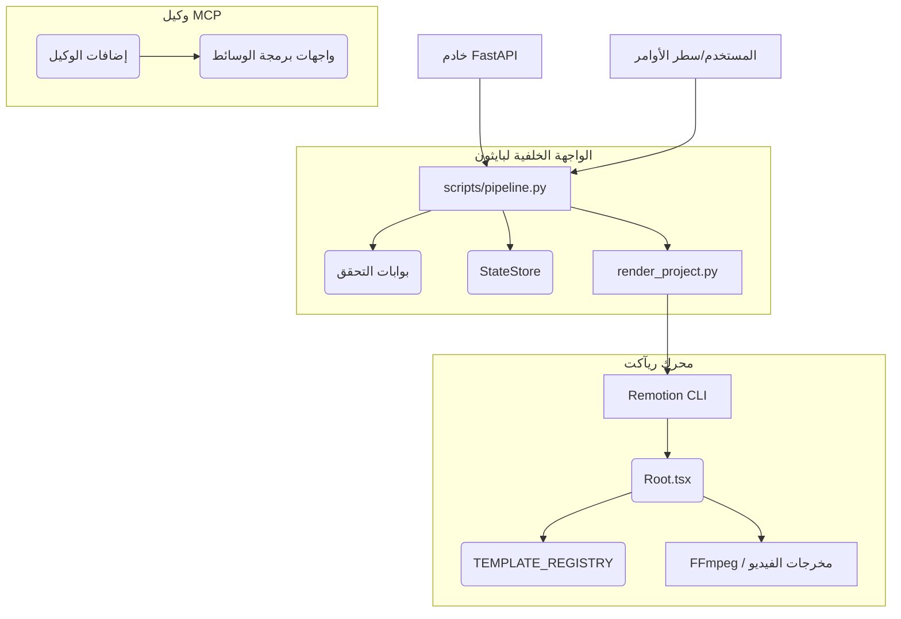
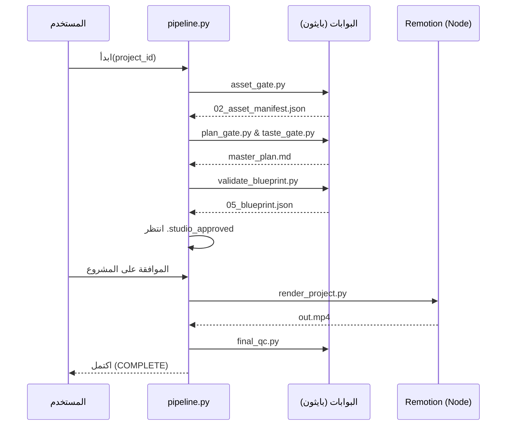
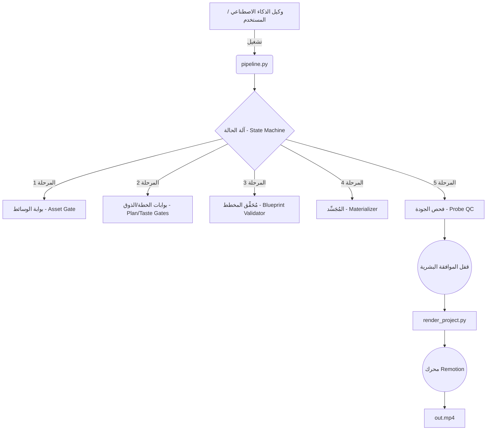

# بيئة عمل الفيديو النظيف (محرك الإنتاج الحركي) - تقرير الاستطلاع

هذا المستند هو عبارة عن استطلاع تقني عميق لمستودع `clean-video-workspace`. ويقدم تحليلاً شاملاً لهيكلية النظام، والاعتماديات، ومسارات التنفيذ، وأنماط التصميم، لرسم خريطة للحالة الحالية من أجل تهيئة المطورين وتدريب الذكاء الاصطناعي.

## 1. نظرة عامة على المشروع

**ما يبدو أن هذا النظام يفعله:**
النظام عبارة عن خط أنابيب (pipeline) "للإنتاج الفيديوي القائم على الوكلاء" بمستوى المؤسسات. يقوم برمجياً بتخطيط وتجميع ورندرة مقاطع فيديو سينمائية من خلال الربط بين وكلاء الذكاء الاصطناعي، وتنسيق الواجهة الخلفية عبر بايثون (Python backend orchestration)، ومحرك رندرة مبني على ريآكت (React-based rendering engine - Remotion).

**المشكلة الرئيسية التي يحلها:**
يحل مشكلة التوليد غير المتسق لمقاطع الفيديو المبرمجة عالية الجودة من خلال فرض آلة حالة (state machine) صارمة ومبنية على البوابات (stage-gated). فهو يمنع الخطوات المهلوسة ويضمن الجودة من خلال إجبار الخطط المولدة بالذكاء الاصطناعي على المرور عبر بوابات تحقق آلية قبل الرندرة الفعلية.

**القدرات الرئيسية:**
- **تنسيق مسار العمل (Pipeline Orchestration):** مسار تنفيذ موحد وصارم يتكون من 10 مراحل.
- **القوالب والرندرة (Templating & Rendering):** تجميع ديناميكي للعناصر المرئية باستخدام قوالب Remotion وسجل مركزي (registry).
- **تكامل وكلاء الذكاء الاصطناعي (AI Agent Integration):** إضافات واسعة النطاق من Antigravity MCP (Model Context Protocol) لمعالجة الصوت، والبحث عن الوسائط، وأدوات الفيديو.
- **المرونة (Resilience):** إعادة المحاولة الآمنة (Idempotent retries)، وحقن الأعطال (failure injection)، ومحرك قوي لاستعادة الحالة.

**التقنيات/اللغات/أطر العمل:**
- **تنسيق الواجهة الخلفية:** بايثون 3.10+، FastAPI، `uvicorn`.
- **محرك الرندرة:** Node.js 18+، React (TSX)، Remotion، TypeScript.
- **معالجة الوسائط:** FFmpeg.
- **تكامل الوكلاء:** إضافات Antigravity مخصصة (`.agents/`).

**كيفية تشغيل النظام المتوقعة:**
يمكن استدعاء النظام عبر سطر الأوامر CLI (`python scripts/pipeline.py <project_id>`) أو عبر خادم FastAPI (`api/main.py`). يتم تفويض الرندرة النهائية إلى Node.js/Remotion (`npx remotion`).

---

## 2. هيكل المستودع

تم بناء المشروع مع فصل صارم للمسؤوليات بين التنسيق، والرندرة، والأنظمة الفرعية للوكلاء.

```text
clean-video-workspace/
├── .agents/                 # إضافات وكلاء الذكاء الاصطناعي وخوادم MCP
├── api/                     # خدمات الواجهة الخلفية الأساسية (FastAPI)
├── config/                  # الإعدادات العامة (مثل violations_config.json)
├── contracts/               # مخططات TypeScript وقيود مسار العمل
├── documentation/           # الحقيقة المعمارية والأدلة
├── projects/                # أدلة العمل لمخرجات توليد الفيديو
├── remotion-app/            # الرندرة الفعلية عبر React/Remotion
├── scripts/                 # المحرك الأساسي لبايثون وبوابات مسار العمل
└── templates/               # القوالب المرئية والتأثيرات عبر React TSX
```

**الملفات المصدرية الهامة:**

- [`scripts/pipeline.py`](file:///c:/video/clean-video-workspace/scripts/pipeline.py)
  - **المسؤولية:** المنسق وآلة الحالة الأساسية (canonical state machine).
  - **سبب وجوده:** لتسيير المشروع بشكل متسلسل عبر بوابات التنفيذ.
  - **الوحدات الهامة (Modules):** `run_script`، `LifecycleState`، `StateStore`.
  - **المخرجات:** انتقالات الحالة في `.pipeline_state.json`.

- [`scripts/core/state_model.py`](file:///c:/video/clean-video-workspace/scripts/core/state_model.py)
  - **المسؤولية:** تعريف المخطط الخاص بحالات مسار العمل والتحقق من صحة الانتقالات.
  - **الفئات الهامة (Classes):** `ProjectState`، `LifecycleState`، `StateMachine`.
  - **يعتمد على:** `pydantic`.

- [`remotion-app/src/Root.tsx`](file:///c:/video/clean-video-workspace/remotion-app/src/Root.tsx)
  - **المسؤولية:** المكون الجذري لريآكت (Root React component) الخاص بـ Remotion.
  - **سبب وجوده:** تقييم بيانات المشروع (`05_blueprint.json`) ودمجها مع القوالب الخاصة بتسلسل الفيديو.
  - **المدخلات:** `BlueprintVideoInputProps` التي تحتوي على بيانات المشروع والمخطط (blueprint) والعلامة التجارية (brand).

- [`api/main.py`](file:///c:/video/clean-video-workspace/api/main.py)
  - **المسؤولية:** نقطة الدخول لخادم FastAPI.
  - **سبب وجوده:** يوفر واجهات REST و WebSocket (مثل `routers/blueprint.py`، `routers/render.py`).

- [`scripts/render_project.py`](file:///c:/video/clean-video-workspace/scripts/render_project.py)
  - **المسؤولية:** ربط مسار العمل الخاص ببايثون مع محرك رندرة Node.js Remotion.
  - **الآثار الجانبية الخارجية:** إنشاء عملية (Spawn) لـ `npx remotion` أو حاوية Docker لإخراج `out.mp4`.

---

## 3. معمارية النظام

يتبع النظام بنية مسار عمل (Pipeline) تتكون من أنظمة فرعية محددة:

### 1. مسار التنسيق (Python)
- **المدخلات:** معرف المشروع (Project ID)، وسائط سطر الأوامر (CLI arguments).
- **المعالجة:** يتنقل عبر حالات `LifecycleState`. يستدعي سكربتات بوابات محددة `_gate.py` عبر عمليات فرعية آمنة (safe subprocesses).
- **المخرجات:** تحديث ملف `.pipeline_state.json`.
- **أوضاع الفشل:** يعالج إعادة المحاولة عبر `RetryPolicyEngine`. يمكن أن يتراجع أو يتوقف إذا تم الوصول إلى الحد الأقصى للمحاولات.

### 2. بوابات التحقق (Python)
- **المسؤولية:** التأكد من أن المخرجات (الخطط والمخططات) تفي بالمواصفات قبل التقدم.
- **أمثلة:** `taste_gate.py`، `validate_blueprint.py`، `probe_qc.py`.
- **البيانات المقروءة:** `master_plan.md`، `05_blueprint.json`.

### 3. محرك الرندرة (Node.js/React)
- **المدخلات:** `render_props.json` (يجمع بين المخطط، إعدادات المشروع، والعلامة التجارية).
- **المعالجة:** يُقَيِّم `BlueprintVideo.tsx` المكونات من `TEMPLATE_REGISTRY`.
- **المخرجات:** ملف الفيديو `out.mp4`.
- **ماذا يحدث في حال عدم التوفر:** يتوقف مسار العمل عند حالة `REVIEW_APPROVED -> RENDERED`.

### 4. النظام الفرعي للوكيل (إضافات Antigravity)
- **المسؤولية:** تنفيذ سير عمل الذكاء الاصطناعي (توليد التعليق الصوتي، البحث عن الوسائط).
- **التكامل:** يرتبط بالنظام عبر إعدادات MCP الموجودة داخل `.agents/plugins/`.

---

## 4. خريطة الاعتماديات

يتدفق مسار الاعتماديات باتجاه تنفيذي صارم ذو اتجاه واحد من الواجهة الخلفية إلى واجهة الرندرة الأمامية.



**أبرز النقاط:**
- يُعَدّ `pipeline.py` **وحدة مركزية بشكل غير عادي**. فهو المحرك الأساسي والمطلق لجميع الحالات.
- ترتبط سكربتات بايثون بشكل غير وثيق (loosely coupled) مع Remotion، حيث يتم تمرير البيانات عبر نظام الملفات (`projects/<project_id>/`).

---

## 5. مسارات التنفيذ

### مسار العمل الرئيسي: التوليد الشامل عبر مسار العمل (End-to-End)

**نقطة الدخول:** `python scripts/pipeline.py <project_id>`
1. **DRAFT -> ASSETS_READY**: يستدعي `asset_gate.py`. يتحقق من مسارات الوسائط وينشئ `02_asset_manifest.json`.
2. **ASSETS_READY -> PLAN_READY**: يستدعي `plan_gate.py` و `taste_gate.py`. يتحقق من خطة الذكاء الاصطناعي ويخرج `master_plan.md`.
3. **PLAN_READY -> BLUEPRINT_READY**: يستدعي `validate_blueprint.py` و `motion_validator.py`. يتحقق من `05_blueprint.json`.
4. **BLUEPRINT_READY -> MATERIALIZED**: يستدعي `materialize_project.py`. يعالج الوسائط وينشئ `media_map.json`.
5. **MATERIALIZED -> PROBE_PASSED**: يستدعي `probe_qc.py`. فحص جودة ما قبل الرندرة.
6. **PROBE_PASSED -> AWAITING_REVIEW**: يتوقف. ينتظر تدخلاً بشرياً لإضافة `.studio_approved`.
7. **REVIEW_APPROVED -> RENDERED**: يستدعي `render_project.py`. ينفذ `npx remotion` لتوليد `out.mp4`.
8. **RENDERED -> COMPLETE**: يستدعي `final_qc.py`.



---

## 6. نقاط الدخول

- **`scripts/pipeline.py`**: منسق سطر الأوامر (CLI orchestrator). يقرأ `.pipeline_state.json` ويستأنف أو يبدأ آلة الحالة.
- **`api/main.py`**: تطبيق FastAPI على المنفذ 8787. يخدم نقاط النهاية (endpoints) مثل `/projects`، و `/gates`، وتحديثات رندرة WebSocket.
- **`remotion-app/src/index.ts`**: نقطة دخول Remotion. يسجل `RemotionRoot`.
- **`scripts/open_studio.py`**: يفتح استوديو Remotion التفاعلي لمشروع معين.

---

## 7. تدفق البيانات

تنتقل البيانات بشكل غير متزامن (asynchronously) عبر الحفظ القائم على الملفات داخل `projects/<project_id>/`.

- **`02_asset_manifest.json`**: يُنشأ بواسطة `asset_gate.py`. يحتوي على مؤشرات الوسائط الخام.
- **`master_plan.md`**: ينشأ بواسطة وكلاء الذكاء الاصطناعي، ويتم التحقق منه بواسطة `taste_gate.py`. يحتوي على الهيكل السردي.
- **`05_blueprint.json`**: هيكل البيانات المركزي. يُعَرِّف المشاهد، الإطارات، النصوص، والانتقالات. يتم تخطيطه مباشرة إلى مكونات ريآكت (React components).
- **`media_map.json`**: يربط الأصول الخارجية (external assets) بالملفات المحلية المعالجة (materialized).
- **`render_props.json`**: يُنشأ ديناميكياً بواسطة `render_project.py`، ويجمع كل ما سبق لتمريره إلى Remotion.

---

## 8. الحالة والتخزين

- **قواعد البيانات:** لا يوجد. يعتمد النظام بالكامل على حالة نظام الملفات.
- **الحالة الدائمة (Persistent State):**
  - `projects/<project_id>/.pipeline_state.json`: يُدار بواسطة `StateStore`. يحتوي على `LifecycleState` وتواقيع المخرجات (SHA256).
- **الحالة المؤقتة:** `out.attempt-*.tmp.mp4` أثناء الرندرة.
- **تخزين الإعدادات:** `.env` و `config/violations_config.json`.

---

## 9. خريطة الأخطاء والأعطال

يحتوي النظام على بنية متطورة للتعامل مع الأخطاء.

- **المكون:** `scripts/pipeline.py` عبر `scripts/core/retry_policy.py`.
- **الأسباب المحتملة:** انهيار السكربتات (crashes)، فشل التحقق من المخطط، أصول مفقودة، أخطاء نفاد الذاكرة في Remotion (OOM).
- **الانتشار (Propagation):** يتم التقاط الاستثناءات (Exceptions) في البوابات بواسطة `safe_subprocess`.
- **آلية إعادة المحاولة:** يقرأ `RetryPolicyEngine` فئة الأمان `IdempotencyClass` (مثل: `SAFE_TO_RETRY`، `CONDITIONALLY_RETRYABLE`). ويعيد المحاولة مع التراجع الزمني (backoff).
- **حقن الأعطال (Fault Injection):** يحاكي `FailureInjector` الأخطاء عند نقاط الحقن `InjectionPoint`s (مثل: `BEFORE_RENDER`) لاختبار المرونة.
- **رؤية المستخدم:** تنسق سجلات وحدة التحكم (Console logs) الإخفاقات بشكل جميل، وتستخرج الأخطاء القياسية، وتتراجع الحالة إلى `FAILED` إذا استُنفِدت المحاولات.

---

## 10. الإعدادات والتهيئة

- **`.env`**: يحتفظ بمفاتيح API (مثل `HEYGEN_API_KEY`، `OPENAI_API_KEY`، إلخ).
- **`config/violations_config.json`**: يهيئ قواعد بوابات الذوق (taste gates) وعمليات التحقق.
- **`remotion-app/remotion.config.ts`**: إعدادات Webpack والرندرة الخاصة بـ Remotion.
- **`.agents/plugins/super-video-maker-plugin/mcp_config.json`**: يربط خوادم Antigravity MCP.

---

## 11. الاعتماديات الخارجية

- **Remotion (`remotion`, `@remotion/cli`)**: إطار العمل الأساسي لرندرة الفيديو.
- **FFmpeg (`ffmpeg-python`)**: يُستخدم لمعالجة الوسائط الثقيلة وتطبيعها (normalization).
- **FastAPI / Uvicorn**: واجهة برمجة تطبيقات الواجهة الخلفية (Backend REST API).
- **Pydantic**: فرض العقود (contract enforcement) (`contracts/` و `schemas/`).
- **Antigravity CLI**: تنفيذ سير العمل القائم على الوكلاء (Agentic workflow).

---

## 12. القرارات المعمارية التي يمكن استنتاجها

- **آلة حالة قائمة على الملفات (File-Based State Machine):** بدلاً من قاعدة بيانات، تستخدم المشاريع تجزئة الملفات (`SHA256`) وملف حالة صارم (`.pipeline_state.json`) للسماح بتكامل سهل مع Git والفحص البشري.
- **نمط بوابة المرحلة (Stage-Gate Pattern):** لا تتقدم أي حالة بدون فحص تشفيري أو قائم على قواعد مستقلة (مثل `taste_gate.py`).
- **تقسيم حدود اللغة:** بايثون مخصص حصرياً لعمليات الإدخال/الإخراج، والأمان، والتنسيق. بينما TypeScript/React مخصص حصرياً للعرض المرئي. ولا يتداخلان مع بعضهما البعض.
- **التشغيل الآمن المتكرر افتراضياً (Idempotency by Default):** تم تصميم السكربتات لتُعاد تشغيلها دون التسبب في تكرارات أو مشاكل.

---

## 13. المشاكل المعمارية المحتملة

*ملاحظة: هذه مجرد ملاحظات وليست أهدافاً لإعادة الهيكلة النشطة (refactoring).*

- **مخاوف محتملة - هشاشة العمليات الفرعية (Brittle Subprocessing):** يعتمد كل من `scripts/pipeline.py` و `scripts/render_project.py` بشدة على `subprocess.Popen` لتنفيذ node وسكربتات بايثون الأخرى. قد يصبح انتشار متغيرات البيئة والعمليات الفرعية العالقة (zombies) مشكلة عند مستويات التزامن (concurrency) العالية. *(الملفات: `scripts/security/security.py`، `scripts/pipeline.py`)*
- **مخاوف محتملة - اختناقات الإدخال/الإخراج للملفات (File I/O Bottlenecks):** قد يكون تمرير بيانات JSON كبيرة عبر القرص (`render_props.json`) بدلاً من الذاكرة/IPC بمثابة عنق زجاجة للمعالجة المتوازية الكثيفة. *(الملفات: `scripts/render_project.py`)*

---

## 14. مجاهيل هامة

- **التطبيقات الدقيقة لخوادم MCP:** تم الإعلان عن قدرات `ffmpeg-mcp-server` و `audio-tools-mcp`، ولكن تم تجريد المنطق الداخلي الدقيق الخاص بها خلف بروتوكول MCP.
- **قاعدة حاوية Docker (Docker Container Base):** يشير `render_project.py` إلى صورة Docker باسم `clean-video-builder`. لم يتم تحليل ملف Dockerfile الخاص بهذه الصورة بشكل مباشر في هذا الاستطلاع.

---

## 15. خريطة التعلم

مسار الدراسة الموصى به للمنضمين الجدد:

1. **`documentation/architecture/ARCHITECTURE_TRUTH.md`**: ابدأ هنا لفهم القواعد الدستورية للمشروع.
2. **`scripts/core/state_model.py` و `scripts/pipeline.py`**: تتبع آلة الحالة هو أمر حاسم لفهم كيفية توليد أي فيديو.
3. **`scripts/render_project.py`**: راقب الجسر الرابط بين Python و Node.js.
4. **`remotion-app/src/Root.tsx`**: افهم كيف يترجم مخطط (blueprint) بصيغة JSON إلى مكونات ريآكت (React components).
5. **`templates/` و `registry/`**: شاهد المكونات المرئية الفعلية.

---

## 16. قاموس النظام (Glossary)

- **البوابة (Gate):** سكربت بايثون معزول يتحقق من مرحلة دورة حياة معينة.
- **المخطط (Blueprint `05_blueprint.json`):** ملف JSON الذي يمثل الحقيقة المطلقة ويخبر Remotion بالضبط بما يجب رندرته من إطارات.
- **محرك الذوق (Taste Engine):** طبقة تحقق (`taste_gate.py`) تمنع وكلاء الذكاء الاصطناعي من توليد تركيبات سيئة جمالياً (مثل تداخل النصوص).
- **القفل الميكانيكي (Mechanical Lock):** مفهوم أمني وعملي (`.studio_approved`) يتطلب من إنسان الموافقة صراحة على مشروع ما قبل بدء عملية الرندرة المكلفة.
- **التجسيد/المعالجة (Materialization):** عملية تحويل روابط (URLs) الأصول المجردة (abstract) إلى ملفات محلية يتم تنزيلها وتطبيعها (`media_map.json`).

---

## 17. ملخص المعمارية

**الهدف:** مسار عمل لإنتاج فيديوهات قائم على الوكلاء، موحد وصارم ببوابات تحقق، يترجم خطط الذكاء الاصطناعي إلى رندرة فيديو عبر React.
**نقاط الدخول:** سطر الأوامر (`scripts/pipeline.py`)، واجهة برمجة التطبيقات (`api/main.py`).
**الأنظمة الفرعية الرئيسية:** منسق بايثون (Python Orchestrator)، بوابات التحقق (Validation Gates)، محرك رندرة Remotion، وطبقة وكلاء MCP (Agent MCP Layer).
**تدفق البيانات:** ملفات JSON/MD في `projects/<id>/` يتم تمريرها بين السكربتات.
**التخزين:** تخزين مؤقت على نظام الملفات (`.pipeline_state.json`).
**نقاط الفشل:** تنفيذ العمليات الفرعية للسكربتات (Script subprocess execution)، وحدود ذاكرة Remotion.


